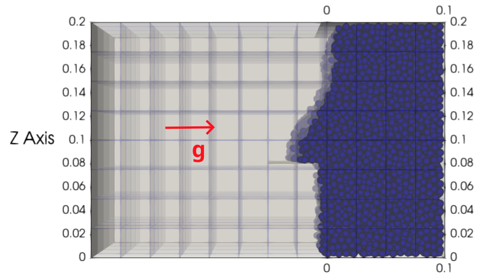
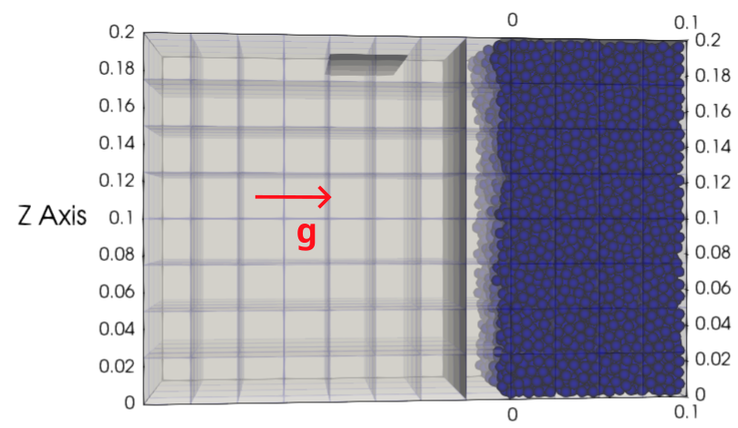
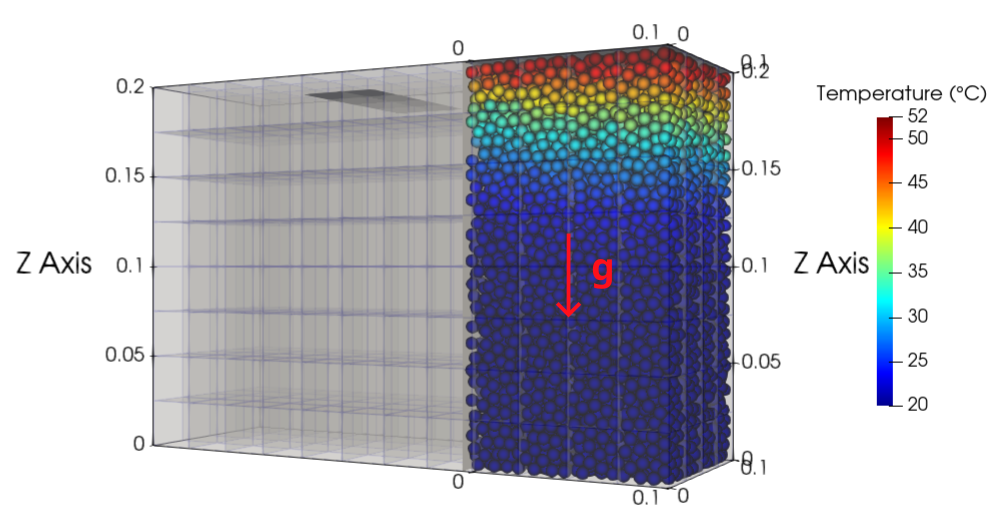
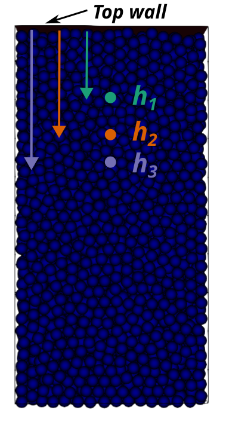
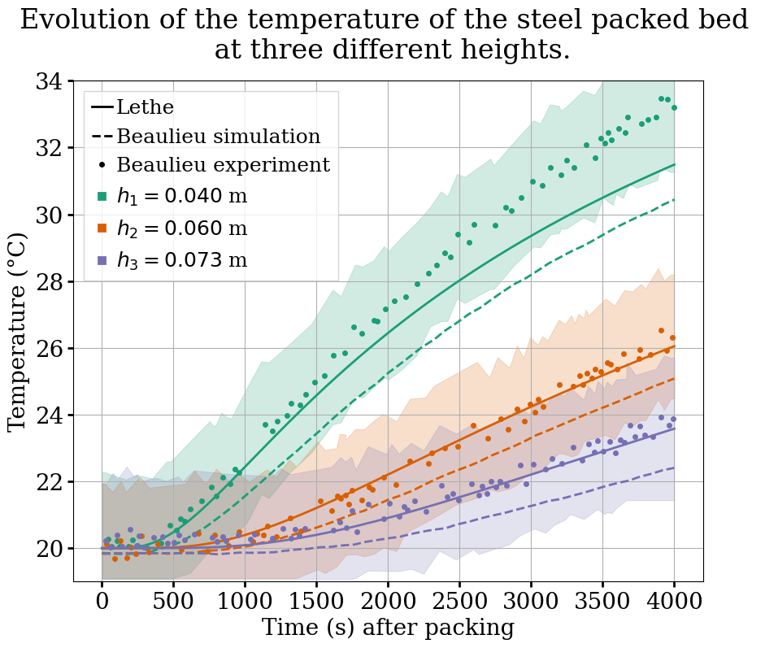
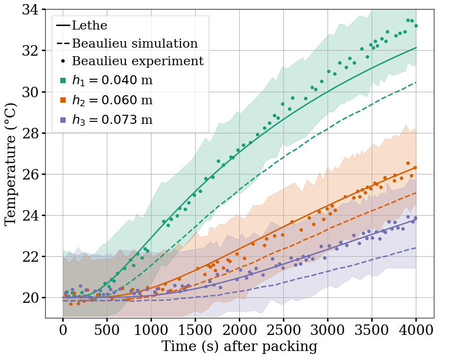

==========================
Heated Packed Bed
==========================

This example simulates the heating of a packed bed using the discrete element method (DEM) including heat transfer. It is based on the experimental and simulation results of Beaulieu [#Beaulieu2020]_ with stainless steel particles.
More information regarding the Multiphysic DEM parameters and the heat transfer model is given in the Lethe documentation, i.e. `DEM parameters <../../../parameters/dem/dem.html>`_ and `Heat transfer model <../../../theory/multiphase/cfd_dem/dem.html#thermal-dem-in-a-stagnant-gas>`_.

----------------------------------
Features
----------------------------------

- Solver: ``lethe-particles``
- Multiphysic DEM
- Three-dimensional problem
- Moving solid surfaces
- Heating solid surface
- Post-processing using `Python <https://www.python.org/>`_, `PyVista <https://docs.pyvista.org/>`_, `lethe_pyvista_tools <https://github.com/chaos-polymtl/lethe/tree/master/contrib/postprocessing>`_, and `ParaView <https://www.paraview.org/>`_.

----------------------------
Files Used in This Example
----------------------------

All files mentioned below are located in the example's folder (``examples/dem-mp/3d-heated-packed-bed``).

- Parameter file to load particles: ``load-packed-bed.prm``
- Parameter file to flip gravity: ``flip-packed-bed.prm``
- Parameter file for the heating: ``heat-packed-bed.prm``
- Geometry files for solid surfaces: ``square-top.geo``, ``square-rake.geo``, ``square-side.geo``
- Post-processing Python script: ``bed-postprocessing.py``

-------------------------
Description of the Case
-------------------------

This example is run in three stages. 

First, during the loading stage (:math:`0-6` s), :math:`8849` particles are inserted with a temperature of :math:`20°C` in a rectangular box. In this part of the simulation, :math:`g = 9.81 \mathbf{e_x}` because we insert the particles from the side of the box. When particles are sufficiently static, we use a solid surface to even out the particles on the side of the packed bed. Then, a second solid surface is placed on the side to close the box and keep the particles in place for the next stage of the simulation. Just before the end of this stage, at :math:`t = 5.95` s, the kinetic energy of the packed bed is :math:`3\times10^{-10}` J, which is lower than the :math:`1\times10^{-7}` J criterion used by Beaulieu for a stable packed bed.

The second stage (:math:`6-7` s) is where gravity is changed to :math:`g = -9.81 \mathbf{e_z}` to be in the same direction as the experiment from Beaulieu [#Beaulieu2020]_. We let the particle bed restructure for :math:`1` s. At :math:`t = 6.95` s, the kinetic energy of the packed bed is :math:`1\times10^{-9}` J.

Finally, during the heating stage (:math:`7-4000` s), the temperature of a solid surface placed on top on the packed bed is set to :math:`53°C` and the particles are heated through this top wall. During this last part of the simulation, particle motion is disabled.

--------------
Parameter File
--------------

Mesh
~~~~

The domain is a rectangular box with dimensions :math:`0.3\times0.1\times0.2` meters and is made using the deal.ii grid generator.

.. code-block:: text

    subsection mesh
      set type               = dealii
      set grid type          = subdivided_hyper_rectangle
      set grid arguments     = 3,1,2 : -0.2 , 0.0 , 0.0 : 0.1 , 0.1 , 0.2 : false
      set initial refinement = 2
    end

Insertion Info
~~~~~~~~~~~~~~~~~

In the loading stage, particles are inserted through the side of the box, with a temperature of :math:`20°C`. This initial temperature was chosen to match the experimental data.

.. code-block:: text

    subsection insertion info
      set insertion method                               = volume
      set inserted number of particles at each time step = 3400
      set insertion frequency                            = 10000
      set insertion box points coordinates               = -0.199, 0.001, 0.001 : -0.03, 0.099, 0.199
      set insertion distance threshold                   = 1.5
      set insertion maximum offset                       = 0.6
      set insertion prn seed                             = 17
      subsection initial temperature function
        set Function expression = 20
      end
    end

Lagrangian Physical Properties
~~~~~~~~~~~~~~~~~~~~~~~~~~~~~~

The :math:`8849` particles are mono-dispersed, with a diameter of :math:`6.4` mm.

The physical properties of the steel particles, the walls, and the interstitial gas were chosen to match those used by Beaulieu in her simulation. However, their Young's moduli were set to be :math:`10` times higher than those used by Beaulieu. This adjustment was made to ensure that our simulation reproduces the experimental porosity of :math:`42\%` observed in the packed bed.

.. code-block:: text

    subsection lagrangian physical properties
      set g                        = 0.0, 0.0 , -9.81
      set number of particle types = 1
      subsection particle type 0
        set size distribution type            = uniform
        set diameter                          = 6.4e-3
        set number of particles               = 8849
        set density particles                 = 7747
        set young modulus particles           = 50e6
        set poisson ratio particles           = 0.29
        set restitution coefficient particles = 0.8
        set friction coefficient particles    = 0.7
        set rolling friction particles        = 0.02
        set real young modulus particles      = 200e9
        set thermal conductivity particles    = 42
        set specific heat particles           = 464
        set microhardness particles           = 3e9
        set surface slope particles           = 0.056
        set surface roughness particles       = 19.e-9
        set thermal accommodation particles   = 0.7
      end
      set young modulus wall           = 50e6
      set poisson ratio wall           = 0.33
      set restitution coefficient wall = 0.8
      set friction coefficient wall    = 0.7
      set rolling friction wall        = 0.02
      set real young modulus wall      = 100e9
      set thermal conductivity wall    = 250
      set microhardness wall           = 1.8e9
      set surface slope wall           = 0.056
      set surface roughness wall       = 0.1e-9
      set thermal accommodation wall   = 0.7
      set thermal conductivity gas     = 0.027
      set specific heat gas            = 1006
      set dynamic viscosity gas        = 1.85e-5
      set specific heats ratio gas     = 1
      set molecular mean free path gas = 68.e-9
    end

Model Parameters
~~~~~~~~~~~~~~~~

For the first two stages, the model parameters are defined as:

.. code-block:: text

    subsection model parameters
      subsection contact detection
        set contact detection method                = dynamic
        set dynamic contact search size coefficient = 0.9
        set neighborhood threshold                  = 1.3
      end
      subsection load balancing
        set load balance method = frequent
        set frequency           = 100000
      end
      set particle particle contact force method = hertz_mindlin_limit_overlap
      set rolling resistance torque method       = constant
      set particle wall contact force method     = nonlinear
      set integration method                     = velocity_verlet
      set solver type                            = dem_mp
    end

For the heating of the particles, the parameter ``disable position integration`` is set to ``true`` to freeze the particles in place by disabling the time-integration of the particles' velocity and position. This allows for the use of a larger time step for the evolution of the temperature, as collisions no longer need to be resolved. Since the particles remain stationary, ``load balancing`` is also no longer necessary.

.. code-block:: text

    subsection model parameters
      subsection contact detection
        set contact detection method                = dynamic
        set dynamic contact search size coefficient = 0.9
        set neighborhood threshold                  = 1.3
      end
      set particle particle contact force method = hertz_mindlin_limit_overlap
      set rolling resistance torque method       = constant
      set particle wall contact force method     = nonlinear
      set integration method                     = velocity_verlet
      set solver type                            = dem_mp
      set disable position integration           = true
    end

Solid Objects
~~~~~~~~~~~~~~~

Three solid surfaces are used in this example. The first one is the one used to heat the packed bed from :math:`7` s to :math:`4000` s, with a temperature of :math:`53°C`. The second one is used to even the particles on the side of the packed bed. The last one closes the box to maintain the particles within it when the direction of the gravity is changed. The second and third walls are both set to ``adiabatic``, meaning that they are insulated and do not provide any heat transfer.

.. code-block:: text

    subsection solid objects
      subsection solid surfaces
        set number of solids = 3
        subsection solid object 0
          subsection mesh
            set type               = gmsh
            set file name          = square-top.msh
            set simplex            = true
            set initial refinement = 0
          end
          subsection translational velocity
            set Function expression = 0 ; 0 ; 0
          end
          subsection angular velocity
            set Function expression = 0 ; 0 ; 0
          end
          set thermal boundary type = isothermal
          subsection temperature
            set Function expression = if(t>7,53,20)
          end
        end
        subsection solid object 1
          subsection mesh
            set type               = gmsh
            set file name          = square-rake.msh
            set simplex            = true
            set initial refinement = 0
          end
          subsection translational velocity
            set Function expression = if(z<0.19,0,if(t<3.6,-0.5,0)) ; 0 ; if(t>1.6 && z<0.19,0.1,0)
          end
          subsection angular velocity
            set Function expression = 0 ; 0 ; 0
          end
          set center of rotation    = 0 , 0 , 0
          set thermal boundary type = adiabatic
        end
        subsection solid object 2
          subsection mesh
            set type               = gmsh
            set file name          = square-side.msh
            set simplex            = true
            set initial refinement = 0
          end
          subsection translational velocity
            set Function expression = if(t>3.6 && x<-0.005,0.5,0) ; 0 ; 0
          end
          subsection angular velocity
            set Function expression = 0 ; 0 ; 0
          end
          set center of rotation    = -0.2 , 0 , 0
          set thermal boundary type = adiabatic
        end
      end
    end

.. note::

  The results are quite sensitive to the position of the side wall (``square-side.msh``), so it could probably be set more precisely for more accurate results.

Simulation Control
~~~~~~~~~~~~~~~~~~

For the loading stage:

.. code-block:: text

    subsection simulation control
      set time step         = 2.5e-5
      set time end          = 6
      set log frequency     = 2000
      set output frequency  = 2000
      set output path       = ./output/
      set output boundaries = true
    end

For the stage where gravity is changed:

.. code-block:: text

    subsection simulation control
      set time step         = 2.5e-5
      set time end          = 7
      set log frequency     = 2000
      set output frequency  = 2000
      set output path       = ./output/
      set output boundaries = true
    end

For the heating stage:

.. code-block:: text

    subsection simulation control
      set time step         = 1
      set time end          = 4007
      set log frequency     = 10
      set output frequency  = 10
      set output path       = ./output/
      set output boundaries = true
    end

-----------------------
Running the Simulation
-----------------------

This simulation is launched in three steps. First the particles are loaded with:

.. code-block:: text
  :class: copy-button

  mpirun -np 4 lethe-particles load-packed-bed.prm

Then, the direction of gravity is changed with:

.. code-block:: text
  :class: copy-button

  mpirun -np 4 lethe-particles flip-packed-bed.prm

Finally, we run the simulation to heat the particles:

.. code-block:: text
  :class: copy-button

  mpirun -np 4 lethe-particles heat-packed-bed.prm

.. note::
  In this example, the three stages require respectively around 16 minutes, 2 minutes and 2 minutes on 4 cores.

---------------
Post-processing
---------------

A Python post-processing code ``bed-postprocessing.py`` is provided with this example. It is used to compare the temperature of the packed-bed at three different heights :math:`h_1 = 4.0` cm, :math:`h_2 = 6.0` cm and :math:`h_3 = 7.3` cm (:math:`h = 0.0` cm corresponds to the top wall), with the results obtained experimentally and numerically by Beaulieu for stainless steel.

The post-processing code can be run with the following command. The argument is the folder which contains the ``.prm`` file.

.. code-block:: text
  :class: copy-button

    python3 bed-postprocessing.py  --folder ./

.. important::

    You need to ensure that ``lethe_pyvista_tools`` is working on your machine. Click `here <../../../tools/postprocessing/postprocessing_pyvista.html>`_ for details.

-------
Results
-------

The following figure compares the temperature of the packed-bed at three different heights :math:`h_1 = 4.0` cm, :math:`h_2 = 6.0` cm and :math:`h_3 = 7.3` cm, with the results obtained by Beaulieu for stainless steel.

The results show good agreement with the experimental and numerical results of Beaulieu but still undershoot a bit the temperature at :math:`h_1 = 4.0` cm compared to the experimental data. Our temperature curves are slightly higher than the ones numerically obtained by Beaulieu due to the hertz contact radius used instead of the analytical one, as in Beaulieu's work. The higher Young's modulus employed also gives better results.

It has been noticed while experimenting with the model that the simulation results are highly sensitive to the loading method and to the wall friction coefficient.
The following figure shows the results of the simulation with the ``friction coefficient wall`` set to :math:`1.0` instead of :math:`0.7`.

This ``friction coefficient wall`` allows to fit the experimental data better but it is debatable whether a friction coefficient of :math:`1.0` is realistic to model the Styrofoam walls used in the experiment. Also, other parameters like the ``rolling friction`` should have probably been adjusted as well to fit the experimental properties.

.. note::
  Since the simulation results are highly sensitive to the loading, they may vary a bit from one computer to another.

----------------------------
Possibilities for Extension
----------------------------

- Reproduce the experimental and numerical results of Beaulieu for other particle types, such as glass beads and aluminum alloys beads.

---------
Reference
---------

.. [#Beaulieu2020] \C. Beaulieu, “Impact de la ségrégation granulaire sur le transfert de chaleur dans un lit rotatif,” (Order No. 28990310), Ph.D. thesis, Polytechnique Montréal, 2020. Available: `<https://www.proquest.com/dissertations-thèses/impact-de-la-ségrégation-granulaire-sur-le/docview/2626891455/se-2>`_\.

