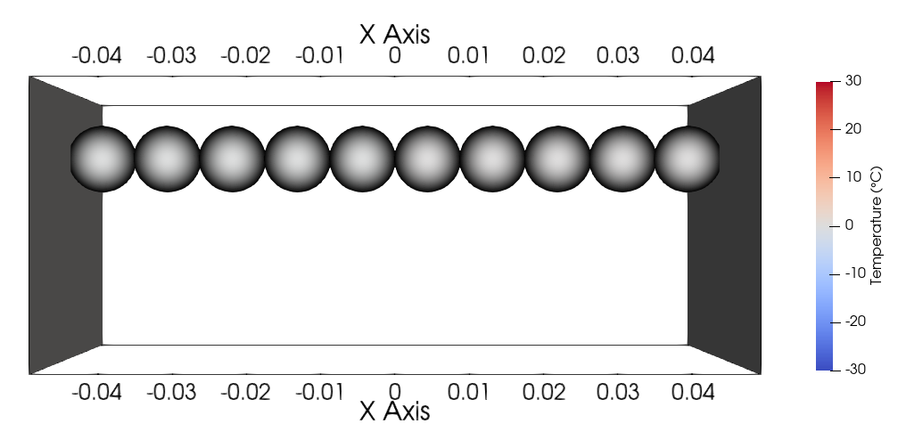
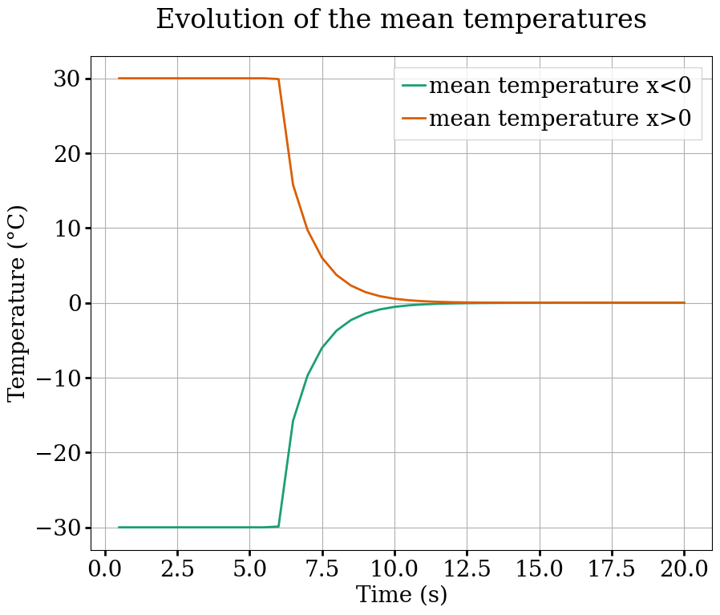
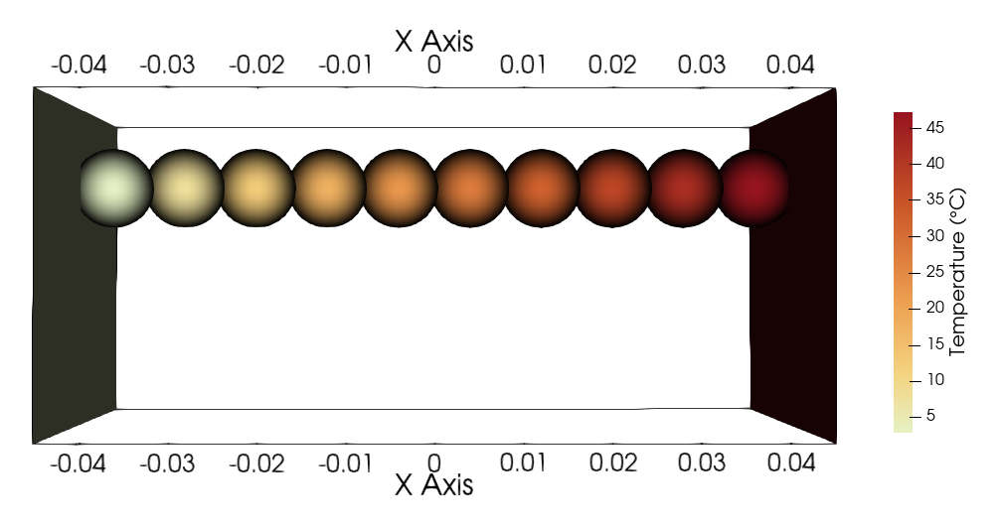
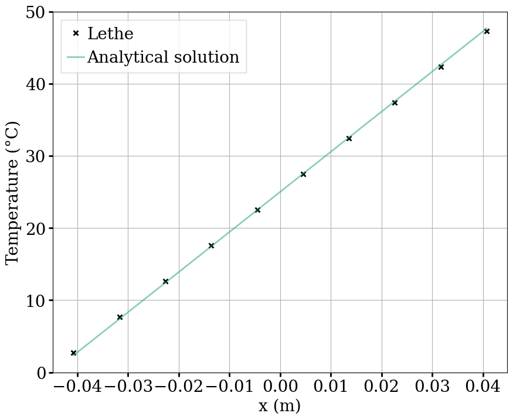

==================================
Thermal Lines
==================================

This example introduces the use of multiphysic DEM, with lined up particles that are heated by other particles or by a wall. It verifies the models of particle-particle and particle-wall heat transfer with two test cases.

----------------------------------
Features
----------------------------------

- Solvers: ``lethe-particles``
- Multiphysic DEM
- Three-dimensional problem
- Moving solid surfaces
- Heating solid surface
- Post-processing using `Python <https://www.python.org/>`_, `PyVista <https://docs.pyvista.org/>`_, `lethe_pyvista_tools <https://github.com/chaos-polymtl/lethe/tree/master/contrib/postprocessing>`_, and `ParaView <https://www.paraview.org/>`_.

----------------------------
Files Used in This Example
----------------------------

All files mentioned below are located in the example's folder (``examples/dem/3d-thermal-lines``).

- Parameter files: ``equilibrium.prm``, ``wall-heating.prm``
- Geometry files solid surfaces: ``square-left.geo``, ``square-right.geo``
- Input files: ``particles-one-temperature.input``, ``particles-two-temperatures.input``
- Post-processing Python scripts: ``equilibrium-postprocessing.py``, ``wall-heating-postprocessing.py``

-------------------------
Description of the Cases
-------------------------

In the first stage of both simulations, the 10 particles are put in contact. The solid surfaces on the left and right move towards the center to push the particles, until they are all in contact on a line.

In the case of the equilibrium simulation, particles on the left side have a temperature of :math:`-30°C` and particles of the right side have a temperature of :math:`30°C`. When all the particles are in contact on a line, the mean temperatures of the particles on the left and the particles on the right should vary towards the whole mean temperature i.e. :math:`0°C` here.

In the case of the wall-heating simulation, all particles start with a temperature of :math:`0°C`. The walls also have a temperature of :math:`0°C`. When all the particles are in contact on a line (:math:`8 s`), the temperature of the right wall is set to :math:`50°C`. After some time, the temperature of the particles should be a linear function of their position.

--------------
Parameter File
--------------

Mesh
~~~~

The domain we simulate is a rectangular box which is :math:`0.30\times0.05\times0.5` meters and is made using the deal.ii grid generator.

.. code-block:: text

    subsection mesh
      set type               = dealii
      set grid type          = hyper_rectangle
      set grid arguments     = -0.15 , -0.025 , -0.025 : 0.15 , 0.025 , 0.025 : false
      set initial refinement = 1
    end

Lagrangian Physical Properties
~~~~~~~~~~~~~~~~~~~~~~~~~~~~~~

The :math:`10` particles are mono-dispersed, with a diameter of :math:`10` mm.

Some parameters used in multiphysic DEM like the ``thermal conductivity`` and ``specific heat`` were chosen to ensure the simulations are fast enough, as simulations involving temperature can take up a lot of time to reach a steady state. Since these test cases are focused on temperature and particles are set on a horizontal line, gravity is not taken into account.

.. code-block:: text

    subsection lagrangian physical properties
      set g                        = 0.0, 0.0, 0.0
      set number of particle types = 1
      subsection particle type 0
        set size distribution type            = uniform
        set diameter                          = 0.01
        set number of particles               = 10
        set density particles                 = 2500
        set young modulus particles           = 1e6
        set poisson ratio particles           = 0.3
        set restitution coefficient particles = 0.3
        set friction coefficient particles    = 0.3
        set rolling friction particles        = 0.3
        set thermal conductivity particles    = 3000
        set specific heat particles           = 300
        set microhardness particles           = 1.e9
        set surface slope particles           = 0.1
        set surface roughness particles       = 1.e-9
        set thermal accommodation particles   = 0.7
      end
      set young modulus wall           = 1e6
      set poisson ratio wall           = 0.3
      set restitution coefficient wall = 0.3
      set friction coefficient wall    = 0.3
      set rolling friction wall        = 0.3
      set thermal conductivity gas     = 0.2
      set specific heat gas            = 10000
      set dynamic viscosity gas        = 9.e-6
      set specific heats ratio gas     = 1.4
      set molecular mean free path gas = 68.e-9
      end

Model Parameters
~~~~~~~~~~~~~~~~

.. code-block:: text

    subsection model parameters
      subsection contact detection
        set contact detection method                = dynamic
        set dynamic contact search size coefficient = 0.9
        set neighborhood threshold                  = 1.3
      end
      set particle particle contact force method = hertz_mindlin_limit_overlap
      set rolling resistance torque method       = constant_resistance
      set particle wall contact force method     = nonlinear
      set integration method                     = velocity_verlet
      set solver type                            = dem_mp
    end

Particle Insertion
~~~~~~~~~~~~~~~~~~

Since the simulations only involve :math:`10` particles, they were inserted at precise locations using the ``file`` insertion method and input files ``particles-one-temperature.input`` for the wall-heating simulation and ``particles-two-temperatures.input`` for the equilibrium simulation.

.. code-block:: text

    subsection insertion info
      set insertion method                               = file
      set insertion frequency                            = 10000
      set list of input files                            = particles-one-temperature.input
    end
    
.. code-block:: text

    subsection insertion info
      set insertion method                               = file
      set insertion frequency                            = 10000
      set list of input files                            = particles-two-temperatures.input
    end

Solid objects
~~~~~~~~~~~~~~~

For the equilibrium simulation, walls are considered ``adiabatic`` and move towards the center until they reach their set location.

.. code-block:: text

    subsection solid objects
      subsection solid surfaces
        set number of solids = 2
        subsection solid object 0
          subsection mesh
            set type               = gmsh
            set file name          = square-left.msh
            set simplex            = true
            set initial refinement = 0
          end
          subsection translational velocity
            set Function expression = if(x<-0.049,0.01,0) ; 0 ; 0
          end
          subsection angular velocity
            set Function expression = 0 ; 0 ; 0
          end
          set center of rotation    = -0.11 , 0 , 0
          set thermal boundary type = adiabatic
        end
        subsection solid object 1
          subsection mesh
            set type               = gmsh
            set file name          = square-right.msh
            set simplex            = true
            set initial refinement = 0
          end
          subsection translational velocity
            set Function expression = if(x>0.049,-0.01,0) ; 0 ; 0
          end
          subsection angular velocity
            set Function expression = 0 ; 0 ; 0
          end
          set center of rotation    = 0.11 , 0 , 0
          set thermal boundary type = adiabatic
        end
      end
    end

For the wall-heating simulation, walls have a temperature (``isothermal``) and move towards the center until they reach their set location.

.. code-block:: text

    subsection solid objects
      subsection solid surfaces
        set number of solids = 2
        subsection solid object 0
          subsection mesh
            set type               = gmsh
            set file name          = square-left.msh
            set simplex            = true
            set initial refinement = 0
          end
          subsection translational velocity
            set Function expression = if(x<-0.045,0.01,0) ; 0 ; 0
          end
          subsection angular velocity
            set Function expression = 0 ; 0 ; 0
          end
          set center of rotation    = -0.11 , 0 , 0
          set thermal boundary type = isothermal
          subsection temperature
            set Function expression = 0
          end
        end
        subsection solid object 1
          subsection mesh
            set type               = gmsh
            set file name          = square-right.msh
            set simplex            = true
            set initial refinement = 0
          end
          subsection translational velocity
            set Function expression = if(x>0.045,-0.01,0) ; 0 ; 0
          end
          subsection angular velocity
            set Function expression = 0 ; 0 ; 0
          end
          set center of rotation    = 0.11 , 0 , 0
          set thermal boundary type = isothermal
          subsection temperature
            set Function expression = if(t>8,50,0)
          end
        end
      end
    end

Simulation Control
~~~~~~~~~~~~~~~~~~

The simulations run for 20 and 15 seconds of real time respectively. We output the simulation results every 10000 iterations.

.. code-block:: text

    subsection simulation control
      set time step         = 5e-5
      set time end          = 20
      set log frequency     = 10000
      set output frequency  = 10000
      set output path       = ./output_equilibrium/
      set output boundaries = true
    end

.. code-block:: text

    subsection simulation control
      set time step         = 5e-5
      set time end          = 15
      set log frequency     = 10000
      set output frequency  = 10000
      set output path       = ./output_wall_heating/
      set output boundaries = true
    end

-----------------------
Running the Simulation
-----------------------

The simulations can be launched with 

.. code-block:: text
  :class: copy-button

   lethe-particles equilibrium.prm

.. code-block:: text
  :class: copy-button

   lethe-particles wall-heating.prm

.. note::

  Parallel calculations are not necessary here as there are only :math:`10` particles.

---------------
Post-processing
---------------

A Python post-processing code is provided for each case: ``equilibrium-postprocessing.py`` and ``wall-heating-postprocessing.py``. 

The first post-processing script is used to check that the two mean temperatures (of particles with :math:`x<0` and :math:`x>0`) do get close to the global mean temperature at the end of the equilibrium simulation. 

The second script is used to confirm that the temperature of the particles matches the analytical solution :math:`T(x) = Ax+B`, where :math:`A` and :math:`B` are found using the temperature and position that are set for the left and right walls.

It is possible to run the post-processing codes with the following lines. The argument is the folder which contains the ``.prm`` file.

.. code-block:: text
  :class: copy-button

    python3 equilibrium-postprocessing.py  --folder ./

.. code-block:: text
  :class: copy-button

    python3 wall-heating-postprocessing.py  --folder ./

.. important::

    You need to ensure that ``lethe_pyvista_tools`` is working on your machine. Click `here <../../../tools/postprocessing/postprocessing_pyvista.html>`_ for details.

-------
Results
-------

Results for the Equilibrium Simulation
~~~~~~~~~~~~~~~~~~~~~~~~~~~~~~~~~~~~~~~

The simulation can be visualised using Paraview as seen below.

    Temperatures at the end of the simulation

The following figure shows that the two mean temperatures do converge towards :math:`0°C`, as expected.

It was noticed while choosing the parameters for the simulation that the more the walls push the particles toward the center, the faster the mean temperatures reach :math:`0°C`. This highlights the importance of the overlap in the particle-particle and particle-wall heat transfer models.

Results for the Wall-heating Simulation
~~~~~~~~~~~~~~~~~~~~~~~~~~~~~~~~~~~~~~~~

The simulation can be visualised using Paraview as seen below.

    Temperatures at the end of the simulation

The following figure compares the temperatures of the particles at the end of the simulation with the analytical solution :math:`T(x) = Ax+B`.

The results show very good agreement with the analytical solution.
