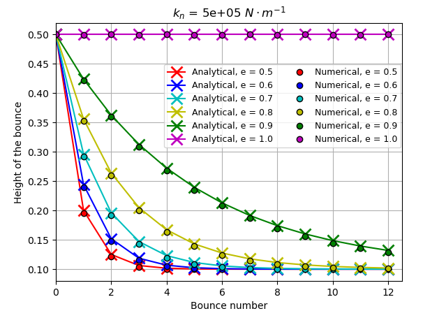
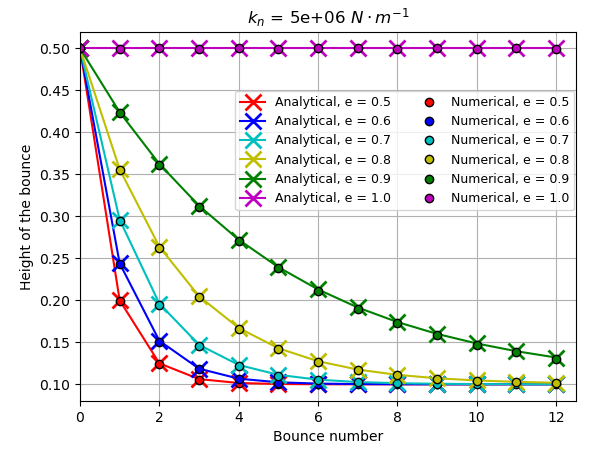

=================
Bouncing Particle
=================

This example of Lethe simulates the bounces of a single particle using the linear spring-dashpot collision model in 3D. This simulation is being setup according to MFIX DEM02 verification test [#mfix]_. It is recommended to visit `DEM parameters <../../../parameters/dem/dem.html>`_ for more detailed information on the concepts and physical meanings of the parameters in Lethe.

--------
Features
--------

- Solvers: ``lethe-particles``
- Postprocessing using `Python <https://www.python.org/>`_, `PyVista <https://docs.pyvista.org/>`_, `lethe_pyvista_tools <https://github.com/chaos-polymtl/lethe/tree/master/contrib/postprocessing>`_, and `ParaView <https://www.paraview.org/>`_.

----------------------------
Files Used in This Example
----------------------------

All files mentioned below are located in the example's folder (``examples/dem/3d-bouncing-particle``).

- Case generation Python script: ``bouncing_particle_case_generator.py``
- Parameter file for case generation: ``bouncing_particle_original.tpl``
- Postprocessing Python script: ``bouncing_particle_postprocessing.py``

-------------------------
Description of the Case
-------------------------

This simulation consists of a single particle bouncing on a flat plane. The particle start at a rest position in the air and accelerate due to the action of gravity. Upon reaching the outer limit of the domain, the particle-wall contact stops the particles form leaving the triangulation. Depending on the values of spring constant and restitution coefficient used, the particle will lose some kinetic energy and the height of the next bounce will decrease until the particle comes to a complete stop.

---------------
Parameter File
---------------

Mesh
~~~~~~~~~~~~~~~~~~

The ``grid type`` in this example is a ``hyper_cube``. Its dimensions are 2.0 m in every direction (from 0.0 m to 2.0 m), and since only one particle is used, the refinement is set to zero.

.. code-block:: text

    subsection mesh
      set type               = dealii
      set grid type          = hyper_cube
      set grid arguments     = 0.0 : 2.0 : false
      set initial refinement = 0
    end

Insertion Info
~~~~~~~~~~~~~~~~~~

Since the insertion of the particle must be done at as specific height, the ``list`` insertion method is used. The ``insertion frequency`` can be set to any value, since we're only using one particle. The particle is at a height of 0.5 m in the center of the X,Y plane.

.. code-block:: text

    subsection insertion info
      set insertion method                               = list
      set insertion frequency                            = 10000
      set list x = 1.0
      set list y = 1.0
      set list z = 0.5
    end

Lagrangian Physical Properties
~~~~~~~~~~~~~~~~~~~~~~~~~~~~~~~~

Different spring constant and restitution coefficient are used in this example. The spring constant is not defined explicitly in the parameter file, and, consequently, the physical properties must be chosen to obtain a desired spring constant. The interested reader can consult `DEM parameters`_ for more information about the definition of the sprint constant.

The ``poisson ratio`` of both the wall and the particle are being set to 0.3 arbitrarily. The Young's modulus of the wall is also being set arbitrarily to the high value of 1E12 Pa.

The following properties are defined in the ``bouncing_particle_original.tpl``  according to MFIX DEM02 verification test.

.. code-block:: text

    subsection lagrangian physical properties
      set g                        = 0.0, 0.0, -9.81
      set number of particle types = 1
      subsection particle type 0
        set size distribution type            = uniform
        set diameter                          = 0.2
        set number of particles               = 1
        set density particles                 = 2600
        set young modulus particles           = {{YP}}
        set poisson ratio particles           = 0.3
        set restitution coefficient particles = {{er}}
        set friction coefficient particles    = 0.0
      end
      set young modulus wall           = 1000000000000
      set poisson ratio wall           = 0.30
      set restitution coefficient wall = {{er}}
      set friction coefficient wall    = 0.
    end

As you can see, the ``young modulus particles`` and the ``restitution coefficient`` of both the wall and particle are not yet defined in the ``bouncing_particle_original.tpl`` file. A Python code called ``bouncing_particle_case_generator.py`` is provided with this example. This code allows the generation 6 parameter files each using a different restitution coefficient values (from 0.5 to 1.0) for one specific normal spring constant. The ``young modulus particles`` parameter will be determined using a bisection algorithm to satisfy the desired normal spring constant. Assuming you have Python3 installed on your machine, this code can be launched using this next line:

.. code-block:: text
    :class: copy-button

    python3 bouncing_particle_case_generator.py 5000000

Where ``5000000`` represent the normal spring constant that is wish to be used for the simulations. This code will generate 6 files named ``bouncing_particle_XX.prm``, where ``XX`` represent the value of the restitution coefficient used in it.

----------------------
Running the Simulation
----------------------
Once all 6 parameter file are created, the simulation can be launched one after the other using the following line (parallel mode is not recommend since there is only one particle):

.. code-block:: text
  :class: copy-button

  for i in $(seq -w 5 10); do lethe-particles bouncing_particle_${i}.prm ; done

All 6 simulations takes less than 2 minutes to run. A folder named according to the restitution coefficient of every simulation used will be generated (``/out_xx``).

---------------
Postprocessing
---------------
A Python post-processing code called ``bouncing_particle_post_processing.py`` is provided with this example. It is used to compare the height reached by the particle after each rebound with the analytical solution of a hard sphere bouncing on a flat plane. This analytical solution considers instantaneous collision between the particle and the wall, thus the maximum height of each bounce can be express by the following expression:

.. math::
        h_{k}^{max} = (h_0 - r_p)e^{2k} + rp

with :math:`k` represent the :math:`k^{th}` bounce, :math:`h_0` the starting height and :math:`r_p` the radius of the particle.

Once the 6 simulations have been run, use the following line in your command line to run the post-processing code :

.. code-block:: text
  :class: copy-button

  python3 bouncing_particle_postprocessing.py

.. important::

    You need to ensure that ``lethe_pyvista_tools`` is working on your machine. Click `here <../../../tools/postprocessing/postprocessing.html>`_ for details.

A figure will be generated which compares the analytical solution with the simulation results.

----------------------
Results and Discussion
----------------------
Animation of a bouncing particle with different restitution coefficient (:math:`K_n` = 5E6 N/m):

.. raw:: html

    <iframe width="560" height="315" src="https://www.youtube.com/embed/B1n776jHdoo" frameborder="0" allowfullscreen></iframe>

It can be seen that the particle with a restitution coefficient (:math:`e`) of 1.0 always rebounds at the same height. The other particles show a reduction in rebound height which follows the analytical solution expressed earlier.

Using the post-processing code, it is possible to compare the effect of the normal spring constant of the conservation of the kinetic energy during the collision.

As the stiffness is increased, the agreement between the results obtained in the simulations and the analytical solution improves. This is due to the assumption of instantaneous contact, which becomes false for an elastic particle. Since the particle is less stiff, the contact time between the particle and the wall is longer, thus the damping term in the force calculation comes into effect over a longer period and more kinetic energy is lost.

---------
Reference
---------

.. [#mfix] NETL Multiphase Flow Science Team, “4.2. DEM02: Bouncing particle", 4.2. DEM02: Bouncing particle - MFiX Third Edition documentation. https://mfix.netl.doe.gov/doc/vvuq-manual/main/html/dem/dem-02.html  (accessed Jun. 8, 2023).
