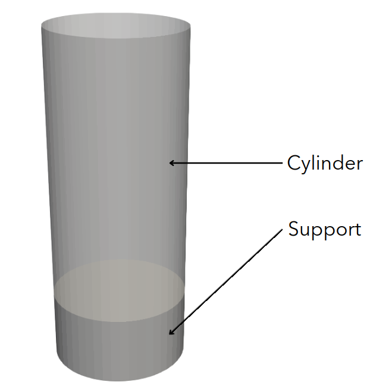
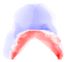
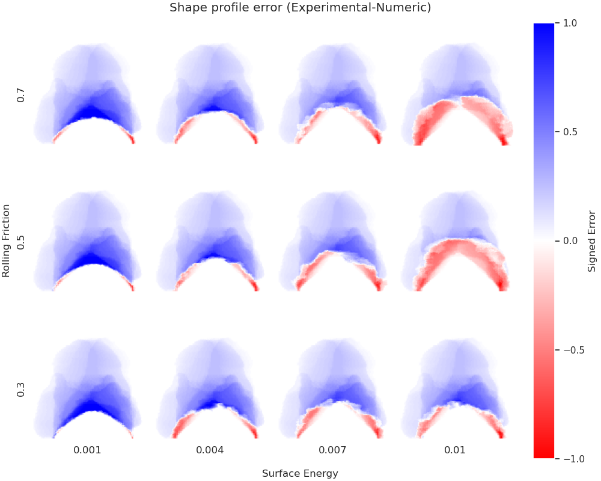
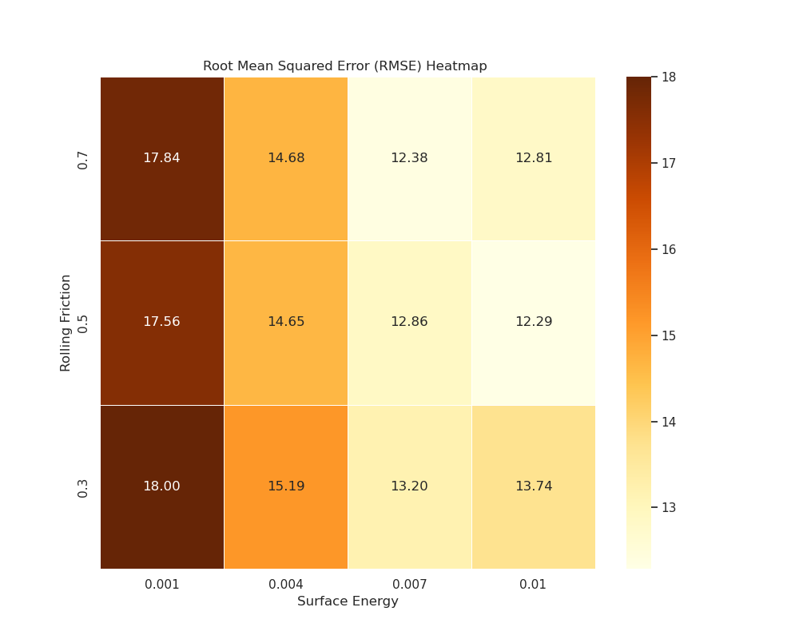

==================================
Granuheap
==================================

This example simulates the flow of a cohesive granular material inside a `Granuheap <https://www.granutools.com/en/granuheap>`_ instrument using the discrete element method (DEM). For more detailed information on the concepts and physical meaning of the parameters in Lethe, we strongly recommend visiting `DEM parameters <../../../parameters/dem/dem.html>`_.

----------------------------------
Features
----------------------------------

- Solvers: ``lethe-particles``
- Three-dimensional problem
- Moving solid surface
- `GMSH <https://gmsh.info/>`_ grids
- Multi-case simulations

----------------------------
Files Used in This Example
----------------------------

All files mentioned below are located in the example's folder (``examples/dem/3d-granuheap``).

- Mesh file: ``cylinder.msh`` and ``support.msh``
- Python file to generate mesh files: ``generate_meshes.py``
- Parameters files for the problem: ``granuheap.prm`` and ``granuheap_multicase.prm``
- Post-processing python files: ``post_processing.py``, ``post_processing_multicase.prm`` and ``post_processing_functions.py``.

-----------------------
Description of the Case
-----------------------

This example simulates the flow of wet sand during a Granuheap experiment. First, the packing of particles is generated by inserting particles inside a cylinder. After 1.6s, the cylinder rises, and the particles can flow freely, producing a heap. We compare the numerical results with our experimental results. To remain consistent with the Granuheap experiment, we use the same geometry in our simulations: a cylinder of 0.01m in diameter. For more information aboutt the Granuheap procedures, visit the `Granuheap web page <https://www.granutools.com/en/granuheap>`_. To match our experimental results, we test multiple combinations of parameters in our simulations. We use the work of Hu *et al.* [#hu2022]_ as a basis to choose which contact properties will create those combinations.

-------------------
Generate Mesh Files
-------------------

To generate the ``cylinder.msh`` and ``support.msh`` files, we used the ``generate_meshes.py`` file. The two functions take as input the bottom's position (x0), the radius, the number of points in the circumference, and the height. 

.. code-block:: text

  cylinder(x0, radius, n_points, height)
  support(x0, radius, n_points, height)

In this case, the cylinder has a height of 0.02m and a radius of 0.005m. The support has a height of 0.005m and has the same diameter as the cylinder. We fix the number of points in the circumference at 50 for both the cylinder and the support. 

.. code-block:: text

  cylinder(-0.005, 0.005, 50, 0.02)
  support(-0.01 ,0.005 ,50, 0.005)

Mesh files can be generated using the following command.

.. code-block:: text
  :class: copy-button

  python3 generate_meshes.py

.. note::
  GMSH is needed to generate mesh files. See `GMSH website <https://gmsh.info/>`_ for installation and `Introduction on How to Use GMSH <../../../tools/gmsh/gmsh.html>`_ for more information. 

--------------
Parameter File
--------------

Mesh
~~~~~

The domain we simulate is a rectangular box measuring :math:`0.045\times0.02\times0.02` meters, made using the deal.ii grid generator.  The grid is refined 6 times using the ``set initial refinement`` parameter so that the cell size is approximately 1.5 times the largest particle diameter value.

.. code-block:: text

  subsection mesh
  set type               = dealii
  set grid type          = subdivided_hyper_rectangle
  set grid arguments     = 3,1,1 : -0.010,-0.01,-0.01 : 0.035, 0.01,0.01 : true
  set initial refinement = 6
  end
  
  
Boundaries Conditions
~~~~~~~~~~~~~~~~~~~~~

The bottom of the domain is set as an outlet to allow the particles to leave the domain, thus reducing the computational time of the simulation.

.. code-block:: text
    
  subsection DEM boundary conditions
  set number of boundary conditions = 1

  subsection boundary condition 0
  set boundary id         = 0
  set type                = outlet
  end
  end

Lagrangian Physical Properties
~~~~~~~~~~~~~~~~~~~~~~~~~~~~~~~

The particles have a polydisperse size distribution with a density of 1922 :math:`kg/m^3`. 400 000 particles would be needed to approximately match the 2 g of sand used in the experiment. However, to reduce the simulation's duration of this example, we insert only 200 000 particles.

According to Hu *et al.* [#hu2022]_ the rolling friction and the surface energy parameters impact the final simulated angle of repose (AOR) the most. Thus, we simulate twelve combinations of those parameters. The ``rolling friction`` is between 0.3 and 0.7, and the ``surface energy`` is between 0.0010 and 0.0100. The ``granuheap.prm`` file of this example is specifically for a ``rolling friction`` of 0.5 and a ``surface energy`` of 0.0100. 

The water volume fraction of the wet sand used in the experiment is 0.325 %. According to the work of Liefferink *et al.* [#Liefferink2018]_, this water volume fraction matches an ``friction coefficient`` of 0.5. We use this value as a rough estimate of the ``friction coefficient`` for this example.

.. code-block:: text

  subsection lagrangian physical properties
  set g                        = -9.81, 0, 0
  set number of particle types = 1
  subsection particle type 0
  set size distribution type            = custom
  set custom diameters                  = 1.02e-4 , 1.16e-4 , 1.33e-4 , 1.52e-4 , 1.75e-4 , 2.00e-4 , 2.29e-4 , 2.62e-4 , 3.01e-4 , 3.44e-4
  set custom volume fractions           = 0.04 , 0.06 , 0.07 , 0.10 , 0.13 , 0.15 , 0.16 , 0.14 , 0.10 , 0.05
  set number of particles               = 200000
  set density particles                 = 1922
  set young modulus particles           = 5.94e4
  set poisson ratio particles           = 0.4
  set restitution coefficient particles = 0.9
  set friction coefficient particles    = 0.5
  set rolling friction particles        = 0.5
  set surface energy particles          = 0.01
  end
  set young modulus wall           = 1e7
  set poisson ratio wall           = 0.33
  set restitution coefficient wall = 0.9
  set friction coefficient wall    = 0.5
  set rolling friction wall        = 0.5
  set surface energy wall          = 1e-4
  end

Model Parameters
~~~~~~~~~~~~~~~~~~~~
 

The JKR contact model is used in this case because it has be shown to correctly model particle agglomeration for wet sand [#hu2022]_ .

.. code-block:: text

  subsection model parameters
  subsection contact detection
  set contact detection method                = dynamic
  set dynamic contact search size coefficient = 0.9
  set neighborhood threshold                  = 1.3
  end
  subsection load balancing
  set load balance method = frequent
  set frequency           = 100000
  end
  set particle particle contact force method = hertz_JKR
  set rolling resistance torque method       = constant_resistance
  set particle wall contact force method     = JKR
  set integration method                     = velocity_verlet
  end

  subsection restart
  set checkpoint = true
  set frequency  = 10000
  set restart    = false
  set filename   = dem
  end

Particle Insertion
~~~~~~~~~~~~~~~~~~~~

An insertion box is defined inside the cylinder. 10 000 particles are inserted every 9000 iterations. The size of the insertion box is chosen to ensure it is completely inside our cylinder which is smaller than our domain. Otherwise, particles will be lost during the insertion stage.

.. code-block:: text

  subsection insertion info
  set insertion method                               = volume
  set inserted number of particles at each time step = 10000
  set insertion frequency                            = 9000
  set insertion box points coordinates               = 0.015, -0.00325, -0.00325: 0.035, 0.00325, 0.00325
  set insertion distance threshold                   = 1.2
  set insertion maximum offset                       = 0.05
  set insertion prn seed                             = 19
  set insertion direction sequence                   =  1, 2, 0
  end

Solid Object
~~~~~~~~~~~~

We set the cylinder's translational velocity to :math:`0.05 m/s` after the particles were loaded, thus when the simulation time is larger than 1.6s. 

.. code-block:: text

  subsection solid objects
  subsection solid surfaces
  set number of solids = 2
  subsection solid object 0
  subsection mesh
  set type                   = gmsh
  set file name              = cylinder.msh
  set simplex                = true
  end
  subsection translational velocity
  set Function expression = if (t>1.6, 0.05, 0) ; 0 ; 0
  end
  end
  subsection solid object 1
  subsection mesh
  set type                   = gmsh
  set file name              = support.msh
  set simplex                = true
  end
  end
  end
  end

Simulation Control
~~~~~~~~~~~~~~~~~~~~~~~~~~~~

The process duration lasts for 2.2 seconds. We output the simulation results in every 1000 iterations.

.. code-block:: text

  subsection simulation control
  set time step         = 7.54e-6
  set time end          = 2.2
  set log frequency     = 1000
  set output frequency  = 1000
  set output path       = ./output/
  set output name       = granuheap
  set output boundaries = true
  end
    
-----------------------
Running the Simulation
-----------------------

Running one case
~~~~~~~~~~~~~~~~

A simulation with one set of values for the ``rolling friction`` and the ``surface energy`` can be launched using the following command:

.. code-block:: text
  :class: copy-button

  mpirun -np 8 lethe-particles granuheap.prm

.. note::
  This example needs a simulation time of approximately 5 hours on 12 processors using an AMD Ryzen 9 5900x 12-core processor.

Running multiple cases
~~~~~~~~~~~~~~~~~~~~~~

Three files are needed to create and launch multiple simulations; ``generate_cases_locally.py``, ``granuheap_multicase.prm`` and ``launch_lethe_locally.py``. For more information, visit `How to Automatically Create and Launch Lethe Simulations <../../../tools/automatic_launch/automatic_launch.html>`_

In this case, we run 3 different values of ``rolling friction`` and 4 different values of ``surface energy``, for a total of 12 simulations. 

.. code-block:: text

  number_of_cases = 4

  # Generation of data points
  energy_first = 0.0010
  energy_last = 0.0100
  energy = np.linspace(energy_first, energy_last, number_of_cases)

  rolling_friction_first = 0.3
  rolling_friction_last = 0.7
  rolling_friction = np.linspace(rolling_friction_first, rolling_friction_last, number_of_cases-1)

Simulations can be launched using the following commands:

.. code-block:: text
  :class: copy-button

  python3 generate_cases_locally.py
  python3 launch_lethe_locally.py

---------------
Post-processing
---------------

The Granuheap machine captures 16 pictures around the heap in a 180-degree arc. The images generate a map that distinguishes areas with constant particle presence (black), no particle presence (white), and varying particle presence (expressed through different shades of gray). The image below shows the map of the wet sand experiment and is provided as ``experimental_result.png``

Running one case
~~~~~~~~~~~~~~~~
To compare only one simulation with the experimental results, the ``post_processing.py`` file can be launched using the following command. 

.. code-block:: text
  :class: copy-button

  pvpython post_processing.py

The post-processing feature is launched using PvPython, the Python interface to the Paraview Software. It allows users to control ParaView with Python, thus without opening the user interface. PvPython can also run python scripts. 

If the experimental file is not the one provided in this example, the ``exp_path``, ``height_exp``, and ``width_exp`` will need to be updated in the ``post_processing.py`` file.

.. code-block:: text

  # Path to the granuheap experimental result
  exp_path = 'experimental_result.png' 
  # Name of simulation output (see OUTPUT NAME set in the simulation subsection of the parameter file)
  num_output = 'granuheap'
  # Output path (see OUTPUT PATH set in the simulation subsection of the parameter file)
  out_path = 'output'
  # Number of pixels in height and width of your experimental support (to adjust if you change experimental result)
  height_exp = 60
  width_exp = 85

This file will generate a map of the simulation and subtract it from the experimental map to obtain the profile shape error. This error will be presented in a new image saved as ``image_difference.png``. The picture below presents the profile shape error for a ``rolling friction`` of 0.5 and a ``surface energy`` of 0.0100. 

This post_processing file will also output the Root Mean Square Error (RMSE) in the terminal. 

Running multiple cases
~~~~~~~~~~~~~~~~~~~~~~
For multiple cases, the ``post_processing_multicase.py`` file should be used using the following command.

.. code-block:: text
  :class: copy-button

  pvpython post_processing_multicase.py

If the experimental file is not the one provided in this example, the ``exp_path``, ``height_exp`` and ``width_exp`` will need to be updated in the ``post_processing_multicase.py`` file. The parameters' names and values for each case can also be modified in the python file. 

.. code-block:: text

  # Path of the granuheap experimental result
  exp_path = 'experimental_result.png' 
  # Name of directory for each simulation (see CASE_PREFIX from the launch_lethe_locally.py file used)
  num_name = 'wetsand'
  # Name of simulation output (see OUTPUT NAME set in the simulation subsection of the parameter file)
  num_output = 'granuheap'
  # Output path (see OUTPUT PATH set in the simulation subsection of the parameter file)
  out_path = 'output'
  # Definition of variable parameters
  parameter1_name = 'Surface Energy'
  parameter1 = [0.0010, 0.0040, 0.0070, 0.0100]
  parameter2_name = 'Rolling Friction'
  parameter2 = [0.70, 0.50, 0.30]
  # Number of pixels in height and width of your experimental support (to adjust if you change experimental result)
  height_exp = 60
  width_exp = 85

The code will generate a map for each simulation and then subtract them from the experimental map. Those errors will be presented in a new image saved as ``profile_shape_error.png``.

To confirm which simulation has the lowest error, an image saved as ``error_values_heatmap.png`` will present a heatmap of each simulation RMSE.

The lowest error is obtained when the ``rolling friction`` is 0.5 and the ``surface energy`` is 0.0100. 

.. note::
  The following libraries will be necessary to run post-processing files; PIL, numpy, matplotlib.pyplot, os, glob, scipy.interpolate and UnivariateSpline. The Paraview software is also needed. 

-------
Results
-------

The video below presents the Granuheap simulation for a ``rolling friction`` of 0.5 and a ``surface energy`` of 0.0100. 

.. raw:: html

    <iframe width="560" height="315" src="https://www.youtube.com/embed/EZPuYZ9wQ0c?si=Px5PiotBox0GzBx3" frameborder="0" allowfullscreen></iframe>

---------
Reference
---------
.. [#hu2022] \A. C. Hu, Z. Li, K. Mao, J. Tang, X. Wang, L. Zhang and J. Zhou, “Calibration of wet sand and gravel particles based on JKR contact model,” *Powder Technology*, vol. 397, Jan. 2022. doi: `10.1016/j.powtec.2021.11.049 <https://doi.org/10.1016/j.powtec.2021.11.049>`_\.

.. [#Liefferink2018] \A. R.W. Liefferink, B. Weber and D. Bonn, “Ploughing friction on wet and dry sand,“ *Physical Review E*, vol. 98, Nov. 2018. doi: `10.1103/PhysRevE.98.052903 <https://doi.org/10.1103/PhysRevE.98.052903>`_\.

