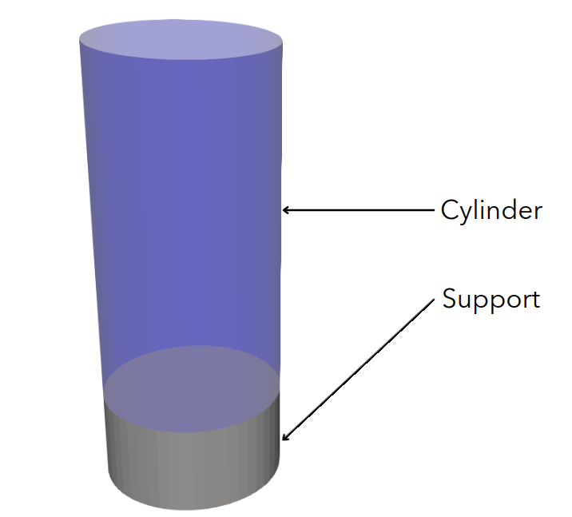
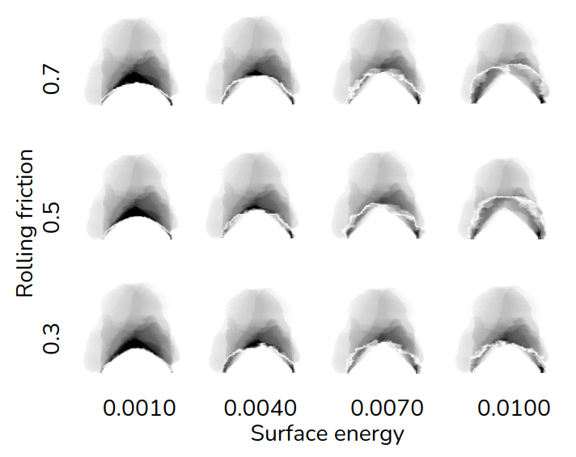

==================================
Granuheap
==================================

This example simulates the flow of a cohesive granular material inside a Granuheap instrument using the discrete element method (DEM). It is strongly recommended to visit `DEM parameters <../../../parameters/dem/dem.html>`_ for more detailed information on the concepts and physical meaning of the parameters in Lethe.

----------------------------------
Features
----------------------------------

- Solvers: ``lethe-particles``
- Three-dimensional problem
- Moving solid object
- `GMSH <https://gmsh.info/>`_ grids

----------------------------
Files Used in This Example
----------------------------

All files mentioned below are located in the example's folder (``examples/dem/3d-granuheap``).

- Mesh file: ``cylinder.msh`` and ``support.msh``
- Parameters file for the problem: ``granuheap.prm``

-----------------------
Description of the Case
-----------------------

This example simulates the flow of a water-wet sand during a Granuheap experiment. First, the packing of particles is generated by inserting particles inside a cylinder. After 1.6s, the cylinder rises, and the particles can flow freely, producing a heap. We compare the numerical results with our experimental results. To remain consistent with granuheap, we use the same metrics in our simulations: a cylinder of 0.01m in diameter. For more information about granuheap procedures, visit the `granuheap web page <https://www.granutools.com/en/granuheap>`_. In order to match our experimental results, we test multiple combinaisons of parameters in our simulations. We use the work of Hu *et al.* `[1] <https://doi.org/10.1016/j.powtec.2021.11.049>`_ as a basis for the choice of variable parameters.

--------------
Parameter File
--------------

Mesh
~~~~~

The domain we simulate is a rectangular box which is :math:`0.045\times0.02\times0.02` metres and is made using the deal.ii grid generator.  The grid is refined 6 times using the ``set initial refinement`` parameter.

.. code-block:: text

  subsection mesh
    set type               = dealii
    set grid type          = subdivided_hyper_rectangle
    set grid arguments     = 3,1,1 : -0.010,-0.01,-0.01 : 0.035, 0.01,0.01 : true
    set initial refinement = 6
  end
  
  
Boundaries Conditions
~~~~~~~~~~~~~~~~~~~~~

To reduce the time of the simulation, the bottom of the domain is set as an outlet. Thus, all particles leaving the support plate will not be part of the simulation anymore. 

.. code-block:: text
  
  subsection DEM boundary conditions
    set number of boundary conditions = 1

    subsection boundary condition 0
      set boundary id         = 0
      set type                = outlet
    end
  end

Lagrangian Physical Properties
~~~~~~~~~~~~~~~~~~~~~~~~~~~~~~~

The particles are polydispersed with a density of 1922 :math:`kg/m^3`. 400,000 particles would be needed to match the 2 g of sand used in the experiment. However, to reduce the simulation time of this example, we insert only 200,000 particles.

According to Hu *et al.* `[1] <https://doi.org/10.1016/j.powtec.2021.11.049>`_, the rolling friction and the surface energy parameters have the most impact on the final simulated angle of repose. Thus, we simulate twelve combinations of those parameters. The ``rolling friction`` is between 0.3 and 0.7 and the ``surface energy`` is between 0.0010 and 0.0100. The ``granuheap.prm`` file of this example is specifically for a ``rolling friction`` of 0.5 and a ``surface energy`` of 0.0100.

.. code-block:: text

  subsection lagrangian physical properties
    set g                        = -9.81, 0, 0
    set number of particle types = 1
    subsection particle type 0
      set size distribution type            = custom
      set custom diameters                  = 1.02e-4 , 1.16e-4 , 1.33e-4 , 1.52e-4 , 1.75e-4 , 2.00e-4 , 2.29e-4 , 2.62e-4 , 3.01e-4 , 3.44e-4
      set custom volume fractions	          = 0.04 , 0.06 , 0.07 , 0.10 , 0.13 , 0.15 , 0.16 , 0.14 , 0.10 , 0.05
      set number of particles               = 200000
      set density particles                 = 1922
      set young modulus particles           = 5.94e4
      set poisson ratio particles           = 0.4
      set restitution coefficient particles = 0.9
      set friction coefficient particles    = 0.5
      set rolling friction particles        = 0.5
      set surface energy particles          = 0.01
    end
    set young modulus wall           = 1e7
    set poisson ratio wall           = 0.33
    set restitution coefficient wall = 0.9
    set friction coefficient wall    = 0.5
    set rolling friction wall        = 0.5
    set surface energy wall          = 1e-4
  end

Model Parameters
~~~~~~~~~~~~~~~~~~~~

The JKR contact model is used in this case because of the cohesive aspect of wet sand. Indeed, as Hu *et al.* `[1] <https://doi.org/10.1016/j.powtec.2021.11.049>`_ explains, JKR method can better simulate agglomeration between particles than, for example, the Hertz-Mindlin contact model.

.. code-block:: text

  subsection model parameters
    subsection contact detection
      set contact detection method                = dynamic
      set dynamic contact search size coefficient = 0.9
      set neighborhood threshold                  = 1.3
    end
    subsection load balancing
      set load balance method = frequent
      set frequency           = 100000
    end
    set particle particle contact force method = hertz_JKR
    set rolling resistance torque method       = constant_resistance
    set particle wall contact force method     = JKR
    set integration method                     = velocity_verlet
  end

  subsection restart
    set checkpoint = true
    set frequency  = 10000
    set restart    = false
    set filename   = dem
  end

Particle Insertion
~~~~~~~~~~~~~~~~~~~~

An insertion box is defined inside the cylinder. 10,000 particles are inserted every 9,000 iterations. It is important to note the size of the insertion box to make sure it is completely inside our cylinder which is smaller than our domain. Otherwise, particles will be lost during the insertion stage given that the domain's bottom is an outlet.

.. code-block:: text

  subsection insertion info
    set insertion method                               = volume
    set inserted number of particles at each time step = 10000
    set insertion frequency                            = 9000
    set insertion box points coordinates               = 0.015, -0.00325, -0.00325: 0.035, 0.00325, 0.00325
    set insertion distance threshold                   = 1.2
    set insertion maximum offset                       = 0.05
    set insertion prn seed                             = 19
    set insertion direction sequence                   =  1, 2, 0
  end

Solid Object
------------

Two mesh files are necessary to reproduce the granuheap example; ``cylinder.msh`` and ``support.msh``. The cylinder is 0.02 tall with a radius of 0.005 and the support is 0.005 tall with the same diameter as the cylinder.

We set the translational velocity of the cylinder to :math:`0.05 m/s` after the particles loading, thus when the simulation time is higher than 1.6s. 

.. code-block:: text

  subsection solid objects
    subsection solid surfaces
      set number of solids = 2
      subsection solid object 0
        subsection mesh
          set type                   = gmsh
          set file name              = cylinder.msh
          set simplex                = true
        end
        subsection translational velocity
          set Function expression = if (t>1.6, 0.05, 0) ; 0 ; 0
        end
      end
      subsection solid object 1
        subsection mesh
          set type                   = gmsh
          set file name              = support.msh
          set simplex                = true
        end
      end
    end
  end

Simulation Control
~~~~~~~~~~~~~~~~~~~~~~~~~~~~

The simulation runs for 2.2 seconds in real time. We output the simulation results in every 1,000 iterations.

.. code-block:: text

  subsection simulation control
    set time step         = 7.54e-6
    set time end          = 2.2
    set log frequency     = 1000
    set output frequency  = 1000
    set output path       = ./output/
    set output name       = granuheap
    set output boundaries = true
  end
    
-----------------------
Running the Simulation
-----------------------

A simulation with one set of values for the ``rolling friction`` and the ``surface energy`` can be launched using the following command:

.. code-block:: text
  :class: copy-button

   mpirun -np 8 lethe-particles granuheap.prm

.. note::
  This example needs a simulation time of approximately 5 hours on 12 processors using an AMD Ryzen 9 5900x 12-core processor x 24.

----------------------
Results and discussion
----------------------

The Granuheap machine captures 16 pictures around the heap in a 180-degree arc. The images generate a map that distinguishes areas with constant particle presence (black), no particle presence (white), and varying particle presence (expressed through different shades of gray). The image below shows the map of the wet sand experiment.

.. figure:: images/map.png
    :width: 200
    :alt: map_exp
    :align: center

To compare our numerical results with the experimental data, we generate a map for each of our simulations and subtract it from the experimental map. The image below illustrates these differences for all twelve combinations of coefficients.

To confirm which simulation has the lowest error, we calculate the Root Mean Square Error for each simulation. The image below presents a heatmap of those errors. 

We see that the combination of a ``rolling friction`` of 0.5 and a ``surface energy`` of 0.0010 gives the lowest error. The video below presents the granuheap simulation for this combination of parameters.

EMBED VIDEO TO COME

---------
Reference
---------
`[1] <https://doi.org/10.1016/j.powtec.2021.11.049>`_ 	C. Hu, Z. Li, K. Mao, J. Tang, X. Wang, L. Zhang and J. Zhou, “Calibration of wet sand and gravel particles based on JKR contact model,” *Powder Technology*, vol. 397, Jan. 2022.
 
