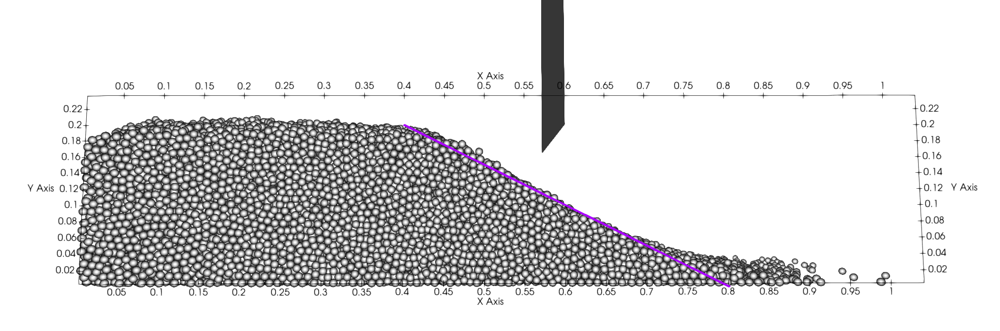
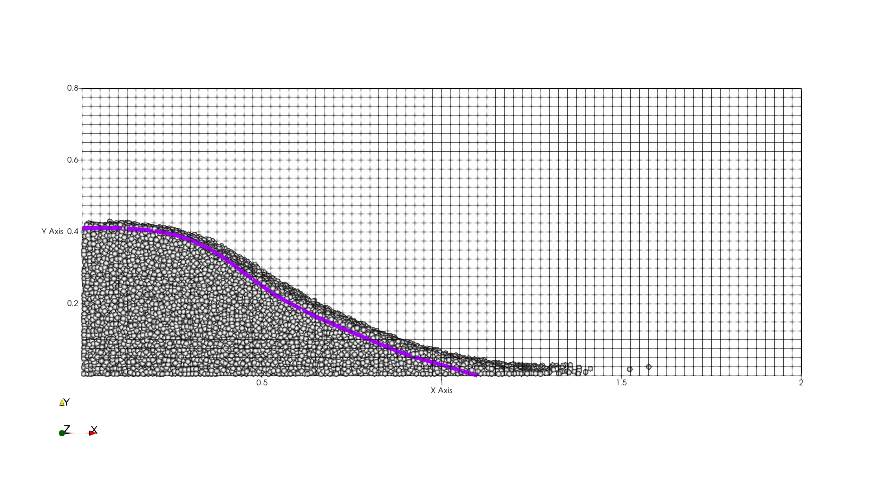

==================================
Granular Dam-Break
==================================

This example simulates the dam-break flow of a dry granular material using the discrete element method (DEM). More information regarding the DEM parameters are given in the Lethe documentation, i.e. `DEM parameters <../../../parameters/dem/dem.html>`_.

----------------------------------
Features
----------------------------------

- Solvers: ``lethe-particles``
- Three-dimensional problem
- Moving floating mesh
- Load-balancing

----------------------------
Files Used in This Example
----------------------------

All files mentioned below are located in the example's folder (``examples/dem/3d-dam-break``).

- Geometry file: ``square.geo``
- Mesh file: ``square.msh``
- Parameters file for the problem (:math:`H=20 \, \text{cm}`): ``granular-dam-break.prm``
- Parameters file for the :math:`H=40 \, \text{cm}` bed: ``granular-dam-break-H-40cm.prm``

-----------------------
Description of the Case
-----------------------

This example simulates the dam-break flow of a dry powder. First, a packing of particles is generated by inserting particles behind a sluice gate. After 0.5s, the sluice gate rises and the particles are able to flow freely, producing a dam-break flow. We compare the results we obtain with those of Evangelista *et al.* [#evangelista2014]_ To ensure that the simulation remains computationally efficient, we will scale-up the sand particles used by Evangelista *et al.* from a diameter of 1.6mm to 10mm. This reduces their number by a factor of approximately 250x. We first simulate case B1 of Evangelista *et al.*, with a bed length of 60cm and bed height of 20cm. As an extension, we also simulate a bed height of 40cm (case B3).

--------------
Parameter File
--------------

Mesh
~~~~~

The domain we simulate is a rectangular box which is :math:`2\times0.4\times0.4` meters and is made using the deal.ii grid generator.  The grid is refined 4 times using the ``set initial refinement`` parameter.

.. code-block:: text

  subsection mesh
    set type               = dealii
    set grid type          = subdivided_hyper_rectangle
    set grid arguments     = 5,1,1 : 0,0,0 : 2,0.4,0.4 : false
    set initial refinement = 4
  end

Lagrangian Physical Properties
~~~~~~~~~~~~~~~~~~~~~~~~~~~~~~~

The particles are mono dispersed with a radius of 0.005 m and a density of 2560 :math:`kg/m^3`, respectively. We insert 60k particles to ensure an initial height of 0.2m in order to match the B1 experiment of Evangelista *et al.*. The friction coefficient and the rolling coefficient are the most important parameters in this simulation, since they control the final repose angle of the particles as well as the speed of the progression of the dam-break flow. Since sand is generally non-spherical, we choose relatively high values for the friction and the rolling friction coefficients.

.. code-block:: text

  subsection lagrangian physical properties
    set g                        = 0, -9.81, 0.0
    set number of particle types = 1
    subsection particle type 0
      set size distribution type            = uniform
      set diameter                          = 0.01
      set number of particles               = 60000
      set density particles                 = 2560
      set young modulus particles           = 1e6
      set poisson ratio particles           = 0.2
      set restitution coefficient particles = 0.9
      set friction coefficient particles    = 0.5
      set rolling friction particles        = 0.3
    end
    set young modulus wall           = 1e6
    set poisson ratio wall           = 0.2
    set restitution coefficient wall = 0.9
    set friction coefficient wall    = 0.5
    set rolling friction wall        = 0.3
  end

Model Parameters
~~~~~~~~~~~~~~~~~~~~

In this example, we use the ``frequent`` load balancing method to ensure that the division of the domain amongst the various processing cores follow the particles.

.. code-block:: text

  subsection model parameters
    subsection contact detection
      set contact detection method                = dynamic
      set dynamic contact search size coefficient = 0.9
    end
    subsection load balancing
      set load balance method                     = frequent
      set frequency                               = 5000
      set threshold                               = 1.3
    end
    set particle particle contact force method  = hertz_mindlin_limit_overlap
    set rolling resistance torque method        = constant
    set particle wall contact force method      = nonlinear
    set integration method                      = velocity_verlet
  end

Particle Insertion
~~~~~~~~~~~~~~~~~~~~

An insertion box is defined inside the rectangular box. 60 000 particles are inserted behind the sluice gate which is located at :math:`x=0.6`. It is important to note the size of the insertion box to make sure it is completely inside our geometry. Otherwise, particles will be lost during the insertion stage.

.. code-block:: text

  subsection insertion info
    set insertion method                               = volume
    set inserted number of particles at each time step = 60000
    set insertion frequency                            = 10000
    set insertion box points coordinates               = 0.0025, 0.0025, 0.0025 : 0.597, 0.340, 0.397
    set insertion distance threshold                   = 1.075
    set insertion maximum offset                       = 0.025
    set insertion prn seed                             = 19
  end

Moving Solid Object
----------------------------

The sluice gate which prevents the particle from floating is made of a 3D surface mesh of a flat wall. This is handled using the solid objects parameters. We insert one solid object which is generated using GMSH. To parametrize the motion of the sluice gate, we set its translational velocity to :math:`\mathbf{v}=[0,1,0]^T \forall t \in [0.5,0.7]s` and we keep it static otherwise. This ensures that the sluice gate moves upward between 0.5 and 0.7s and stops moving afterwards. To ensure maximal computational efficiency, it is important to minimize the number of triangles used in the surface meshes that represent moving objects.

.. code-block:: text

  subsection solid objects
    subsection solid surfaces
      set number of solids = 1
      subsection solid object 0
        subsection mesh
          set type               = gmsh
          set file name          = square.msh
          set simplex            = true
          set initial refinement = 0
        end
  
        subsection translational velocity
          set Function expression = 0 ; if(t>0.5,if(t<0.7,1,0),0) ; 0
        end
        subsection angular velocity
          set Function expression = 0 ; 0 ; 0
        end
      end
    end
  end

Simulation Control
~~~~~~~~~~~~~~~~~~~~~~~~~~~~

The simulation runs for 2 seconds of real time. We output the simulation results every 500 iterations.

.. code-block:: text

  subsection simulation control
    set time step         = 5e-5
    set time end          = 2
    set log frequency     = 500
    set output frequency  = 500
    set output path       = ./output/
    set output boundaries = true
  end
    

-----------------------
Running the Simulation
-----------------------

The simulation is launched using a single input file for the insertion of the particles, the opening of the sluice gate and the granular motion of the particles.

.. code-block:: text
  :class: copy-button

   mpirun -np 8 lethe-particles granular-dam-break.prm

.. note::
 This example needs a simulation time of approximately 10 minutes on 8 processors using an 12th Gen Intel(R) Core(TM) i9-12900K.

-------
Results
-------

Results for :math:`H=20 \ \text{cm}`
~~~~~~~~~~~~~~~~~~~~~~~~~~~~~~~~~~~~

The following movie displays the dam-break flow:

.. raw:: html

    <iframe width="840" height="472"  src="https://www.youtube.com/embed/v32ZqxO2X98" frameborder="0" allow="accelerometer; autoplay; clipboard-write; encrypted-media; gyroscope; picture-in-picture" allowfullscreen></iframe>

The following image compares the final repose angle of the particles with the results of Evangelista *et al.* We note the good agreement between the two. Evangelista *et al.* also found experimentally that the particle height profile varied from :math:`0.2m` at :math:`x=0.4m` to :math:`\approx 0.025m` at :math:`x=0.8m` which is in good agreement with what we observe here.

Results for :math:`H=40 \ \text{cm}`
~~~~~~~~~~~~~~~~~~~~~~~~~~~~~~~~~~~~

The following image compares the final granular profile of the particles with the results of Evangelista et al (illustrated using a magenta curve). We note the good agreement between the two, except for the fact that a few particles have moved further away (:math:`x>1.1m`) than the one from the experiments of Evangelista *et al.* This is a consequence of the fact that we have used larger particles to simulate the case.

----------------------------
Possibilities for Extension
----------------------------

- Study the impact of the friction and rolling friction coefficients on the dam-break flow.
- Change the height of the bed to 30cm or 50m and try to reproduce the other experiments of Evangelista *et al.*
- Use smaller particles and reproduce the full experiment of Evangelista *et al.*

---------
Reference
---------

.. [#evangelista2014] \S. Evangelista, G. De Marinis, C. Di Cristo, and A. Leopardi, “Dam-break dry granular flows: Experimental and numerical analysis,” *Wseas Trans. Environ. Dev.*, vol. 10, pp. 382–392, Nov. 2014. [Online]. Available: http://www.wseas.us/journal/pdf/environment/2014/a245715-232.pdf.\
 
