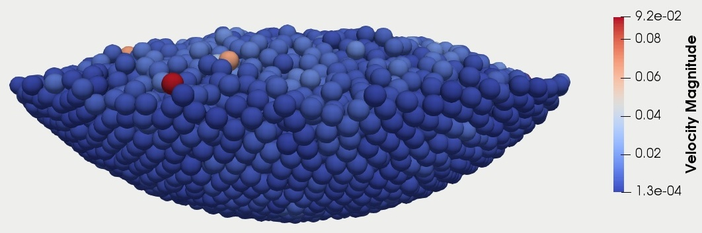

==================================
Packing in Ball
==================================

This is the second example of Lethe-DEM. This example is the three-dimensional version of the ``packing_in_circle`` example. It is recommended to visit `DEM parameters <../../../parameters/dem/dem.html>`_ for more detailed information on the concepts and physical meanings of the parameters in Lethe-DEM.

Features
----------------------------------
- Solvers: ``dem_3d``
- Three-dimensional problem
- Parallelism

Location of the examples
------------------------
 ``/examples/dem/3d_packing_in_ball/packing_in_ball.prm``

Description of the case
-----------------------

Packing in ball example is the three-dimensional version of the packing in circle example.

.. warning::
	Two-dimensional DEM solver (dem_2d) is not an accurate model, since several phenomena including torque on particles are intrinsically three-dimensional. dem_2d solver may only be used for simple basic analyses before performing three-dimensional simulations with dem_3d solver becomes necessary.

Parameter file
--------------

The parameter file of packing in ball example is very similar to packing in circle example. We only explain the parts that are different because of the three-dimensional example.

Mesh
~~~~~

In a three-dimensional simulation, ``hyper_ball`` creates a three-dimensional ball (hollow sphere). Note that the first grid argument, which is the center of the triangulation, has three components (0.0, 0.0, 0.0). The ``expand particle-wall contact search`` is used in concave geometries to enable particle-wall contact search with boundary faces of neighbor cells for particles located in each boundary cell.

.. code-block:: text

    subsection mesh
        set type                 			 	  = dealii
        set grid type      	     			 	= hyper_ball
        set grid arguments       				   = 0.0, 0.0, 0.0 : 0.1 : false
        set initial refinement   				   = 3
        set expand particle-wall contact search = true
    end

Insertion info
~~~~~~~~~~~~~~~~~~~

In a three-dimensional simulation, we have to define the minimum and maximum dimensions of the insertion box with three components in `x`, `y`, and `z` directions.

.. code-block:: text

    subsection insertion info
        set insertion method								= non_uniform
        set inserted number of particles at each time step  = 1000
        set insertion frequency            		 			= 150000
        set insertion box minimum x            	 			= -0.05
        set insertion box minimum y            	         	= -0.05
        set insertion box minimum z            	         	= -0.03
        set insertion box maximum x            	         	= 0.05
        set insertion box maximum y           	 		 	= 0.05
        set insertion box maximum z            	         	= 0.07
        set insertion distance threshold					= 2
        set insertion random number range					= 0.75
        set insertion random number seed					= 19
    end

Lagrangian physical properties
~~~~~~~~~~~~~~~~~~~~~~~~~~~~~~~

Gravitational acceleration has three components in three directions.

.. code-block:: text

    subsection lagrangian physical properties
        set gx            		 					  	= 0.0
        set gy            		 					  	= 0.0
        set gz            		 					  	= -9.81
        set number of particle types	                = 1
            subsection particle type 0
            set size distribution type					= uniform
                set diameter            	 			= 0.005
            set number									= 5000
                set density particles  	 			 	= 2000
                set young modulus particles         	= 10000000
                set poisson ratio particles          	= 0.3
                set restitution coefficient particles	= 0.75
                set friction coefficient particles      = 0.3
                set rolling friction particles          = 0.1
        end
        set young modulus wall            				= 10000000
        set poisson ratio wall            				= 0.3
        set restitution coefficient wall           		= 0.75
        set friction coefficient wall         			= 0.3
        set rolling friction wall         	     		= 0.1
    end

Model parameters
~~~~~~~~~~~~~~~~~

.. code-block:: text

    subsection model parameters
      set contact detection method 		   	   		= dynamic
      set dynamic contact search size coefficient	= 0.7
      set neighborhood threshold				 	= 1.5
      set particle particle contact force method    = hertz_mindlin_limit_overlap
      set particle wall contact force method        = nonlinear
      set integration method				 		= velocity_verlet
    end

Simulation control
~~~~~~~~~~~~~~~~~~~~~~~~~~~~

.. code-block:: text

    subsection simulation control
      set time step                 		= 1e-6
      set time end       					= 3
      set log frequency				    	= 10000
      set output frequency            		= 10000
    end

Running the simulation
----------------------
This simulation can be launched by:

.. code-block:: text

  dem_3d packing_in_ball.prm

We can also launch this simulation in parallel mode. For example, to launch the simulation on 8 processes:

.. code-block:: text

  mpirun -np 8 dem_3d packing_in_ball.prm

.. note::
	The parallel simulations are generally faster than simulations on a single process. However, to leverage the full performance of a parallel simulation, it should be performed with a load-balancing strategy throughout the simulation. Load-balancing is explained in the `next example <../rotating-drum/rotating-drum.html>`_.

Results
---------

Packed particles at the end of simulation:

