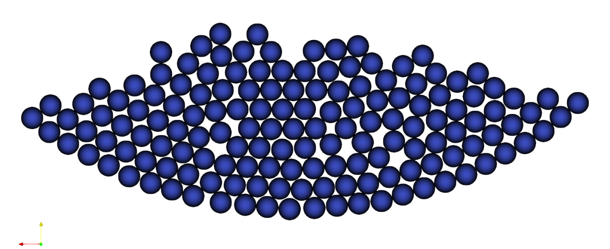

==================================
Packing in Circle
==================================

This example introduces the concept of parameter files to parametrize Lethe simulations. It is strongly recommended to visit `DEM parameters <../../../parameters/dem/dem.html>`_ for more detailed information on the concepts and physical meaning of the parameters in Lethe-DEM.

----------------------------------
Features
----------------------------------
- Solvers: ``lethe-particles``
- Two-dimensional problem
- Displays the selection of models and physical properties

----------------------------
Files Used in This Example
----------------------------

- Parameter file: ``examples/dem/2d-packing-in-circle/packing-in-circle.prm``

-----------------------
Description of the Case
-----------------------

Packing in a circle is the most basic example in Lethe-DEM. In this example, 50 two-dimensional particles are inserted in a circle. Due to the action of gravity, they accelerate in the defined direction of gravity. Upon reaching the outer periphery of the circle (the boundary walls of the triangulation), the particle-wall contact stops the particles from leaving the triangulation. Finally a balance forms between the particle-particle and particle-wall contact force and the gravity force. Particles lose kinetic energy (and velocity), get packed on the triangulation boundary, and remain at rest.

--------------
Parameter File
--------------

Lethe simulations are controlled by *parameter files* which possess the extension ``.prm``. This is the default text format of the ParameterHandler class of the deal.ii library from which Lethe derives. For more information on this class, we refer to the `deal.II documentation <https://www.dealii.org/current/doxygen/deal.II/classParameterHandler.html>`_. 

Parameter files are made of subsections which describe a portion of the simulation (e.g. physical properties, simulation control). In parameter files, lines starting with ``#`` are comments. Parameters are set using the following syntax:

.. code-block:: text

    set parameter name = value

The syntax is flexible. Parameters do not need to be specified in a specific order, but only within the subsection in which they belong. For a full list of the parameters within Lethe-DEM, we refer to the DEM parameter page.

To set-up the packing-in-circle case, we first need to establish the triangulation used for the simulation.

Mesh
~~~~~

The ``mesh`` subsection specifies the computational grid:

.. code-block:: text

    subsection mesh
      set type                                = dealii
      set grid type                           = hyper_ball
      set grid arguments                      = 0.0, 0.0 : 0.1 : false
      set initial refinement                  = 3
      set expand particle-wall contact search = true
    end

The ``type`` specifies the mesh format used. At the moment, Lethe supports two mesh formats: ``dealii`` and ``gmsh``. ``dealii`` meshes are in-situ generated meshes for simple geometries. The type of grid generated is specified by the ``grid type`` parameters and this grid is parametrized by its ``grid arguments``. We refer to the documentation of the deal.ii `GridGenerator <https://www.dealii.org/current/doxygen/deal.II/namespaceGridGenerator.html>`_ for a detailed explanation of the available grids.

Since the domain of the packing-in-circle problem is a circle, we use the *hyper_ball* as ``grid_type``. The ``grid arguments`` of this ``grid_type`` determine the position of the center, the radius of the ball (circle), and whether the colorize option is going to be used (``true``) or not (``false``). By setting the latter argument to ``true``, each of the boundaries will receive a unique ID. The IDs will be used to set the boundary conditions on specific parts of the boundary of the domain. If the ``colorize`` option is set to ``false``, all boundaries would have been given the ID ``0``. This will constitute the walls of the domain.

The ``expand particle-wall contact search`` parameter is an advanced feature of Lethe-DEM that expands the particle-wall contact detection list by including the walls of the neighboring cells.  This feature is necessary when the geometry is concave and presents curvature, as is the case of the circle in which the simulation is carried out.

.. note:: 
	Since the simulation is two-dimensional, we have a circle instead of a ball for the triangulation.

The last parameter is the ``initial refinement`` of the grid. Most deal.ii grid generators contain a minimal number of cells. Indicating an ``initial refinement=3`` implies that the initial mesh is refined 3 times. Each refinement corresponds to dividing the cell element into two for each dimension, i.e, in 2D, each cell is divided into 4 per refinement.

.. note:: 
	The computational complexity of the functions in Lethe-DEM is either a function of the number of particles or a function of the number of cells. As the number of refinement increases, the number of cells in the triangulation increases, while the number of particles in each cell decreases. This is in favor of particle-based functions (such as fine search), whereas cell-based functions (such as sorting particles in the cells) become more computationally expensive. Hence, we recommend the users choose an ``initial refinement`` to reach an average cell size equal to 3-4 times the particle diameter.

Insertion Info
~~~~~~~~~~~~~~~~~~~

The ``insertion info`` subsection manages the insertion of particles.

.. code-block:: text

    subsection insertion info
      set insertion method                               = volume
      set inserted number of particles at each time step = 50
      set insertion frequency                            = 1000000
      set insertion box points coordinates               = -0.05, 0  : 0.05, 0.07
      set insertion distance threshold                   = 2
      set insertion maximum offset                       = 0.75
      set insertion prn seed                             = 19
    end

First, the ``insertion method`` is selected. There are two insertion methods (``uniform`` and ``non_uniform``) in Lethe-DEM. In ``uniform`` insertion, the particles are inserted uniformly (without randomness in their initial location), while in ``non_uniform``, particles are inserted randomly in the insertion box. ``inserted number of particles at each time step`` specifies the desired number of particles to be inserted at each insertion step.

.. note ::
	The meaning of randomness in the initial location of particles in a non-uniform insertion is structured randomness (Using pseudo-random number generator algorithms).

.. note::
    If the insertion box is not adequately large to insert ``inserted number of particles at each time step`` particles with the defined arrangement (initial distance between the inserted particles), Lethe prints a warning and inserts the maximum number of particles that fit inside the insertion box at each insertion step.

``insertion frequency`` specifies the frequency of insertion steps. For example, if we set ``insertion frequency = 1000``, steps 0, 1000, 2000, 3000, ... will be defined as insertion iterations. Then we specify the dimensions of the insertion box. The box is defined using its ``minimum x``, ``minimum y``, ``maximum x``, and ``maximum y`` in two-dimensional simulations. In three-dimensional simulations, ``minimum z``, and ``maximum z`` are defined as well.

.. note::
    We recommend that the defined insertion box have at least a distance of :math:`{d^{max}_p}` (maximum diameter of particles) from the triangulation boundaries. Otherwise, particles may have an overlap with the triangulation walls in the insertion.

``insertion distance threshold`` specifies the initial distance between the particles in the insertion. If we choose a ``non_uniform`` insertion, this initial distance is added by a random number to generate randomness. The random numbers are generated in the range [0 - ``insertion maximum offset``], and from a seed of ``insertion prn seed``.

Lagrangian Physical Properties
~~~~~~~~~~~~~~~~~~~~~~~~~~~~~~~

The gravitational acceleration as well as the physical properties of particles and walls are specified in the ``Lagrangian physical properties`` subsection. These properties include diameter and density of particles, Young's modulus, Poisson's ratio, restitution coefficient and friction coefficients.

.. code-block:: text

    subsection lagrangian physical properties
      set gx                       = 0.0
      set gy                       = -9.81
      set number of particle types = 1
      subsection particle type 0
        set size distribution type            = uniform
        set diameter                          = 0.005
        set number of particles               = 150
        set density particles                 = 2000
        set young modulus particles           = 100000000
        set poisson ratio particles           = 0.3
        set restitution coefficient particles = 0.9
        set friction coefficient particles    = 0.3
      end
      set young modulus wall           = 100000000
      set poisson ratio wall           = 0.3
      set restitution coefficient wall = 0.9
      set friction coefficient wall    = 0.3
    end

First, gravitational acceleration is defined. Since the simulation is two-dimensional, we do not define the gravity in `z` direction. The ``number of particle types`` parameter specifies the number of particle types in a simulation. Particles with different sizes, size distributions, and physical properties have to be defined as separate particle types. The ``size distribution type`` parameter specifies the size distribution for each particle type. The acceptable choices are ``uniform`` and ``normal`` distributions. Since this simulation is monodispersed, the ``size distribution type`` is ``uniform``. ``diameter`` and ``density`` of particles, ``number`` of particles of each type, ``young modulus``, ``poisson ratio``, ``restitution coefficient`` and ``friction coefficient`` are defined.

.. note::
    The ``diameter`` parameter defines the diameter of the particles in a ``uniform`` distribution. For a ``normal`` distribution, we need to define ``average diameter`` and ``standard deviation`` parameters.

Model Parameters
~~~~~~~~~~~~~~~~~

In the ``model parameters`` subsection, DEM simulation parameters are defined. 

.. code-block:: text

    subsection model parameters
      subsection contact detection
        set contact detection method                = dynamic
        set dynamic contact search size coefficient = 0.7
        set neighborhood threshold                  = 1.5
      end
      set particle particle contact force method    = hertz_mindlin_limit_overlap
      set particle wall contact force method        = nonlinear
      set integration method                        = velocity_verlet
      set rolling resistance torque method          = constant_resistance
    end

These parameters include ``contact detection method`` and its subsequent information (``dynamic contact search size coefficient`` **or** ``contact detection frequency`` for ``dynamic`` **or** ``constant`` contact detection method), ``neighborhood threshold`` (which defines the contact neighbor list size: ``neighborhood threshold`` * particle diameter), ``particle particle contact force method``, ``particle wall contact force method`` and ``integration method``. All the concepts, models, and choices are explained in `DEM parameters <../../../parameters/dem/dem.html>`_.

By setting ``contact detection method = constant``. contact search will be carried out at constant frequency (every ``contact detection frequency`` iterations). Normally, the ``contact detection frequency`` should be a value between 5 and 50. The contact frequency should be chosen such that the particles do not travel more than half a cell between two contact detection. Small values of ``contact detection frequency`` lead to long simulation times, while large values of ``contact detection frequency`` may lead to late detection of collisions. Late detection of collisions can result in very large particles velocities (popcorn jump of particles in a simulation) or particles leaving the simulation domain.

By setting ``contact detection method = dynamic``, Lethe-DEM rebuilds the contact lists automatically. In this mode, Lethe-DEM stores the displacements of each particle in the simulation since the last contact detection. If the maximum displacement of a particle exceeds the smallest contact search criterion (explained in the following), then the iteration is a contact search iteration and the contact list is rebuilt.

The smallest contact search criterion is the minimum of the smallest cell size in the triangulation or the radius of the spherical region in fine search (explained in the following), and it is defined as:
 
.. math::
    \phi=\min({d_c^{min}-r_p^{max},\epsilon(\alpha-1)r_p^{max}})

where :math:`{\phi}`, :math:`{d_c^{min}}`, :math:`{r_p^{max}}`, :math:`{\epsilon}`, and :math:`{\alpha}` denote smallest contact search criterion, minimum cell size (in the triangulation), maximum particle radius (in polydisperse simulations), ``dynamic contact search size coefficient``, and ``neighborhood threshold``.

``dynamic contact search size coefficient``, as illustrated in the equation above, is a safety factor to ensure the late detection of particles will not happen in the simulations with ``dynamic`` contact search; and its value should be defined generally in the range of 0.5-1. 0.5 is a rather conservative value for ``dynamic contact search size coefficient``.

Simulation Control
~~~~~~~~~~~~~~~~~~~~~~~~~~~~

The last subsection, which is generally the one we put at the top of the parameter files, is the ``simulation control`` . ``time step``, end time, log and ``output frequency`` are defined here. Additionally, users can specify the output folder for the simulation results in this subsection. The ``log frequency`` parameter controls the frequency at which the iteration number is printed on the terminal. If ``log frequency = 1000`` the iteration number will be printed out every 1000 iterations. This is an easy way to monitor the progress of the simulation.

.. code-block:: text

    subsection simulation control
      set time step        = 1e-6
      set time end         = 3
      set log frequency    = 10000
      set output frequency = 10000
    end

----------------------
Running the Simulation
----------------------
Launching the simulation is as simple as specifying the executable name and the parameter file. Assuming that the ``lethe-particles`` executable is within your path, the simulation can be launched by typing:

.. code-block:: text
  :class: copy-button

  lethe-particles packing-in-circle.prm

Lethe will generate a number of files. The most important one bears the extension ``.pvd``. It can be read by popular visualization programs such as `Paraview <https://www.paraview.org/>`_. 

.. note:: 
    The vtu files generated by Lethe are compressed archives. Consequently, they cannot be postprocessed directly. Although they can be easily post-processed using Paraview, it is sometimes necessary to be able to work with the raw data. The python library `PyVista <https://www.pyvista.org/>`_  allows us to do this.

---------
Results
---------

Packed particles at the end of simulation:

