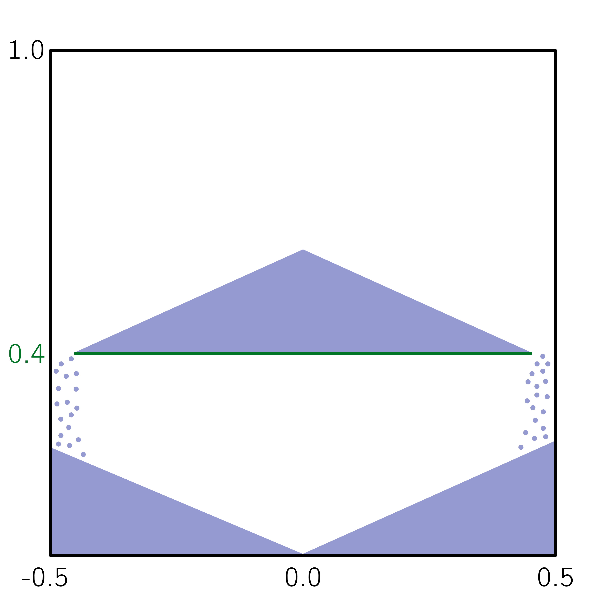
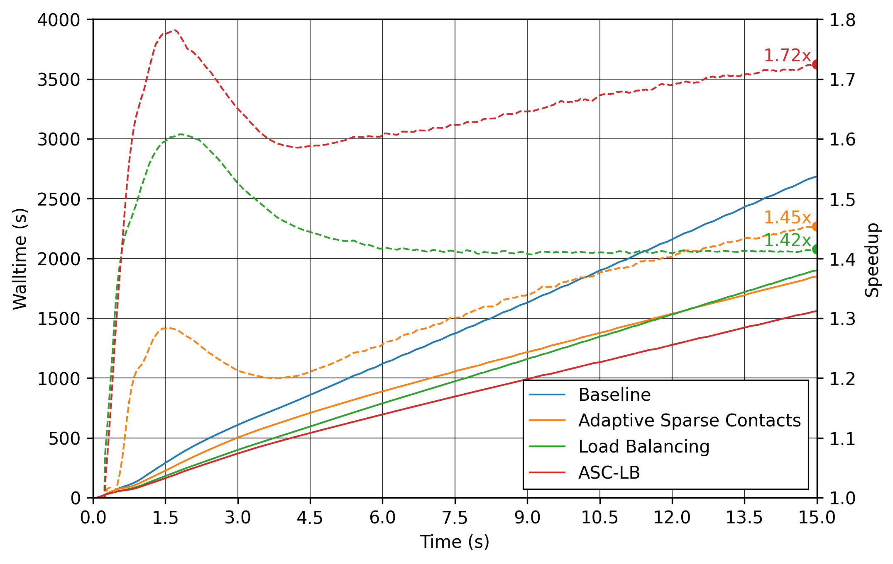
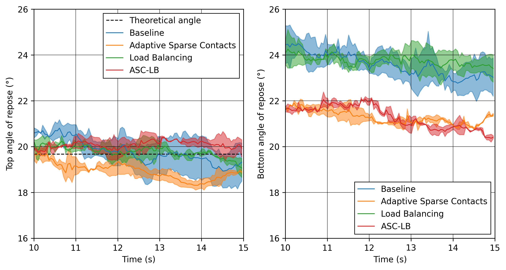

==================================
Plate Discharge
==================================

This example compares the angles of repose and performance results of a plate discharging particles with performance enhancement methods.

----------------------------------
Features
----------------------------------

- Solvers: ``lethe-particles``
- Three-dimensional problem
- Uses `adaptive sparse contacts (ASC) <../../../parameters/dem/model_parameters.html#adaptive-sparse-contacts-asc>`_
- Uses `dynamic load balancing <../../../parameters/dem/model_parameters.html#load-balancing>`_
- Post-processes results and compares them to the literature

---------------------------
Files Used in this Example
---------------------------

All the files mentioned below are located in the example folder ``examples/dem/3d-plate-discharge``.

- There are 4 parameters files: a baseline case and three other cases with different features using one or a combination of performance enhancing methods. The parameters files are:

  .. list-table::
     :width: 100%
     :widths: 30 30 30
     :header-rows: 1
     :align: center

     * - Name of the .prm file
       - `ASC <../../../parameters/dem/model_parameters.html#adaptive-sparse-contacts-asc>`_
       - `Load Balancing <../../../parameters/dem/model_parameters.html#load-balancing>`_
     * - ``plate-discharge_base.prm``
       -
       -
     * - ``plate-discharge_asc.prm``
       - ×
       -
     * - ``plate-discharge_lb.prm``
       -
       - ×
     * - ``plate-discharge_asc-lb.prm``
       - ×
       - ×

- These parameters files are ready for the simulations. We run 2 sets of simulation: performance and data. In the performance simulations, speedup is computed. Hence, the writing of solution files is deactivated. In the data simulations, those files are outputted to analyze the results. The performance analysis parameter files are in the folder ``performance/``, and the ones for the data analysis are in the folder ``data/``.

-----------------------
Description of the Case
-----------------------

This example simulates the discharge of particles at the sides of a plate in a rectangular container in order to get the angle of repose of the granular material as done by Zhou *et al*. [#zhou2002]_ The example compares the angles of repose and the performance of the simulations with the use of adaptive sparse contacts and load balancing methods. The angles are also compared to literature values.

    Diagram of the container (black) with the plate (green) and the particles (blue).

-------------------
DEM Parameter files
-------------------

Baseline case simulation
~~~~~~~~~~~~~~~~~~~~~~~~

In this section, we introduce the different sections of the parameter file ``plate-discharge_base.prm`` which do not use any performance enhancement methods.

Simulation Control
------------------

The simulation lasts :math:`15 \ \text{s}`  and the DEM time step is :math:`0.0001 \ \text{s}`. The output are generated every  :math:`0.01 \ \text{s}` for the simulation for data analysis.

.. code-block:: text

   subsection simulation control
     set time step        = 1e-4
     set time end         = 15
     set log frequency    = 500
     set output frequency = 100
     set output path      = ./output_base/
   end

Mesh
----

The rectangular container is a :math:`1.0 \times 1.0 \times 0.2 \ \text{m}` box.

.. code-block:: text

   subsection mesh
     set type               = dealii
     set grid type          = subdivided_hyper_rectangle
     set grid arguments     = 5,5,1 : -0.5, 0.0, 0.0 : 0.5, 1.0, 0.2 : true
     set initial refinement = 3
   end

Solid Objects
-------------

The plate is a solid object with a simple mesh of 2 triangles placed at a height of :math:`0.4 \ \text{m}` in the container.

.. code-block:: text

   subsection solid objects
     subsection solid surfaces
       set number of solids = 1
       subsection solid object 0
         subsection mesh
           set type                = gmsh
           set file name           = plate.msh
           set simplex             = true
           set initial translation = 0, 0.4, 0
         end
       end
     end
   end

Lagrangian Physical Properties
------------------------------

The lagrangian properties are relatively arbitrary. The simulation contains :math:`52000` particles with a diameter of :math:`0.01 \ \text{m}`, and a density of :math:`2400 \ \frac{\text{kg}}{\text{m}^3}`. Both properties of particle-particle and particle-wall interactions are the same.

.. code-block:: text

   subsection lagrangian physical properties
     set g                        = 0, -9.81, 0.0
     set number of particle types = 1
     subsection particle type 0
       set size distribution type            = uniform
       set diameter                          = 0.01
       set number of particles               = 52000
       set density particles                 = 2400
       set young modulus particles           = 1e6
       set poisson ratio particles           = 0.3
       set restitution coefficient particles = 0.9
       set friction coefficient particles    = 0.2
       set rolling friction particles        = 0.1
     end
     set young modulus wall           = 1e6
     set poisson ratio wall           = 0.3
     set restitution coefficient wall = 0.9
     set friction coefficient wall    = 0.2
     set rolling friction wall        = 0.1
   end

Insertion Info
--------------

The particles are inserted above the plate with the volume insertion method.

.. code-block:: text

   subsection insertion info
     set insertion method                               = volume
     set inserted number of particles at each time step = 52000
     set insertion frequency                            = 20000
     set insertion box points coordinates               = -0.45, 0.4, 0 : 0.45, 1.0, 0.2
     set insertion distance threshold                   = 1.25
     set insertion maximum offset                       = 0.1
     set insertion prn seed                             = 20
     set insertion direction sequence                   = 0, 2, 1
   end

Floating Walls
--------------

At the beginning of the simulation, floating walls are placed vertically at both extremities of the plate to keep all particles on the latter. The walls are removed suddenly after :math:`0.75 \ \text{s}` of simulation, starting the discharge.

.. code-block:: text

   subsection floating walls
     set number of floating walls = 2
     subsection wall 0
       subsection point on wall
         set x = -0.45
         set y = 0
         set z = 0
       end
       subsection normal vector
         set nx = 1
         set ny = 0
         set nz = 0
       end
       set start time = 0
       set end time   = 0.75
     end
     subsection wall 1
       subsection point on wall
         set x = 0.45
         set y = 0
         set z = 0
       end
       subsection normal vector
         set nx = 1
         set ny = 0
         set nz = 0
       end
       set start time = 0
       set end time   = 0.75
     end
   end

Model Parameters
----------------

The model parameters are quite standard for a DEM simulation with the non-linear Hertz-Mindlin contact force model, a constant rolling resistance torque, and the velocity Verlet integration method. For the baseline case, we do not use any performance enhancement method.

.. code-block:: text

   subsection model parameters
     subsection contact detection
       set contact detection method                = dynamic
       set dynamic contact search size coefficient = 0.9
       set neighborhood threshold                  = 1.3
     end
     subsection load balancing
       set load balance method = none
     end
     set particle particle contact force method = hertz_mindlin_limit_overlap
     set rolling resistance torque method       = constant
     set particle wall contact force method     = nonlinear
     set integration method                     = velocity_verlet
     subsection adaptive sparse contacts
       set enable adaptive sparse contacts = false
     end
     subsection load balancing
       set load balance method = none
     end
   end

Timer
-------

The timer is enabled since we want to profile the computational performance of the simulations. We print the total wallclock time elapsed since the start at every `log frequency` iteration.

.. code-block:: text

   subsection timer
     set type = iteration
   end

ASC Simulation
~~~~~~~~~~~~~~~~~~

The only differences between ``plate-discharge_base.prm`` and ``plate-discharge_asc.prm`` are the enabling of the ASC and the name of the folder for outputs.

Model Parameters
----------------

Here the ASC is enabled with a granular temperature threshold of :math:`0.0001 \ \frac{\text{m}^2}{\text{s}^2}` and a solid fraction threshold of :math:`0.4`. Those parameters have shown to be efficient in other DEM simulations with a good balance between performance gain and low impact on the simulation results. These parameters can be adjusted.

.. code-block:: text

   subsection model parameters
     subsection contact detection
       set contact detection method                = dynamic
       set dynamic contact search size coefficient = 0.9
       set neighborhood threshold                  = 1.3
     end
     set particle particle contact force method = hertz_mindlin_limit_overlap
     set rolling resistance torque method       = constant
     set particle wall contact force method     = nonlinear
     set integration method                     = velocity_verlet
     subsection adaptive sparse contacts
       set enable adaptive sparse contacts = true
       set granular temperature threshold  = 1e-4
       set solid fraction threshold        = 0.4
     end
     subsection load balancing
       set load balance method = none
     end
   end

Load Balancing Simulation
~~~~~~~~~~~~~~~~~~~~~~~~~

The only differences between ``plate-discharge_base.prm`` and ``plate-discharge_lb.prm`` are the usage of the load balancing and the name of the folder for outputs.

Model Parameters
----------------

Here, the dynamic load balancing checks if a load balancing is needed every :math:`2500` iterations with a load threshold of :math:`0.5`.

.. code-block:: text

   subsection model parameters
     subsection contact detection
       set contact detection method                = dynamic
       set dynamic contact search size coefficient = 0.9
       set neighborhood threshold                  = 1.3
     end
     set particle particle contact force method = hertz_mindlin_limit_overlap
     set rolling resistance torque method       = constant
     set particle wall contact force method     = nonlinear
     set integration method                     = velocity_verlet
     subsection adaptive sparse contacts
       set enable adaptive sparse contacts = false
     end
     subsection load balancing
       set load balance method     = dynamic
       set threshold               = 0.5
       set dynamic check frequency = 2500
     end
   end

ASC with Load Balancing Simulation
~~~~~~~~~~~~~~~~~~~~~~~~~~~~~~~~~~

The only differences between ``plate-discharge_base.prm`` and ``plate-discharge_asc-lb.prm`` are the usage of the ASC method with the load balancing, and the name of the folder for outputs.

Model Parameters
----------------

Here, we use the ASC with the dynamic load balancing, using the same load balancing parameters. In this case, the mobility status of the cells from the ASC will influence the weight, i.e. the computational contribution of the cell in the load balancing evaluation. The additional parameters for `active` cells `weight factor` is :math:`0.7`, and the `inactive` cells `weight factor` is :math:`0.5`, while the mobile cells always have a fixed weight factor of :math:`1`.

.. code-block:: text

   subsection model parameters
     subsection contact detection
       set contact detection method                = dynamic
       set dynamic contact search size coefficient = 0.9
       set neighborhood threshold                  = 1.3
     end
     set particle particle contact force method = hertz_mindlin_limit_overlap
     set rolling resistance torque method       = constant
     set particle wall contact force method     = nonlinear
     set integration method                     = velocity_verlet
     subsection adaptive sparse contacts
       set enable adaptive sparse contacts = true
       set granular temperature threshold  = 1e-4
       set solid fraction threshold        = 0.4
     end
     subsection load balancing
       set load balance method     = dynamic_with_sparse_contacts
       set threshold               = 0.5
       set dynamic check frequency = 2500
       set active weight factor    = 0.7
       set inactive weight factor  = 0.5
     end
   end

-----------------------
Running the Simulations
-----------------------

Simulations can be launched individually with the executable ``lethe-particles`` and the parameter files, while saving the display in the terminal in a log file.
To make things easier a script is provided to run all the simulations in a sequence from the ``dem/3d-plate-discharge/`` folder.

In order to run the simulations for the performance analysis, you can use the following command:

.. code-block:: text
  :class: copy-button

  bash run-performance-simulations.sh

Which corresponds to:

.. code-block:: bash

  simulations=("base" "asc" "lb" "asc-lb")

  cd performance/

  for sim in "${simulations[@]}"
  do
     echo "Running the $sim simulation"
     time mpirun -np 8 lethe-particles plate-discharge_$sim.prm | tee log_$sim.out
  done

Or you can run the simulations in the ``performance/`` folder with the following commands:

.. code-block:: text
  :class: copy-button

  time mpirun -np 8 lethe-particles plate-discharge_base.prm | tee log_base.out
  time mpirun -np 8 lethe-particles plate-discharge_asc.prm | tee log_asc.out
  time mpirun -np 8 lethe-particles plate-discharge_lb.prm | tee log_lb.out
  time mpirun -np 8 lethe-particles plate-discharge_asc-lb.prm | tee log_asc-lb.out

In order to run the simulations for the data analysis, you can use the following script:

.. code-block:: text
  :class: copy-button

  bash run-data-simulations.sh

.. note::
   Running the simulations for the performance analysis using 8 cores takes between 25 and 45 minutes per simulation, for a total of around 2 hours. Running the simulations for data analysis takes a few minutes longer per simulation.

-------
Results
-------

The simulations should look like the following video:

.. raw:: html

  
<iframe width="800" height="450" src="https://www.youtube.com/embed/awRXtTLyM94?si=E1uzfONZ1QhQuN2T" title="YouTube video player" frameborder="0" allow="accelerometer; autoplay; clipboard-write; encrypted-media; gyroscope; picture-in-picture; web-share" referrerpolicy="strict-origin-when-cross-origin" allowfullscreen></iframe>

Post-Processing Code
~~~~~~~~~~~~~~~~~~~~

The data is extracted with the Lethe PyVista tool and post-processed with custom functions in the files ``pyvista_utilities.py`` and ``log_utilities.py``.
Extraction, post-processing and plotting are automated in the script ``plate-discharge_post-processing.py``:

.. code-block:: text
  :class: copy-button

  python3 plate-discharge_post-processing.py

The script will generate the figures. If you want to modify the path or the filenames, you have to modify the script.

Performance Analysis
~~~~~~~~~~~~~~~~~~~~

The log files (outputs displayed in the terminal) are read to extract the simulation and wall times.

The speedup is calculated with the baseline case as the reference. The results are plotted in the following figure, where the solid lines show the walltime during the simulation, the dashed lines show the speedup, and the points show to total speedup.

   The walltime during the simulations (solid line) and the speedup (dashed line) for the performance enhancement methods with the Adaptive Sparse Contacts (ASC) and the Load Balancing (LB) compared to the baseline case.

.. note::
   The slight oscillations of the speedup are caused by the scientific notation format of the walltime by the timer feature after :math:`1000 \ \text{s}`. The walltimes are attenuated by the moving average, but the division operation for the speedup accentuates the lack of time precision.

The load balancing method helps the performance of the simulation from the start, since the particles move within the domain during the discharge. The load balancing allows to distribute the particles, and therefore all their related computations, more evenly between the cores. Once the discharge of the particles is mostly done and only a few particles are still falling from the top part, the performance gain brought by the load balancing stays constant since the load across the cores is already balanced.
The adaptive sparse contacts method helps the performance of the simulation mostly when there are large areas of motionless particles. As it was showed in the video, those areas are located in the core of the pile at the top and at the corners of settled particles below the plate. This explains why the ASC gives a limited performance gain at the start of the simulation (only from the core of the pile) and an increasing gain through the simulation (accumulation of motionless particles at the bottom part). Given that both methods help the computation performance at different times, their combination gives the best performance as observed.

Angle of Repose
~~~~~~~~~~~~~~~

The angles of repose are calculated from the data extracted from the VTU output files. The 2 angles of repose are calculated from the pile of particles on the plate for comparison with the literature, and from the piles formed by the discharge for curiosity.

The configuration of the case gives a symmetrical formation of the piles, meaning that there are 2 angles of repose to calculate for the pile at the top of the plate and for the 2 piles at the bottom. The angles of repose are calculated by linear regressions from the highest particle positions in y-axis from :math:`-0.35 \ \text{m}` to :math:`-0.15 \ \text{m}` for the left angles and from :math:`0.15 \ \text{m}` to :math:`0.35 \ \text{m}` for the right angles along the x-axis. The following figure shows the areas where the angles are calculated. The areas where the angle of repose is calculated for the left (blue) and right (red) sides of the piles.

.. figure:: images/angle-areas.png
   :alt: Angle of repose areas
   :align: center
   :name: plate-discharge-angle-areas

In order to show how the results may fluctuate, we show the angle obtained from the particle positions from the left and the right sides of the top pile (left plot) and of the 2 piles at bottom (right plot) as solid lines.
The given angles of repose are the linear regressions from the positions with absolute x coordinates.

   The angles of repose calculated from the simulation data. The solid lines are the angles computed from the highest particles on both side, while the shaded areas represent the angles for the left and the right.

According to Zhou *et al.* [#zhou2002]_, the angle of repose for this type of configuration is calculated with the following empirical formula:

.. math::
   \phi = 68.61 \mu_{\text{f,pp}}^{0.27} \mu_{\text{f,pw}}^{0.22} \mu_{\text{r,pp}}^{0.06} \mu_{\text{r,pw}}^{0.12} d_p^{-0.2}

where :math:`\mu_{\text{f,pp}}` and :math:`\mu_{\text{f,pw}}` are the friction coefficients of the particle-particle and particle-wall interactions, respectively, :math:`\mu_{\text{r,pp}}` and :math:`\mu_{\text{r,pw}}` are the rolling friction coefficients, and :math:`d_p` is the particle diameter.

The meaning of the rolling friction coefficient :math:`\mu_{\text{r}}^{\text{eqt}}` by the authors [#zhou2002]_ is different than :math:`\mu_{\text{r}}^{\text{Lethe}}` found in Lethe. They express the coefficient as a length in the `rolling friction model <../../../theory/multiphase/cfd_dem/dem.html#rolling-friction-models>`_. However, they also use the constant torque, therefore the rolling friction coefficient in Lethe has to be multiplied by the effective radius of the particle for the results comparison:

.. math::
   \mu_{\text{r}}^{\text{eqt}} = \mu_{\text{r}}^{\text{Lethe}}d_p

The theoretical angle of repose is :math:`19.7^\text{o}`. We did not compute the mean of the angles of repose in order to compare the results with the literature since, even after :math:`15 \ \text{s}` of simulation, some particles are still falling from the top. The angles are still not converging to a value. We can however state that the angles are close to the literature.

Here we can see that the top angles from all simulations are in a range of around :math:`\pm 1.5^\text{o}` from the baseline case, which we consider as a good agreement. We can clearly see a trend in the bottom angles using the ASC. The angles of repose are about :math:`2^\text{o}` below the baseline and load balancing cases. It seems to be caused by the accumulation of particles at the bottom of the piles.

----------
References
----------

.. [#zhou2002] \Y.C. Zhou, B.H. Xu, A.B. Yu, P. Zulli, “An experimental and numerical study of the angle of repose of coarse spheres,” *Powder Technology*, vol. 125, pp. 45-54, 2002. doi: `10.1016/S0032-5910(01)00520-4 <https://doi.org/10.1016/S0032-5910(01)00520-4>`_\.
