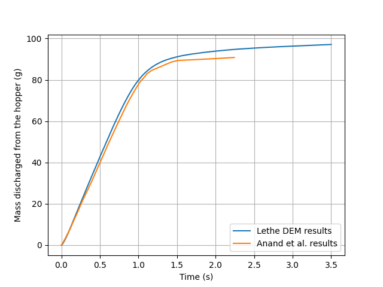
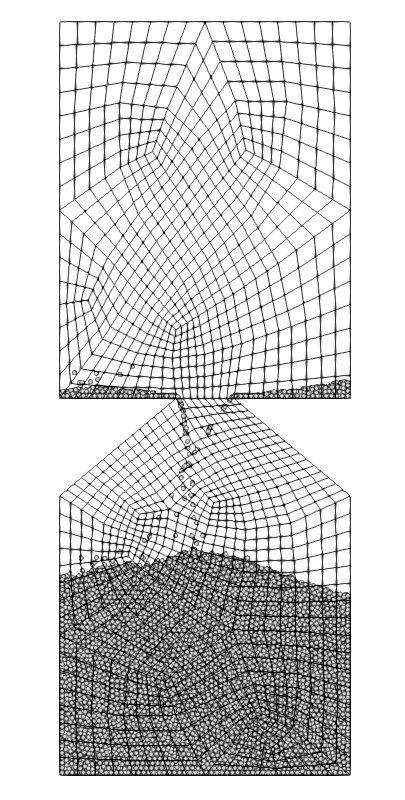
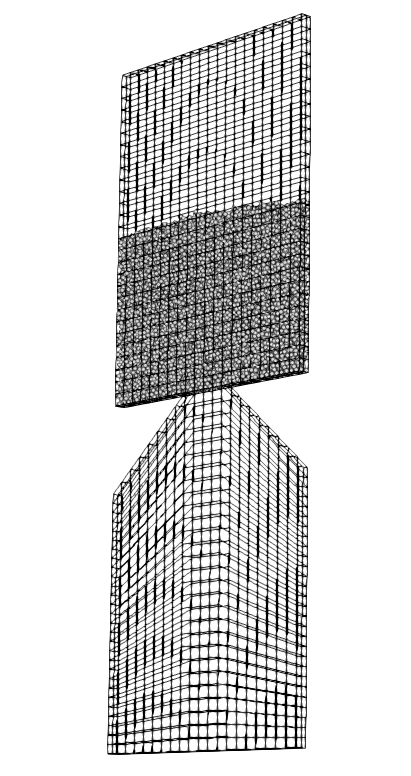
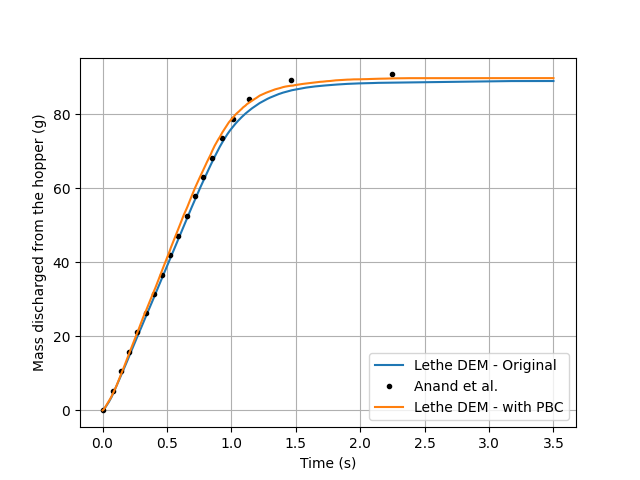

==================================
Rectangular Hopper
==================================

This example simulates the filling and discharging of particles in a rectangular hopper.
We set up this simulation based on the simulation of Anand *et al.* [#anand2008]_ It is recommended to visit `DEM parameters <../../../parameters/dem/dem.html>`_ for more detailed information on the concepts and physical meanings of the parameters in Lethe-DEM.
The main example does not use periodic boundary conditions in the depth of the hopper like article, but an extended case, presented at the end, does.

----------------------------------
Features
----------------------------------
- Solvers: ``lethe-particles``
- Floating walls
- `GMSH <https://gmsh.info/>`_ grids
- Python post-processing script using `PyVista <https://docs.pyvista.org/>`_
- Periodic boundaries in DEM (see section :ref:`ref-periodic-hopper`)

----------------------------
Files Used in This Example
----------------------------

- Parameter file: ``examples/dem/3d-rectangular-hopper/hopper.prm``

-----------------------
Description of the Case
-----------------------

This simulation consists of two stages: filling (0-4 s) and discharge (4-7.5 s) of particles. Anand *et al.* uses periodic boundaries in the z axis allowing to use a thin width for simulation.
In the main example, we do not consider periodic boundaries. To minimize the impact of collision of particle with walls along the z axis, the width and the number of particle were multiplied by 6 (40740 particles instead of 6790). This corresponds to a width of 15 times the particle diameter.

--------------
Parameter File
--------------

Mesh
~~~~~

The mesh is a hopper with 90° angle generated with GMSH having a top part for the filling and a bottom part which acts as a collector of the particle.
The geometry follow the Anand *et al.* [#anand2008]_ base case and was handled in order to generate a structured mesh.

.. code-block:: text

    subsection mesh
      set type                                = gmsh
      set file name                           = hopper_structured.msh
      set initial refinement                  = 1
      set expand particle-wall contact search = false
      set check diamond cells                 = true
    end

.. list-table::

    * - .. figure:: images/packed_hopper_2d.png
           :width: 300
           :alt: Mesh
           :align: center

           Rectangular hopper packed with particle before the discharge with a 2d view.

      - .. figure:: images/packed_hopper_3d.png
           :width: 300
           :alt: Mesh
           :align: center

           Rectangular hopper packed with particle before the discharge with a 3d view.

Insertion Info
~~~~~~~~~~~~~~~~~~~

An insertion box is defined inside and the top part of the hopper. The inserted number of particles per time step is chosen to be a factor of the total number of particle. In this case, 14 insertion steps are required to fill up the hopper with particles.

.. code-block:: text

    subsection insertion info
      set insertion method                               = volume
      set inserted number of particles at each time step = 2910
      set insertion frequency                            = 25000
      set insertion box points coordinates               = -0.06, 0.10644, .00224 : 0.06, 0.16020, 0.03136
      set insertion distance threshold                   = 1.5
      set insertion maximum offset                       = 0.1
      set insertion prn seed                             = 20
    end

Lagrangian Physical Properties
~~~~~~~~~~~~~~~~~~~~~~~~~~~~~~~

The total number of particles in this simulation is 40740. All particles have a diameter of 2.24 mm.

The following properties are chosen according to the Anand et al. paper :

* Uniform distribution of spherical particles
* Diameter (2.24 mm)
* Density of glass (2.5 g/cm³)
* Restitution coefficient of particle-particle (0.94)
* Restitution coefficient of particle-wall (0.90)
* Friction coefficient of particle-particle (0.2)

.. code-block:: text

    subsection lagrangian physical properties
      set g                        = 0.0, -9.81, 0.0
      set number of particle types = 1
      subsection particle type 0
        set size distribution type            = uniform
        set diameter                          = 0.00224
        set number of particles               = 40740
        set density particles                 = 2500
        set young modulus particles           = 1e6
        set poisson ratio particles           = 0.3
        set restitution coefficient particles = 0.94
        set friction coefficient particles    = 0.2
        set rolling friction particles        = 0.09
      end
      set young modulus wall           = 1e6
      set poisson ratio wall           = 0.3
      set friction coefficient wall    = 0.2
      set restitution coefficient wall = 0.9
      set rolling friction wall        = 0.09
    end

Model Parameters
~~~~~~~~~~~~~~~~~

Model parameters are based on the `Silo example <../silo/silo.html>`_.

.. code-block:: text

    subsection model parameters
      subsection contact detection
        set contact detection method                = dynamic
        set dynamic contact search size coefficient = 0.9
        set neighborhood threshold                  = 1.3
      end
      subsection load balacing
        set load balance method                     = frequent
        set frequency                               = 50000
      end
      set particle particle contact force method    = hertz_mindlin_limit_overlap
      set particle wall contact force method        = nonlinear
      set rolling resistance torque method          = constant_resistance
      set integration method                        = velocity_verlet
    end

Simulation Control
~~~~~~~~~~~~~~~~~~

The time end of the simulation is 7.5 where most of the particles are discharged and the DEM time step is 1e-5 s which corresponds to 2.9% of Rayleigh time step.

.. code-block:: text

    subsection simulation control
      set time step        = 1e-5
      set time end         = 7.5
      set log frequency    = 1000
      set output frequency = 1000
      set output path      = ./output/
      set output name      = hopper
      set output boundaries = true
    end

Floating Walls
~~~~~~~~~~~~~~

Floating wall in this example is handled as explained in the `Silo example <../silo/silo.html>`_.

.. code-block:: text

    subsection floating walls
      set number of floating walls = 1
      subsection wall 0
        subsection point on wall
          set x = 0
          set y = 0
          set z = 0
        end
        subsection normal vector
          set nx = 0
          set ny = 1
          set nz = 0
        end
        set start time = 0
        set end time   = 4
      end
    end

----------------------
Running the Simulation
----------------------
This simulation can be launched by

.. code-block:: text
  :class: copy-button

  mpirun -np 8 lethe-particles hopper.prm

---------------
Post-processing
---------------
A Python post-processing code called ``hopper_post_processing.py`` is provided with this example. It is used to measure the flow rate of particles.

It also compares the data generated by the simulation to data from Anand *et al.* `[1] <https://doi.org/10.1016/j.ces.2008.08.015>`_

It is possible to run the post-processing code with the following line. The arguments are the simulation path and the prm file name.

.. code-block:: text
  :class: copy-button

    python3 hopper_post_processing.py ./ hopper.prm

.. important::

    You need to ensure that ``lethe_pyvista_tools`` is working on your machine. Click `here <../../../tools/postprocessing/postprocessing.html>`_ for details.

-----------------------
Results Post-processing
-----------------------
Mass flow rate results after post-processing and comparison with the results of Anand *et al.* `[1] <https://doi.org/10.1016/j.ces.2008.08.015>`_ for the base case of the hooper with a 90° angle.

    Mass discharge results.

-------
Results
-------
As seen in the following figure, the simulation was not run until all the particles are discharged in the bottom part.
Since the mass flow rate is constant during the discharge, simulating the very end is not necessary.
The simulated mass discharging rate is 84.94 g/s.

    Rectangular hopper at the end of the simulation.

.. _ref-periodic-hopper:

--------------------------------------
Case with Periodic Boundary Conditions
--------------------------------------
Periodic boundary conditions feature was not implemented when this example was created. Since it is now, this example is now extended to show how to use it. The original case in Anand *et al.* `[1] <https://doi.org/10.1016/j.ces.2008.08.015>`_ did use periodic boundaries.
The modifications on the parameters of the previous example is the mesh thickness and the number of particles and also the addition of the boundary condition section.

Mesh
~~~~

The hopper in this case has the same shape with a depth reduces by a factor of 6. The depth is the same than the article and a new GMSH file is used.

.. code-block:: text

    subsection mesh
        set type                                = gmsh
        set file name                           = hopper_structured_periodic.msh
        set initial refinement                  = 1
        set expand particle-wall contact search = false
        set check diamond cells                 = true
    end

    Rectangular periodic hopper packed with particle before the discharge with a 3d view.

Boundary Conditions
~~~~~~~~~~~~~~~~~~~

The previous example did not need any parameters on a section for the boundary conditions since all walls are treated as solid boundaries by default.
We need to specify which boundaries are periodic and the perpendicular direction, here the periodic ids are 0 and 1 and the axis is z, corresponding to value of 2.
The feature only works with one pair of periodic boundaries.

.. code-block:: text

    subsection DEM boundary conditions
        set number of boundary conditions = 1

        subsection boundary condition 0
            set type                      = periodic
            set periodic id 0             = 0
            set periodic id 1             = 1
            set periodic direction        = 2
        end
    end

Lagrangian Physical Properties
~~~~~~~~~~~~~~~~~~~~~~~~~~~~~~~

The total number of particles of this simulation is 6790: 6 times less than the previous example.

.. code-block:: text

    subsection lagrangian physical properties
        set g                        = 0.0, -9.81, 0.0
        set number of particle types = 1
        subsection particle type 0
            set size distribution type            = uniform
            set diameter                          = 0.00224
            set number                            = 6790
            set density particles                 = 2500
            set young modulus particles           = 1e6
            set poisson ratio particles           = 0.3
            set restitution coefficient particles = 0.94
            set friction coefficient particles    = 0.2
            set rolling friction particles        = 0.09
        end
        set young modulus wall           = 1e6
        set poisson ratio wall           = 0.3
        set friction coefficient wall    = 0.2
        set restitution coefficient wall = 0.9
        set rolling friction wall        = 0.09
    end

Insertion Info
~~~~~~~~~~~~~~

Since the geometry of the mesh and the number of the particles are not the same, the insertion info have to be modified according to the new domain of the mesh with an inserted number of particles corresponding to the new number.

.. code-block:: text

    subsection insertion info
        set insertion method                               = volume
        set inserted number of particles at each time step = 485
        set insertion frequency                            = 25000
        set insertion box points coordinates               = -0.06, 0.10644, .00112 : 0.06, 0.16020, 0.00448
        set insertion distance threshold                   = 1.5
        set insertion maximum offset                       = 0.1
        set insertion prn seed                             = 20
    end

Results Comparison
~~~~~~~~~~~~~~~~~~
Here is the comparison of the results from the original simulation with Lethe DEM, the simulation with periodic boundary conditions with Lethe and the results from Anand et al. paper.
The simulated mass discharging rate is 85.09 g/s from the original simulation and 91.73 g/s with PBC. Also, the run time of the simulation goes from about 1 hours and 30 minutes to 10 minutes on 8 cores with an Intel i7-11700K.

    Comparison of mass discharge results from the 2 simulations and the journal article.

---------
Reference
---------
.. [#anand2008] \A. Anand, J. S. Curtis, C. R. Wassgren, B. C. Hancock, and W. R. Ketterhagen, “Predicting discharge dynamics from a rectangular hopper using the discrete element method (DEM),” *Chem. Eng. Sci.*, vol. 63, no. 24, pp. 5821–5830, Dec. 2008, doi: `10.1016/j.ces.2008.08.015 <https://doi.org/10.1016/j.ces.2008.08.015>`_.\
