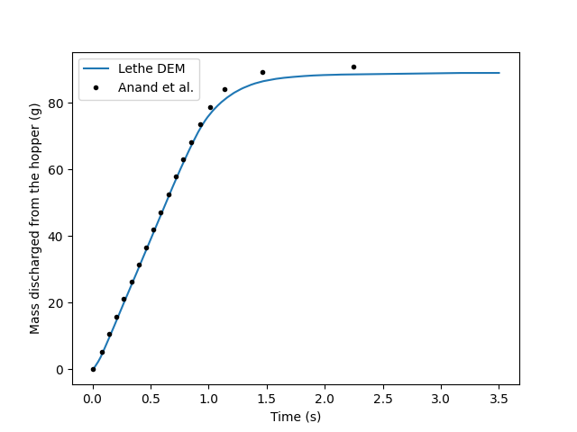
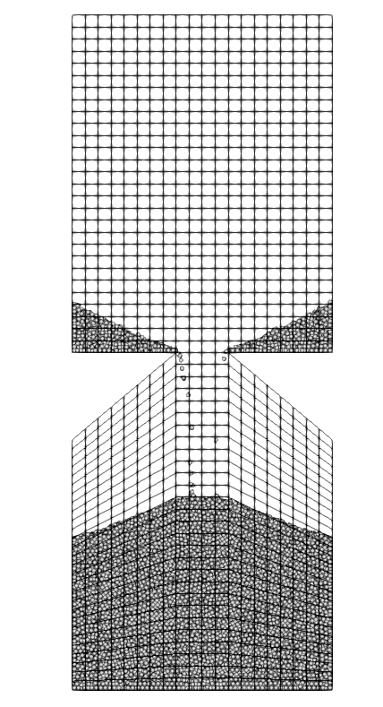

==================================
Rectangular hopper
==================================

This example simulates the filling and discharging of particles in a rectangular hopper.
We set up this simulation based on the simulation of Anand et al. `[1] <https://doi.org/10.1016/j.ces.2008.08.015>`_. It is recommended to visit `DEM parameters <../../../parameters/dem/dem.html>`_ for more detailed information on the concepts and physical meanings of the parameters in Lethe-DEM.

Features
----------------------------------
- Solvers: ``dem_3d``
- Floating walls
- `GMSH <https://gmsh.info/>`_ grids
- Python post-processing script using `PyVista <https://docs.pyvista.org/>`_

Files used in this example
----------------------------
``/examples/dem/3d-rectangular-hopper/hopper.prm``

Description of the case
-----------------------

This simulation consists of two stages: filling (0-4 s) and discharge (4-7.5 s) of particles. Anand et al. uses periodic boundaries in the z axis allowing to use a thin width for simulation.
Since those are not available at the time in Lethe, we do not consider periodic boundaries. To minimize the impact of collision of particle with walls along the z axis, the width and the number of particle were multiplied by 6 (40740 particles instead of 6790). This corresponds to a width of 15 times the particle diameter.

Parameter file
--------------

Mesh
~~~~~

The mesh is a hopper with 90° angle generated with GMSH having a top part for the filling and a bottom part which acts as a collector of the particle.
The geometry follow the Anand et al. `[1] <https://doi.org/10.1016/j.ces.2008.08.015>`_ base case and was handled in order to generate a structured mesh.

.. code-block:: text

    subsection mesh
      set type                                = gmsh
      set file name                           = hopper_structured.msh
      set initial refinement                  = 1
      set expand particle-wall contact search = false
      set check diamond cells                 = true
    end

.. list-table::

    * - .. figure:: images/packed_hopper_2d.png
           :width: 300
           :alt: Mesh
           :align: center

           Rectangular hopper packed with particle before the discharge with a 2d view.

      - .. figure:: images/packed_hopper_3d.png
           :width: 300
           :alt: Mesh
           :align: center

           Rectangular hopper packed with particle before the discharge with a 3d view.

Insertion info
~~~~~~~~~~~~~~~~~~~

An insertion box is defined inside and the top part of the hopper. The inserted number of particles per time step is chosen to be a factor of the total number of particle. In this case, 14 insertion steps are required to fill up the hopper with particles.

.. code-block:: text

    subsection insertion info
      set insertion method                               = non_uniform
      set inserted number of particles at each time step = 2910
      set insertion frequency                            = 25000
      set insertion box minimum x                        = -0.1030
      set insertion box minimum y                        = 0.10644
      set insertion box minimum z                        = .00224
      set insertion box maximum x                        = 0.1030
      set insertion box maximum y                        = 0.16020
      set insertion box maximum z                        = 0.03136
      set insertion distance threshold                   = 1.5
      set insertion random number range                  = 0.1
      set insertion random number seed                   = 20
    end

Lagrangian physical properties
~~~~~~~~~~~~~~~~~~~~~~~~~~~~~~~

The total number of particles in this simulation is 40740. All particles have a diameter of 2.24 mm.

The following properties are chosen according to the Anand et al. paper :

* Uniform distribution of spherical particles
* Diameter (2.24 mm)
* Density of glass (2.5 g/cm³)
* Restitution coefficient of particle-particle (0.94)
* Restitution coefficient of particle-wall (0.90)
* Friction coefficient of particle-particle (0.2)

.. code-block:: text

    subsection lagrangian physical properties
      set gx                       = 0.0
      set gy                       = -9.81
      set gz                       = 0.0
      set number of particle types = 1
      subsection particle type 0
        set size distribution type            = uniform
        set diameter                          = 0.00224
        set number                            = 40740
        set density particles                 = 2500
        set young modulus particles           = 1e6
        set poisson ratio particles           = 0.3
        set restitution coefficient particles = 0.94
        set friction coefficient particles    = 0.2
        set rolling friction particles        = 0.09
      end
      set young modulus wall           = 1e6
      set poisson ratio wall           = 0.3
      set friction coefficient wall    = 0.2
      set restitution coefficient wall = 0.9
      set rolling friction wall        = 0.09
    end

Model parameters
~~~~~~~~~~~~~~~~~

Model parameters are based on the `Silo example <../silo/silo.html>`_.

.. code-block:: text

    subsection model parameters
      set contact detection method                = dynamic
      set dynamic contact search size coefficient = 0.9
      set load balance method                     = frequent
      set load balance frequency                  = 50000
      set neighborhood threshold                  = 1.3
      set particle particle contact force method  = hertz_mindlin_limit_overlap
      set particle wall contact force method      = nonlinear
      set rolling resistance torque method        = constant_resistance
      set integration method                      = velocity_verlet
    end

Simulation control
~~~~~~~~~~~~~~~~~~

The time end of the simulation is 7.5 where most of the particles are discharged and the DEM time step is 1e-5 s which corresponds to 2.9% of Rayleigh time step.

.. code-block:: text

    subsection simulation control
      set time step        = 1e-5
      set time end         = 7.5
      set log frequency    = 1000
      set output frequency = 1000
      set output path      = ./output/
      set output name      = hopper
    end

Floating walls
~~~~~~~~~~~~~~

Floating wall in this example is handled as explained in the `Silo example <../silo/silo.html>`_.

.. code-block:: text

    subsection floating walls
      set number of floating walls = 1
      subsection wall 0
        subsection point on wall
          set x = 0
          set y = 0
          set z = 0
        end
        subsection normal vector
          set nx = 0
          set ny = 1
          set nz = 0
        end
        set start time = 0
        set end time   = 4
      end
    end

Running the simulation
----------------------
This simulation can be launched by

.. code-block:: text

  mpirun -np 8 dem_3d hopper.prm

Post-processing
---------------
A Python post-processing code called ``hopper_post_processing.py`` is provided with this example. It is used to measure the flow rate of particles with a module reading the output files generated by the simulation.
This module is a script called ``Lethe_pyvista_tools.py`` that uses `PyVista <https://docs.pyvista.org/>`_ to extract data from the pvd/vtu files and stores it in a dictionary ready to use for post-processing.

It also compares the data generated by the simulation to data from Anand et al. `[1] <https://doi.org/10.1016/j.ces.2008.08.015>`_.

It is possible to run the post-processing code with the following line. The arguments are the simulation path and the prm file name.

.. code-block:: text

    python3 hopper_post_processing.py ./ hopper.prm

Results post-processing
-----------------------
Mass flow rate results after post-processing and comparison with the results of Anand et al. `[1] <https://doi.org/10.1016/j.ces.2008.08.015>`_ for the base case of the hooper with a 90° angle.

    Mass flow rate results.

Results
-------
As seen in the following figure, the simulation was not run until all the particles are discharged in the bottom part.
Since the mass flow rate is constant during the discharge, simulating the very end is not necessary.
The simulated mass discharging rate is 84.94 g/s.

    Rectangular hopper at the end of the simulation.

Reference
---------
`[1] <https://doi.org/10.1016/j.ces.2008.08.015>`_ Anand, A., Curtis, J. S., Wassgren, C. R., Hancock, B. C., & Ketterhagen, W. R. (2008). Predicting discharge dynamics from a rectangular hopper using the discrete element method (DEM). Chemical Engineering Science, 63(24), 5821-5830.
