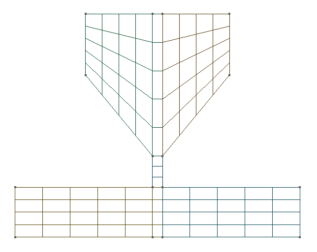
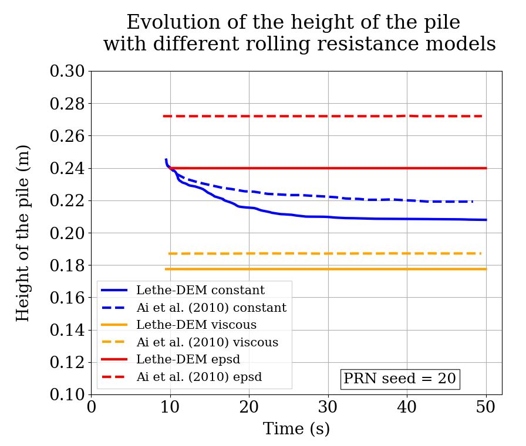

==================================
Sandpile Formation
==================================

This example simulates the formation of a sandpile using the discrete element method (DEM). 
It is based on the simulation of Ai *et al.* [#Ai2010]_, meant to reproduce the 2D photoelastic sandpile experiments led by Zuriguel *et al.* [#Zuriguel2007]_.
More information regarding the DEM parameters is given in the Lethe documentation, i.e. `DEM parameters <../../../parameters/dem/dem.html>`_.

----------------------------------
Features
----------------------------------

- Solvers: ``lethe-particles``
- Two-dimensional problem
- Bi-dispersed particles
- Floating wall
- Post-processing using `Python <https://www.python.org/>`_, `PyVista <https://docs.pyvista.org/>`_, `lethe_pyvista_tools <https://github.com/chaos-polymtl/lethe/tree/master/contrib/postprocessing>`_, and `ParaView <https://www.paraview.org/>`_.

----------------------------
Files Used in This Example
----------------------------

All files mentioned below are located in the example's folder (``examples/dem/2d-sandpile-formation``).

- Geometry file: ``sandpile.geo``
- Mesh file: ``sandpile.msh``
- Parameter files: ``sandpile-epsd.prm``, ``sandpile-constant.prm``, ``sandpile-viscous.prm``
- Post-processing Python scripts: ``sandpile-postprocessing.py``, ``sandpile-height-comparison.py``

-----------------------
Description of the Case
-----------------------

In the first stage of the simulation (:math:`0-4.5` s), particles are filled into the hopper. 
Then, at :math:`4.5` s, particles are discharged through a narrow channel onto a flat surface where a pile is formed.
We compare the evolution of the height of the pile for the different rolling resistance models with the results obtained by Ai *et al.* [#Ai2010]_.
The angle of repose is also calculated, so as to be compared to the one from the experiment conducted by Zuriguel *et al.* [#Zuriguel2007]_.
We expect that the Elastic-Plastic Spring-Dashpot (EPSD) model will give closer results to the height and angle from the experiment than the viscous model or the constant torque model. Indeed, the constant torque model produces an oscillation that can prevent the pile from reaching a stable state and the viscous model is not adapted here as the viscous effects are not sufficient to stabilize the pile at its real height.

--------------
Parameter File
--------------

Mesh
~~~~

The mesh is a hopper with 50.5° angle generated with GMSH, with a channel connecting the hopper to the part with the flat surface.
The geometry follows the one used by Zuriguel *et al.* [#Zuriguel2007]_ and the mesh generated with gmsh is structured.

.. code-block:: text

    subsection mesh
      set type                = gmsh
      set file name           = ./sandpile.msh
      set check diamond cells = true
      set initial refinement  = 1
    end

    2D mesh of the hopper

.. note::

  The mesh can be generated using the following line:

  .. code-block:: text
    :class: copy-button

    gmsh -2 sandpile.geo

Lagrangian Physical Properties
~~~~~~~~~~~~~~~~~~~~~~~~~~~~~~

The :math:`3000` particles are bi-dispersed, with :math:`2500` having a diameter of :math:`6.9` mm and :math:`500` having a diameter of :math:`8.9` mm.

The following properties are chosen according to the Ai *et al.* paper:

* Custom distribution of disks with :math:`70%` of disks with a :math:`6.9` mm diameter and :math:`30%` with an :math:`8.9` mm diameter
* Density (:math:`1056\;\text{kg}/\text{m}^3`)
* Young's modulus (:math:`4` MPa)
* Poisson's ratio (:math:`0.49`)
* Friction coefficient of particle-particle (:math:`0.8)``
* Rolling resistance coefficient of particle-particle (:math:`0.3`)

The same properties were given to the wall as they were not specified in the original article.

.. code-block:: text

    subsection lagrangian physical properties
      set g                        = 0.0, -9.81
      set number of particle types = 1
      subsection particle type 0
        set size distribution type            = custom
        set custom diameters                  = 0.0069 , 0.0089
        set custom volume fractions           = 0.7   , 0.3
        set number of particles               = 3000
        set density particles                 = 1056
        set young modulus particles           = 4000000
        set poisson ratio particles           = 0.49
        set restitution coefficient particles = 0.7
        set friction coefficient particles    = 0.8
        set rolling friction particles        = 0.3
      end
      set young modulus wall           = 4000000
      set poisson ratio wall           = 0.49
      set restitution coefficient wall = 0.7
      set friction coefficient wall    = 0.8
      set rolling friction wall        = 0.3
    end

.. note::

  Only the value of the restitution coefficient was not given in the reference paper but it did not impact much the height of the pile.

Model Parameters
~~~~~~~~~~~~~~~~

.. code-block:: text

    subsection model parameters
      subsection contact detection
        set contact detection method                = dynamic
        set dynamic contact search size coefficient = 0.8
        set neighborhood threshold                  = 1.3
      end
      set particle particle contact force method = hertz_mindlin_limit_overlap
      set particle wall contact force method     = nonlinear
      set integration method                     = velocity_verlet
      set rolling resistance torque method       = epsd
      set f coefficient                          = 0.0 
    end

.. note::

  The ``f coefficient`` is only specified when the EPSD rolling resistance model is selected, in this case in prm file ``sandpile-epsd.prm``. 
  
  In ``sandpile-viscous.prm`` and ``sandpile-constant.prm``, the ``rolling resistance torque method`` is set to ``viscous`` and ``constant``, respectively.
  
  More information regarding the DEM model parameters is given in the Lethe documentation, i.e. `DEM Model Parameters <../../../parameters/dem/model_parameters.html>`_.

Particle Insertion
~~~~~~~~~~~~~~~~~~

Particles are inserted in an insertion box in the upper part of the hopper. In this simulation, the hopper is filled through 12 insertion steps.

.. code-block:: text

    subsection insertion info
      set insertion method                               = volume
      set inserted number of particles at each time step = 250
      set insertion frequency                            = 10000
      set insertion box points coordinates               = -0.34, 0.7 : 0.34, 1.2
      set insertion distance threshold                   = 1.5
      set insertion maximum offset                       = 0.1
      set insertion prn seed                             = 20
    end

.. note::

  Due partly to the bi-dispersed particle size distribution, changing the ``prn seed`` to a different value can lead to different results since it changes the initial configuration of the particles.

Simulation Control
~~~~~~~~~~~~~~~~~~

The simulation runs for 50 seconds of real time. We output the simulation results every 1000 iterations.

.. code-block:: text

    subsection simulation control
      set time step        = 2e-5
      set time end         = 50
      set log frequency    = 1000
      set output frequency = 1000
      set output path      = ./output_epsd/
      set output name      = sandpile_epsd
    end

.. note::
  
  To compare with the results of Ai *et al.*, the end time should be set at 50 s or at least 35 s to see the progression of the curve. 
  It can be reduced to 15 s to see the fully formed sandpile but the height of the pile is only measured after 10 s and may continue to decrease after 15 s, particularly with the constant rolling resistance model.

Floating Wall
~~~~~~~~~~~~~~

The floating wall is a temporary flat wall, used here to hold the particles in the hopper during the filling stage, from 0 to :math:`4.5` s. 
It is located at the bottom of the hopper, before the channel.

.. code-block:: text

    subsection floating walls
      set number of floating walls = 1
      subsection wall 0
        subsection point on wall
          set x = 0
          set y = 0
        end
        subsection normal vector
          set nx = 0
          set ny = 1
        end
        set start time = 0
        set end time   = 4.5
      end
    end

-----------------------
Running the Simulation
-----------------------

The simulation for each rolling resistance model can be launched with 

.. code-block:: text
  :class: copy-button

   mpirun -np 2 lethe-particles sandpile-epsd.prm

.. code-block:: text
  :class: copy-button

   mpirun -np 2 lethe-particles sandpile-constant.prm

.. code-block:: text
  :class: copy-button

   mpirun -np 2 lethe-particles sandpile-viscous.prm

.. note::

  If the end time is set at :math:`50` s, this example needs a simulation time of approximately 25 minutes on 2 cores, for each of the three rolling resistance models.

---------------
Post-processing
---------------

A Python post-processing code called ``sandpile-postprocessing.py`` is provided with this example. It is used to measure the height of the pile at each time set, starting at :math:`10.02` s so that the pile is already formed. It also calculates the angle of repose of the pile, based on the last frame.
It compares the data generated by the simulation to the one from Ai *et al.* [#Ai2010]_ for the selected rolling resistance model.

It is possible to run the post-processing code with the following line. The arguments are the simulation path and the rolling resistance model used.

.. code-block:: text
  :class: copy-button

    python3 sandpile-postprocessing.py  --folder ./ --rollingmethod epsd

.. important::

    You need to ensure that ``lethe_pyvista_tools`` is working on your machine. Click `here <../../../tools/postprocessing/postprocessing.html>`_ for details.

.. important::

  The argument `--rollingmethod` can be either epsd, viscous or constant and corresponds to the ``rolling resistance torque method`` selected in each prm file.
  The argument `--regression` can be added to plot the least squares regression used to calculate the angle of repose.

The code prints the values of the coefficient of determination :math:`R^2`, the slope (from the regression), and the angle of repose.

When you have launched the simulation and the post-processing (with the right argument) for each rolling resistance model (constant, epsd, viscous), launch the following to compare the different models.

.. code-block:: text
  :class: copy-button

    python3 sandpile-height-comparison.py

-------
Results
-------

Visualisation with Paraview
~~~~~~~~~~~~~~~~~~~~~~~~~~~

The simulation can be visualised using Paraview as seen below.

.. figure:: images/formed-sandpile.png
    :width: 600
    :alt: Mesh
    :align: center

    Sandpile at the end of the simulation

Evolution of the Height of the Pile
~~~~~~~~~~~~~~~~~~~~~~~~~~~~~~~~~~~

The following figure compares the evolution of the height of the pile with the results of Ai *et al.*

Considering the height of the pile measured in the experiment by Zuriguel *et al.* was :math:`28` cm, the results with model EPSD are satisfying.
As predicted, with the constant model, the pile takes a lot of time to stabilize but results are close to those obtained by Ai *et al.* Regarding the viscous model, the pile does remain constant like with the EPSD model but the height is lower than what is observed in the experiments.

The difference with the Ai *et al.* simulation could be due to the fact that there are two sizes of particles. As they are inserted, the particles are placed randomly according to the chosen ``prn seed``, which can lead to a difference in the height of the pile.

The next figure shows the evolution of the height of the pile with rolling resistance model EPSD using different PRN seeds.

.. image:: images/figure-height-different-prn-seeds.png
    :alt: Height comparison
    :align: center

This confirms changing the PRN seed leads to different heights but the results remain around :math:`24` cm.

-------------
References
-------------

.. [#Ai2010] \J. Ai, Jian-Fei Chen, J. Michael Rotter, and Jin Y. Ooi. "Assessment of Rolling Resistance Models in Discrete Element Simulations." *Powder Technology*, vol. 206, no. 3, 2011, pp. 269-282. ScienceDirect. [Online]. Available: https://www.sciencedirect.com/science/article/pii/S0032591010005164
 
.. [#Zuriguel2007] \I. Zuriguel, T. Mullin, J. M. Rotter. "Effect of Particle Shape on the Stress Dip Under a Sandpile." *Physical Review Letters*, vol. 98, no. 2, 2007, p. 028001. [Online]. Available: https://journals.aps.org/prl/abstract/10.1103/PhysRevLett.98.028001
