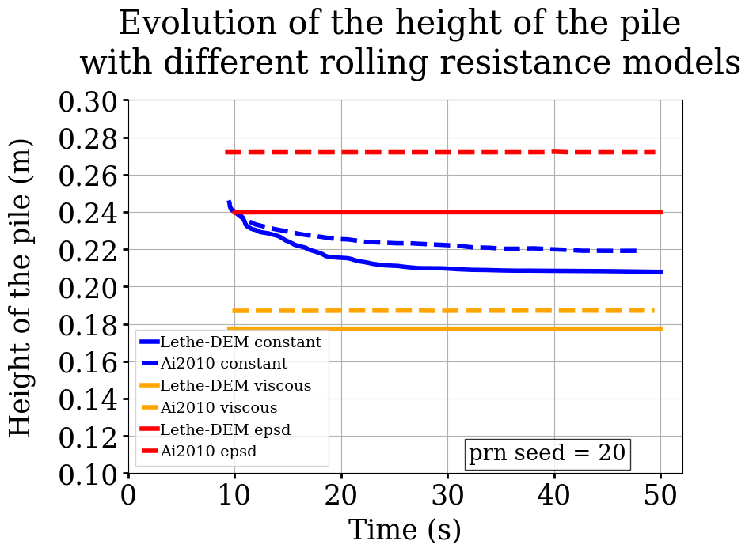
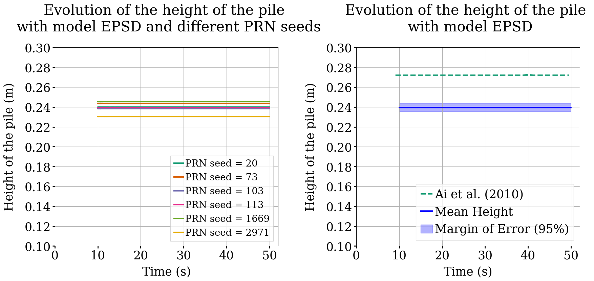

==================================
Sandpile Formation
==================================

This example simulates the formation of a sandpile using the discrete element method (DEM). 
The simulation is based on the simulation of J. Ai *et al.* [#Ai2010]_, meant to reproduce the 2D photoelastic sandpile experiments led by Zuriguel *et al.* [#Zuriguel2007]_.
More information regarding the DEM parameters is given in the Lethe documentation, i.e. `DEM parameters <../../../parameters/dem/dem.html>`_.

----------------------------------
Features
----------------------------------

- Solvers: ``lethe-particles``
- Two-dimensional problem
- Bi-dispersed particles
- Floating Wall
- Postprocessing using `Python <https://www.python.org/>`_, `PyVista <https://docs.pyvista.org/>`_, `lethe_pyvista_tools <https://github.com/chaos-polymtl/lethe/tree/master/contrib/postprocessing>`_, and `ParaView <https://www.paraview.org/>`_.

----------------------------
Files Used in This Example
----------------------------

All files mentioned below are located in the example's folder (``examples/dem/2d-sandpile-formation``).

- Geometry file: ``sandpile.geo``
- Mesh file: ``sandpile.msh``
- Parameters file: ``sandpile.prm``
- Postprocessing Python script: ``sandpile-postprocessing.py``

-----------------------
Description of the Case
-----------------------

In the first stage of the simulation (0-4.5s), particles are filled into the hopper. 
Then, at 4.5s, particles are discharged through a narrow channel onto a flat surface where a pile is formed.
We compare the evolution of the height of the pile for the different rolling resistance models with the results obtained by J. Ai *et al.* [#Ai2010]_.
The angle of repose is also calculated, so as to be compared to the one from the experiment conducted by Zuriguel *et al.* [#Zuriguel2007]_.
We expect that the Elastic-Plastic Spring-Dashpot model will give closer results to the height and angle from the experiment than the viscous model or the constant torque model. Indeed, the constant torque model produces an oscillation that can prevent the pile from reaching a stable state and the viscous model is not adapted here as the viscous effects are not major.

--------------
Parameter File
--------------

Mesh
~~~~

The mesh is a hopper with 50.5° angle generated with GMSH, with a channel connecting the hopper to the part with the flat surface.
The geometry follows the one used by Zuriguel *et al.* [#Zuriguel2007]_ and was handled in order to generate a structured mesh.

.. code-block:: text

    subsection mesh
      set type                = gmsh
      set file name           = ./sandpile.msh
      set check diamond cells = true
      set initial refinement  = 1
    end

    2D mesh of the hopper

.. note::

  The mesh can be generated using the following line:

   .. code-block:: bash
      :class: copy-button

      gmsh -2 sandpile.geo

Lagrangian Physical Properties
~~~~~~~~~~~~~~~~~~~~~~~~~~~~~~

The 3000 particles are bi-dispersed, with 2500 having a diameter of 6.9 mm and 500 having a diameter of 8.9 mm.

The following properties are chosen according to the J. Ai *et al.* paper:

* Custom distribution of disks with 70% of disks with a 6.9 mm diameter and 30% with an 8.9 mm diameter
* Density (1056 :math:`kg/m^3`)
* Young's modulus (4 MPa)
* Poisson's ratio (0.49)
* Friction coefficient of particle-particle (0.8)
* Rolling resistance coefficient of particle-particle (0.3)

The same properties were given to the wall as they were not specified.

.. code-block:: text

    subsection lagrangian physical properties
      set g                        = 0.0, -9.81
      set number of particle types = 1
      subsection particle type 0
        set size distribution type            = custom
        set custom diameters                  = 0.0069 , 0.0089
        set custom volume fractions           = 0.7   , 0.3
        set number of particles               = 3000
        set density particles                 = 1056
        set young modulus particles           = 4000000
        set poisson ratio particles           = 0.49
        set restitution coefficient particles = 0.7
        set friction coefficient particles    = 0.8
        set rolling friction particles        = 0.3
      end
      set young modulus wall           = 4000000
      set poisson ratio wall           = 0.49
      set restitution coefficient wall = 0.7
      set friction coefficient wall    = 0.8
      set rolling friction wall        = 0.3
    end

.. note::

  Only the value of the restitution coefficient was not given in the paper.

Model Parameters
~~~~~~~~~~~~~~~~

.. code-block:: text

    subsection model parameters
      subsection contact detection
        set contact detection method                = dynamic
        set dynamic contact search size coefficient = 0.8
        set neighborhood threshold                  = 1.3
      end
      set particle particle contact force method = hertz_mindlin_limit_overlap
      set particle wall contact force method     = nonlinear
      set integration method                     = velocity_verlet
      set rolling resistance torque method       = epsd_resistance
      set f coefficient                          = 0.0 
    end

.. note::

  Only when the Elastic-Plastic Spring-Dashpot (epsd) rolling resistance model is selected should f be specified (f=0 here).
  More information regarding the DEM Model parameters is given in the Lethe documentation, i.e. `DEM Model Parameters <../../../parameters/dem/model_parameters.html>`_.

Particle Insertion
~~~~~~~~~~~~~~~~~~

Particles are inserted in an insertion box in the upper part of the hopper. In this simulation, the hopper is filled through 12 insertion steps.

.. code-block:: text

    subsection insertion info
      set insertion method                               = volume
      set inserted number of particles at each time step = 250
      set insertion frequency                            = 10000
      set insertion box points coordinates               = -0.34, 0.7 : 0.34, 1.2
      set insertion distance threshold                   = 1.5
      set insertion maximum offset                       = 0.1
      set insertion prn seed                             = 20
    end

.. note::

  Due partly to the bi-dispersed simulation, changing the prn seed to a different value can lead to different results.

Simulation Control
~~~~~~~~~~~~~~~~~~

The simulation runs for 50 seconds of real time. We output the simulation results every 1000 iterations.

.. code-block:: text

    subsection simulation control
      set time step        = 2e-5
      set time end         = 50
      set log frequency    = 1000
      set output frequency = 1000
      set output path      = ./output/
    end

.. note::

  To compare with the results of J.Ai *et al.*, the end time should be set at 50 s or at least 35 s to see the progression of the curve. 
  It can be reduced to 15 s to see the fully formed sandpile but the height of the pile is only measured after 10 s and may continue to decrease after 15 s, particularly with the constant rolling resistance model.

Floating Walls
~~~~~~~~~~~~~~

Floating wall is handled as explained in the `Silo example <../silo/silo.html>`_.
In this example, a floating wall is used during the filling stage, from 0 to 4.5s. The wall is located at the bottom of the hopper, before the channel.

.. code-block:: text

    subsection floating walls
      set number of floating walls = 1
      subsection wall 0
        subsection point on wall
          set x = 0
          set y = 0
        end
        subsection normal vector
          set nx = 0
          set ny = 1
        end
        set start time = 0
        set end time   = 4.5
      end
    end

-----------------------
Running the Simulation
-----------------------

The simulation can be launched with

.. code-block:: text
  :class: copy-button

   mpirun -np 2 lethe-particles sandpile.prm

---------------
Post-processing
---------------

A Python post-processing code called ``sandpile-postprocessing.py`` is provided with this example. It is used to measure the height of the pile at each time set, starting at 10.02s so that the pile is already formed. It also calculates the angle of repose of the pile, based on the last frame.
It compares the data generated by the simulation to data from J.Ai *et al.* [#Ai2010]_ for the selected rolling resistance model.

It is possible to run the post-processing code with the following line. The arguments are the simulation path, the prm file name and the rolling resistance model used.

.. code-block:: text
  :class: copy-button

    python3 sandpile-postprocessing.py  --folder ./ --prm sandpile.prm --rollingmethod epsd

The code prints the values of the coefficient of determination :math:`R^2`, the slope (from the regression), and the angle of repose.

.. important::

  The argument --rollingmethod can be either epsd, viscous or constant and should be the same as the "rolling resistance torque method" in the prm file.
  The argument --regression can be added to plot the least squares regression used to calculate the angle of repose.

.. important::

    You need to ensure that ``lethe_pyvista_tools`` is working on your machine. Click `here <../../../tools/postprocessing/postprocessing.html>`_ for details.

When you have launched the simulation and the post-processing (with the right argument) for each rolling resistance model (constant, epsd, viscous), launch the following to compare different models.

.. code-block:: text
  :class: copy-button

    python3 sandpile-height-comparison.py

-------
Results
-------

Visualisation with Paraview
~~~~~~~~~~~~~~~~~~~~~~~~~~~

The simulation can be visualised using Paraview as seen below.

.. figure:: images/formed-sandpile.png
    :width: 400
    :alt: Mesh
    :align: center

    Sandpile at the end of the simulation

Evolution of the Height of the Pile
~~~~~~~~~~~~~~~~~~~~~~~~~~~~~~~~~~~

The following image compares the evolution of the height of the pile with the results of J. Ai *et al.*.

Considering the height of the pile measured in the experiment by Zuriguel *et al.* was 28 cm, the results with model epsd are satisfying.
As predicted, with the constant model, the pile takes a lot of time to stabilise but results are closed to those obtained by J. Ai *et al*. Regarding the viscous model, the pile does remain constant like with epsd but the height is underestimated.

The difference with J. Ai *et al* simulation could be related to there being two sizes of particles. As they are inserted, the particles are placed randomly according to the prn seed chosen, which can lead to a difference in the height of the pile.
The next image shows the evolution of the height of the pile with rolling resistance model epsd using different prn seeds.

This confirms changing the prn seed leads to different heights but the results remain around 24 cm.

-------------
References
-------------

.. [#Ai2010] \Jun Ai, Jian-Fei Chen, J. Michael Rotter, and Jin Y. Ooi. "Assessment of Rolling Resistance Models in Discrete Element Simulations." *Powder Technology*, vol. 206, no. 3, 2011, pp. 269-282. ScienceDirect. [Online]. Available: https://www.sciencedirect.com/science/article/pii/S0032591010005164
 
.. [#Zuriguel2007] \I. Zuriguel, T. Mullin, J. M. Rotter. "Effect of Particle Shape on the Stress Dip Under a Sandpile." *Physical Review Letters*, vol. 98, no. 2, 2007, p. 028001. [Online]. Available: https://journals.aps.org/prl/abstract/10.1103/PhysRevLett.98.028001
