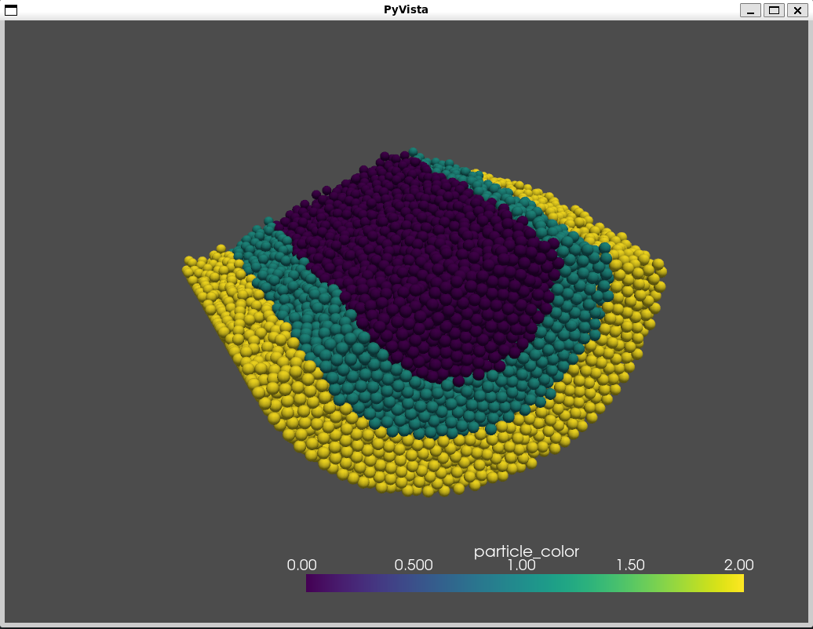
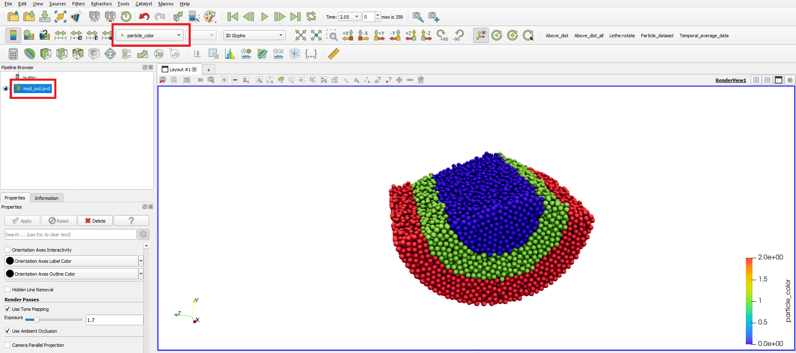
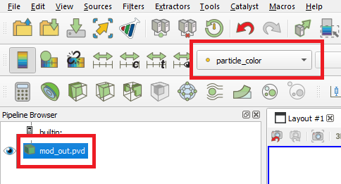

==========================================
Small scale rotating drum post-processing
==========================================

This is an example of how to post-process results obtained in the `Small scale rotating drum example <../../dem/rotating-drum/small-scale-rotating-drum.html>`_ using `lethe_pyvista_tools <https://github.com/lethe-cfd/lethe/tree/master/contrib/postprocessing>`_, a Python module is based on `PyVista <https://docs.pyvista.org/>`_, built to facilitate the reading of Lethe results using `Python <https://www.python.org/>`_. 

.. important::
  This example uses the DEM files of the `Small scale rotating drum example <../../dem/rotating-drum/small-scale-rotating-drum.html>`_.

.. warning::
  For `lethe_pyvista_tools <https://github.com/lethe-cfd/lethe/tree/master/contrib/postprocessing>`_ to work, along with `Python 3 <https://www.python.org/downloads/>`_, the following libraries are needed: `os <https://docs.python.org/3/library/os.html>`_, `NumPy <https://numpy.org/>`_, `PyVista <https://docs.pyvista.org/>`_, and `tqdm <https://tqdm.github.io/>`_. If any of the modules are missing, use `pip <https://pypi.org/project/pip/>`_ to install it running ``pip3 install $NAME_OF_THE_MODULE`` on the terminal.

Features
----------------------------------
- DEM simulation
- Post-processing using `Python <https://www.python.org/>`_, `PyVista <https://docs.pyvista.org/>`_, `lethe_pyvista_tools <https://github.com/lethe-cfd/lethe/tree/master/contrib/postprocessing>`_, and `ParaView <https://www.paraview.org/>`_.

Files used in this example
----------------------------

- Parameters file for particle insertion: ``/examples/dem/3d-small-scale-rotating-drum/packing-rotating-drum.prm``
- Parameters file for drum rotation: ``/examples/dem/3d-small-scale-rotating-drum/small-rotating-drum-dem.prm``
- Python module for Lethe data post-processing: ``/contrib/postprocessing/lethe_pyvista_tools.py``
- Python script using module for rotating drum post-processing: ``/examples/postprocessing/small-scale-rotating-drum-postprocessing/example_small_rotating_drum.py``

Description of the case
-----------------------

In this example, we illustrate the mixing inside a rotating drum by coloring the particles according to their radial position right after their full packing. To do so, we post-process Lethe-DEM data using `Python <https://www.python.org/>`_, `PyVista <https://docs.pyvista.org/>`_, `lethe_pyvista_tools <https://github.com/lethe-cfd/lethe/tree/master/contrib/postprocessing>`_, and `ParaView <https://www.paraview.org/>`_

The DEM files used in this example are obtained following the `Small scale rotating drum example <../../dem/rotating-drum/small-scale-rotating-drum.html>`_.

.. note::
  It is not necessary to use all mentioned tools, but they are used in this example to show different ways to process the data according to user's need.

Python code
---------------

Module importing
~~~~~~~~~~~~~~~~~

The module `lethe_pyvista_tools <https://github.com/lethe-cfd/lethe/tree/master/contrib/postprocessing>`_ was conceived to optimize the reading and post-treatment of Lethe data using Python. It is based on `PyVista <https://docs.pyvista.org/>`_, a versatile module that can be used to manipulate Lethe results.

First of all, we import the module to our Python script. There are two ways to do so. In the case of this example, we use the `sys <https://docs.python.org/3/library/sys.html>`_ module to import it directly from Lethe's directory:

.. code-block::

  import sys
  path_to_module = '../../../contrib/postprocessing/'
  sys.path.append(path_to_module)
  from lethe_pyvista_tools import *

where `sys.path <https://docs.python.org/3/library/sys.html#sys.path:~:text=in%20version%203.10.-,sys.path%C2%B6,-A%20list%20of>`_ is a list of strings that specifies the search path for modules. However, one can simply copy the `lethe_pyvista_tools.py <https://github.com/lethe-cfd/lethe/tree/master/contrib/postprocessing>`_ file to the same folder as the Python post-processing script is and simply import it, such as:
 
.. code-block::

  from lethe_pyvista_tools import *

The ``*`` means that we want to import all members of lethe_pyvista_tools. 

Constructing the object
~~~~~~~~~~~~~~~~~~~~~~~~~~~~

The following step is to create an object to receive the data. In the present case, the object is called ``particles``.

.. code-block::

  particles = lethe_pyvista_tools(case_path = ".", prm_file_name = "small-rotating-drum-dem.prm")

Here, the constructor ``lethe_pyvista_tools`` receives two arguments: ``case_path`` and ``prm_file_name``. In the above code line, ``"."`` means that the ``case_path`` is the path where we currently are, but it can be any path where the case is. The ``prm_file_name`` argument takes ``"small-rotating-drum-dem.prm"``.

.. tip::
  Together with the object ``particles``, ``lethe_pyvista_tools`` creates a dictionary with all parameters in the ``.prm`` file. To access the parameter, we can use ``particles.prm_dict['$NAME_OF_THE_PARAMETER']``. In the present case for example, the diameter of the particles can be easily printed using ``print(particles.prm_dict['diameter'])``. This can be useful for post-processing routines with multiple simulations.

Reading Lethe results to Python
~~~~~~~~~~~~~~~~~~~~~~~~~~~~~~~~~

Next, we read the results into Python:

.. code-block::
  
  particles.read_lethe_to_pyvista(pvd_name = "out.pvd")

``read_lethe_to_pyvista`` takes the name of the ``.pvd`` file generated by the simulation. The method can take 3 other arguments: ``first``, ``last``, and ``interval``, standing for the first and last time-steps to be read and the interval between the time-steps, respectively. By default, ``first = 0``, ``interval = 1``, and ``last`` is the last time-step of the data.

The ``read_lethe_to_pyvista`` reading function assigns the datasets of each time-step to the object ``particles``. Each time-step corresponds to a `PyVista dataset <https://docs.pyvista.org/user-guide/vtk_to_pyvista.html#>`_, and can be accessed using ``particles.df[$TIME-step_NUMBER]``.

.. note:: 
  
  If we set ``first = 2``, ``particles.df[0]`` corresponds to the dataset of the 2nd output time-step. In all situations from now on, everytime we refer to a time-step, it will correspond to a dataset.

.. important::
  Since this is a post-processing module, we can only have access to data that was previously output. If one needs more time resolution than the data in hand, the simulation must be `reran with a smaller time-step <../../../parameters/dem/simulation_control>`_

Creation of a new array
~~~~~~~~~~~~~~~~~~~~~~~~

To color the particles according to their position, we use the function ``array_modifier``, which takes the following arguments:

- ``reference_array_name``: Name of the array used to sort the data and identify the particles at all time-steps. Other arrays, such as ``Type`` or any other array, can be used for this. By default: ``"ID"``
- ``array_name``: Name of the new array. If there is an array with the same name, it will be rewritten according to the other arguments. By default: ``"new_array"``
- ``restart_array``: If ``True``, gives ``standard_value`` to the entire array before applying the modifications to it. If one wants to modify part of the array keeping the rest intact, it must be set as ``False``. By default: ``False``
- ``condition``: Takes a string and uses it in an if condition to modify the array. Variables accepted include ``x``, ``y``, ``z``, ``u``, ``v``, ``w``, ``t``, and any other array (``ID`` for example). It also accepts a combination of them, such as ``"x*w**2 + t > 2 and ID > 0"``. By default: ``""``
- ``array_values``: New values to the array. This argument accepts a single value (which will be repeated to all data respecting the given ``condition``), a `NumPy <https://numpy.org/>`_ array, or `Python list <https://docs.python.org/3/tutorial/datastructures.html>`_ (with the same length (``len``) of all other arrays in ``particles.df``), or a string such as ``"2*x + t"`` (working just like the ``condition`` argument). By default: ``0``
- ``standard_value``: If ``restart array = True`` or the array is a completely new array, the ``standard_value`` will be plugged to the entire array before modifying it. By default: ``0``
- ``time_dependent``: ``array_modifier`` can be time dependent or not. If set ``True``, ``condition`` will be tested to each of the time-steps, while if it is ``False``, it will be applied using the ``reference_time_step`` instead, and the modification will be just replicated to the other time-steps. By default: ``False``
- ``reference_time_step``: Reference time-step to which the modification will be applied. If ``time_dependent = False``, the result of the modificaition applied to ``reference_time_step`` will be simply replicated to the others. By default: ``0``

.. important::

  As explained in the previous subsection, ``reference_time_step`` only refers to time-steps that were read into the code using ``read_lethe_to_pyvista``.

The following block of code creates an array named ``particle_color`` using the ``array_modifier`` function, assigning ``1`` to all particles with radial position :math:`> 0.025` at the end of the packing (40th time-step):

.. code-block::
  
  condition = "(y**2 + z**2)**(1/2) > 0.025"
  particles.array_modifier(array_name = "particle_color", condition = condition, array_values = 1, reference_time_step = 40)

Since the rotating drum is placed along the :math:`x` axis, we use :math:`\sqrt{y^2 + z^2}` to assess the radial position of particles.

To create an additional layer of particles with different colors, we use the same function again with a different condition.

.. code-block::

  condition = "(y**2 + z**2)**(1/2) > 0.04"
  particles.array_modifier(array_name = "particle_color", condition = condition, array_values = 2, reference_time_step = 40, restart_array = False)

This time, we set ``restart_array = False`` to guarantee it is not going to affect the previous modification to the array.

.. Note:: 
  If we applied the second condition first, since conditions would overlap, intead of 3 layers of particles we would have only two.

Visualizing the results
-------------------------

We have two visualization options. One would be the `PyVista visualization tools <https://docs.pyvista.org/api/plotting/index.html>`_, such as `PyVista Plotter <https://docs.pyvista.org/api/plotting/_autosummary/pyvista.Plotter.html#pyvista.Plotter>`_. The other option is to use `ParaView <https://www.paraview.org/>`_.

PyVista visualization
~~~~~~~~~~~~~~~~~~~~~~

To visualize particle data using PyVista, first we need to create a single particle with diameter 1 and a given angular resolution:

.. code-block::
  
  sphere = pv.Sphere(theta_resolution=50, phi_resolution=50)

The next step is to use this object as base to represent all particles:

.. code-block::
  
  particle_glyph = particles.df[0].glyph(scale='Diameter', geom = sphere)

Here, we are using the first time-step of the data (``particles.df[0]``) as example.

Now that particles are created, we can visualize them:

.. code-block::
  
  plt = pv.Plotter()
  plt.add_mesh(particle_glyph, scalars = "particle_color")
  plt.show()

This will open one iteractive window such as this one:

.. tip:: 
  It is possible to `create movies with PyVista <https://docs.pyvista.org/api/plotting/_autosummary/pyvista.BasePlotter.open_movie.html#open-movie>`_ looping through time-steps.

ParaView visualization
~~~~~~~~~~~~~~~~~~~~~~~~~

First, we need to save the new data with the modifications. To do so, we can use the following:

.. code-block::
  
  particles.write_vtu(prefix = "mod_")

This will save all data in the output folder of the simulation. All files will have a ``prefix`` and can be opened in ParaView just like any other Lethe simulation.

 

Results
---------

Following we present one video of the full simulation with particles colored by their initial position.

.. raw:: html

  <iframe width="560" height="315" src="https://www.youtube.com/embed/qxO4MD_zg2w" title="Rotating drum - mixing study" frameborder="0" allow="accelerometer; autoplay; clipboard-write; encrypted-media; gyroscope; picture-in-picture; web-share" allowfullscreen></iframe>

The simulation results show that the layers in red and green, that is, particles close to the walls, tend to mix faster than the ones in the center.

Possibilities for extension
----------------------------

- Give a different ``condition`` to create the ``particle_color`` array
- Use the ``lethe_pyvista_tools`` for a different problem, modifying the ``condition`` accordingly
- Use the tools in the `PyVista official repository <https://docs.pyvista.org>`_ to create screenshots, movies, and plots with the data.
- Change the rotation velocity and track the mixing of the three layers of particles

 
