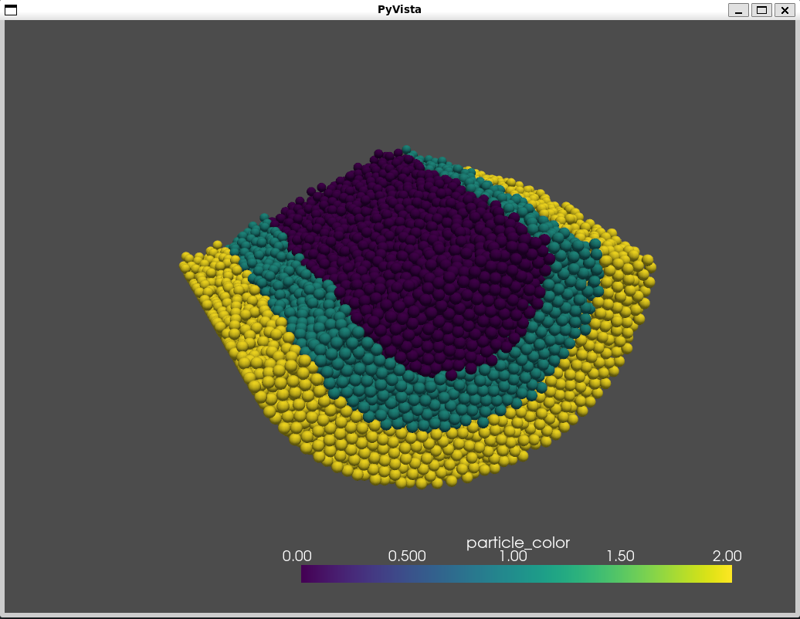
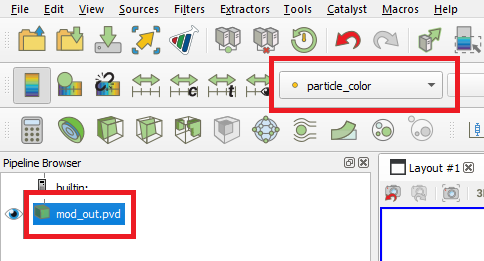
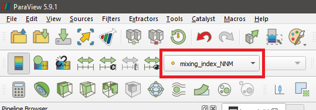
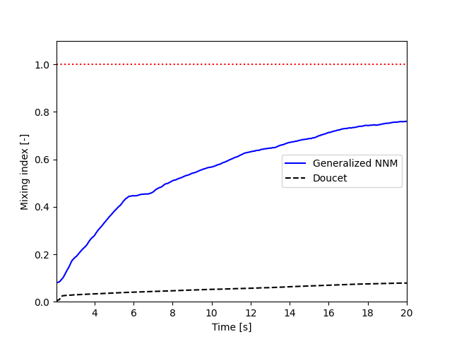

==========================================
Small Scale Rotating Drum Postprocessing
==========================================

This is an example of how to post-process results obtained in the `Small scale rotating drum example`_ using `lethe_pyvista_tools <https://github.com/lethe-cfd/lethe/tree/master/contrib/postprocessing>`_, a Python module based on `PyVista <https://docs.pyvista.org/>`_, built to facilitate the reading of Lethe results using `Python <https://www.python.org/>`_.

.. _`Small scale rotating drum example`: ../../dem/small-scale-rotating-drum/small-scale-rotating-drum.html

.. important::
  
  This example uses the DEM files of the `Small scale rotating drum example`_.

.. warning::
  
  Details about installing the module or using it without installing it are available on this `documentation <../../../tools/postprocessing/postprocessing.py>`_.

----------------------------------
Features
----------------------------------

- DEM simulation
- Post-processing using `Python <https://www.python.org/>`_, `PyVista <https://docs.pyvista.org/>`_, `lethe_pyvista_tools <https://github.com/lethe-cfd/lethe/tree/master/contrib/postprocessing>`_, and `ParaView <https://www.paraview.org/>`_.

----------------------------
Files Used in This Example
----------------------------

- Parameters file for particle insertion: ``examples/dem/3d-small-scale-rotating-drum/packing-rotating-drum.prm``
- Parameters file for drum rotation: ``examples/dem/3d-small-scale-rotating-drum/small-rotating-drum-dem.prm``
- Python module for Lethe data post-processing: ``contrib/postprocessing/lethe_pyvista_tools``
- Python script using module for rotating drum post-processing: ``examples/postprocessing/small-scale-rotating-drum-postprocessing/example_small_rotating_drum.py``

-----------------------
Description of the Case
-----------------------

In this example, we illustrate the mixing inside a rotating drum by coloring the particles according to their radial position right after their full packing. To do so, we post-process Lethe-DEM data using `Python <https://www.python.org/>`_, `PyVista <https://docs.pyvista.org/>`_, `lethe_pyvista_tools <https://github.com/lethe-cfd/lethe/tree/master/contrib/postprocessing>`_, and `ParaView <https://www.paraview.org/>`_.

Additionally, we calculate the mixing index using the Nearest Neighbors Method (NNM) [`1 <https://www.researchgate.net/profile/Niels-Deen/publication/228722534_Characterizing_solids_mixing_in_DEM_simulations/links/00b495289f429c5b39000000/Characterizing-solids-mixing-in-DEM-simulations.pdf>`_] and Doucet method [`2 <https://www.sciencedirect.com/science/article/abs/pii/S0263876208002724>`_, `3 <https://doi.org/10.1016/j.cherd.2016.12.018>`_].

The DEM files used in this example are obtained following the `Small scale rotating drum example`_.

.. note::
  It is not necessary to use all mentioned tools, but they are used in this example to show different ways to process the data according to user's need.

---------------
Python Code
---------------

Please, read this `documentation <../../../tools/postprocessing/postprocessing.py>`_ before jumping to the following steps.

Constructing the Object
~~~~~~~~~~~~~~~~~~~~~~~~~~~~

The first step is to create an object to receive the data. In the present case, the object is called ``particles``.

.. code-block::

  particles = lethe_pyvista_tools(case_path = ".", prm_file_name = "small-rotating-drum-dem.prm", pvd_name = "out.pvd", prefix = "mod_", n_procs = None)

Here, the constructor ``lethe_pyvista_tools`` receives three arguments: ``case_path``, ``prm_file_name``, and the name of the ``.pvd`` file generated by the simulation. In the above code line, ``"."`` means that the ``case_path`` is the path where we currently are, but it can be any path where the case is. The ``prm_file_name`` argument takes ``"small-rotating-drum-dem.prm"``. The constructor can take 3 other arguments: ``first``, ``last``, and ``step``, standing for the first and last time-steps to be read and the interval between the time-steps, respectively. By default, ``first = 0``, ``step = 1``, and ``last`` is the last time-step of the data.

.. important::

    The special ``n_procs`` parameter controls the number of cores used in the post-processing routine. By default, it is set to ``None``. If no other value is provided, the ``n_procs`` will be the number of CPUs on your machines.

.. note:: 
  
  If we set ``first = 2``, ``particles.time_list[0]`` will return the time corresponding to the second time-step. In all situations from now on, everytime we refer to a time-step, it will correspond to a dataset.

.. tip::
  Together with the object ``particles``, ``lethe_pyvista_tools`` creates a dictionary with all parameters in the ``.prm`` file. To access the parameter, we can use ``particles.prm_dict['$NAME_OF_THE_PARAMETER']``. In the present case for example, the diameter of the particles can be easily printed using ``print(particles.prm_dict['diameter'])``. This can be useful for post-processing routines with multiple simulations.

  Note that a list of values is returned when there is more than one parameter with the same name in the ``.prm`` file. The list is sorted according to parameters' occurrence.

This command will also read all information necessary to read the data from the pvd file. To ensure that no original data will not be lost during the post-processing, on calling the constructor, copies of the ``.pvd`` and all ``.vtu`` files are created with a given ``prefix``. This parameter can be added to ``lethe_pyvista_tools`` and is ``mod_`` by default. If you wish to work with the original ``.vtu`` and ``.pvd`` files, just use ``prefix = ""``.

The ``read_lethe_to_pyvista`` reading function assigns the datasets of each time-step to the object ``particles``. Each time-step corresponds to a `PyVista dataset <https://docs.pyvista.org/user-guide/vtk_to_pyvista.html#>`_, and can be accessed using ``particles.df[$TIME-step_NUMBER]``.

.. important::
  Since this is a post-processing module, we can only have access to data that was previously output. If one needs more time resolution than the data in hand, the simulation must be `reran with a smaller time-step <../../../parameters/dem/simulation_control>`_

Creation of a New Array
~~~~~~~~~~~~~~~~~~~~~~~~

To color the particles according to their position, we use the function ``modify_array``, which takes the following arguments:

- ``reference_array_name``: Name of the array used to sort the data and identify the particles at all time-steps. Other arrays, such as ``Type`` or any other array, can be used for this. By default: ``"ID"``
- ``array_name``: Name of the new array. If there is an array with the same name, it will be rewritten according to the other arguments. By default: ``"new_array"``
- ``restart_array``: If ``True``, gives ``standard_value`` to the entire array before applying the modifications to it. If one wants to modify part of the array keeping the rest intact, it must be set as ``False``. By default: ``False``
- ``condition``: Takes a string and uses it in an if condition to modify the array. Variables accepted include ``x``, ``y``, ``z``, ``u``, ``v``, ``w``, ``t``, and any other array (``ID`` for example). It also accepts a combination of them, such as ``"x*w**2 + t > 2 and ID > 0"``. By default: ``""``
- ``array_values``: New values to the array. This argument accepts a single value (which will be repeated to all data respecting the given ``condition``), a `NumPy <https://numpy.org/>`_ array, or `Python list <https://docs.python.org/3/tutorial/datastructures.html>`_ (with the same length (``len``) of all other arrays in ``particles.df``), or a string such as ``"2*x + t"`` (working just like the ``condition`` argument). By default: ``0``
- ``standard_value``: If ``restart array = True`` or the array is a completely new array, the ``standard_value`` will be plugged to the entire array before modifying it. By default: ``0``
- ``time_dependent``: ``modify_array`` can be time dependent or not. If set ``True``, ``condition`` will be tested to each of the time-steps, while if it is ``False``, it will be applied using the ``reference_time_step`` instead, and the modification will be just replicated to the other time-steps. By default: ``False``
- ``reference_time_step``: Reference time-step to which the modification will be applied. If ``time_dependent = False``, the result of the modificaition applied to ``reference_time_step`` will be simply replicated to the others. By default: ``0``

.. important::

  As explained in the previous subsection, ``reference_time_step`` only refers to time-steps that were read into the code using ``read_lethe_to_pyvista``.

The following block of code creates an array named ``particle_color`` using the ``modify_array`` function, assigning ``1`` to all particles with radial position :math:`> 0.025` at the end of the packing (40th time-step):

.. code-block::
  
  condition = "(y**2 + z**2)**(1/2) > 0.025"
  particles.modify_array(array_name = "particle_color", condition = condition, array_values = 1, reference_time_step = 40)

Since the rotating drum is placed along the :math:`x` axis, we use :math:`\sqrt{y^2 + z^2}` to assess the radial position of particles.

To create an additional layer of particles with different colors, we use the same function again with a different condition.

.. code-block::

  condition = "(y**2 + z**2)**(1/2) > 0.04"
  particles.modify_array(array_name = "particle_color", condition = condition, array_values = 2, reference_time_step = 40, restart_array = False)

This time, we set ``restart_array = False`` to guarantee it is not going to affect the previous modification to the array.

.. Note:: 
  If we applied the second condition first, since conditions would overlap, intead of 3 layers of particles we would have only two.

-------------------------
Visualizing the Results
-------------------------

We have two visualization options. One would be the `PyVista visualization tools <https://docs.pyvista.org/api/plotting/index.html>`_, such as `PyVista Plotter <https://docs.pyvista.org/api/plotting/_autosummary/pyvista.Plotter.html#pyvista.Plotter>`_. The other option is to use `ParaView <https://www.paraview.org/>`_.

PyVista Visualization
~~~~~~~~~~~~~~~~~~~~~~

To visualize particle data using PyVista, first we need to create a single particle with diameter 1 and a given angular resolution:

.. code-block::
  
  sphere = pv.Sphere(theta_resolution=50, phi_resolution=50)

The next step is to use this object as base to represent all particles:

.. code-block::
  
  particle_glyph = particles.get_df(0).glyph(scale='Diameter', geom = sphere)

Here, we are using the first time-step of the data (``particles.get_df(0)``) as example. To access the full data as a PyVista dataset, we use the ``.get_df($STEP_NUMBER)`` function. It can be used to store data into variables, such as ``variable = particles.get_df(0)``.

Now that particles are created, we can visualize them:

.. code-block::
  
  plotter = pv.Plotter()
  plotter.add_mesh(particle_glyph, scalars = "particle_color")
  plotter.show()

This will open one iteractive window such as this one:

.. tip:: 
  It is possible to `create movies with PyVista <https://docs.pyvista.org/api/plotting/_autosummary/pyvista.BasePlotter.open_movie.html#open-movie>`_ looping through time-steps.

ParaView Visualization
~~~~~~~~~~~~~~~~~~~~~~~~~

Since all modifications are saved to the new ``.pvd`` and ``.vtu`` files, the results of the post-processing can be easily opened on ParaView, using the generated files.

.. image:: images/paraview_window.png
    :alt: ParaView
    :align: center

 

Mixing Index
-------------

We used two methods to calculate the mixing index of the rotating drum:

- Nearest Neighbors Method (NNM) [`1 <https://www.researchgate.net/profile/Niels-Deen/publication/228722534_Characterizing_solids_mixing_in_DEM_simulations/links/00b495289f429c5b39000000/Characterizing-solids-mixing-in-DEM-simulations.pdf>`_].

- Doucet method [`2 <https://www.sciencedirect.com/science/article/abs/pii/S0263876208002724>`_, `3 <https://doi.org/10.1016/j.cherd.2016.12.018>`_].

Nearest Neighbors Method
~~~~~~~~~~~~~~~~~~~~~~~~~~~

One example of application of the ``modify_array`` method is on the calculation of the mixing index using the Nearest Neighbors Method (NNM) [`1 <https://www.researchgate.net/profile/Niels-Deen/publication/228722534_Characterizing_solids_mixing_in_DEM_simulations/links/00b495289f429c5b39000000/Characterizing-solids-mixing-in-DEM-simulations.pdf>`_]. To do so, we first need to split the domain in half. Since we are interested on working with the radial mixing, first we need to calculate the cylindric coordinates of each particle:

.. code-block::

  particles.get_cylindrical_coords(radial_components = "yz")

Given the radial components, this method assigns ``['points_cyl']`` to the object ``particles``. The coordinates :math:`[0, 1, 2]` are :math:`[r, \theta, Z]`, respectively

To help us finding where to split the domain, we will also find the radial coordinate of the center of mass of the particles at ``reference_time_step = 40``:

.. code-block::

  r_center_mass = np.mean(particles.get_df(40)['points_cyl'][:, 0])

Now we can split the domain:

.. code-block::

  condition = f"(y**2 + z**2)**(1/2) > {r_center_mass}"
  particles.modify_array(array_name = "particle_color", condition = condition, array_values = 1, restart_array = True, reference_time_step = 40)

.. note:: 
  
  We need to set ``restart_array = True`` since we are doing a new split on the particles using the same ``array_name = 'particle_color'``.

The following method is used to find the ``15`` nearest neighbors of each particle:

.. code-block::

  particles.get_nearest_neighbors(return_id = True, n_neighbors = 15)

To get the indice and the position of the nearest neighbor (`0`) of particle `2` at the 5th time-step, the following can be used:

.. code-block::

  neighbor_index = particles.get_df(5)['neighbors'][2][0]
  print(particles.get_df(5).points[neighbor_index])

It is also possible to print the neighbor's `ID` and its distance to particle `2`:abbreviation:

.. code-block::

  print(particles.get_df(5)['neighbors_id'][2][0])
  print(particles.get_df(5)['neighbors_dist'][2][0])

All set, now we can calculate the mixing index using NNM and store it in `particles.mixing_index_nnm`:

.. code-block::

  particles.mixing_index_nearest_neighbors(reference_array = "particle_color", n_neighbors = 15, mixing_index_array_name = "mixing_index_NNM")
  particles.mixing_index_nnm = particles.mixing_index

This method calculates the mixing index for each particles and stores it in an array named according to the parameter `mixing_index_array_name`. This array can be used for vizualization.

Doucet Mixing Index
~~~~~~~~~~~~~~~~~~~~

Similar to NNM, we are interested in the mixing index results using cylindrical coordinates. Calculating the Doucet mixing index is as simple as running:

.. code-block::
  
  particles.mixing_index_doucet(reference_time_step = 40, use_cyl = True, increasing_index = True, normalize = True)
  particles.mixing_index_doucet = particles.mixing_index

Usually, Doucet mixing index decreases with mixing, but for comparison with NNM purposes we do ``increasing_index = True``. Doucet method does not need any sort of splitting of particles, so it is not necessary to split them previous to using this method.

---------
Results
---------

Following we present one video of the full simulation with particles colored by their initial position.

.. raw:: html

  <iframe width="560" height="315" src="https://www.youtube.com/embed/qxO4MD_zg2w" title="Rotating drum - mixing study" frameborder="0" allow="accelerometer; autoplay; clipboard-write; encrypted-media; gyroscope; picture-in-picture; web-share" allowfullscreen></iframe>

The simulation results show that the layers in red and green, that is, particles close to the walls, tend to mix faster than the ones in the center.

The poor mixing of the particles is confirmed with NNM and Doucet mixing indices. To plot both indices as a function of time:

.. code-block::
  
  plt.plot(particles.time_list[40:], particles.mixing_index_nnm[40:], '-b', label = "Generalized NNM")
  plt.plot(particles.time_list[40:], particles.mixing_index_doucet[40:], '--k', label = "Doucet")
  plt.plot(particles.time_list[40:], np.repeat(1, len(particles.time_list[40:])), ':r')
  plt.xlabel("Time [s]")
  plt.ylabel("Mixing index [-]")
  plt.xlim(particles.time_list[40], particles.time_list[-1])
  plt.ylim(0, 1.1)
  plt.legend()
  plt.savefig("./mixing_index.png")
  plt.close()

For ``set rotational speed = 2``, the following is observed:

As shown, neither of the mixing indices point to a full mixing of the particles, even at higher simulation times. NNM is always above Doucet, indicating that the main mixing component must not be the radius. Higher rotating velocities can improve results.

----------------------------
Possibilities for Extension
----------------------------

- Give a different ``condition`` to create the ``particle_color`` array
- Use the ``lethe_pyvista_tools`` for a different problem, modifying the ``condition`` accordingly
- Use the tools in the `PyVista official repository <https://docs.pyvista.org>`_ to create screenshots, movies, and plots with the data.
- Change the rotation velocity and track the mixing indices.

