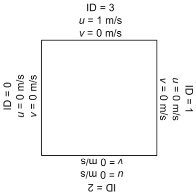
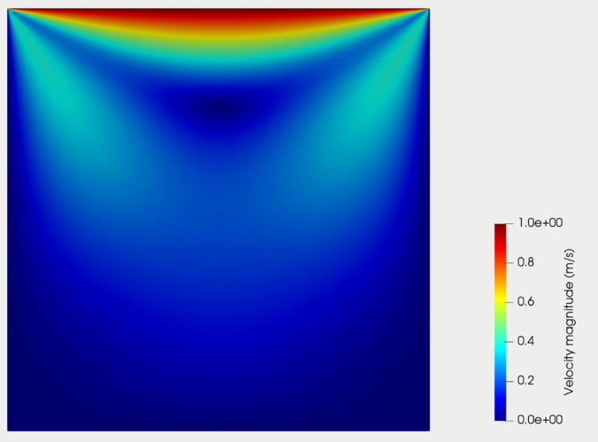

==================================
Example 1 : Lid-Driven Cavity Flow
==================================

In this example, flow of fluid in a two-dimensional square-shaped cavity is simulated using Lethe. The geometry and boundary conditions of the simulated system is illustrated in the following.

In this case, only the upper wall boundary (ID = 3) moves in x direction with a constant velocity (u = 1 m/s) while the other boundaries are fixed (no slip boundary condition). Note the numbering method of the boundaries in the native deal.II format on this figure. We will use "gls_navier_stokes_2d" solver for this simulation. In the parameter handler file the geometry and mesh is determined as:

.. code-block:: text

    #---------------------------------------------------
    # Mesh
    #---------------------------------------------------
    subsection mesh
        set type                 = dealii
        set grid type            = hyper_cube
        set grid arguments       = -1 : 1 : true
        set initial refinement   = 6
    end

As can be observed, the geometry is defined using a hyper_cube, starting from -1 to 1 in each direction and the initial number of refinements is set equal to 6. The boundary conditions of this simulation are also determined as:

.. code-block:: text

    #---------------------------------------------------
    # Boundary Conditions
    #---------------------------------------------------
    subsection boundary conditions
    set number                  = 4
        subsection bc 0
            set id                = 0
            set type              = noslip
        end
        subsection bc 1
            set id                = 1
            set type              = noslip
        end
        subsection bc 2
            set id                = 2
            set type              = noslip
        end
        subsection bc 3
            set id                = 3
            set type              = function
            subsection u
                set Function expression = 1
            end
            subsection v
                set Function expression = 0
            end
        end
    end

In the boundary conditions section, "no slip" boundary condition was chosen for the first three boundaries, while the motion of the top wall is defined using function boundary condition. In the function boundary condition, the velocity in x direction is set equal to 1.

First order elements are used for the velocity and the pressure:

.. code-block:: text

    #---------------------------------------------------
    # FEM
    #---------------------------------------------------
    subsection FEM
        set velocity order            = 1
        set pressure order            = 1
    end

Consequently, only the gls_navier_stokes_2d solver can be used for this test case. To use the gd_navier_stokes_2d solver, the velocity order should be set to two.

The velocity distribution in the steady state is illustrated in the following:

