====================================
2D Flow Past a Backward-Facing Step  
====================================

Features
--------

- Solver : ``gls_navier_stokes_2d`` 
- Steady and pseudo steady state resolution
- Comparison with benchmark and analytical data
- Mesh refinement and error analysis

Location of the example
-----------------------

- Base case (:math:`Re \leq 800`) : ``/examples/incompressible_flow/[À INCLURE]``
- Higher-Reynolds case (:math:`Re > 800`) : ``/examples/incompressible_flow/[À INCLURE]``

Description of the case
-----------------------

In this example, a bidimensional flow goes past a backward-facing step. The flow enters from the left inlet and seperates from the bottom wall at the step, and then reattaches to it further downstream at a distance :math:`x_r` from the step.  

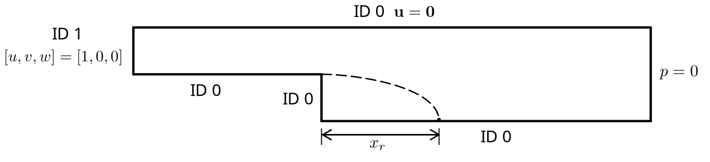

The backward-facing step problem is a classical computationnal fluid dynamics problem. The fact that it features a non-trivial solution while maintaining simple geometry and boundary conditions makes this problem a good candidate for validation purposes as well as to test the robustness of a given CFD method. First, the basic parameters used to solve the backward-facing step problem will be exposed. A solution to several Reynolds numbers (from :math:`Re = 100` to :math:`Re =1000`) will then be presented and compared to experimental and numerical data. A mesh adaptation and numerical error analysis will be carried on. Lastly, some key features of *Lethe* and general FEA parameters will be compared and their impact on their respective results will be shown.

Parameter File
--------------

The following subsections show the different parameters of *Lethe* used in the simulations. While they all remain more or less the same throughout the various cases, some of them change as the Reynolds number is increased.

Simulation control
~~~~~~~~~~~~~~~~~~

For :math:`Re \leq 800`, the solution is stable enough to be computed in steady state by setting ``method`` to ``steady`` : 

.. code-block:: text

	subsection simulation control
	  set method = steady
	  set stop tolerance = 1e-12
	  set number mesh adapt = 10
	  set output name = backward_facing_step_output
	  set output frequency = 1
	  set subdivision = 1
	  set output boundaries = false
	end
	
A mesh refinement analysis can be done with ``set number mesh adapt = 10``. By starting from a very coarse mesh and by dynamically refining the mesh at least 10 times, asymptotic convergence can be clearly observed.

However, for :math:`Re > 800`, convergence can be quite difficult to obtain while doing a steady state simulation. In fact, as the Reynolds number increases, the problem becomes progessively more stiff to a point where the ``steady`` solver ultimately fails. With that in mind, the case can be solved as a transient problem until the steady state solution is obtained. This can be acheived with the ``method = steady_bdf`` parameter.

.. code-block:: text

	subsection simulation control
	  set method = steady_bdf
	  set stop tolerance = 1e-6
	  set time step                     = 0.01
	  set adapt                         = true
	  set max cfl                       = 100000
	  set adaptative time step scaling = 1.2
	  set number mesh adapt = 0
	  set output name = backward_facing_step_output
	  set output frequency = 1
	  set subdivision = 1
	  set output boundaries = false
	end
  
``stop tolerance``, ``time step``, ``adapt``, ``max cfl`` and ``adaptative time step scaling`` are parameters that control the transient simulation. Since this transient problem can be quite demanding, a relativly high tolerance has been chosen as an input for ``stop tolerance``. This choice is however not without its consequences : the :math:`x_r` parameter might be underestimated.

Physical Properties
~~~~~~~~~~~~~~~~~~~

In this problem, the Reynolds number is defined as follows : 

.. math::
	Re_h = \frac{u h_{out}}{\nu} = \frac{2uh}{\nu}
	
where :math:`h_{out}` is the outlet height, :math:`h` the step height and :math:`\nu` the kinematic viscosity.

In addition, unit values of :math:`u` and :math:`h` are chosen in the goal of obtaining :

.. math::
	Re_h = f(\nu) = \frac{2}{\nu}
	
Consequently, the physical properties are defined as follows : 

.. code-block:: text
	
	subsection physical properties
	  set number of fluids      = 1
	  subsection fluid 0
		set kinematic viscosity = 0.002 # Re=2/nu
	  end
	end
	
.. note::
	The ``kinematic viscosity`` parameter changes coherently with :math:`Re`, as specified above.

Mesh
~~~~

.. code-block:: text

	subsection mesh
	  set type = gmsh
	  set file name = Backward_facing_step_inlet.msh
	end
	
The mesh features quad elements as well as unit step and inlet heights (:math:`h_{in}=h=1`). In that direction, the expansion ratio has been set to :math:`\beta=\frac{h_{out}}{h_{in}}=2` throughout the entirety of the simulations. Also, the inlet and outlet lengths are long enough that they allow the formation of a fully developped flow (10 and 100 step heights for the inlet and the outlet respectively).

Mesh Adaptation
~~~~~~~~~~~~~~~

In this example, the mesh adaptation algorithm is based on the Kelly error estimator applied on the velocity variable. This strategy is suitable here, since a fine mesh is required in the vicinity of the step while a coarser mesh is acceptable far way from it.

.. code-block:: text

	subsection mesh adaptation
	  set variable = velocity
	  set type = kelly
	  set fraction coarsening  = 0.1
	  set fraction refinement  = 0.2
	  set min refinement level = 0
	  set max refinement level = 10
	end
	
Here is an example of mesh adaptation using Kelly error estimator for :math:`Re = 100` :

Initial coarse mesh :

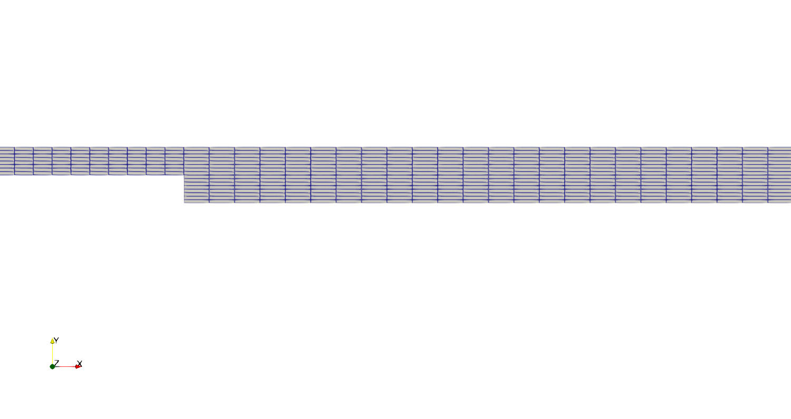

After four refinement steps :

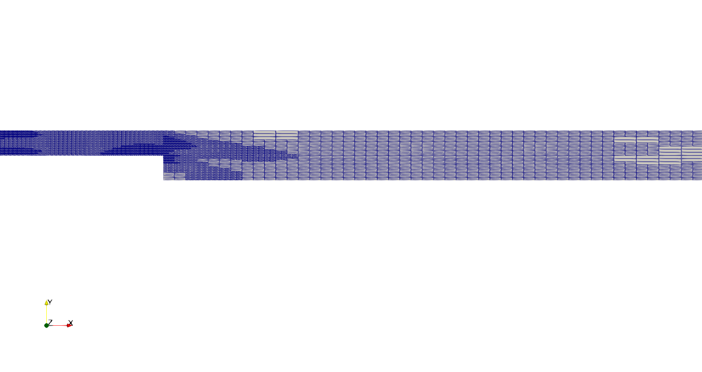

After six refinement steps :

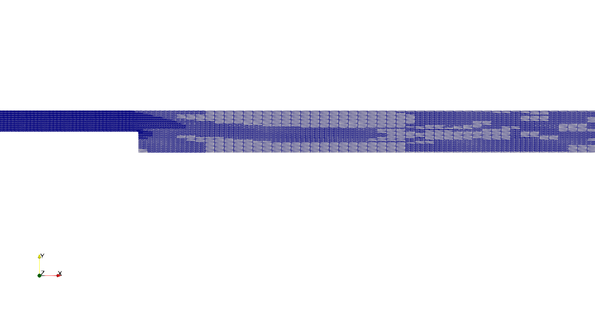

FEM
~~~

In first approximation, the interpolation order has been set to one for both velocity and pressure.

.. code-block:: text

	subsection FEM
	  set pressure order = 1
	  set velocity order = 1
	end

Boundary Conditions
~~~~~~~~~~~~~~~~~~~

As shown in the figure, three different boundary conditions (or boundary IDs) are necessary to define this particular problem.

.. code-block:: text

	subsection boundary conditions
	  set number         = 2
	  set time dependent = false
	  subsection bc 0
		set type = noslip
	  end
	  subsection bc 1
		set type = function
		subsection u
		  set Function expression = 1
		end
		subsection v
		  set Function expression = 0
		end
		subsection w
		  set Function expression = 0
		end
	  end
	end
	
First, ``subsection bc 0`` represents a Dirichlet boundary condition (or ``noslip``) at each wall where :math:`\mathbf{u}=\mathbf{0}.` The boundary condition at the inlet is represented as a uniform unit flow such that :math:`[u,v,w] = [1,0,0]`. In that case, the parameter ``type = function`` is used in ``subsection bc 1``. With this parameter, :math:`u`, :math:`v` and :math:`w` can be set numerically and independantly. The outflow boundary condition is considered as a natural boundary condition (also known as the *do nothing* boundary condition), since we can consider the outlet very far from the step. In fact, this condtion specfies :math:`p \rightarrow 0` or that the traction on the fluid equals zero. In *Lethe*, this particular boundary condition is automatically used when nothing is assigned to a specific ID  (in our case, there is none at the outlet).

Non-linear Solver
~~~~~~~~~~~~~~~~~

The ``newton`` non-linear solver is used with a relatively high ``tolerance``, since convergence can be hard to obtain at high Reynolds number.

.. code-block:: text

	subsection non-linear solver
	  set solver = newton
	  set verbosity               = verbose
	  set tolerance               = 1e-4
	  set max iterations          = 10
	end

Linear Solver
~~~~~~~~~~~~~

For :math:`Re \leq 800`, standard parameters are suitable to achieve convergence.

.. code-block:: text

	subsection linear solver
	  set verbosity               = verbose
	  set method                  = gmres
	  set max iters               = 10000
	  set relative residual       = 1e-4
	  set minimum residual        = 1e-7
	  set ilu preconditioner fill = 1
	  set ilu preconditioner absolute tolerance = 1e-12
	  set ilu preconditioner relative tolerance = 1.00
	end
	
For :math:`Re>800`, however, it is often necessary to set ``ilu precondtionner fill = 2`` in order to save calculation time. Also, adjusting ``max krylov vectors = 200`` can help to reach convergence.

.. code-block:: text

	subsection linear solver
	  set verbosity               = verbose
	  set method                  = gmres
	  set max iters               = 10000
	  set relative residual       = 1e-4
	  set minimum residual        = 1e-7
	  set ilu preconditioner fill = 2
	  set ilu preconditioner absolute tolerance = 1e-12
	  set ilu preconditioner relative tolerance = 1.00
	  set max krylov vectors = 200
	end
	
Running the Simulations
-----------------------

The simulation can be executed using the following command (assuming that the solver's location is in your PATH environement variable) :

.. code-block:: text

	gls_navier_stokes_2d Backward_facing_step.prm
	
However, mpi can be used to lower calculation time by using several CPUs :

.. code-block:: text

	mpirun -np j gls_navier_stokes_2d Backward_facing_step.prm
	
where ``j`` is the number of CPUs used.

Results and Discussion
----------------------

Low Reynolds Number (:math:`Re = 100`)
~~~~~~~~~~~~~~~~~~~~~~~~~~~~~~~~~~~~~~~

After opening the file ``backward_facing_step_output.pvd`` with Paraview, the following results are obtained.

For :math:`Re = 100` :

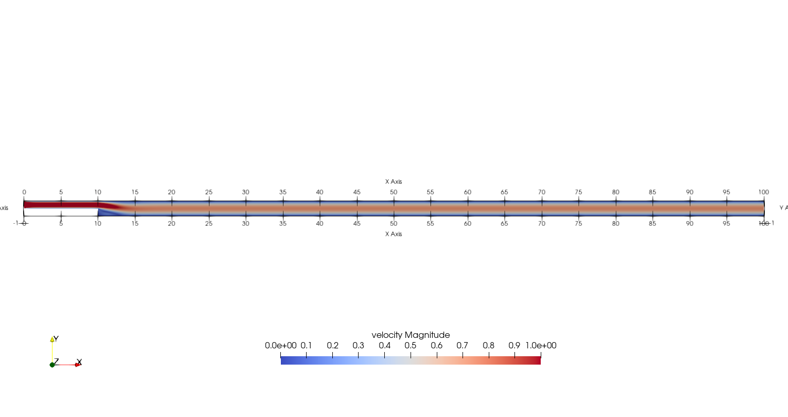

.. image:: image/Reynolds100_view2.png

It is possible to notice that there seems to be a lot of diffusion past the step. This phenomenon is coherent with what is known of the Navier-Stokes equations : the diffusivity term is inversely proportional to the Reynolds number. Most importantly, a small eddy adjacent to the step is clearly observable. It is also visually noticeable that :math:`x_r \simeq 2.9` (:math:`x \simeq 12.9`). With the Python module Pyvista, raw simulation data can be extracted (from the .vtu files) and this data can be used to compute :math:`x_r` numerically. This can be calculated with the following equation. 

.. math::
	\left[ \frac{du}{dy} \right]_{y=0} = 0

which can be resolved with a bisection algorithm or with any other appropriate numerical approach. By doing this step for each successively refined mesh, a mesh refinement analysis can be achieved.

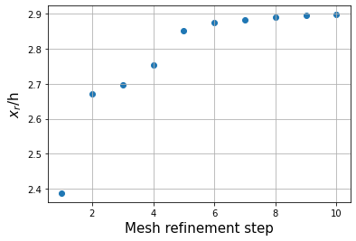

where the final value of :math:`x_r` is :math:`2.898`. We notice from the graph that convergence is obtained quite quickly : the following figure illustrates the evolution of the relative error as the number of elements increases.

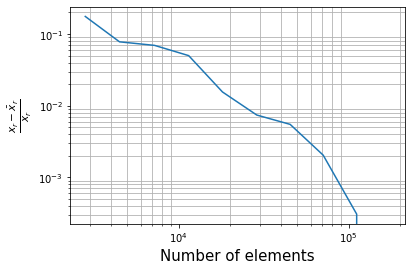

Higher Reynolds Number (:math:`Re = 800` and :math:`Re=1000`)
~~~~~~~~~~~~~~~~~~~~~~~~~~~~~~~~~~~~~~~~~~~~~~~~~~~~~~~~~~~~~

In a similar way as we did in the precedent subsection, the solution for :math:`Re = 800` and :math:`Re = 1000` can be obtained.

For :math:`Re = 800` :

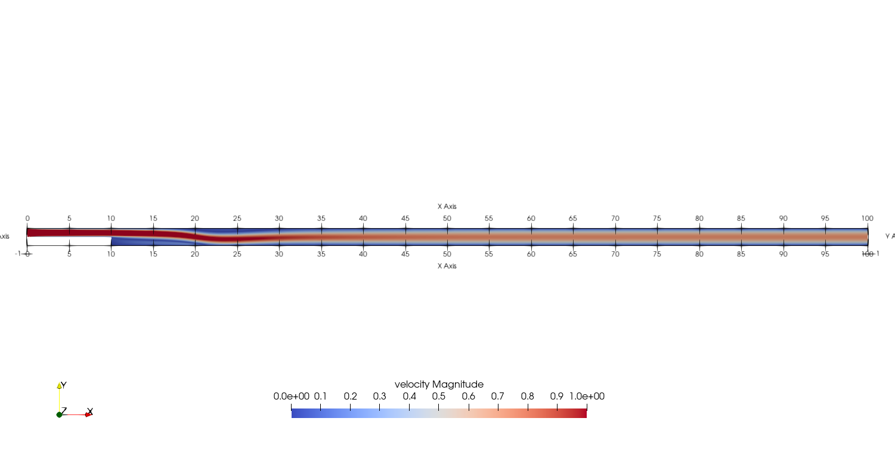

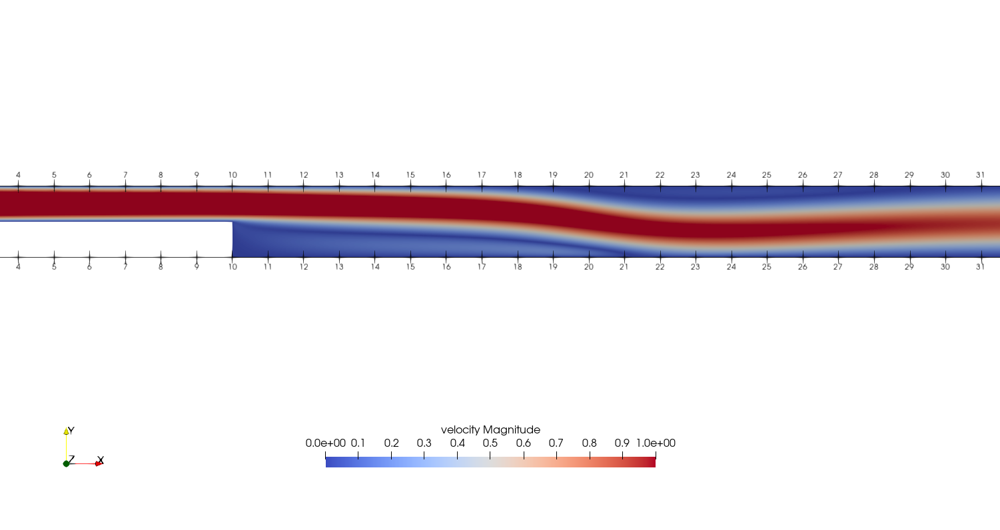

and for :math:`Re = 1000` : 

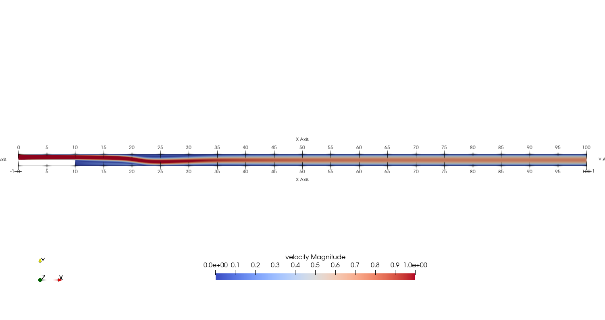

.. image:: image/Reynolds1000_view2.png

In the contrary of what we saw in the :math:`Re = 100` case, it is clearly noticeable that there is much less diffusion within the flow. This is once more coherent with the theory. The same eddy as mentionned in the previous section is still present, but grows as the Reynolds number is increased. Furthermore, a second principal eddy can be seen adjacent to the top wall in the range :math:`x \in [19,32]` for :math:`Re = 800` and :math:`x \in [20,35]` for :math:`Re = 1000`. This "oscillating flow" caracteristic is expected of a higher Reynolds flow such as this one. Finally, the :math:`x_r` variable is evaluated visually and respectively at :math:`x_r \simeq 11.0` (:math:`x \simeq 21.0`) and :math:`x_r \simeq 12.0` (:math:`x \simeq 22.0`).

For :math:`Re = 800`, the mesh refinement analysis according to :math:`x_r` is as follows :

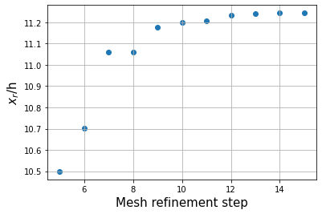

Without any surprises, we can easily observe that it is more difficult to converge with a high Reynolds Number (more refinement step are required to reach the desired accuracy). Furthermore, the final value of :math:`x_r` is :math:`11.244`. 

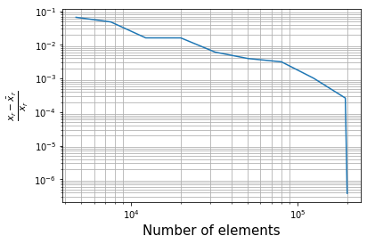

The error analysis graph shows that the number of elements needs to be approximately doubled in order to obtain the same level of precision as the :math:`Re = 100` case (:math:`\sim 2 \times 10^5` elements).

Validation and Comparison
-------------------------

Reattachment Length
~~~~~~~~~~~~~~~~~~~

In this section, the solutions obtained with *Lethe* will be compared with data that can be found in the scientific litterature (Erturk (2008) [1], Armaly and al. (1983) [2], Velivelli and Bryden (2015) [3]). Several studies include datasets of :math:`x_r = f(Re)` (reattachment length) either analytically or numerically. The next figure illustrates some of them.

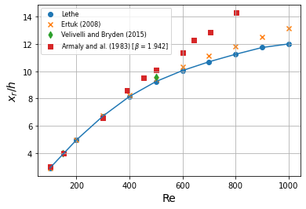

First, the results provided by *Lethe* are identical or so to all of the three selected studies for low Reynolds numbers (:math:`Re \leq 400`). After that point, both results form *Lethe* and from Erturk (2008) [1] diverge from the experimental data of Armaly and al. (1983) [2]. According to [1], this error is due to 3D effects that are more potent as the flow becomes more and more turbulent. There is also a less signficant but clearly noticeable error between *Lethe* and Erturk [1] : the fact that the tolerances have been set quite high in the parameter file might have underestimated the reattachment length. Also, first order elements have been used throughout the whole simulation process. Using second order elements for velocity, for instance, could yield better results for higher Reynolds number. The following table illustrates the error at :math:`Re = 600` for first and second order velocity elements.

+---------------+----------------+----------------+
| Order         | :math:`x_r`    | Error          |
+===============+================+================+
| Order 1       | :math:`10.051` | :math:`2.88` % |
+---------------+----------------+----------------+
| Order 2       | :math:`10.125` | :math:`2.16` % |       
+---------------+----------------+----------------+
| Erturk (2008) | :math:`10.349` | N/A            |
+---------------+----------------+----------------+

Velocity distribution
~~~~~~~~~~~~~~~~~~~~~

To validate the quality of the mesh/geometry as well as, it is interesting to compare the obtained velocity destributions with analytical data.

Velocity at the step (:math:`x = 10`) :

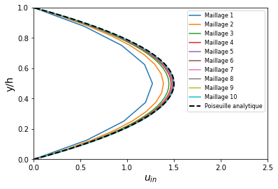

Velocity at the outlet (:math:`x = 100`) :

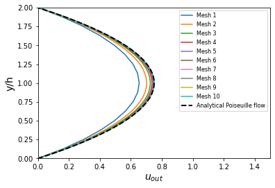

Possibilites for Extension
--------------------------

- **Validate with a 3D geometry** : Since experimental data takes into account 3D effects, it would be interesting to compare numerical data to experimental results.
- **Use second order elements for higher Reynolds simulations** : Using second order elements can improve accuracy for more turbulent flows.
- **Validate for even higher Reynolds numbers** : Some studies compute their simulations up to :math:`Re = 3000`. It would also be interesting to visualize the passage to a transitional and even turbulent flow.

References
----------

[1] Erturk, E. (2008). Numerical solutions of 2-d steady incompressible flow over a backward-facing step, part i: high reynolds number solutions. Computers and Fluids, 37(6), 633–655. https://doi.org/10.1016/j.compfluid.2007.09.003

[2] Armaly, B. F., Durst, F., Pereira, J. C. F., &amp; Schönung B. (1983). Experimental and theoretical investigation of backward-facing step flow. Journal of Fluid Mechanics, 127(-1), 473–473. https://doi.org/10.1017/S0022112083002839

[3] Velivelli, A. C., &amp; Bryden, K. M. (2015). Domain decomposition based coupling between the lattice boltzmann method and traditional cfd methods – part ii: numerical solution to the backward facing step flow. Advances in Engineering Software, 82(C). https://doi.org/10.1016/j.advengsoft.2014.11.006

