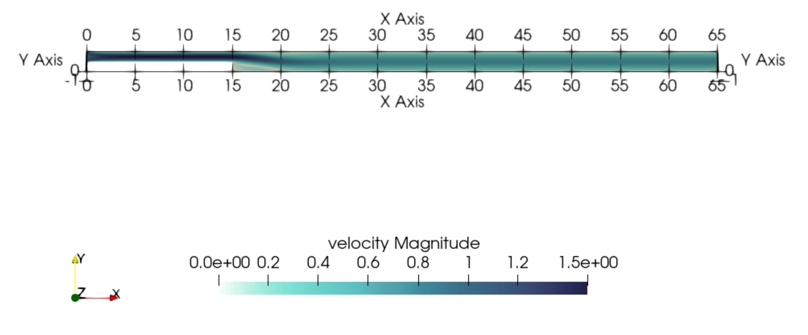

====================================
Flow past a Backward-Facing Step
====================================

--------
Features
--------

- Solver: ``lethe-fluid`` (with Q1-Q1)
- Steady and pseudo steady state solution
- Comparison with benchmark solutions
- Mesh refinement and error analysis

----------------------------
Files Used in This Example
----------------------------

All files mentioned below are located in the example's folder (``examples/incompressible-flow/2d-backward-facing-step``).

- Geometry file: ``backward-facing-step.geo``
- Mesh file: ``backward-facing-step.msh``
- Parameter file for the base case (:math:`Re < 700`): ``Reynolds100-600.prm``
- Parameter file for the higher-Reynolds case (:math:`Re \geq 700`): ``Reynolds700-1000.prm``
- Postprocessing Python script for computing the reattachment length: ``bisection.py``
- Postprocessing Python script for computing velocity distributions at inlet and outlet: ``velocity_distribution.py``

-----------------------
Description of the Case
-----------------------

In this example, a bidimensional flow goes past a backward-facing step. The flow enters from the left inlet and separates from the bottom wall at the step, and then reattaches to it further downstream at a distance :math:`x_r` from the step.  

.. image:: image/backward-facing-step-description.png

The backward-facing step problem is a classical computational fluid dynamics problem. The fact that it features a non-trivial solution while maintaining simple geometry and boundary conditions makes this problem a good candidate for validation purposes as well as to test the robustness of a given CFD method. First, the basic parameters used to solve the backward-facing step problem will be exposed. A solution to several Reynolds numbers (from :math:`Re = 100` to :math:`Re =1000`) will then be presented and compared to experimental and numerical data. A mesh adaptation and numerical error analysis will be carried on.

--------------
Parameter File
--------------

The following subsections show the different parameters used in the simulations. While they all remain more or less the same throughout the various cases, some of them change as the Reynolds number is increased.

Simulation Control
~~~~~~~~~~~~~~~~~~

For :math:`Re < 700`, the solution is stable enough to be computed in steady state by setting ``method`` to ``steady``: 

.. code-block:: text

    subsection simulation control
      set method            = steady
      set number mesh adapt = 10
      set output name       = backward_facing_step_output
      set output frequency  = 1
      set subdivision       = 1
      set output boundaries = false
    end
	
A mesh refinement analysis can be done with ``set number mesh adapt = 10``. By starting from a very coarse mesh and by dynamically refining the mesh at least 10 times, asymptotic convergence can be clearly observed.

However, for :math:`Re \geq 700`, convergence can be quite difficult to obtain while doing a steady state simulation. In fact, as the Reynolds number increases, the problem becomes progressively stiffer to a point where the ``steady`` solver ultimately fails. With that in mind, the case can be solved as a transient problem until the steady state solution is obtained. This can be achieved with the ``method = steady_bdf`` parameter.

.. code-block:: text

    subsection simulation control
      set method                       = steady_bdf
      set stop tolerance               = 1e-6
      set time step                    = 0.005
      set adapt                        = true
      set max cfl                      = 1e6
      set adaptative time step scaling = 1.2
      set number mesh adapt            = 0
      set output name                  = backward_facing_step_output
      set output frequency             = 1
      set subdivision                  = 1
      set output boundaries            = false
    end
  
``stop tolerance``, ``time step``, ``adapt``, ``max cfl`` and ``adaptive time step scaling`` are parameters that control the pseudo-steady simulation. In this case, choosing ``stop tolerance = 1e-6`` ensures that the simulation reaches steady state while keeping the number of time iterations to a minimum. Moreover, one can notice a very high value for the ``max cfl``; however, since it is used with ``adaptative time step scaling`` (and since *Lethe* is an implicit solver), even a very high value of the CFL does not compromise the results.

Physical Properties
~~~~~~~~~~~~~~~~~~~

In this problem, the Reynolds number is defined as follows: 

.. math::
	Re_{D_h} = \frac{u D_h}{\nu} = \frac{2uh}{\nu}
	
where :math:`h` is the step height, :math:`D_h = 2h` is the hydraulic diameter and :math:`\nu` the kinematic viscosity.

In addition, unit values of :math:`u` and :math:`h` are chosen in the goal of obtaining an adimensional problem.

.. math::
	Re_{D_h} = f(\nu) = \frac{2}{\nu}
	
Consequently, the physical properties are defined as follows : 

.. code-block:: text
	
    subsection physical properties
      set number of fluids = 1
      subsection fluid 0
        set kinematic viscosity = 0.01 # Re_h=2/nu
      end
    end
	
.. note::
	The ``kinematic viscosity`` is the only parameter that changes coherently with :math:`Re` (for example, to obtain :math:`Re = 100`, ``kinematic viscosity = 0.02`` can be used as input). 

Mesh
~~~~

.. code-block:: text

    subsection mesh
      set type      = gmsh
      set file name = ../backward-facing-step.msh
    end
	
The mesh features quadrilateral elements as well as unit step and inlet heights (:math:`h_{in}=h=1`). In that direction, the expansion ratio has been set to :math:`\beta=\frac{h_{out}}{h_{in}}=2` throughout the entirety of the simulations. Also, the inlet and outlet lengths should be long enough that they allow the formation of a fully developed flow. Finally, since a ``gmsh`` mesh file is used, the initial mesh should be as coarse as possible, since these cells cannot be coarsened with the mesh adaptation algorithm.

Mesh Adaptation
~~~~~~~~~~~~~~~

In this example, the mesh adaptation algorithm is based on the Kelly error estimator applied on the velocity variable. This strategy is suitable here, since a fine mesh is required in the vicinity of the step while a coarser mesh is acceptable far way from it.

.. code-block:: text

    subsection mesh adaptation
      set variable            = velocity
      set type                = kelly
      set fraction refinement = 0.2
    end
	
For higher Reynolds number with adjoint time stepping, ``frequency = 5`` can be added to the above parameters in order to obtain a reasonable number of elements throughout the simulation. In this particular case, the mesh would be refined at every fifth time iteration.
	
Here is an example of mesh adaptation using the Kelly error estimator for :math:`Re = 100`:

Initial coarse mesh:

.. image:: image/0th-mesh.png

After four refinement steps:

.. image:: image/4th-mesh.png

After eight refinement steps:

.. image:: image/8th-mesh.png

FEM
~~~

In this example, the interpolation order has been set to one for both velocity and pressure.

.. code-block:: text

    subsection FEM
      set pressure order = 1
      set velocity order = 1
    end

Boundary Conditions
~~~~~~~~~~~~~~~~~~~

As presented in the description of the case (see figure above), three different boundary conditions (or boundary IDs) are necessary to define this particular problem.

.. code-block:: text

    subsection boundary conditions
      set number         = 2
      set time dependent = false
      subsection bc 0
        set type = noslip
      end
      subsection bc 1
        set type = function
        subsection u
          set Function expression = 1
        end
        subsection v
          set Function expression = 0
        end
        subsection w
          set Function expression = 0
        end
      end
    end
	
First, ``subsection bc 0`` represents a Dirichlet boundary condition (or ``noslip``) at each wall where :math:`\mathbf{u}=\mathbf{0}.` The boundary condition at the inlet is represented as a uniform unit flow such that :math:`[u,v,w] = [1,0,0]`. In that case, the parameter ``type = function`` is used in ``subsection bc 1``. With this parameter, :math:`u`, :math:`v` and :math:`w` can be set numerically and independently. The outflow boundary condition is considered a natural boundary condition (also known as the *do nothing* boundary condition) and it is used since we can consider the outlet to be very far from the step. In fact, this condition specifies :math:`p \rightarrow 0` or in other words, that the traction on the fluid equals zero. In *Lethe*, this particular boundary condition is automatically loaded when nothing is assigned to a specific ID  (in our case, there is none at the outlet).

Non-linear Solver
~~~~~~~~~~~~~~~~~

The ``newton`` non-linear solver is used with a medium ``tolerance``, since convergence can be hard to obtain for high Reynolds number.

.. code-block:: text

    subsection non-linear solver
      subsection fluid dynamics
        set verbosity      = verbose
        set tolerance      = 1e-6
        set max iterations = 10
      end
    end

Linear Solver
~~~~~~~~~~~~~

For :math:`Re < 700`, standard parameters are suitable to achieve convergence.

.. code-block:: text

    subsection linear solver
      subsection fluid dynamics
        set verbosity                             = verbose
        set method                                = gmres
        set max iters                             = 10000
        set relative residual                     = 1e-4
        set minimum residual                      = 1e-9
        set preconditioner                        = ilu
        set ilu preconditioner fill               = 2
        set ilu preconditioner absolute tolerance = 1e-12
        set ilu preconditioner relative tolerance = 1.00
      end
    end         
	
For :math:`Re \geq 700`, however, it is often necessary to set ``ilu precondtionner fill = 2`` in order to save calculation time. Also, adjusting ``max krylov vectors = 200`` can help to reach convergence.

.. code-block:: text

    subsection linear solver
      subsection fluid dynamics
        set verbosity                             = verbose
        set method                                = gmres
        set max iters                             = 10000
        set relative residual                     = 1e-4
        set minimum residual                      = 1e-9
        set preconditioner                        = ilu
        set ilu preconditioner fill               = 2
        set ilu preconditioner absolute tolerance = 1e-12
        set ilu preconditioner relative tolerance = 1.00
        set max krylov vectors                    = 200
      end
    end
	
.. tip::
	It is important to note that the ``minimum residual`` of the linear solver is smaller than the ``tolerance`` of the nonlinear solver. The reader can consult the `Parameters Guide <https://chaos-polymtl.github.io/lethe/documentation/parameters/cfd/linear_solver_control.html>`_ for more information.

-----------------------
Running the Simulations
-----------------------

The simulation can be executed using the following command (assuming that the solver's location is in your PATH environment variable):

.. code-block:: text
  :class: copy-button

  lethe-fluid 2D-backward-facing-step-steady.prm
	
However, mpi can be used to lower calculation time by using several CPUs (especially useful for pseudo-steady simulations) :

.. code-block:: text
  :class: copy-button

  mpirun -np j lethe-fluid 2D-backward-facing-step-steady.prm
	
where ``j`` is the number of CPUs used for the computations.

----------------------
Results and Discussion
----------------------

Low Reynolds Number (:math:`Re=100`)
~~~~~~~~~~~~~~~~~~~~~~~~~~~~~~~~~~~~

After opening the file ``backward_facing_step_output.pvd`` with Paraview, the following results are obtained.

For :math:`Re = 100` :

It is possible to notice that there seems to be a lot of diffusion past the step. This phenomenon is coherent with what is known of the Navier-Stokes equations: the diffusivity term is inversely proportional to the Reynolds number. Most importantly, a small eddy adjacent to the step is clearly observable. It is also visually noticeable that :math:`x_r \simeq 2.9` (:math:`x \simeq 17.9`). With the Python module `PyVista <https://docs.pyvista.org/>`_, raw simulation data can be extracted (from the .vtu files) and this data can be used to compute :math:`x_r` numerically. This can be calculated with the following equation. 

.. math::
	\left[ \frac{du}{dy} \right]_{y=0} = 0

which can be resolved with a bisection algorithm or with any other appropriate numerical approach. By doing this step for each successively refined mesh (10 meshes as specified by ``set number mesh adapt`` in the simulation control section), a mesh refinement analysis can be achieved.

.. image:: image/Reynolds100-mesh-refinement.png

where the final value of :math:`x_r` is :math:`2.893`. We notice from the graph that convergence is obtained quite quickly. In addition, the following figure illustrates the evolution of the relative error as the number of elements increases.

.. image:: image/Reynolds100-error-analysis.png

The reference value used in the error analysis is taken from Erturk (2008) `[1] <https://doi.org/10.1016/j.compfluid.2007.09.003>`_.

Higher Reynolds Number (:math:`Re=1000`)
~~~~~~~~~~~~~~~~~~~~~~~~~~~~~~~~~~~~~~~~

In a similar way as we did in the last subsection, the solution for :math:`Re = 1000` can be obtained.

For :math:`Re = 1000` : 

On the contrary of what we saw in the :math:`Re = 100` case, it is clearly noticeable that there is much less diffusion within the flow. This is once more coherent with the theory. The same eddy as mentioned in the previous section is still present, but grows as the Reynolds number is increased. Furthermore, a second principal eddy can be seen adjacent to the top wall in the range :math:`x \in [25,37]`. This "oscillating flow" characteristic is expected of a higher Reynolds flow such as this one. Finally, the :math:`x_r` variable is evaluated visually at :math:`x_r \simeq 12.5` (:math:`x \simeq 27.5`). By using the same Python code as before, we obtain :math:`x_r = 12.637` as a precise numerical result.

-------------------------
Validation and Comparison
-------------------------

Reattachment Length
~~~~~~~~~~~~~~~~~~~

In this section, the solutions obtained with Lethe are compared with data that can be found in the scientific literature (Erturk (2008) `[1] <https://doi.org/10.1016/j.compfluid.2007.09.003>`_, Armaly and al. (1983) `[2] <https://doi.org/10.1017/S0022112083002839>`_ and Velivelli and Bryden (2015) `[3] <https://doi.org/10.1016/j.advengsoft.2014.11.006>`_). Several studies include datasets of :math:`x_r/h = f(Re)` (reattachment length) either experimentally or numerically. The next figure illustrates some of them in comparison with *Lethe*.

First, the results provided by Lethe are identical or so to all of the three selected studies for low Reynolds numbers (:math:`Re \leq 400`). After that point, both results form *Lethe* and from Erturk (2008) `[1] <https://doi.org/10.1016/j.compfluid.2007.09.003>`_ diverge from the experimental data of Armaly and al. (1983) `[2] <https://doi.org/10.1017/S0022112083002839>`_. According to `[1] <https://doi.org/10.1016/j.compfluid.2007.09.003>`_, this error is due to 3D effects that are more potent as the flow becomes more and more turbulent. Furthermore, there is also a less significant but clearly noticeable error between *Lethe* and Erturk (2008) `[1] <https://doi.org/10.1016/j.compfluid.2007.09.003>`_: the fact that certain tolerances have been set higher for higher Reynolds number cases might have underestimated the reattachment length. Also, first order elements have been used throughout the whole simulation process. Using second order elements for velocity, for instance, could yield better results for higher Reynolds numbers, however, at a higher computational cost. The following table illustrates the error at :math:`Re = 600` for first and second order velocity elements.

+---------------+----------------+----------------+
| Order         | :math:`x_r/h`  | Error          |
+===============+================+================+
| Order 1       | :math:`10.219` | :math:`1.26` % |
+---------------+----------------+----------------+
| Order 2       | :math:`10.250` | :math:`0.96` % |       
+---------------+----------------+----------------+
| Erturk (2008) | :math:`10.349` | N/A            |
+---------------+----------------+----------------+

Velocity Distribution
~~~~~~~~~~~~~~~~~~~~~

To validate the quality of the mesh/geometry as well, it is interesting to compare the obtained velocity distributions with analytical data. The following figures illustrate the velocity distributions at the outlet (right wall) in comparison to the analytical solution.

For :math:`Re = 100`:

For :math:`Re = 1000`:

.. image:: image/Reynolds1000-poiseuille.png

For :math:`Re = 1000`, an error in the velocity profile is visually noticeable. We can assume that the outlet is not long enough for the flow to be fully developed at its end, meaning that there is still traction on the fluid. Consequently, increasing this length is essential in order to be able to validate cases where :math:`Re \geq 1000`.

---------------------------
Possibilities for Extension
---------------------------

- **Validate with a 3D geometry/mesh**: Since experimental data takes into account 3D effects, it would be interesting to compare numerical data to experimental results.
- **Use second order elements for higher Reynolds simulations**: Using second order elements can improve accuracy for more turbulent flows. Also, it can be very powerful in this particular example, since quadratic elements can theoretically interpolate *Poiseuille* flows with genuinely no numerical error. Consequently, the method can yield incredibly precise results while maintaining a very coarse mesh far from the step. 
- **Validate for even higher Reynolds numbers**: Some studies compute their simulations up to :math:`Re = 3000`. It would also be interesting to visualize the formation of more eddies further downstream of the step.

----------
References
----------

`[1] <https://doi.org/10.1016/j.compfluid.2007.09.003>`_ E. Erturk, “Numerical solutions of 2-D steady incompressible flow over a backward-facing step, Part I: High Reynolds number solutions,” *Comput. Fluids*, vol. 37, no. 6, pp. 633–655, Jul. 2008, doi: 10.1016/j.compfluid.2007.09.003.

`[2] <https://doi.org/10.1017/S0022112083002839>`_ B. F. Armaly, F. Durst, J. C. F. Pereira, and B. Schönung, “Experimental and theoretical investigation of backward-facing step flow,” *J. Fluid Mech.*, vol. 127, pp. 473–496, Feb. 1983, doi: 10.1017/S0022112083002839.

`[3] <https://doi.org/10.1016/j.advengsoft.2014.11.006>`_ A. C. Velivelli and K. M. Bryden, “Domain decomposition based coupling between the lattice Boltzmann method and traditional CFD methods – Part II: Numerical solution to the backward facing step flow,” *Adv. Eng. Softw.*, vol. 82, pp. 65–74, Apr. 2015, doi: 10.1016/j.advengsoft.2014.11.006.

