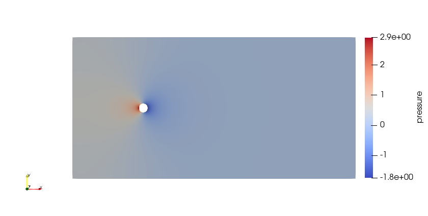

======================================
2D Flow around a Cylinder
======================================

This is the third Lethe exampl and it corresponds to a flow around a fixed cylinder. This is a classical problem studied in fluid mechanics. This example introduces several important features supported by Lethe.

Features
---------

- Solver: ``gls_navier_stokes_2d`` (with Q1-Q1) 
- Steady-state problem
- Displays how to import a gmsh file
- Displays how to set a manifold
- Displays how to specify an initial condition

Location of the example
------------------------

- Parameter file: ``/examples/incompressible_flow/2d_flow_around_cylinder/cylinder.prm``
- Mesh file: ``/examples/incompressible_flow/2d_flow_around_cylinder/cylinder_structured.msh``
- Geometry file: ``/examples/incompressible_flow/2d_flow_around_cylinder/cylinder_structured.geo``

Description of the case
-----------------------
We simulate the flow around a fixed cylinder with a constant upstream fluid velocity. The following schematic describes the geometry with its relevant quantities (taken form the article by Blais et al. [1]):

.. image:: images/geometry_description.png
    :alt: The geometry
    :align: center
    :name: geometry_description

Parameter file
--------------

Only the subsections of the parameter file that change significantly in comparison to the first two examples are explained in this section.

Mesh
~~~~~

Lethe supports the use of existing mesh files:

.. code-block:: text

  #---------------------------------------------------
  # Mesh
  #---------------------------------------------------
  subsection mesh
      set type                 = gmsh
      set file name            = cylinder_structured.msh
  end

The ``type`` specifies the mesh format used, in this case  we have ``gmsh`` which corresponds to a file generated by `Gmsh <https://gmsh.info/#Download>`_. The ``set file name`` command specifies the path to the file. In this case, we assume that the parameter and mesh files are in the same location.  The ``.geo`` used to generate the gmsh mesh is also provided as a reference.

Manifolds
~~~~~~~~~

All the deal.II meshes supported by Lethe that correspond to the `GridGenerator <https://www.dealii.org/current/doxygen/deal.II/namespaceGridGenerator.html>`_ class, attach by default manifolds to meshes when needed. However, if another type of mesh is used in Lethe, it is possible to attach manifolds adding a section to the parameter file that looks as follows:

.. code-block:: text

  # --------------------------------------------------
  # Manifolds
  #---------------------------------------------------
  subsection manifolds
    set number                  = 1
      subsection manifold 0
          set id                = 0
          set type              = spherical
          set arg1              = 8
          set arg2              = 8
      end
  end

First the number of manifolds is specified by the ``set number`` command. Then a subsection for each of the manifolds is created starting with the manifold 0. The boundary ``id`` is in this case set to ``0`` as we want to set a cylinder manifold and this is the corresponding id in this example. Then the ``type`` of the manifold is specified. In Lethe, there are two types supported:

* ``spherical`` manifold: The former can be used to describe any sphere, circle, hypesphere or hyperdisc in two or three dimensions and requires as arguments two or three geometrical locations depending on the dimension, that are used to create the circle center where the manifold will be build. In this example we set ``arg1`` and ``arg2`` to ``8``. 

* ``iges`` manifold corresponding to a CAD geometry: the last two lines of the manifold 0 subsection are replaced by the following command ``set cad file = file_name.iges`` where the path to the cad file is specified. 

.. note::
    For more information about manifolds and the reasons behind them, we invite you to read the documentation page of deal.II: `Manifold description for triangulations <https://www.dealii.org/developer/doxygen/deal.II/group__manifold.html>`_.

Initial conditions
~~~~~~~~~~~~~~~~~~
Despite this problem being a steady-state problem, one know strategy to improve convergence is to set a coherent initial condition. In Lethe, this can be achieved by the initial conditions subsection: 

.. code-block:: text

    subsection initial conditions
        set type = nodal
        subsection uvwp
            set Function expression = 1; 0; 0
        end
    end

In this case we use the ``nodal`` initial condition and the ``subsection uvwp`` allows the description of a velocity-pressure vector-valued function. It can be seen that the individual components of the function are separated by semicolons in the ``set Function expression``. In this case, the velocity in the x-direction is set to 1, in the y-direction is set to 0, and the pressure is set to 0. If the problem was in three dimensions, four values should be specified, velocity in x, y and z and the pressure.

Boundary conditions
~~~~~~~~~~~~~~~~~~~~
In this section, we specify the boundary conditions taking into account the IDs presented in the following schematic:

.. image:: images/geometry_bc.png
    :alt: The boundary conditions
    :align: center
    :name: geometry_bc

.. code-block:: text

    subsection boundary conditions
        set number                  = 3
        subsection bc 0
            set type              = noslip
        end
        subsection bc 1
            set type              = function
            subsection u
                set Function expression = 1
            end
            subsection v
                set Function expression = 0
            end
            subsection w
                set Function expression = 0
            end
        end
        subsection bc 2
            set type              = slip
        end
    end

* ``bc 0`` identifies the cylinder where we apply ``noslip`` boundary conditions on its walls. This leads to a velocity of 0 for the fluid directly in contact with the walls of the cylinder.
* ``bc 1`` determines the flow of the fluid from the left wall. As mentioned before, the fluid is moving in the x-direction and therefore its boundary condition is defined with a function having a ``u`` velocity equals to 1. The rest of the velocity components are set to 0.
* ``bc2`` is applied at the top and bottom walls. This condition allows the simulation to be performed in a finite sized domain. In real life, the cylinder would be placed in a relatively infinite domain. Using ``slip`` condition, we assume that the fluid cannot go out in the normal direction, but that it can still flow from left to right without friction. Thus, the walls have no effect on the flow of the fluid.

.. note::
    An implicit fourth boundary condition is implemented on the right wall which represents the outlet of the flow. We do not specify anything explicitly, because this corresponds to a natural boundary condition where the pressure becomes close to 0.

Running the simulation
----------------------
Launching the simulation is as simple as specifying the executable name and the parameter file. Assuming that the ``gls_navier_stokes_2d`` executable is within your path, the simulation can be launched by typing:

.. code-block:: text

  gls_navier_stokes_2d cylinder.prm

Lethe will generate a number of files. The most important one bears the extension ``.pvd``. It can be read by popular visualization programs such as `Paraview <https://www.paraview.org/>`_. 

Results
-------

Using Paraview the following steady-state velocity and pressure profiles can be visualized:

.. image:: images/velocity.png
    :alt: Velocity profile
    :align: center
    :name: velocity

In one hand, from the velocity distribution, we notice how the velocity of the fluid is 0 at the boundaries of the cylinder and how it increases gradually if we move further away from it. On the other hand, the pressure difference between the inlet and outlet is visible and we can see how the pressure is near to 0 close to the outlet.

In addition to these profiles, it is possible to calculate the perpendicular and parallel forces acting on the cylinder and compare the values with the literature. 

Possibilities for extension
----------------------------

References
----------
[1] Blais, B., Lassaigne, M., Goniva, C., Fradette, L., & Bertrand, F. (2016). A semi-implicit immersed boundary method and its application to viscous mixing. Comput. Chem. Eng., 85, 136-146.