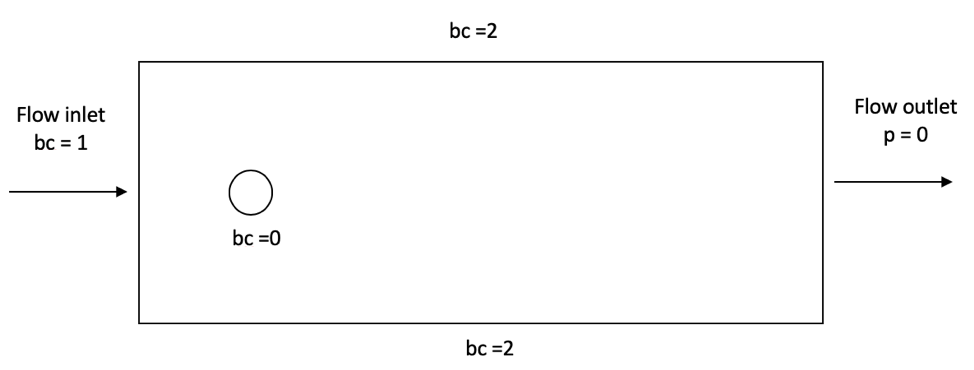
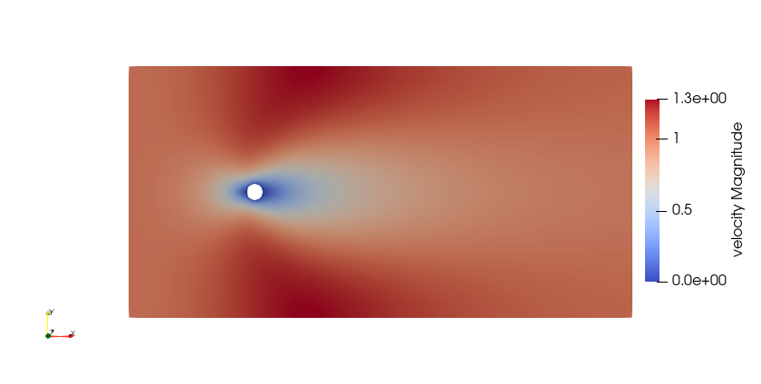

======================================
2D Flow around a cylinder
======================================

In this example, a flow is passing across a fixed cylinder. The velocity profile of the flow is simulated. The parameter file used is ``cylinder.prm``. This example can be solved using the ``gls_navier_stokes_2d`` solver.

The following schematic describes the simulation.

* bc = 0 (No slip boundary condition)
* bc = 1 (u = 1; flow in the x-direction)
* bc = 2 (Slip boundary condition)

Initial conditions
------------------
The initial condition implemented describes the movement of the flow in the x-direction.

.. code-block:: text

    subsection initial conditions
        set type = nodal
        subsection uvwp
            set Function expression = 1; 0; 0
        end
    end

The ``subsection uvwp`` allows the description of a vector-valued function representing the velocity in the x-direction where the individual components of the velocity are separated by semicolons in the ``set Function expression``.

Mesh
----
For the mesh, the ``gmsh`` option was chosen as which requires the input of a ``.msh`` file generated by `Gmsh <https://gmsh.info/#Download>`_.

.. code-block:: text

    subsection mesh
        set type                 = gmsh
        set file name            = cylinder_structured.msh
    end

The ``.msh`` file can be found in the same folder where the parameter file was obtained. The ``set file name`` includes the path of the file to be used, however since in this case both the parameter and the mesh files are located in the same folder, no path needs to be identified.

Boundary conditions
-------------------
In this section, we mainly have 3 boundary conditions:

* ``bc 0`` identifies the cylinder where we apply ``noslip`` boundary conditions on its walls. This leads to a velocity of 0 for the fluid directly in contact with the walls of the cylinder.
* ``bc 1`` determines the flow of the fluid from the left wall. As mentioned before, the fluid is moving in the x-direction and therefore its boundary condition is defined with a function having a ``u`` velocity equals to 1.
* ``bc2`` is applied at the top and bottom walls. This condition allows the simulation to be performed in a finite sized domain. In real life, the cylinder would be placed in a relatively infinite domain. Using ``slip`` condition, we assume that the fluid cannot go out in the normal direction, but that it can still flow from left to right without friction. Thus, the walls have no effect of the flow of the fluid.

.. code-block:: text

    subsection boundary conditions
        set number                  = 3
        subsection bc 0
            set type              = noslip
        end
        subsection bc 1
            set type              = function
            subsection u
                set Function expression = 1
            end
            subsection v
                set Function expression = 0
            end
            subsection w
                set Function expression = 0
            end
        end
        subsection bc 2
            set type              = slip
        end
    end

An implied fourth boundary condition is implemented on the right wall which represents the outlet of the flow. We do not apply anything in this region which leads to a natural boundary condition where the pressure becomes close to 0.

Results
-------
The results obtained are represented in what follows. From the velocity distribution, we notice how the velocity of the fluid is 0 at the boundaries of the cylinder and how it increases gradually the further away from the cylinder the fluid is.

The pressure is also visualized. The pressure difference between the inlet and outlet is visible and we can see how the pressure nears a value of 0 the close to the outlet.

.. image:: images/pressure.png
    :alt: Pressure profile
    :align: center
    :name: pressure