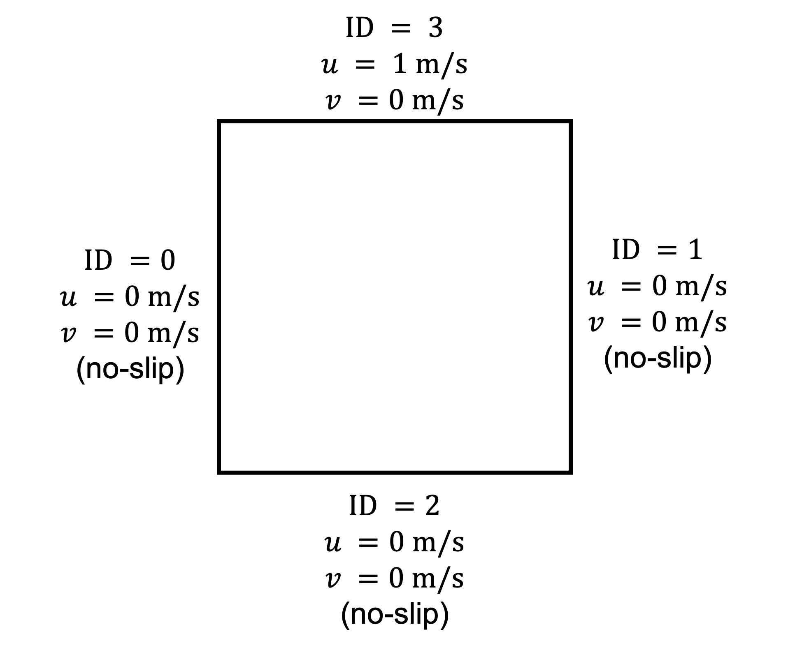
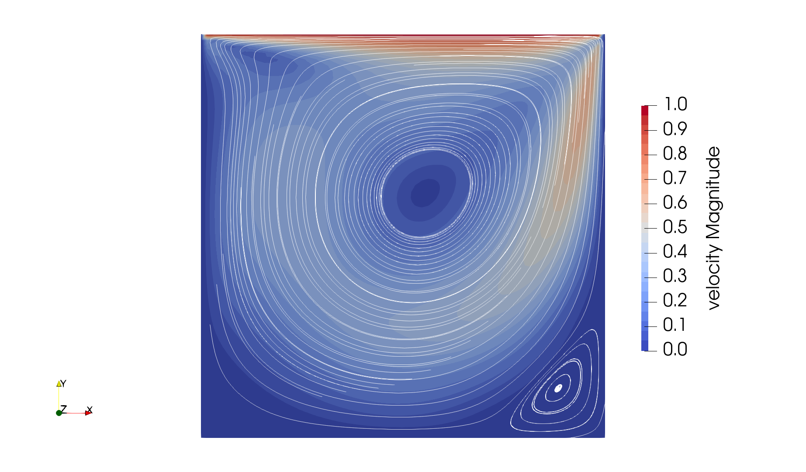
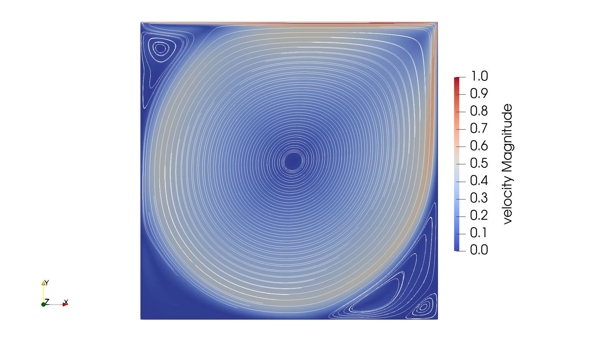
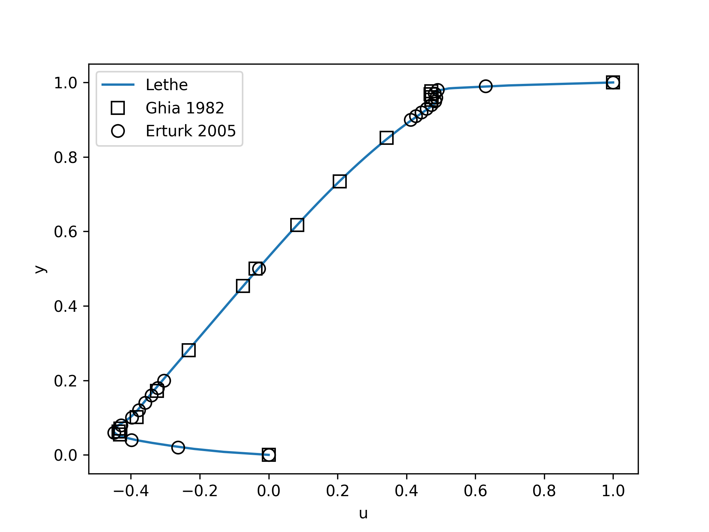
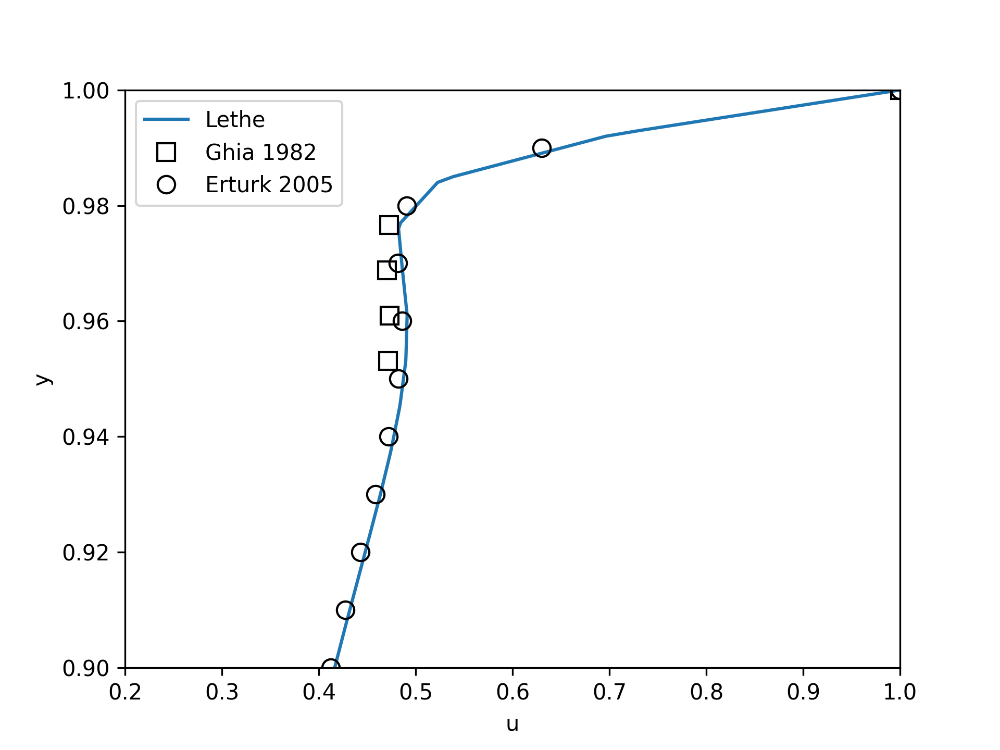

==================================
Lid-Driven Cavity Flow
==================================

This example showcases a classical fluid mechanics problem, the lid-driven cavity. This example also introduces the concept of parameter files to parametrize Lethe simulations.

----------------------------------
Features
----------------------------------

- Solvers: ``lethe-fluid`` (with Q1-Q1) or  ``lethe-fluid-block`` (with Q2-Q1)
- Steady-state problem
- Displays the use of adjoint time-stepping for steady-state problems

----------------------------
Files Used in This Example
----------------------------

All files mentioned below are located in the example's folder (``examples/incompressible-flow/2d-lid-driven-cavity``).

- Base case parameter file (:math:`Re=400`): ``cavity.prm``
- Experimental data file from Ghia `et al.` (1982) [#ghia1982]_: ``ref-2d-ghia-u.txt``
- Experimental data file from Erturk `et al.` (2005) [#erturk2005]_: ``ref-2d-erturk-u.txt``
- Higher-Reynolds case parameter file (:math:`Re=7500`): ``Reynolds_7500/cavity.prm``
- Postprocessing Python script for the :math:`Re=400` case: ``post_process_Reynolds_400.py``
- Postprocessing Python script for the :math:`Re=7500` case: ``Reynolds_7500/post_process_Reynolds_7500.py``

-----------------------
Description of the Case
-----------------------

The lid-driven cavity is a classical fluid dynamics problem. It consists of a flow in an enclosed cavity, where one of the walls (in this example, the top wall) is put in motion at a constant tangential velocity. This case is often used to benchmark the capacity of CFD software because of the simplicity of its geometry and the availability of multiple reference results over a large range of Reynolds numbers. In this example, we investigate this problem in 2D, but simulating this case in 3D would require only a few changes. The geometry and boundary conditions are illustrated in the following figure:

Only the upper wall boundary moves in the x direction with a constant velocity (:math:`u = 1 \ \text{m/s}`) while the other boundaries are static. We will discuss later in this example the meaning of the ID of the boundary conditions used in this figure.

We first investigate this case at a Reynolds number of 400 for which a steady-state solution can be easily obtained. Later, we will increase this Reynolds number to 7500 and leverage some of the advanced functionalities of Lethe to reach a steady-state solution. 

--------------
Parameter File
--------------

Lethe simulations are controlled by *parameter files* which possess the extension ``.prm``. This is the default text format of the ParameterHandler class of the deal.ii library from which Lethe derives. For more information on this class, you may refer to the `deal.II documentation <https://www.dealii.org/current/doxygen/deal.II/classParameterHandler.html>`_.

Parameter files are made of subsections which describe a portion of the simulation (e.g. mesh generation, physical properties, simulation control). In parameter files, lines starting with ``#`` are comments. Parameters are set using the following syntax:

.. code-block:: text

    set parameter name = value

The syntax is flexible. Parameters do not need to be specified in a specific order, but only within the subsection in which they belong. For a full list of the parameters within Lethe, we refer to the :doc:`parameter page <../../../parameters/parameters>`.

To set-up the lid-driven cavity case, we first need to establish the mesh used for the simulation.

Mesh
~~~~~

The ``mesh`` subsection specifies the computational grid:

.. code-block:: text

    subsection mesh
      set type               = dealii
      set grid type          = hyper_cube
      set grid arguments     = 0 : 1 : true
      set initial refinement = 6
    end

The ``type`` specifies the mesh format used. At the moment, Lethe supports two mesh formats: ``dealii`` and ``gmsh``. ``dealii`` meshes are in-situ generated meshes for simple geometries. The type of grid generated is specified by the ``grid type`` parameters and this grid is parametrized by it's ``grid arguments``. We refer to the documentation of the deal.ii `GridGenerator <https://www.dealii.org/current/doxygen/deal.II/namespaceGridGenerator.html>`_ for a detailed explanation of the available grids. 

Since the lid-driven cavity problem domain is a square, we use the ``hyper_cube`` ``grid_type``. The arguments of this grid type are the position of the bottom left corner, the position of the top right corner and the option to colorize the boundaries in order to give each of them a unique ID. The IDs will be used to set the boundary conditions on specific parts of the boundary of the domain. The ID given to each face was given in the graphical description of the case. If ``colorize`` option were set to false, all boundaries would have been given the ID ``0``.

It is a bit surprising that the position of the bottom left and the top right corner are specified by a single value. Since the geometry is a square, the position of the corner is specified using a single number, assuming that this identifies both the x and y value associated with that point. Other grid generators, such as the ``hyper_rectangle``, allow for more flexibility.

The last parameter specifies the ``initial refinement`` of the grid. Most deal.ii grid generators contain a minimal number of cells. For example, the ``hyper_cube`` mesh is made of a single cell. Indicating an ``initial refinement=6`` implies that the initial mesh is refined 6 times. In 2D, each cell is divided by 4 per refinement. Consequently, the final grid is made of :math:`2^{(2\cdot6)}=4096` cells.

Boundary Conditions
~~~~~~~~~~~~~~~~~~~

The ``boundary conditions`` subsection establishes the constraints on different parts of the domain:

.. code-block:: text

    subsection boundary conditions
      set number = 4
      subsection bc 0
        set id   = 0
        set type = noslip
      end
      subsection bc 1
        set id   = 1
        set type = noslip
      end
      subsection bc 2
        set id   = 2
        set type = noslip
      end
      subsection bc 3
        set id   = 3
        set type = function
        subsection u
          set Function expression = 1
        end
        subsection v
          set Function expression = 0
        end
      end
    end

First, the ``number`` of boundary conditions to be applied must be specified. For each boundary condition, the ``id`` of the boundary as well as its ``type`` must be specified. The left (``0``), right (``1``) and bottom (``2``) walls are static and, consequently, a ``noslip`` boundary condition can be used. This boundary condition imposes :math:`\mathbf{u} = [0,0]^T`. For the top wall, we use the ``function`` boundary type. This type of boundary condition allows us to define the value of the velocity components using ``Function expression``. We set :math:`u=1` and :math:`v=0`. Note that the ``Function expression`` supports writing complex mathematical expressions which may depend on the spatial coordinates (:math:`x,y,z`) and on time.

Physical Properties
~~~~~~~~~~~~~~~~~~~

For the base case, we wish to simulate the lid-driven cavity at a Reynolds number of 400. Since the characteristic dimension of the cavity is :math:`L=1` and the velocity of the top boundary is :math:`u=1`, the Reynolds number is :math:`Re=\frac{1}{\nu}` where :math:`\nu` is the kinematic viscosity. The kinematic viscosity is set by the ``physical properties`` subsection:

.. code-block:: text

    subsection physical properties
      subsection fluid 0
        set kinematic viscosity = 0.0025
      end
    end

By default, simulations only contain a single fluid which is labeled ``0``.

FEM Interpolation
~~~~~~~~~~~~~~~~~

Lethe supports the use of arbitrary interpolation order. The default solver for this case is ``lethe-fluid`` which uses a stabilized method and supports equal order interpolation. 

We specify the interpolation order for both pressure and velocity using the ``FEM`` subsection:

.. code-block:: text

    subsection FEM
      set velocity order = 1
      set pressure order = 1
    end

.. warning:: 
    An alternative would be to use the ``lethe-fluid-block`` solver; for `LBB <https://en.wikipedia.org/wiki/Ladyzhenskaya%E2%80%93Babu%C5%A1ka%E2%80%93Brezzi_condition>`_ stable elements must be used (e.g. Qn-Q(n-1)). Only the stabilized solver supports the use of equal order elements. 

Non-linear Solver
~~~~~~~~~~~~~~~~~

Lethe is an implicit CFD solver. Consequently, each time-step requires the solution of a non-linear system of equations. By default, Lethe uses a Newton solver for which a ``tolerance`` must be specified:

.. code-block:: text

    subsection non-linear solver
      subsection fluid dynamics
        set tolerance = 1e-8
        set verbosity = verbose
      end
    end

The ``verbosity`` option specifies if details about the non-linear solver steps (residual value and iteration number) will be printed out to the terminal. By setting it to ``verbose``, this information is printed out, whereas ``quiet`` would mute all outputs of the non-linear solver. We recommend to always set ``verbosity=verbose`` in order to monitor possible non-convergence of the solver.

Linear Solver
~~~~~~~~~~~~~

Each non-linear solver step requires the solution of a linear system of equations. Lethe has multiple options to parametrize its linear solvers, but here, we only enable its verbosity to monitor the number of iteration per time step and use the default parameters for the rest. 

.. note:: 
    A good thing to remember is that, generally, linear solver parameters control the robustness of the simulation.

.. code-block:: text

  subsection linear solver
    subsection fluid dynamics
      set method         = gmres
      set preconditioner = amg
      set verbosity      = verbose
    end
  end

Simulation Control
~~~~~~~~~~~~~~~~~~

The last subsection, which is generally the one we put at the top of the parameter files, is the ``simulation control``. In this example, it is only used to specify the name of the output files:

.. code-block:: text

  subsection simulation control
    set method      = steady 
    set output name = output_cavity
  end

-----------------------
Running the Simulations
-----------------------
Launching the simulation is as simple as specifying the executable name and the parameter file. Assuming that the ``lethe-fluid`` executable is within your path, the simulation can be launched by typing:

.. code-block:: text
  :class: copy-button

  lethe-fluid cavity.prm

Lethe will generate a number of files. The most important one bears the extension ``.pvd``. It can be read by popular visualization programs such as `Paraview <https://www.paraview.org/>`_.

-----------------------
Results and Discussion
-----------------------

Base Case (:math:`Re=400`)
~~~~~~~~~~~~~~~~~~~~~~~~~~

Using Paraview, the steady-state velocity profile and the streamlines can be visualized:

It is also very interesting to compare the results with those obtained in the literature. A python script provided in the example folder allows to compare the velocity profile along de y axis for :math:`x=0.5` with results from the literature. Using this script, the following resuts are obtained for ``initial refinement = 6``

.. image:: images/lethe-ghia-re-400-comparison.png
    :alt: re_400_comparison
    :align: center

We note that the agreement is perfect. This is not surprising, especially considering that these results were obtained at a relatively low Reynolds number.

.. note:: 
    The vtu files generated by Lethe are compressed archives. Consequently, they cannot be postprocessed directly. Although they can be easily post-processed using Paraview, it is sometimes necessary to be able to work with the raw data. The python library `PyVista <https://www.pyvista.org/>`_  allows us to do this.

Higher-Reynolds Case (:math:`Re=7500`)
~~~~~~~~~~~~~~~~~~~~~~~~~~~~~~~~~~~~~~

We now consider the case at a Reynolds number of 7500. At this value of the Reynolds number, the ``steady`` solver will generally not converge as the problem is too non-linear (or too stiff). A workaround for this issue is to use an adjoint time-stepping strategy. This strategy consists in transforming the steady-state problem into a transient problem and to use an increasingly large time-step to reach a steady-state solution. This method is called ``steady_bdf`` in Lethe.

It can be used by modifying the ``simulation control`` subsection:

.. code-block:: text

    subsection simulation control
      set method = steady_bdf
      set adapt = true
      # Maximum CFL value
      set max cfl = 1000
      # Tolerance at which the simulation is stopped
      set stop tolerance = 1e-10
      # Adaptative time step scaling
      set adaptative time step scaling = 1.05
      set time step = 0.001
    end

The ``adapt`` parameter allows dynamic time-step adaptation. This feature is also used in transient simulations to carry simulations at a constant CFL number. The ``max cfl`` controls the maximum value of the CFL reached during the simulation. Remember that Lethe is an implicit solver and, as such, can theoretically manage absurdly large values of the CFL. The ``stop-tolerance`` controls the initial tolerance of a time-step below which steady-state will be considered reached.  The ``time step`` controls the initial value of the time step and, finally, the ``adaptative time step scaling`` controls the rate of increase of the time step. The increase of the time step follows:

.. math::

  \Delta t_{n+1} = \alpha \Delta t_{n}

where :math:`\alpha` is the ``adaptative time step scaling`` .

We first carry out the simulations with an initial refinement 7. Using Paraview, the steady-state velocity profile and the streamlines can be visualized:

We see that new recirculation regions occur in the flow.

Using a similar python script, we can compare the results obtained with those from the literature. We note that there is quite a good agreement with the results from the literature, even in the top region where the velocity field changes abruptly.

Increasing the number of cells by a factor 4 (to :math:`\approx` 65k cells) allows for an even slightly better agreement.

.. image:: images/re-7500-mesh-8/lethe-ghia-re-7500-comparison.png
    :alt: re_7500_comparison_mesh_8
    :align: center

----------------------------
Possibilities for Extension
----------------------------

- **Validate at even higher Reynolds numbers:** The Erturk [#erturk2005]_ data within the example investigates this case up to a Reynolds number of 20000.  It is an interesting exercise to simulate these more complex cases using the adjoint time-stepping ``steady_bdf`` scheme.

- **High-order methods:** Lethe supports higher order interpolation. This can yield much better results with an equal number of degrees of freedom than traditional second-order (Q1-Q1) methods, especially at higher Reynolds numbers. 

- **Dynamic mesh adaptation:** Lethe supports dynamic mesh adaptation. Running this case with dynamic mesh adaptation could potentially yield better results.

-----------
References
-----------

.. [#ghia1982] \U. Ghia, K. N. Ghia, and C. T. Shin, “High-Re solutions for incompressible flow using the Navier-Stokes equations and a multigrid method,” *J. Comput. Phys.*, vol. 48, no. 3, pp. 387–411, Dec. 1982, doi: `10.1016/0021-9991(82)90058-4 <https://doi.org/10.1016/0021-9991(82)90058-4>`_\.

.. [#erturk2005] \E. Erturk, T. C. Corke, and C. Gökçöl, “Numerical solutions of 2-D steady incompressible driven cavity flow at high Reynolds numbers,” *Int. J. Numer. Methods Fluids*, vol. 48, no. 7, pp. 747–774, 2005, doi: `10.1002/fld.953 <https://doi.org/10.1002/fld.953>`_\.
