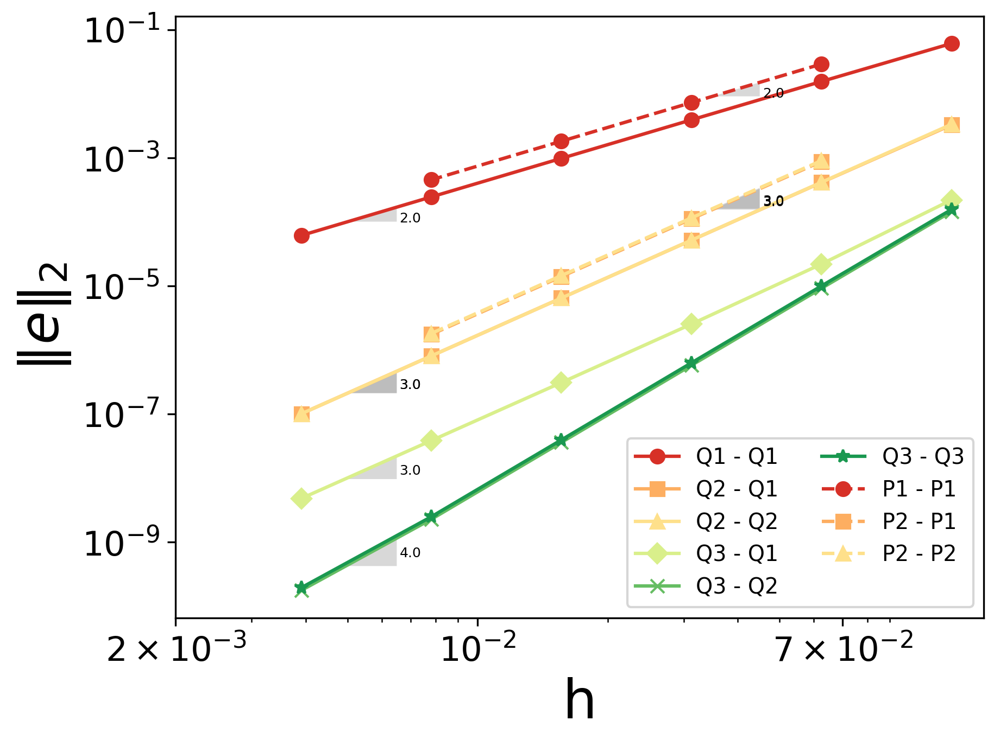
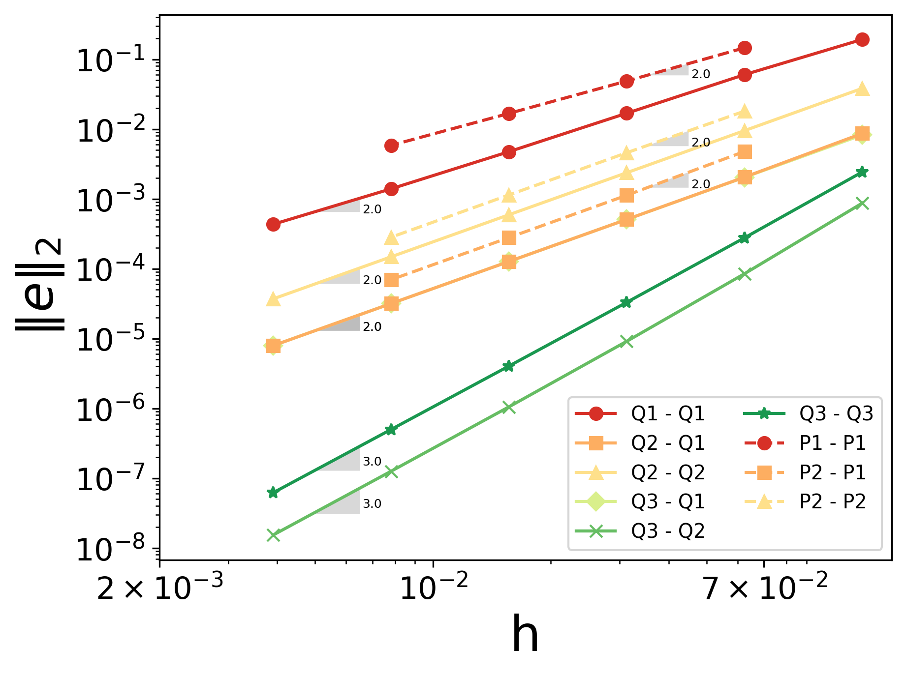

===============================================================================
Method of Manufactured Solutions
===============================================================================

This example illustrates the use of the Method of Manufactured Solutions (MMS) to verify the order of accuracy of a solver. The equations solved are the two-dimensional steady incompressible Navier-Stokes (NS) equations.

----------------------------------
Features
----------------------------------

- Solvers: ``lethe-fluid`` with the velocity and pressure polynomial approximations :math:`\in \{Q_1, Q_2, Q3\}` and  :math:`\in \{P_1, P_2\}`
- Steady-state problem
- Introduction of a source term in the NS equations
- Output of the :math:`L^2` norm of the `error relative to the chosen manufactured solution <https://chaos-polymtl.github.io/lethe/documentation/parameters/cfd/analytical_solution.html#analytical-solution>`_
- Use of a parameter file template allowing the `automatic launching of multiple cases <https://chaos-polymtl.github.io/lethe/documentation/tools/automatic_launch/automatic_launch.html>`_ with different mesh refinement levels and polynomial approximation degrees

----------------------------
Files Used in This Example
----------------------------

All files are located in the example's folder (``examples/incompressible-flow/2d-mms``). The files used for the quadrilateral mesh can be found in the ``mms_quad`` folder, while those for the triangular mesh are
grouped in the ``mms_simplex`` folder.

- Base case parameter file in each folder: ``mms_quad/mms_2d_steady.prm`` and ``mms_simplex/mms_2d_steady.prm``
- Python script to compute the source terms for the analytical solution used in this example: ``mms_source_term.py``
- Files to generate the parameter files at the different conditions: ``mms_quad/generate_cases.py`` and ``mms_simplex/generate_cases.py``
- Files to run the different simulations: ``mms_quad/launch_cases.py`` and ``mms_simplex/launch_cases.py``
- File to reorganize the output of the triangular mesh in a similar manner to the quadrilateral case: ``mms_simplex/organize_output.py``. After running the code, a directory ``mms_simplex/initial_output`` is created where the initial simulations output is stored
- Python script that plots the error: ``plot_error.py``

-----------------------
Description of the Case
-----------------------

Numerical models require both verification and validation. While code verification ensures that the mathematical and numerical schemes are consistent and that the code implementation is free from programming errors, code validation assesses the agreement between the mathematical model and the underlying physics. The Method of Manufactured Solution (MMS, see Roache (2002) [#Roache2002]_) is employed for code verification and involves evaluating the error defined as the difference between the manufactured solution and the computed solution. Specifically, the MMS can be used to verify or determine the order of convergence of a solver.
Obviously, few exact analytical solution of the incompressible Navier-Stokes (NS) equations are known. Therefore, the following procedure is adopted:

- The manufactured solution is chosen such that all terms of the NS equations are non-trivial and non-singular. In other words, the manufactured solution must be at least twice differentiable, with both its first and second derivatives being non-trivial. The manufactured solution can vary in complexity.
- Once the manufactured solution is defined, it is substituted into the steady incompressible NS equations, leading to the appearance of source terms. Hence, the manufactured solution is the exact solution of the original equations if the source term is added. 
- The simulations are launched with different mesh resolutions and for different degrees of the polynomial approximations of the velocity and pressure.
- The order of convergence is calculated by measuring the error between the numerical solution and the manufactured solution.

In the current example, we choose the following analytical solution:

.. math::
  \mathbf{u} &= 2 \begin{bmatrix}
    (\sin(\pi x))^2 \sin(\pi y) \cos(\pi y)\\
    \sin(\pi x) \cos(\pi x) (\sin(\pi y))^2 
   \end{bmatrix}\\
  p &= \sin(\pi x)\sin(\pi y)
 
The analytical solution is shown in the following figure:

.. image:: Images/analytical_solution.png
    :alt: The analytical solution: x-component of the velocity (upper-left), y-component of the velocity (upper-right), and pressure (bottom)
    :align: center
    :name: analytical_solution
    :width: 800

Since the velocity function is divergence-free, no source term arises in the continuity equation. Substituting the previous expressions for the velocity and the pressure into the momentum equation leads to the following source term:

.. math::
  \mathbf{G} = \pi \begin{bmatrix} \sin(\pi y)(-16\pi\nu (\sin(\pi x))^2\cos(\pi y) + 4\pi \nu \cos(\pi y) + 4 (\sin(\pi x))^3\sin(\pi y)\cos(\pi x) + \cos(\pi x))\\ 
    \sin(\pi x)(16\pi\nu (\sin(\pi y))^2\cos(\pi x) - 4\pi \nu \cos(\pi x) + 4 \sin(\pi x)(\sin(\pi y))^3\cos(\pi y) + \cos(\pi y)) \end{bmatrix}

where :math:`\nu` is the kinematic viscosity.

--------------
Parameter File
--------------

The simulations are conducted on the domain :math:`\Omega = [-1,1] \times [-1,1]` using two types of meshes: one composed of quadrilateral cells and the other of triangular cells (simplex mesh). The polynomial degree :math:`k_v` of the velocity interpolation was varied from :math:`k_v=1` to :math:`k_v=3` for the quadrilateral mesh, and from :math:`k_v=1` to :math:`k_v=2` for the triangular mesh, as deal.II does not yet support higher-order polynomials for simplex mesh elements. Additionally, for each velocity approximation degree :math:`k_v`, the pressure field polynomial degree :math:`k_p` ranged from :math:`k_p=1`  up to  :math:`k_p = k_v`. Finally, for each combination of velocity and pressure shape functions, six different mesh resolutions were tested on the quadrilateral mesh, while four resolutions were tested on the triangular mesh.

Since several parameter files are needed with a common syntax, except for the three parameters varied, a `parameter file template <https://chaos-polymtl.github.io/lethe/documentation/tools/automatic_launch/automatic_launch.html>`_ is employed for automated file launch.

.. _Simulation_control_section:

Simulation control
~~~~~~~~~~~~~~~~~~
In this example the steady-state incompressible solver is used. 

.. code-block:: text

  subsection simulation control
    set method = steady
    set output name = output_mms_2d_steady_
    set number mesh adapt = 4 # Comment this line if using simplex
  end

The ``number mesh adapt`` is set to the number of refinements to be tested and is only compatible with quadrilateral meshes. In this case, the simulations will be run starting from the initial mesh until convergence is reached. The mesh is then refined once and the obtained solution is then used as an initial condition. This process is repeated 5 times. In this case, the output file will include the results corresponding to the different mesh resolutions. However, automatic mesh adaptation is not yet supported for simplex meshes, and separate parameter files must be generated for each mesh resolution.

.. _Mesh_section:

Mesh
~~~~~
The mesh used in this example is generated using the deal.II grid generator. 

.. code-block:: text

  subsection mesh
    set type               = dealii
    set grid type          = hyper_cube
    set grid arguments     = -1 : 1 : false
    set simplex            = true      # if using simplex mesh 
    set initial refinement = 4         # if using quad mesh
    set initial refinement = {{LEVEL}} # if using simplex mesh 
  end

For a mesh with quadrilateral cells, the initial level of refinement is set to 4, which corresponds to 256 cells. For a simplex mesh, as mentioned in section :ref:`Simulation_control_section`, each refinement level is defined in a separate parameter file and is represented by the parameter variable ``{{LEVEL}}`` in Jinja2 format. The simplex mesh is selected by setting the ``set simplex`` parameter to `true`. In this case, a quadrilateral mesh is first generated at the specified resolution and then converted to a simplex mesh using the `dealii::GridGenerator::convert_hypercube_to_simplex_mesh <https://www.dealii.org/current/doxygen/deal.II/namespaceGridGenerator.html#ac7515d2b17c025dddc0e37286fb8d216>`_ function, which divides each square cell into 8 triangles.

Boundary Conditions
~~~~~~~~~~~~~~~~~~~

The velocity components are set to zero on the entire boundary to match the manufactured solution. However, if the manufactured solution requires varying velocity conditions on different parts of the boundary, specific values or analytical functions can be assigned to the corresponding boundary section. Thus, each boundary section must have a unique ID and be linked to the correct boundary condition in the parameter file. Additionally, the order of convergence of the numerical scheme can be analyzed for different types of boundary conditions (see `Boundary Conditions - CFD <https://chaos-polymtl.github.io/lethe/documentation/parameters/cfd/boundary_conditions_cfd.html>`_).

.. code-block:: text

  subsection boundary conditions
  set number = 1
    subsection bc 0
      set id   = 0
      set type = noslip
    end
  end

Physical Properties
~~~~~~~~~~~~~~~~~~~

For this analysis, the Reynolds number (based on the maximum velocity in the domain) is taken to be 1, which results in the terms of the NS equation being of the same order. Hence, the kinematic viscosity is set to 1 in the ``physical properties`` subsection:

.. code-block:: text

    subsection physical properties
      subsection fluid 0
        set kinematic viscosity = 1
      end
    end

FEM Interpolation
~~~~~~~~~~~~~~~~~

Similarly to the ``initial refinement`` parameter in the case of a simplex mesh, ``velocity order`` and ``pressure order``  are set to the ``{{Poly_deg_u}}`` and ``{{Poly_deg_p}}`` parameter variables, respectively, in Jinja2 format.

.. code-block:: text

  subsection FEM
    set velocity order = {{Poly_deg_u}}
    set pressure order = {{Poly_deg_p}}
  end

Non-linear Solver
~~~~~~~~~~~~~~~~~

The nonlinear solver's tolerance is set to :math:`10^{-10}` since the errors on the velocity and pressure fields reach values that are near or lower than the default tolerance of :math:`10^{-8}` on the quadrilateral meshes with a finer resolution. Hence, if the default tolerance were used, the error would be constrained by this value.

.. code-block:: text

    subsection non-linear solver
      subsection fluid dynamics
        set tolerance = 1e-10
        set verbosity = verbose
      end
    end

Linear Solver
~~~~~~~~~~~~~

The only modification made in the linear solver section is the use of AMG preconditioner to accelerate the simulations. 

.. code-block:: text

  subsection linear solver
    subsection fluid dynamics
      # Set type of preconditioner for the iterative solver
      set preconditioner = amg
      set verbosity      = verbose
    end
  end

-----------------------
Running the Simulations
-----------------------

The simulations are launched by first running the ``generate_cases.py``, then ``launch_cases.py`` scripts. The first script generates the folders and parameter files for the different configurations simulated,
while the second one launches the simulations. The run time for the mesh with quadrilateral cells is around 6 minutes on 8 processors, while the mesh with triangular cells runs in about 4 minutes.

As mentioned in section :ref:`Mesh_section`, for the quadrilateral mesh, for each combination of velocity and pressure polynomial approximations, the mesh is refined automatically in a successive manner. Therefore, one folder for each combination of velocity and pressure shape functions containing the corresponding parameter file is created. Within each folder, the results corresponding to the different mesh resolutions are stored in a single ``L2Error.dat``. This is not the case for the simplex mesh, where a parameter file and an output file are created within a separate folder for each combination of velocity and pressure approximations and mesh resolution.

Once the simulations are completed, the script ``organize_output.py`` must be run to rearrange the results for a triangular mesh into a folder structure similar to that obtained for the quadrilateral mesh. After running this script for the simplex mesh, folders are created for each combination of velocity and pressure polynomial approximations. Within each folder, the error is reorganized in a single ``L2Error.dat`` file, following the same structure as the one for the quadrilateral mesh, and containing the errors for the different mesh resolutions. The results can then be post-processed using the python script ``plot_error.py``, which plots the error relative to the manufactured solution for the different mesh resolutions and polynomial approximation degrees.

-----------------------
Results and Discussion
-----------------------

The following figures show the :math:`L^2` norm of the error relative to the analytical solution for the velocity and pressure fields as a function of the mesh size :math:`h`. The error is defined as follows:

.. math::
  |e_{\mathbf u}|_2 &= \sqrt{\int_\Omega [\Sigma_{i=1}^2(u_{i,sim}-u_{i,exact})^2]} = \sqrt{\Sigma_{k=1}^{n_{cells}}\Sigma_{j=1}^{n_q}\Sigma_{i=1}^2[(u_{i,sim,j}-u_{i,exact,j})^2]*w_j}\\
  |e_p|_2 &= \sqrt{\int_\Omega [(p_{sim}-p_{sim, av})-(p_{exact}-p_{exact, av})]^2} = \sqrt{\Sigma_{k=1}^{n_{cells}}\Sigma_{j=1}^{n_q} [(p_{sim,j}-p_{sim, av})-(p_{exact,j}-p_{exact, av})]^2*w_j}

where :math:`n_q` is the number of quadrature points in each cell, :math:`w_j` are the quadrature weights, and :math:`n_{cells}` is the number of cells in the domain. The terms :math:`u_{i}` and :math:`p` represent the velocity components and pressure, respectively. The subscript :math:`sim` refers to variables obtained from the simulations, while :math:`exact` denotes their exact counterparts. Finally, the subscript :math:`av` represents the average values of the simulated and exact pressure fields, which are subtracted from the corresponding pressure fields to account for the fact that the pressure is recovered to within a constant. In fact, for incompressible flows, the pressure field constitutes a Lagrange multiplier that enforces the continuity condition through its gradient value. More details on the error calculation can be found by consulting the implementation of the function ``calculate_L2_error`` in ``lethe/source/solvers/postprocessing_cfd.cc``.

Finally, the mesh size :math:`h` is defined as follows:
  .. math::
    h_{quad} &= \frac{l_\Omega}{\sqrt{n_{cells}}}\\
    h_{simplex} &= \frac{l_\Omega}{\sqrt{(n_{cells}/8)}}*0.5

where the number of cells :math:`n_{cells}` is retrieved from the ``L2Error.dat`` files. For the simplex mesh case, :math:`n_{cells}` is divided by 8 to compute the number of quadrilaterals used to generate the triangles (see section :ref:`Mesh_section`). Taking the square root of this number gives the number of quad sides on a given boundary segment. Dividing the length of the boundary segment by the latter number leads to the length of the side of each quad. The size of each triangle is then half the length of the quad side. 

The following figure shows the variation of  :math:`|e_{\mathbf u}|_2` with :math:`h`

The following figure shows the variation of  :math:`|e_p|_2` with :math:`h`

In both plots, the continuous lines correspond to the quadrilateral mesh, while the dashed lines represent the simplex mesh. It can be seen that the velocity converges to the order :math:`(k_v+1)` for a velocity shape function of degree :math:`k_v`, except for the case :math:`\{Q_3-Q_1\}`.

As for the pressure, it converges at the second-order for the shape functions pairs :math:`\in \{Q_1-Q_1, Q_2-Q_1, Q_2-Q_2, Q_3-Q_1\}` and :math:`\in \{P_1-P_1, P_2-Q_1, P_2-P_2\}`, and to the third-order for combinations :math:`\in \{Q_3-Q_2, Q_3-Q_3\}`. It can also be seen that the error for the pressure increases with an increasing pressure approximation degree, except for :math:`\{Q_3-Q_1\}` and :math:`\{Q_3-Q_2\}` for the quad mesh.

Finally, for the same degree of the velocity and pressure approximations and the same mesh resolution, the error is smaller for a quadrilateral mesh, for both the pressure and velocity fields.  

----------------------------
Possibilities for Extension
----------------------------

- **Use more complex analytical functions:**  Using a non-divergence free velocity field leads to the apperance of a source term in the mass conservation equation, as well as the contribution of all the components of the stress tensor in the momentum conservation equations. More complex manufactured solutions may be found in Blais and Bertrand (2015) [#Blais2015]_.

- **Unsteady equations:** Using the transient form of the equations with a manufactured solution that also depends on time provides insight into the convergence in time.

-----------
References
-----------

.. [#Roache2002] \P. J. Roache, “Code Verification by the Method of Manufactured Solutions,” *J. Fluids Eng.*, vol. 124, no. 1, pp. 4–10, Dec. 1982, doi: `10.1115/1.1436090 <https://doi.org/10.1115/1.1436090>`_\.

.. [#Blais2015] \B. Blais and F. Bertrand, “On the Use of the Method of Manufactured Solutions for the Verification of CFD Codes for the Volume-Averaged Navier-Stokes Equations,” *Comput. Fluids*, vol. 114, pp. 121-129, 2015, doi: `10.1016/j.compfluid.2015.03.002 <https://doi.org/10.1016/j.compfluid.2015.03.002>`_\.
