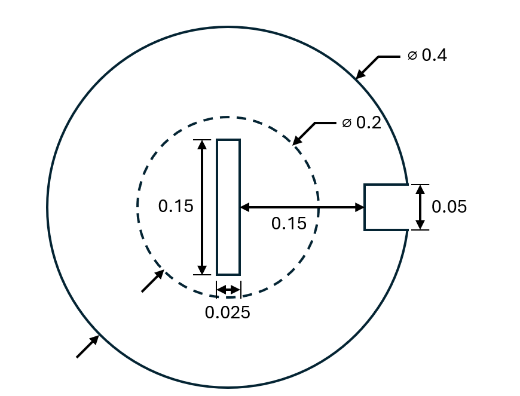

======================================
Paddle Mixer Using the Mortar Method
======================================

This example showcases the use of the mortar method in Lethe to solve a 2D incompressible flow problem with a rotating impeller.

---------
Features
---------

- Solver: ``lethe-fluid`` (with Q1-Q1) 
- Transient problem
- Usage of different parameters related to the mortar method
- Setup of boundary conditions in a gmsh file before using the mortar method 

----------------------------
Files Used in This Example
----------------------------

All files mentioned below are located in the example's folder (``examples/incompressible-flow/2d-mortar-method``).

- Geometry file: ``full-geometry.geo``
- Rotor mesh file: ``mixer_rotor.msh``
- Stator mesh file: ``mixer_stator.msh``
- Parameter file: ``mixer_mortar_method.prm``

-----------------------
Description of the Case
-----------------------
We simulate the flow around a rotating impeller in a cylindrical domain with the presence of a baffle. This domain is composed of the rotor part, which contains the impeller and is rotating, and the stationary stator part. These two geometries are attached with mortar elements, which maintain the continuity of the solution between the two domains.

The geometry of the problem is illustrated in the following figure:

--------------
Parameter File
--------------

Simulation Control
~~~~~~~~~~~~~~~~~~

A 1st order backward differentiation is used for the time integration (``bdf1``), considering a 0.01 second ``time step`` and a final simulation time of 10 seconds. Outputs are saved every 5 steps, as indicated by the ``output frequency`` parameter.

.. code-block:: text

  subsection simulation control
    set method           = bdf1
    set time step        = 0.01
    set time end         = 10
    set output frequency = 5
    set output path      = ./output/
    set output name      = mortar-output
  end

FEM
~~~

For this example, Q1 elements are used for both velocity and pressure. The bubble enrichment function is also enabled for the velocity field to increase the accuracy and stability of the solution. The `deal.II documentation <https://dealii.org/current/doxygen/deal.II/classFE__Q__Bubbles.html>`_ contains more information about the bubble enrichment function and its implementation in deal.II.

.. code-block:: text

  subsection FEM
    set enable bubble function velocity = true
    set velocity order                  = 1
    set pressure order                  = 1
  end

Mesh
~~~~

When using the mortar method, only the static mesh needs to be included in the ``mesh`` subsection. In this example, ``mixer_stator.msh`` only contains the meshed stator shown in the above case description.

.. code-block:: text

  subsection mesh
    set type               = gmsh
    set file name          = mixer_stator.msh
    set initial refinement = 2
  end

Mortar
~~~~~~

The ``mortar`` subsection specifies all the parameters required to simulate a rotor-stator geometry using mortar elements to attach the two meshes. The ``mesh`` subsection embedded in the ``mortar`` subsection refers to the rotor domain and contains the same parameters described in :doc:`../../../parameters/cfd/mesh`. Due to the current implementation, it is important that the number of cells both sides of the mortar interface is equal, as different amount of cells will fail the mortar cells generation step.
After the rotor geometry configuration, the boundary ids at the rotor-stator interface need to be specified. Other parameters related to the rotation of the rotor domain can also be modified (see the :doc:`../../../parameters/cfd/mortar` section for more details):

- The ``center of rotation`` represents the coordinates around which the rotor domain will be rotating.
- The ``rotor rotation angle`` subsection contains the expression for the rotation angle, which can either be constant or time-dependant.
- The ``rotor angular velocity`` subsection contains the expression for the angular velocity of the rotor and needs to correspond to the time derivative of the ``rotor rotation angle``.

We can now ``set verbosity`` to ``verbose`` to print information about the rotor rotation at every iteration. Lastly, we set the ``radius tolerance`` to 1e-6; every iteration, the radial distance between the center of rotation and every node at the rotor-stator interface is calculated to ensure that the difference between the maximum and minimum value is less than the tolerance.

.. note::
    When creating the ``.msh`` files from the ``.geo`` files, the boundary ids need to be unique for the rotor and stator domains. For example, if the boundary id for the rotor-stator interface is 3 in the rotor mesh, it should be 4 in the stator mesh. This way, both boundaries can be specified in the ``mortar`` subsection without any conflict. As of today, a manual modification of the ``.msh`` files may be required to achieve this. It is important to note that the boundary ids at the rotor-stator interface do not need to be sequential, as the only requirement is that they are different on each side of the interface.

.. code-block:: text

  subsection mortar
    set enable = true
    subsection mesh
      set type               = gmsh
      set file name          = mixer_rotor.msh
    end
    set rotor boundary id  = 3
    set stator boundary id = 4
    set center of rotation = 0, 0
    subsection rotor rotation angle
      set Function expression = 1*t
    end
    subsection rotor angular velocity
      set Function expression = 1
    end
    set verbosity = verbose
    set radius tolerance = 1e-6
  end

Boundary Conditions
~~~~~~~~~~~~~~~~~~~

Both the outside wall (ID 5) and the baffle (ID 6) have a no-slip Dirichlet boundary condition. The mortar boundaries (ID 3 and 4) are already defined in the ``mortar`` subsection, so a ``none`` boundary condition is assigned to them here. Finally, the velocity of the fluid at the impeller (ID 2) is defined with the functions :math:`u=-\Omega y` and :math:`v=\Omega x`, where :math:`\Omega` is the angular velocity of the impeller, defined as 1 in the ``mortar`` subsection. 

.. code-block:: text

  subsection boundary conditions
    set number = 3
    subsection bc 0
      set type               = noslip
      set id                 = 5,6
    end
    subsection bc 1
      set type               = none
      set id                 = 3,4
    end
    subsection bc 2
      set type = function
      set id   = 2
      subsection u
        set Function expression = -y
      end
      subsection v
        set Function expression = x
      end
    end
  end

Manifolds
~~~~~~~~~

Since the mortar boundary and the outside wall are both circular, we need to setup manifolds to ensure that the circular shape is not lost as the mesh is refined. See the :doc:`../../../parameters/cfd/manifolds` section for more information about the manifold types supported in Lethe. 

.. code-block:: text

  subsection manifolds
    set number = 3
    subsection manifold 0
      set id = 3
      set type = spherical
      set point coordinates = 0, 0
    end
    subsection manifold 1
      set id = 4
      set type = spherical
      set point coordinates = 0, 0
    end
    subsection manifold 2
      set id = 5
      set type = spherical
      set point coordinates = 0, 0
    end
  end

Linear Solver
~~~~~~~~~~~~~

The only modification made in the linear solver is the use of the AMG preconditioner.

.. code-block:: text

  subsection linear solver
    subsection fluid dynamics
      set verbosity                             = quiet
      set method                                = gmres
      set preconditioner                        = amg
    end
  end

----------------------
Running the Simulation
----------------------

Assuming that the ``lethe-fluid`` executable is within your path, the simulation can be launched by typing:

.. code-block:: text
  :class: copy-button

  lethe-fluid mixer_mortar_method.prm

It can also be launched in parallel using MPI with the following command:

.. code-block:: text
  :class: copy-button

  mpirun -np X lethe-fluid mixer_mortar_method.prm

with X the number of processors used to run it.
Lethe will generate a number of files. The most important one bears the extension ``.pvd``. It can be read by visualization programs such as `Paraview <https://www.paraview.org/>`_.

----------------------
Results and Discussion
----------------------

Using Paraview, we can visualize the results of the simulation with the ``.pvd`` output file. Using the surface LIC visualization method, we obtain the following animation: 

.. raw:: html

    <iframe width="560" height="315" src="https://www.youtube.com/watch?v=fGO1YEMRqDY" frameborder="0" allowfullscreen></iframe>

As we can see, the presence of the baffle creates re-circulation zones in the flow, which are visible in the animations. Continuity of the solution is maintained at the mortar interface, as expected. 

----------------------------
Possibilities for Extension
----------------------------
- Vary the Reynolds number to see the effect on the flow.
- Run the simulation for different impeller and/or baffle geometries.
- Make the case three-dimensional by using a cylindrical mortar interface.

