===============================================
2D Flow around NACA0012 at low Reynolds number
===============================================

Features
--------

- Solver: ``gls_navier_stokes_2d`` (with Q1-Q1)
- Transient problem
- Boundary Layer Mesh - Transfinite Mesh
- Spectral analysis - Fourier transform

Files used in this example
----------------------------

- Base case (:math:`Re = 1000`): ``/examples/incompressible-flow/2d-naca0012-low-reynolds/naca.prm``
- .geo file fto generate the mesh: ``/examples/incompressible-flow/2d-naca0012-low-reynolds/cTypeMesh.geo``

Description of the case
-------------------------

In this example, a two-dimensional flow around a NACA airfoil is studied. According to Wikipedia, the "NACA airfoils are airfoil shapes for aircraft wings developed by the National Advisory Committee for Aeronautics (NACA)". The airfoils, simply refered to as NACA afterwards, are described by a set of four digits for the simpler airfoils, allowing to generate a lot of different profiles. Since we deal with deal with a symetrical NACA we will only consider the last two digits which describe the maximum thickness of the airfoil as percent of the chord. The first two digits are set to zero.

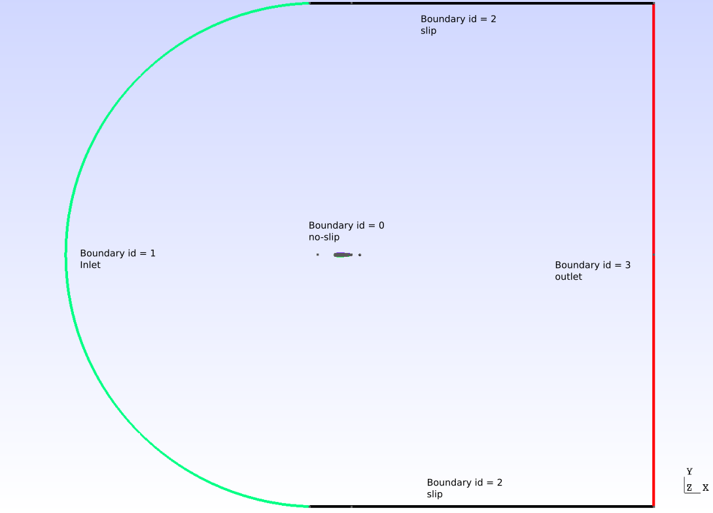

These airfoils, though created almost 100 years ago, are still very popular in aerodynamic fields where they often serve as a "base" choice, which is then modified to fit the constructor's constraints. The literature on numerical simulations of NACAs with high Reynolds numbers (:math:`Re>10^6`) is abundant. However recent technological developments in the field of Micro Air Vehicles (MAVs) created a need for low Reynolds simulations (:math:`Re<10^4`) since these vehicles operate at Reynolds numbers much smaller than usual aircrafts. In this example, a 2D simulation around a 0012NACA at :math:`Re=1000` will be done in order to retrieve significant quantities such as drag, lift and pressure coefficient, respectively denoted by :math:`C_D`, :math:`C_L` and :math:`C_p`. A spectral analysis will then be performed to analyze the vortex shedding frequency. 

Parameter file
----------------

Simulation control
~~~~~~~~~~~~~~~~~~~~~

The problem to solve is transient. An adaptative timestep is used to ensure that the :math:`CFL<10` condition is obtained. This boundary for the CFL number was chosen to get relevant results wile having reasonable simulation times. A second order backward difference scheme was chosen.

.. code-block:: text

    subsection simulation control
      set method            = bdf2
      set output name       = naca-output
      set output path       = ./output/
      set output frequency  = 50
      set adapt             = true
      set max cfl           = 10
      set time end          = 40
      set time step         = 0.01
    end
    
Physical properties 
~~~~~~~~~~~~~~~~~~~~~

In this problem, the Reynolds number is defined as :

.. math::
        Re = \frac{uC}{\nu}

where :math:`C` is the chord length of the airfoil, :math:`u` is the entry velocity and :math:`\nu` the kinematic viscosity. :math:`C` and :math:`u` are taken equal to 1. Then, in order to get :math:`Re = 1000` one must have :math:`\nu = 0.001`.

.. code-block:: text
	
    subsection physical properties
      subsection fluid 0
        set kinematic viscosity = 0.001
        set density             = 1.0
      end
    end

Forces
~~~~~~~~~~~~~~~~~~

The forces are computed in order to obtain the drag and lift coefficients later on :

.. code-block:: text
	
    subsection forces
      set verbosity             = verbose
      set calculate force       = true
      set calculate torque      = false
      set force name            = force
      set output precision      = 10
      set calculation frequency = 1
      set output frequency      = 1
    end
    
Mesh 
~~~~~~~~~~~~~~~~~~

A C-Type mesh was created around the NACA. It is the usual type of mesh chosen for airfoils because it allows for the curvature of the grid to match the leading edge of the airfoil. Also, it allows the user to place more cells on areas which require higher resolution, typicaly the upper and lower part of the airfoil. In order to obtain such a mesh, the Transfinite functions of ``gmsh`` were used. To get a good understanding of how it was done, the reader is advised to read through the ``cTypeMesh.geo`` file included in the example which is thoroughly commented. To generate a mesh with a different angle, the only thing required is to change the ``angle`` parameter in the ``cTypeMesh.geo`` file.

.. code-block:: text
	
    subsection mesh
      set type      = gmsh
      set file name = naca.msh
    end

Below is the whole mesh and a zoom on the airfoil, for an angle of attack :math:`\alpha = 15°`

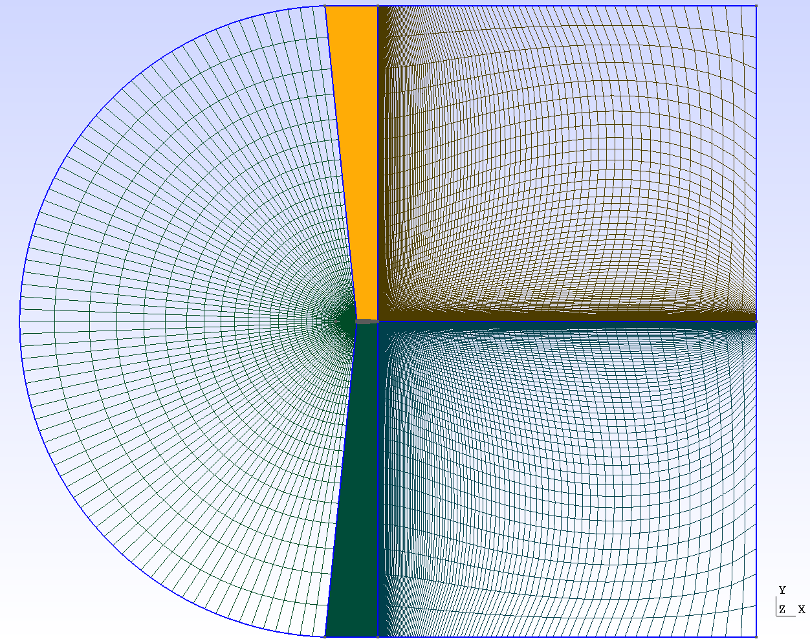

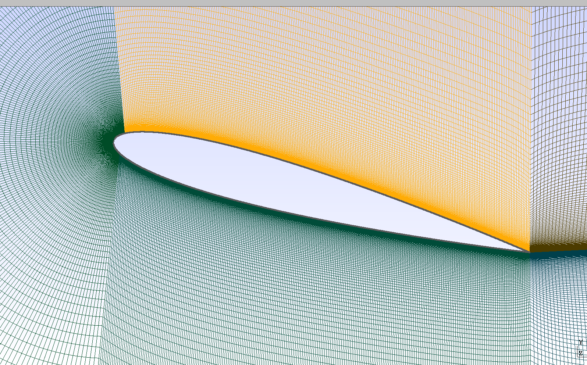

Mesh adaptation 
~~~~~~~~~~~~~~~~~~

Mesh adaptation is used to get a higher resolution in areas of interest, that is to say close to the airfoil, while keeping a coarse mesh far from the NACA. Since the mesh is big and the simulation lengthy in time, it was chosen not to refine too much. The parameters were tuned as follow : 

.. code-block:: text
	
    subsection mesh adaptation
      set type                 = kelly
      set variable             = velocity
      set fraction type        = number
      set max number elements  = 700000
      set max refinement level = 2
      set min refinement level = 0
      set frequency            = 5
      set fraction refinement  = 0.02
      set fraction coarsening  = 0.16
    end
    
    
FEM
~~~

In this example, the interpolation order has been set to one for both velocity and pressure.

.. code-block:: text

    subsection FEM
      set pressure order = 1
      set velocity order = 1
    end

Boundary conditions
~~~~~~~~~~~~~~~~~~~

The boundary conditions are defined as presented above : 

.. code-block:: text

     subsection boundary conditions
       set number = 4
       subsection bc 0
         set type = noslip
       end
       subsection bc 1
         set type = function
         subsection u
           set Function expression = 1
         end
         subsection v
           set Function expression = 0
         end
         subsection w
           set Function expression = 0
         end
       end
       subsection bc 2
         set type = slip
       end
       subsection bc 3
       	set type = outlet
       	set beta = 1.3
       end
     end
	
The boundary 0 corresponds to the NACA, it is a ``noslip`` boundary condition which sets the velocity to zero on the boundary. The boundary 1 is the inlet where the velocity field was chosen to be horizontal and unitary, to ensure that :math:`Re = 1000` is correct, it is represented in green on the image. The boundary 2, in black on the image, is a wall with a ``slip`` boundary condition and finally boundary 3 is of type ``outlet`` with a parameter :math:`\beta = 1.3`. The reader is refered to the `Parameters Guide <https://lethe-cfd.github.io/lethe/parameters/cfd/linear_solver_control.html>`_ for more information about the :math:`\beta` parameter.

Non-linear solver
~~~~~~~~~~~~~~~~~

The ``inexact_newton`` non-linear solver is used with a high ``tolerance``, since convergence can be hard to obtain for high Reynolds number. The choice of this solver was to reduce the cost of the simulation since it reuses the Jacobian matrix between iterations.

.. code-block:: text

    subsection non-linear solver
      set solver         = inexact_newton
      set verbosity      = verbose
      set tolerance      = 1e-3
      set max iterations = 10
    end

Linear solver
~~~~~~~~~~~~~

Again, in order to reduce the computational time the tolerance for the linear solver were chosen higher than usual : 

.. code-block:: text

    subsection linear solver
      set verbosity                             = verbose
      set method                                = gmres
      set max iters                             = 5000
      set relative residual                     = 1e-3
      set minimum residual                      = 1e-8
      set ilu preconditioner fill               = 1.1
      set ilu preconditioner absolute tolerance = 1e-10
      set ilu preconditioner relative tolerance = 1.00
      set max krylov vectors                    = 1000
    end      
	
	
.. tip::
	It is important to note that the ``minimum residual`` of the linear solver is smaller than the ``tolerance`` of the nonlinear solver. The reader can consult the `Parameters Guide <https://lethe-cfd.github.io/lethe/parameters/cfd/linear_solver_control.html>`_ for more information.
	
Running the simulations
-----------------------

The simulation can be launched using the following command 

.. code-block:: text

	gls_navier_stokes_2d nacaBatch.prm
	
However, it is highly recommended to launch the simulation on a supercomputer. To launch on a desktop machine, the ``time end`` can be set to ``3.0`` to see the beginning of the simulation. Though to get relevant results about forces, it is better to simulate at least for ``10s`` in order for a pseudo-steady regime to settle.

Results and discussion
-----------------------

The following average pressure and velocity fields are obtained for an angle of attack :math:`\alpha`such that :math:`\alpha \in \{0,5,7,9,11,15\}` : 

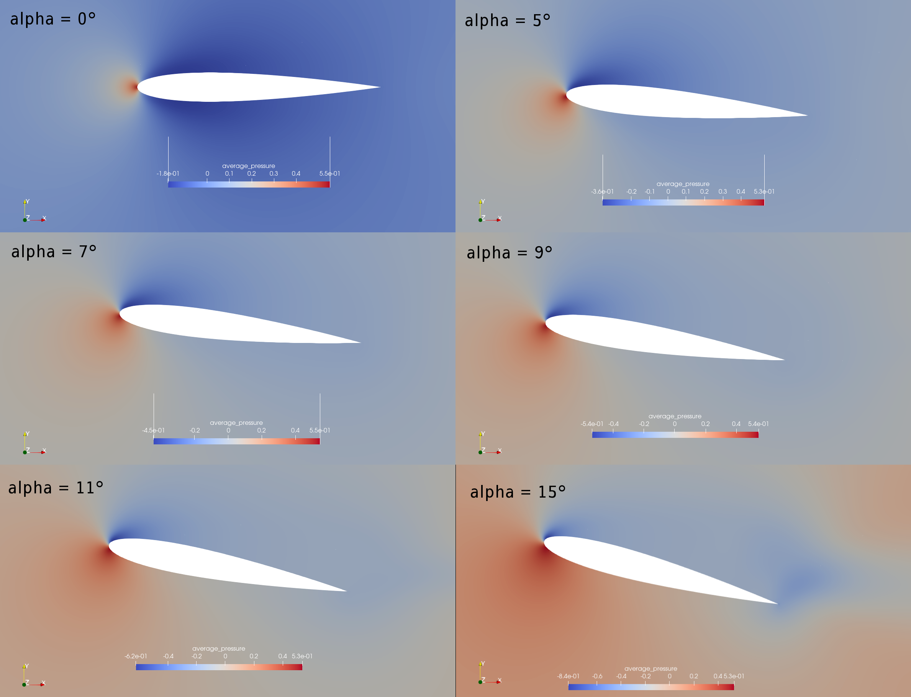

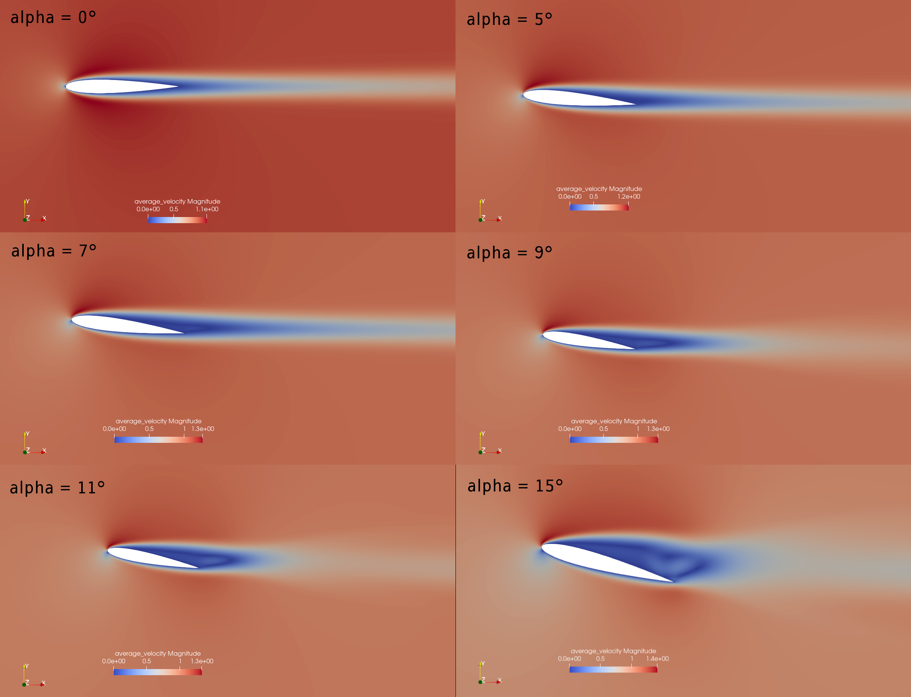

It is already noticeable that the the bigger the angle of attack, the bigger the pressure gradient. Following this observation, the lift coefficient :math:`C_L` is expected to increase with the angle of attack. The variation of the lift and drag coefficients are given below with a comparison to the litterature (Kouser et al. (2021) `[1] <https://doi.org/10.1177/17568293211055656>`_), they are computed using the following formula : 

.. math::
        C_L = \frac{F_L}{0.5\rho u^2 S} \; \; \; \; \; C_D = \frac{F_D}{0.5\rho u^2 S}
        
with :math:`F_L` and :math:`F_D` respectively the lift and drag forces. Those forces can be obtained in the ``force.00.dat`` and post processed using the ``postProcessing.py`` python file included in the folder of this example. :math:`S` represents a reference area, here it is equal to the product of the chord length :math:`C` (equal to 1 in this example) multiplied by a unitary transversal length.
        
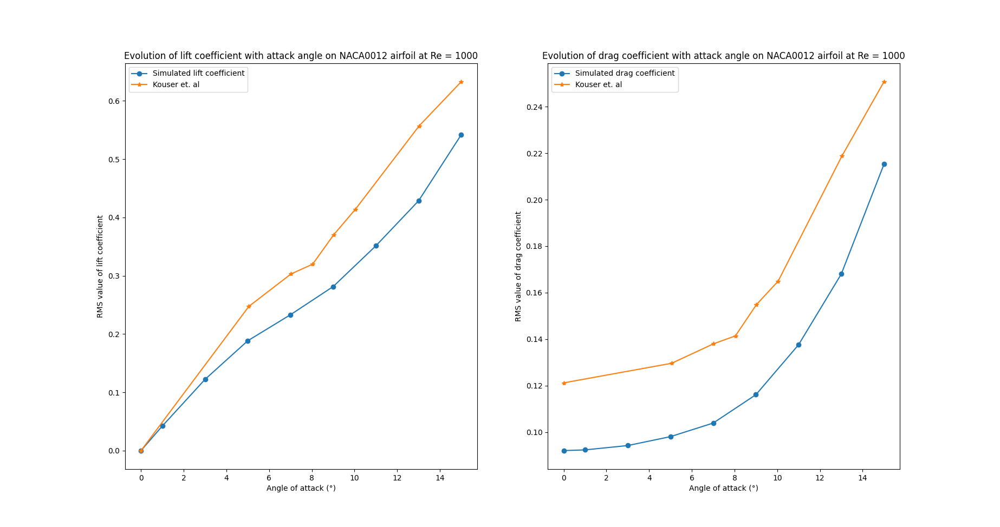

There is a slight variation of the results obtained compared to the litterature results. Indeed, the simulation is purely two-dimensionnal while Kouser et al. take a 2D slice of a 3D simulation. Still, the evolution observed is relevant.

One can also see the low velocity zones on the upper part of the airfoil which corresponds to the boundary layer : the ``noslip`` condition on the NACA imposes a zero velocity condition on the fluid. This create a zone where the advective and diffusive forces are in competition. The following streamline representation helps to see the movements of the fluid inside the boundary layer : 

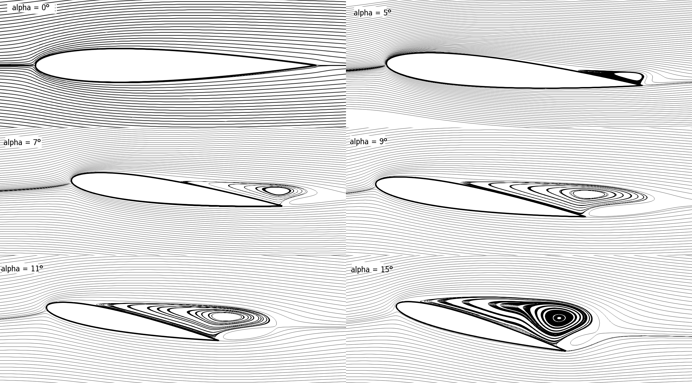

It can be observed that zones of recirculation form on the airfoil. This is due to two phenomenas : first the flow outside of the boundary layer tends to "pull" it in its direction and the ``noslip`` boundary condition slows the fluid, then a positive pressure gradient -commonly refered to as adverse pressure gradient- on the airfoil surface pushes the fluid backwards. Following this a vertex forms. Below is represented the mean pressure coefficient :math:`C_p` on the airfoil with comparison to the litterature right below. It is computed using the following formula : 

.. math::
        C_p = \frac{p-p_{\infty}}{0.5\rho_{\infty}u_{\infty}^2}
        
with :math:`p_{\infty}` the static pressure in the freestream (equal to 0 in this case), :math:`\rho_{\infty}` the freestream fluid density, equal to the fluid density since we are solving an incompressible flow and :math:`u_{\infty}` the freestream velocity of the fluid, equal to ``1.0`` in this case.

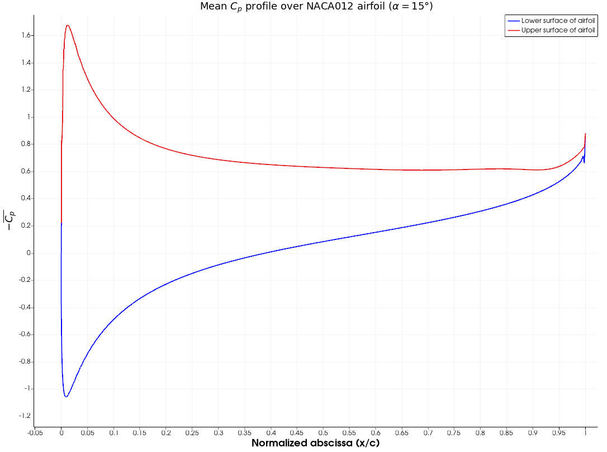

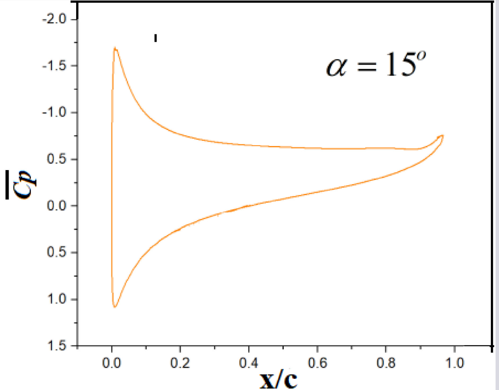

The important pressure at the attacking edge of the airfoil is what allows the incoming flow to be deflected to the upper and lower part. Then, if we look at the upper part (be careful about the reversed y-axis since :math:`-C_p` is plotted) the adverse pressure gradient is visible. Then at the trailing edge, the mesh is ot precise enough. A slight discontuinity ensues which, though not physically accurate, do not invalidate the whole result.

For angles of attack :math:`\alpha\geq 9°`, the vortex start to detach from the airfoil, this can be seen using the instantaneous velocity fields. For each angle of attack, the last time iteration was taken :  

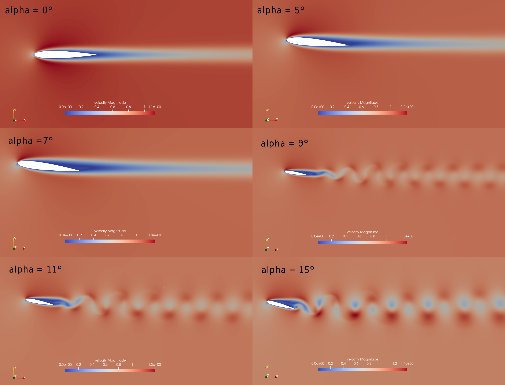

In order to retrieve the frequency of the vortex shedding, one can look at the variations of :math:`C_L`. Below are the variations of the lift coefficient with time, only the case where :math:`\alpha=15°` was considered for this analysis : 

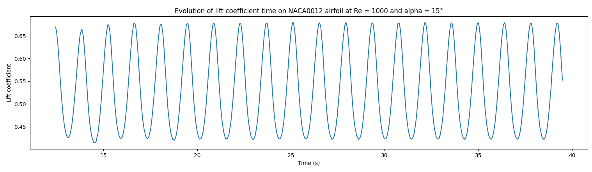

The best mathematical tool available to make a spectral analysis is a Fourier transform, which is performed below, with literature results for comparison :

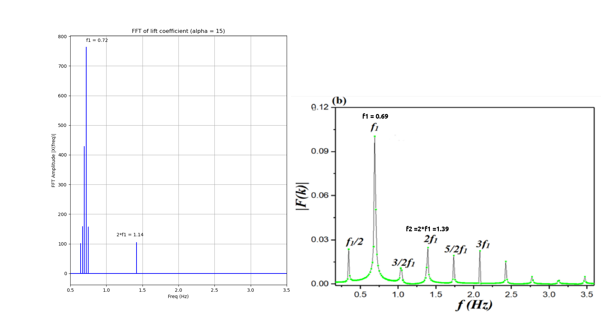

The fundamental frequency is :math:`f_1 = 0.69` Hz which gives a shedding period :math:`T = 1.44` s that is coherent with the instantaneous velocity field above.

Possibilities for extension
------------------------------

- **High-order elements** : In order to get more precise results on the forces and the coefficients, Q2-Q2 elements may be used. It can be modified by setting ``set velocity order = 2`` and ``set pressure order = 2`` in the ``FEM``subsection of ``nacaBatch.prm`` .

- **Going 3D** : the mesh can be extruded into the third dimension. Some modifications will be required in the boundary conditions and getting the correct boundaries id is not trivial. However with periodic boundary conditions set on the sides of the box, the full turbulence effects can be taken into account, which should yield much better results. 

- **Validate for higher Reynolds numbers** : Litterature is available for comparison at :math:`Re = 10000` at Yamaguchi et al. (2013) `[2] <https://doi.org/10.1299/jsmeicjwsf.2013.4._1201-1_>`_ and :math:`Re = 23000` at Kojima et al. (2013) `[3] <https://doi.org/10.2514/1.C031849>`_.

References
-----------

`[1] <https://doi.org/10.1177/17568293211055656>`_ 1.
Kouser T, Xiong Y, Yang D, Peng S. Direct Numerical Simulations on the three-dimensional wake transition of flows over NACA0012 airfoil at Re = 1000. International Journal of Micro Air Vehicles. 2021;13. https://doi.org/10.1177/17568293211055656

`[2] <https://doi.org/10.1299/jsmeicjwsf.2013.4._1201-1_>`_ 2.
Yamaguchi Yuta, Ohtake Tomohisa, Muramatsu Akinori, 1201 PRESSURE DISTRIBUTION ON A NACA0012 AIRFOIL AT LOW REYNOLDS NUMBERS, The Proceedings of the International Conference on Jets, Wakes and Separated Flows (ICJWSF), 2013, Volume 2013.4, 2013.4, Pages _1201-1-_1201-5, Released on J-STAGE June 19, 2017, Online ISSN 2424-2888, https://doi.org/10.1299/jsmeicjwsf.2013.4._1201-1

`[3] <https://doi.org/10.2514/1.C031849>`_ 3.
Ryoji Kojima, Taku Nonomura, Akira Oyama, and Kozo Fujii, Large-Eddy Simulation of Low-Reynolds-Number Flow Over Thick and Thin NACA Airfoils, Journal of Aircraft 2013 50:1, 187-196. https://doi.org/10.2514/1.C031849 

