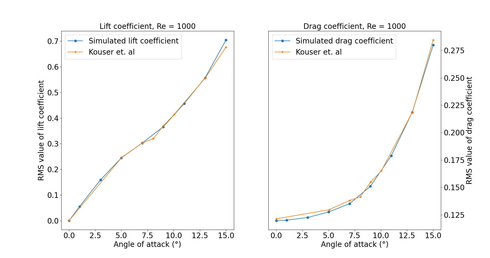

===============================================
Flow around NACA0012 at Low Reynolds Number
===============================================

--------
Features
--------

- Solver: ``lethe-fluid`` (with Q1-Q1)
- Transient problem
- Boundary Layer Mesh - Transfinite Mesh
- Spectral analysis - Fourier transform

--------------------------
Files Used in This Example
--------------------------

All files mentioned below are located in the example's folder (``examples/incompressible-flow/2d-naca0012-low-reynolds``).

- Geometry file: ``c_type_mesh.geo``
- Parameter file for the base case (:math:`Re=1000`): ``naca.prm``
- Postprocessing Python script: ``postprocessing.py``

-----------------------
Description of the Case
-----------------------

In this example, a two-dimensional flow around a NACA airfoil is studied. According to Wikipedia, the *NACA airfoils are airfoil shapes for aircraft wings developed by the National Advisory Committee for Aeronautics (NACA)*. The NACA is the ancestor of the well-known `NASA <https://www.nasa.gov/about/index.html>`_. The airfoils, simply referred to as NACAs afterwards, can be described by a set of four digits for the simpler airfoils, allowing the generation of a lot of different profiles. Since we deal with a symmetrical NACA we will only consider the last two digits, which describe the maximum thickness of the airfoil in percentage of the chord. The first two digits, describing the maximum camber and its position, are set to zero. The problem under study is presented in the figure below, which details the boundary conditions chosen and gives an idea of the size of the computational domain.

.. image:: image/explanations_BC.png

These airfoils, though created almost 100 years ago, are still very popular in aerodynamic fields where they often serve as a *base* choice, which is then modified to fit the constructor's constraints. The literature on numerical simulations of NACAs with high Reynolds numbers (:math:`Re>10^6`) is abundant. However, recent technological developments in the field of Micro Air Vehicles (MAVs) created a need for low Reynolds simulations (:math:`Re<10^4`) since these vehicles operate at Reynolds numbers much smaller than usual aircraft. In this example, a 2D simulation around a NACA0012 at :math:`Re=1000` will be performed in order to retrieve significant quantities such as drag, lift, and pressure coefficients, respectively denoted by :math:`C_D`, :math:`C_L` and :math:`C_p`. Elements of order 1 will be used for pressure and velocity. A spectral analysis will then be performed to analyze the vortex shedding frequency.

--------------
Parameter File
--------------

Simulation Control
~~~~~~~~~~~~~~~~~~

The problem is transient. An adaptative time step is used to ensure that the CFL :math:`<10` condition is obtained. This boundary for the CFL number was chosen to get relevant results while having reasonable simulation times. The reader is referred to the :doc:`../2d-lid-driven-cavity-flow/lid-driven-cavity-flow` example for a better understanding of the time step adaptation to keep the CFL below a certain threshold. A second-order backward differentiation (BDF2) scheme was chosen.

.. code-block:: text

    subsection simulation control
      set method            = bdf2
      set output name       = naca-output
      set output path       = ./output/
      set output frequency  = 50
      set adapt             = true
      set max cfl           = 10
      set time end          = 40
      set time step         = 0.01
    end
    
Physical Properties
~~~~~~~~~~~~~~~~~~~

In this problem, the Reynolds number is defined as:

.. math::
        Re = \frac{u_{\infty}C}{\nu}

where :math:`C` is the chord length of the airfoil, :math:`u_{\infty}` is the magnitude of the inlet velocity (free-stream velocity) and :math:`\nu` the kinematic viscosity. :math:`C` and :math:`u_{\infty}` are taken equal to 1. Then, in order to get :math:`Re = 1000`, one must have :math:`\nu = 0.001`.

.. code-block:: text
	
    subsection physical properties
      subsection fluid 0
        set kinematic viscosity = 0.001
      end
    end

Forces
~~~~~~

The forces are computed in order to obtain the drag and lift coefficients later on:

.. code-block:: text
	
    subsection forces
      set verbosity             = verbose
      set calculate force       = true
      set calculate torque      = false
      set force name            = force
      set output precision      = 10
      set calculation frequency = 1
      set output frequency      = 1
    end
    
Mesh 
~~~~

A C-Type mesh was created around the NACA. It is one of the usual types of mesh chosen for airfoils because it allows for the curvature of the grid to match the leading edge of the airfoil. Also, it allows the user to place more cells in areas which require higher resolution, typically near the upper and lower surfaces of the airfoil and in the wake. These properties are also true for O-type meshes, the difference being that the exterior boundary is a full circle, instead of a semi-circle in entry. In order to obtain such a mesh, the Transfinite functions of ``gmsh`` were used. To get a good understanding of how it was done, the reader is advised to read through the ``c_type_mesh.geo`` file included in the example, which is thoroughly commented on. To generate a mesh with a different angle of attack, the only thing required is to change the ``angle`` parameter in the ``c_type_mesh.geo`` file.

.. note::
  Assuming that the ``gmsh`` executable is within your path, you can generate the mesh with:

  .. code-block:: text
    :class: copy-button

    gmsh -2 c_type_mesh.geo -o naca.msh

.. code-block:: text
	
    subsection mesh
      set type      = gmsh
      set file name = naca.msh
    end

Below is the whole mesh and a zoom on the airfoil, for an angle of attack :math:`\alpha = 15°`

.. image:: image/whole_mesh.png

Mesh Adaptation
~~~~~~~~~~~~~~~

Mesh adaptation is used to get a higher resolution in areas of interest, that is to say, close to the airfoil, while keeping a coarse mesh far from the NACA. Since the mesh is big and the simulation lengthy in time, it was chosen not to refine too much. Also, since the area of interest of the mesh (close to the airfoil) is much smaller than the whole mesh, the coarsening fraction was set eight times bigger than the refinement fraction. The parameters were tuned as follows: 

.. code-block:: text
	
    subsection mesh adaptation
      set type                 = kelly
      set variable             = velocity
      set fraction type        = number
      set max number elements  = 700000
      set max refinement level = 2
      set min refinement level = 0
      set frequency            = 5
      set fraction refinement  = 0.02
      set fraction coarsening  = 0.16
    end
    

Boundary Conditions
~~~~~~~~~~~~~~~~~~~

The boundary conditions are defined as presented above: 

.. code-block:: text

     subsection boundary conditions
       set number = 4
       subsection bc 0
         set type = noslip
       end
       subsection bc 1
         set type = function
         subsection u
           set Function expression = 1
         end
         subsection v
           set Function expression = 0
         end
         subsection w
           set Function expression = 0
         end
       end
       subsection bc 2
         set type = slip
       end
       subsection bc 3
       	set type = outlet
       	set beta = 1.3
       end
     end
	
The boundary 0, corresponding to the NACA0012 surface, is a ``noslip`` boundary condition that sets the velocity to zero on the boundary. Boundary 1 is the inlet where the velocity field was chosen to be horizontal and unitary to ensure that :math:`Re = 1000` is correct. It is represented in green on the figure. Boundary 2, in black on the image, corresponds to the upper and lower walls which are endowed with a ``slip`` boundary condition. Finally, boundary 3 is of type ``outlet`` with a parameter :math:`\beta = 1.3`. The reader is referred to the `Parameters Guide <https://chaos-polymtl.github.io/lethe/documentation/parameters/cfd/linear_solver_control.html>`_ for more information about the :math:`\beta` parameter.

Non-linear Solver
~~~~~~~~~~~~~~~~~

The ``inexact_newton`` non-linear solver is used with a high ``tolerance``, since convergence can be hard to obtain for high Reynolds numbers. This solver was chosen to reduce the cost of the simulation since it reuses the Jacobian matrix between iterations.

.. code-block:: text

    subsection non-linear solver
      subsection fluid dynamics
        set solver         = inexact_newton
        set verbosity      = verbose
        set tolerance      = 1e-3
        set max iterations = 10
      end
    end

Linear Solver
~~~~~~~~~~~~~

Again, in order to reduce the computational time, the ``minimum residual`` for the linear solver was chosen higher than usual: 

.. code-block:: text

    subsection linear solver
      subsection fluid dynamics
        set verbosity                                 = verbose
        set method                                    = gmres
        set relative residual                         = 1e-3
        set minimum residual                          = 1e-8
        set preconditioner                            = amg
        set amg preconditioner ilu fill               = 0
        set amg preconditioner ilu absolute tolerance = 1e-12
        set amg preconditioner ilu relative tolerance = 1.00
        set max krylov vectors                        = 1000
      end
    end      
	
	
.. tip::
	It is important to note that the ``minimum residual`` of the linear solver is smaller than the ``tolerance`` of the non-linear solver. The reader can consult the `Parameters Guide <https://chaos-polymtl.github.io/lethe/documentation/parameters/cfd/linear_solver_control.html>`_ for more information.

-----------------------
Running the Simulations
-----------------------

The simulation can be launched using the following command:

.. code-block:: text
  :class: copy-button

  lethe-fluid naca.prm

It can also run in parallel using:

.. code-block:: text
  :class: copy-button

  mpirun -np X lethe-fluid naca.prm

with X the number of processors used to run it.
	
However, it is highly recommended to launch the simulation on a supercomputer. To launch on a desktop machine, the ``time end`` can be set to ``3.0`` to see the beginning of the simulation. However, to get relevant results about the forces, it is better to simulate at least for 10 seconds so that a pseudo-steady regime settles.

----------------------
Results and Discussion
----------------------

The following average pressure and velocity fields are obtained for an angle of attack :math:`\alpha` such that :math:`\alpha \in \{0,5,7,9,11,15\}`: 

It is already noticeable that the higher the angle of attack, the greater the pressure gradient. Following this observation, the lift coefficient :math:`C_L` is expected to increase with the angle of attack until stall condition is reached. The variation of the lift and drag coefficients are given below with a comparison to the work of Kouser *et al.* [#kouser2021]_. Both coefficients are computed using the following formula:

.. math::
        C_L = \frac{F_L}{0.5\rho_{\infty} u_{\infty}^2 S} \; \; \; \; \; C_D = \frac{F_D}{0.5\rho_{\infty} u_{\infty}^2 S}
        
with :math:`F_L` and :math:`F_D`, respectively, the lift and drag forces. Those forces can be obtained in the ``force.00.dat`` and post-processed using the ``postprocessing.py`` python file included in the folder of this example. :math:`S` represents a reference area; here, it is equal to the product of the chord length :math:`C` (equal to 1 in this example) multiplied by a unitary transversal length.
        

The results obtained fit the drag and lift coefficients found by Kouser *et al.* [#kouser2021]_. Note that the value given for the :math:`C_D` and :math:`C_L` coefficients are Root Mean Squared (RMS) values. The time span considered is 25s long (between 15 :math:`\text{s}` and 40 :math:`\text{s}`). The first 15 seconds were not considered to let the system reach a pseudo-steady state.

One can also see the low-velocity zones on the upper part of the airfoil, which corresponds to the recirculating zone: the ``noslip`` condition on the NACA imposes a zero velocity condition on the fluid. The following streamline representation helps to see the movements of the fluid inside the recirculating zone: 

It can be observed that zones of recirculation form on the airfoil. This is due to two phenomena: first the flow outside of the boundary layer tends to "pull" it in its direction, and the ``noslip`` boundary condition slows the fluid, then a positive pressure gradient, commonly referred to as adverse pressure gradient, on the upper surface pushes the fluid backward. Following this, the boundary layer separates, and a recirculation zone is formed. Below is represented the mean pressure coefficient :math:`C_p` on the airfoil with a comparison to the literature. It is computed using the following formula:

.. math::
        C_p = \frac{p-p_{\infty}}{0.5\rho_{\infty}u_{\infty}^2}
        
with :math:`p_{\infty}` the static pressure in the freestream (equal to 0 in this case), :math:`\rho_{\infty}` the freestream fluid density, equal to the fluid density since we are solving an incompressible flow and :math:`u_{\infty}` the freestream velocity of the fluid, equal to ``1.0`` in this case.

.. image:: image/cp_comparison.png

The important pressure at the leading edge of the airfoil is what allows the incoming flow to be deflected to the upper and lower surfaces. Then, if we look at the upper surface (be careful about the reversed y-axis) the adverse pressure gradient is visible. Then at the trailing edge, the mesh is not precise enough. This zone of high pressure gradient, though not physically accurate, do not invalidate the whole result.

For angles of attack :math:`\alpha\geq 9°`, the vortices start to detach from the airfoil. It can be seen using the instantaneous velocity fields. The velocity fields for each angle of attack, at t = 40 seconds, are shown below:    

In order to retrieve the frequency of the vortex shedding, one can look at the fluctuations of :math:`C_L`, as presented below for the case where :math:`\alpha=15°` was considered: 

.. image:: image/plot_cl_time.png

The best mathematical tool available to make a spectral analysis is a Fourier transform, which is performed below, with literature results (Kouser *et al.* (2021) [#kouser2021]_) for comparison:

.. image:: image/fft_cl_comparison.png

The fundamental frequency is :math:`f_1=0.72 \ \text{Hz}`, which gives a shedding period :math:`T = 1.39 \ \text{s}` that is coherent with the instantaneous velocity field above.

---------------------------
Possibilities for Extension
---------------------------

- **High-order elements**: In order to get more precise results on the forces and the coefficients, Q2-Q2 elements may be used. It can be modified by setting ``set velocity order = 2`` and ``set pressure order = 2`` in the ``FEM`` subsection of ``naca.prm`` .

- **Going 3D**: the mesh can be extruded into the third dimension. Some modifications will be required in the boundary conditions, and getting the correct boundaries id is not trivial. However, with periodic boundary conditions set on the sides of the box, spanwise effects can be taken into account, which should yield much better results.

- **Validate for higher Reynolds numbers**: Literature is available for comparison at :math:`Re=10000` at Yamaguchi *et al.* (2013) [#yuta2013]_ and :math:`Re=23000` at Kojima *et al.* (2013) [#kojima2013]_.

----------
References
----------

.. [#kouser2021] \T. Kouser, Y. Xiong, D. Yang, and S. Peng, “Direct Numerical Simulations on the three-dimensional wake transition of flows over NACA0012 airfoil at Re=1000,” *Int. J. Micro Air Veh.*, vol. 13, p. 17568293211055656, Jan. 2021, doi: `10.1177/17568293211055656 <https://doi.org/10.1177/17568293211055656>`_\.

.. [#yuta2013] \Y. Yuta, O. Tomohisa, and M. Akinori, “1201 Pressure Distribution on a Naca0012 Airfoil at Low Reynolds Numbers,” *Proc. Int. Conf. Jets Wakes Separated Flows ICJWSF*, vol. 2013.4, p. 1201-1 - 1201-5 , 2013, doi: `10.1299/jsmeicjwsf.2013.4._1201-\1_ <https://doi.org/10.1299/jsmeicjwsf.2013.4._1201-1_>`_\.

.. [#kojima2013] \R. Kojima, T. Nonomura, A. Oyama, and K. Fujii, “Large-Eddy Simulation of Low-Reynolds-Number Flow Over Thick and Thin NACA Airfoils,” *J. Aircr.*, vol. 50, no. 1, pp. 187–196, Jan. 2013, doi: `10.2514/1.C031849 <https://doi.org/10.2514/1.C031849>`_\.

