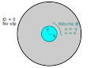
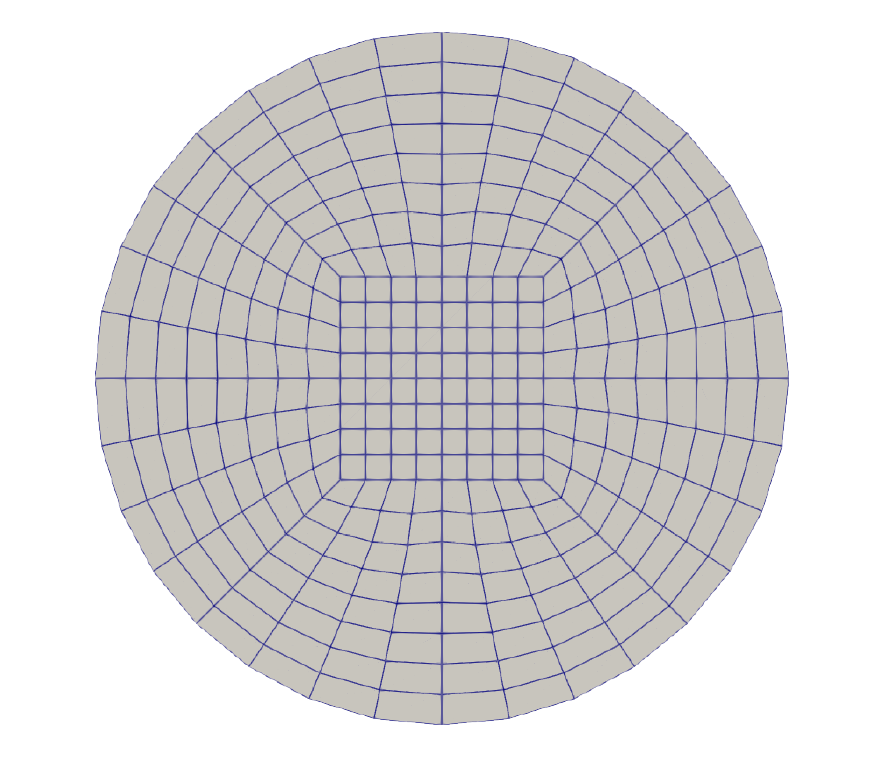
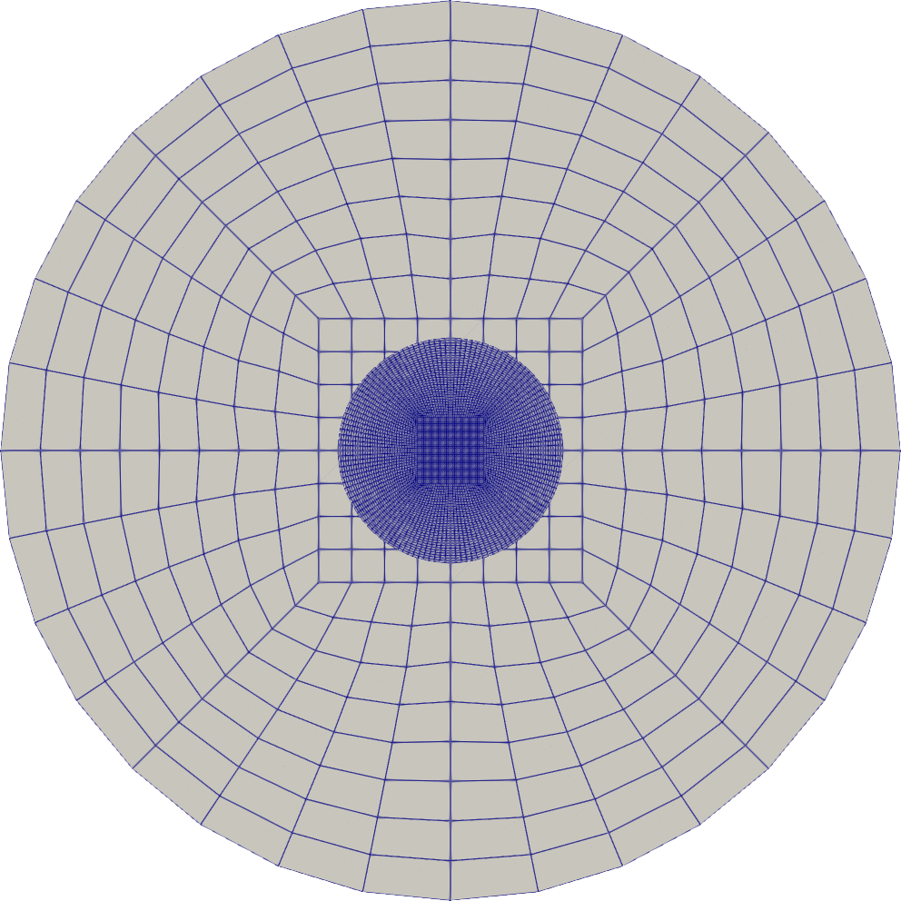
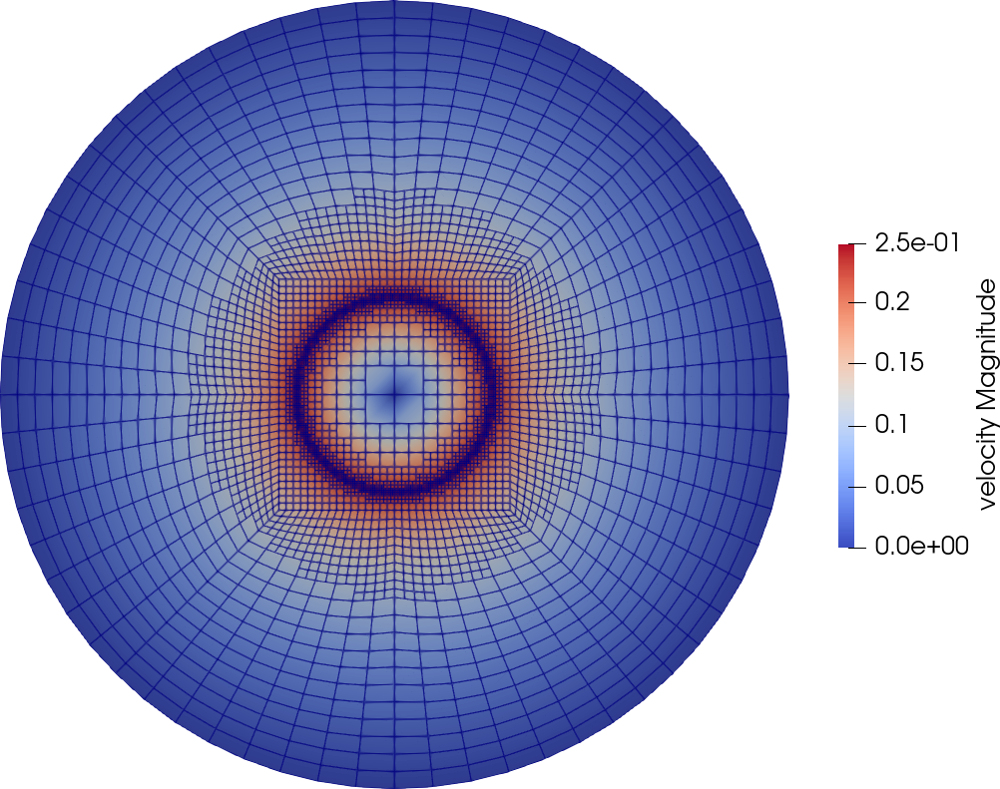

========================================================
Taylor-Couette Flow Using Nitsche Immersed Boundary
========================================================

This example revisits the same taylor-couette flow [#bird2006]_ problem in :doc:`../2d-taylor-couette-flow/2d-taylor-couette-flow`,
now using immersed boundaries to represent the inner cylinder. This example demonstrates some of the capabilities of Lethe to simulate the flow around complex geometries without meshing them explicitly with a conformal mesh, but instead by using the Nitsche immersed boundary method available within Lethe.

---------
Features
---------

- Solvers: ``lethe-fluid-nitsche`` (with Q1-Q1, Q2-Q1 and Q2-Q2)

.. note:: 

    We have not found that Q2-Q2 elements lead to better results when the flows are at a low Reynolds number.

- Steady-state problem
- Displays the use of an adaptive mesh refinement using Nitsche immersed boundaries
- Displays the use of the analytical solution to calculate the mesh convergence 
- Displays the calculation of the torque induced by the fluid on a boundary

----------------------------
Files Used in This Example
----------------------------

Both files mentioned below are located in the example's folder (``examples/incompressible-flow/2d-taylor-couette-nitsche``).

- Parameter file with uniform mesh refinement: ``uniform-taylor-couette-nitsche.prm``
- Parameter file with adaptive mesh refinement: ``adaptive-taylor-couette-nitsche.prm``

-----------------------
Description of the Case
-----------------------

Taylor-Couette flow is the name of a fluid flow in the gap between two long concentric cylinders with different rotational velocities.
We simulate the same case as the regular Taylor-Couette flow where the inner cylinder rotates at a constant angular anti-clockwise velocity :math:`\omega`, while the outer cylinder is fixed.
The following figure shows the geometry of this problem and the corresponding boundary conditions. 

--------------
Parameter File
--------------

We first establish the meshes used for the simulation. Using Nitsche immersed boundaries, two meshes are to be defined : the fluid mesh and the geometry mesh (i.e. the inner cylinder).

Mesh
~~~~~

The ``mesh`` subsection specifies the computational grid:

.. code-block:: text

    subsection mesh
      set type               = dealii
      set grid type          = hyper_ball
      set grid arguments     = 0, 0 : 1 : true
      set initial refinement = 3
    end

The ``type`` specifies the mesh format used. We use the ``hyper_shell`` mesh generated from the deal.II `GridGenerator <https://www.dealii.org/current/doxygen/deal.II/namespaceGridGenerator.html>`_. This GridGenerator generates the mesh of the interstice between two concentric cylinders. The arguments of this grid type are the position of center of the cylinders (``0, 0``), the inner cylinder radius (`0.25`), the outer cylinder radius (`1`) and the number of subdivisions in the azimuthal direction (`4`). All arguments are separated by ``:``. We set ``colorize=true`` and this sets the boundary ID of the inner cylinder to ``0`` and of the outer cylinder to ``1``

The last parameter specifies the ``initial refinement`` of the grid. 

.. note::

  Most deal.II grid generators contain a minimal number of cells. The 2D *hyper_ball* mesh is made of five cells, a square one in the middle and four ones surrounding it. Indicating an ``initial refinement=3`` implies that the initial mesh is refined 3 times. In 2D, each cell is divided by 4 per refinement. Consequently, the final grid is made of 320 cells.

Nitsche Mesh
~~~~~~~~~~~~

The ``Nitsche`` subsection specifies the solid geometry embedded in the fluid domain. The Nitsche Immersed Boundary (IB) uses particles located at the 
Gauss quadrature points of the immersed mesh to represent the immersed body. For a thorough explanation of this, we refer the reader to `step-70 <https://www.dealii.org/developer/doxygen/deal.II/step_70>`_ of deal.II.

.. code-block:: text

    subsection nitsche
      set verbosity        = verbose
      set number of solids = 1
    
      subsection nitsche solid 0
        set beta             = 10
        subsection mesh
          set type               = dealii
          set grid type          = hyper_ball
          set grid arguments     = 0, 0 : 0.25 : true
          set initial refinement = 6
        end
        subsection solid velocity
          set Function expression = -y ; x
        end
        set calculate torque on solid = true
      end
    end

First, we set the ``number of solids`` to specify the amount of geometries that will be represented with Nitsche IB. For each Nitsche IB solid,  we need to specify a ``beta``  coefficient, a mesh and a solid velocity. The ``beta`` coefficient is a parameter used to enforce the Nitsche IB. Its value is generally between 1 and 100 (10 being a reasonable value). The restriction automatically scales with the mesh size. In the case of the mesh, we note that in this problem, the Nitsche solid grid has the same dimension as the background grid. This is necessary for 2D simulations. Also, the Nitsche solid grid is well-refined to ensure that at approximately each fluid cell contains one particle of the immersed body.  The solid velocity of the Nitsche IB is specified using the ``solid velocity`` subsection. By default, the motion of the particle is disabled. This means that even if the immersed particles have a non-zero velocity, they will not physically move in the fluid domain. In this case, this is useful because our problem has rotation symmetry and we will be seeking steady-state solutions.  Finally, we enable the calculation of the torque on the Nitsche IB by setting ``calculate torque on solid = true``. 

The following figure illustrates the background mesh as well as the particles used to represent the IB on top of it:

Boundary Conditions
~~~~~~~~~~~~~~~~~~~

The ``boundary conditions`` subsection becomes simple since the inner cylinder boundaries were specified in the previous section.

.. code-block:: text

    subsection boundary conditions
      set number = 1
      subsection bc 0
        set id   = 0
        set type = noslip
      end
    end

First, the ``number`` of boundary conditions to be applied must be specified. For each boundary condition, the ``id`` of the boundary as well as its ``type`` must be specified. The outer cylinder (``0``) is static and, consequently, a ``noslip`` boundary condition is applied. 

Physical Properties
~~~~~~~~~~~~~~~~~~~

The analytical solution for the Taylor-Couette problem is only valid at low Reynolds number. We thus set the kinematic viscosity to 1.

.. code-block:: text

    subsection physical properties
      subsection fluid 0
        set kinematic viscosity = 1.0
      end
    end

FEM Interpolation
~~~~~~~~~~~~~~~~~

.. note::

  In `Example 2 <https://chaos-polymtl.github.io/lethe/documentation/examples/incompressible-flow/2d-taylor-couette-flow/2d-taylor-couette-flow.html>`_ we have used second order element for velocity. In this problem, since we are using immersed boundary conditions, moving to higher order polynomials would not enhance the order of convergence as the solid boundary is not represented with high accuracy.

.. code-block:: text

    subsection FEM
      set velocity order = 1
      set pressure order = 1
    end

Analytical Solution
~~~~~~~~~~~~~~~~~~~

Like in the first Taylor-Couette example, we add an analytical solution section to the parameter handler file. This analytical solution is more complex to define, 
since the simulation domain encompasses the inside of the inner cylinder as well as the gap between the cylinders. Because of this, we only specify the analytical 
solution for the velocity field and forego pressure. The analytical solution is only defined in the ``.prm`` file and we do not reproduce it here for the sake of brevity.

Forces
~~~~~~

The ``forces`` subsection controls the postprocessing of the torque and the forces acting on the boundaries of the domain.

.. code-block:: text

    subsection forces
      set verbosity             = verbose   # Output force and torques in log 
      set calculate torque      = true      # Enable torque calculation
      set torque name           = torque    # Name prefix of torque files
      set calculation frequency = 1         # Frequency of the force calculation
      set output frequency      = 1         # Frequency of file update
    end

By setting ``calculate torque = true``, the calculation of the torque resulting from the fluid dynamics physics on every boundary of the domain is automatically calculated. 
Setting ``verbosity=verbose`` will print out the value of the torque calculated for each mesh. 

Simulation Control and Mesh Refinement
~~~~~~~~~~~~~~~~~~~~~~~~~~~~~~~~~~~~~~

As stated above, this problem can either be solved using a uniform mesh refinement or using an adaptive mesh refinement

Uniform Mesh Refinement
***********************

The ``simulation control`` subsection controls the flow of the simulation. Two additional parameters are introduced in this example. 
By setting ``number mesh adapt=4`` we configure the simulation to solve the fluid dynamics on the mesh and on four(4) subsequently refined mesh. 
This approach is very interesting, because the solution on the coarse mesh also serves as the initial guest for the solution on the finer mesh. 

.. code-block:: text

    subsection simulation control
      set method            = steady
      set number mesh adapt = 4
      set output name       = taylor_couette_22
      set output frequency  = 1
      set output path       = ./
    end

We then set the mesh adaptation ``type`` to ``uniform``.

.. code-block:: text

    subsection mesh adaptation
      set type = uniform
    end

Adaptive Mesh Refinement
**************************

Since the Nitsche IB method introduces additional error on the surface of the immersed geometry, it is pertinent to investigate the results it can produce with 
adaptive mesh refinement. We now consider the following option:

.. code-block:: text

    subsection simulation control
      set method                  = steady
      set number mesh adapt       = 6
      set output name             = taylor_couette_22
      set output frequency        = 1
      set output path             = ./
    end

The mesh can be dynamically adapted using Kelly error estimates on the velocity, pressure or variables arising from other physics. 

.. code-block:: text

    subsection mesh adaptation
      set type                 = kelly
      set variable             = velocity
      set fraction type        = number
      set max number elements  = 500000
      set max refinement level = 15
      set min refinement level = 0
      set frequency            = 1
      set fraction refinement  = 0.3
      set fraction coarsening  = 0.15
    end

Rest of the Subsections
~~~~~~~~~~~~~~~~~~~~~~~

The ``non-linear solver`` and ``linear solver`` subsections do not contain any new information in this example.

----------------------
Running the Simulation
----------------------
Launching the simulation is as simple as specifying the executable name and the parameter file. Assuming that the ``lethe-fluid-nitsche`` executable is within your path, the simulation can be launched by typing:

.. code-block:: text
  :class: copy-button

  lethe-fluid-nitsche uniform-nitsche-taylor-couette.prm

or 

.. code-block:: text
  :class: copy-button

  lethe-fluid-nitsche adaptive-nitsche-taylor-couette.prm

Lethe will generate a number of files. The most important one bears the extension ``.pvd``. It can be read by popular visualization programs such as `Paraview <https://www.paraview.org/>`_. 

----------------------
Results and Discussion
----------------------

Uniform Mesh Refinement
~~~~~~~~~~~~~~~~~~~~~~~
For the uniform mesh refinement problem, the evolution of the L2 error is as follows:

.. code-block:: text

  cells error_velocity  error_pressure 
    320 2.6290e-02    - 1.5068e-02     - 
   1280 1.2266e-02 1.10 1.9538e-02 -0.37 
   5120 6.2622e-03 0.97 1.7759e-02  0.14 
  20480 3.2062e-03 0.97 1.7740e-02  0.00 
  81920 1.5688e-03 1.03 1.7626e-02  0.01 

We discard the results for pressure since we have not specified an analytical solution. We note that as the number of cells increases, 
the error converges to zero at first order (error is divided by two when the mesh size decreases by a factor of two).

The torque on the inner cylinder is given in the ``torque_solid.00.dat`` file:

.. code-block:: text

  cells     T_x          T_y          T_z      
    320 0.0000000000 0.0000000000 -0.6901522094 
   1280 0.0000000000 0.0000000000 -0.7673814310 
   5120 0.0000000000 0.0000000000 -0.8009318544 
  20480 0.0000000000 0.0000000000 -0.8186962282 
  81920 0.0000000000 0.0000000000 -0.8283917140

whereas the toque on the outer cylinder is given by the ``torque.00.dat`` file:

.. code-block:: text

  cells     T_x          T_y          T_z      
    320 0.0000000000 0.0000000000 0.7223924685 
   1280 0.0000000000 0.0000000000 0.7840745866 
   5120 0.0000000000 0.0000000000 0.8093268556 
  20480 0.0000000000 0.0000000000 0.8229078025 
  81920 0.0000000000 0.0000000000 0.8305030116 

We see that the sum of both torque converge towards zero as the mesh is refined, ensuring that Newton's third law is respected. 
The torque on the inner cylinder should be -0.83776 and we note that the torque on both cylinder converges close to that value. 
Running the simulation with finer meshes lead to this results.

adaptive Mesh Refinement
~~~~~~~~~~~~~~~~~~~~~~~~~~~

Using Paraview, the steady-state velocity profile can be visualized for the adaptive mesh refinement case:

The end of the simulation log provides the following information about the convergence of the error:

.. code-block:: text

    cells error_velocity   error_pressure  
      320 2.6280e-02    - 1.5068e-02     - 
      620 1.2500e-02 1.07 1.9900e-02 -0.40 
     1196 6.4573e-03 0.95 1.7950e-02  0.15 
     2312 3.3532e-03 0.95 1.8708e-02 -0.06 
     4580 1.5891e-03 1.08 1.7682e-02  0.08 
     9056 8.4245e-04 0.92 1.7687e-02 -0.00 
    18284 4.3930e-04 0.94 1.8065e-02 -0.03

Correspondingly, the torque on the inner cylinder:

.. code-block:: text

  cells     T_x          T_y           T_z      
    320 0.0000000000 0.0000000000 -0.6902135017 
    620 0.0000000000 0.0000000000 -0.7681788397 
   1196 0.0000000000 0.0000000000 -0.8020340261 
   2312 0.0000000000 0.0000000000 -0.8196041387 
   4580 0.0000000000 0.0000000000 -0.8289292869 
   9056 0.0000000000 0.0000000000 -0.8332883003 
  18284 0.0000000000 0.0000000000 -0.8353647429

We see that even for a small number of cells (~18k), the error on the torque is less than 0.5%.

----------------------------
Possibilities for Extension
----------------------------

- Calculate formally the order of convergence for the torque :math:`T_z`.
- It could be very interesting to investigate this flow in 3D at a higher Reynolds number to see the apparition of the Taylor-Couette instability. 

------------
Reference
------------

.. [#bird2006] \R. B. Bird, W. E. Stewart, and E. N. Lightfoot, *Transport Phenomena*, vol. 1. John Wiley & Sons, 2006\.
