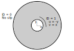
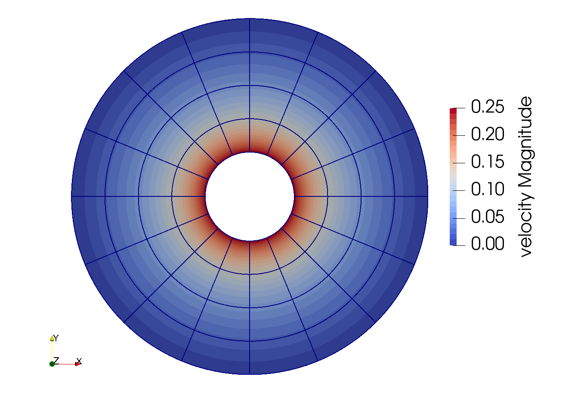
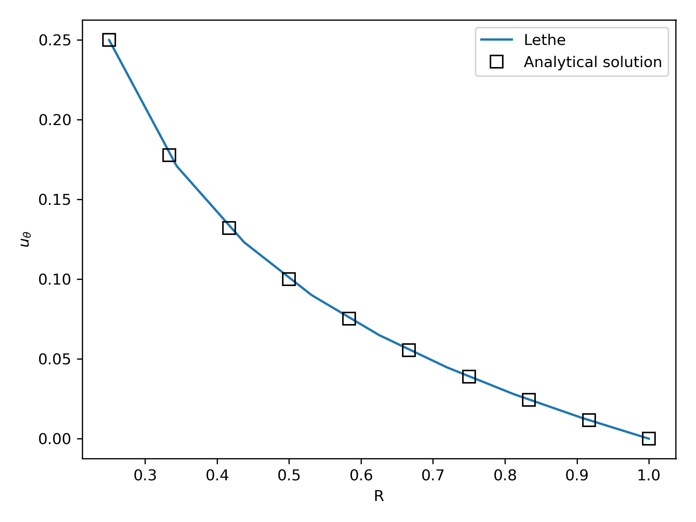

==================================
Taylor-Couette Flow
==================================

This example showcases another classical fluid mechanics problem, the Taylor-Couette flow. This example introduces the usage of analytical solution and monitors the convergence of the CFD solver by using progressively refined meshes.

---------
Features
---------

- Solvers: ``lethe-fluid`` (with Q1-Q1 and Q2-Q1) or  ``lethe-fluid-block`` (with Q2-Q1)
- Steady-state problem
- Displays the use of the analytical solution to calculate the mesh convergence 
- Displays the calculation of the torque induced by the fluid on a boundary

----------------------------
Files Used in This Example
----------------------------

All files mentioned below are located in the example's folder (``examples/incompressible-flow/2d-taylor-couette``).

- Parameter file: ``taylor-couette.prm``
- Postprocessing Python script: ``postprocess_taylor_couette.py``

-----------------------
Description of the Case
-----------------------

Taylor-Couette flow is a fluid flow in the gap between two long concentric cylinders with different rotational velocities. One or both of these cylinders may rotate along the axis, however generally it is assumed that the outer cylinder is fixed, and the inner cylinder rotates with a constant angular velocity. For the Taylor-Couette flow, an analytical solution of the Navier-Stokes equations can be found, although this solution is not stable for all ranges of operating conditions and becomes unstable at high Reynolds number.

We assume that the inner cylinder rotates at a constant angular velocity :math:`\omega` in the anti-clockwise direction, while the outer cylinder is fixed. The following figure shows the geometry of this problem and the corresponding boundary conditions:

The analytical solution of this problem can be found relatively easily in cylindrical coordinates (see for example the book by Bird, Stewart and Lightfoot [1]):

.. math::

  u_{\theta} = \omega R \kappa \frac{\left ( \frac{R}{r} - \frac{r}{R} \right )} {\left( \frac{1}{\kappa} - \kappa \right)}

where :math:`u_{\theta}` is the angular velocity, :math:`R` is the radius of the outer cylinder, :math:`\kappa` takes a value between 0 and 1.0 and represents the ratio between the radius of the inner cylinder and the radius of the outer cylinder (:math:`\kappa=R_{i}/ R`) and :math:`r` is the radial position. Since the simulation in Lethe is in Cartesian coordinates, this analytical solution will have to be converted to Cartesian coordinates to be usable. As we shall see, this is not as hard as it seems. Interestingly, this flow also possesses an analytical solution for the torque :math:`T_z` acting on the inner cylinder:

.. math::
  T_z = 4 \pi \mu \omega  R^2 L \frac{\kappa^2}{1-\kappa^2}

where :math:`\mu` is the dynamic viscosity and :math:`L` is the height of the cylinder. Since we simulate the problem in 2D, we assume that :math:`L=1` without loss of generality.

--------------
Parameter File
--------------

We first establish the mesh used for the simulation

Mesh
~~~~~

The ``mesh`` subsection specifies the computational grid:

.. code-block:: text

    subsection mesh
      set type               = dealii
      set grid type          = hyper_shell
      set grid arguments     = 0, 0 : 0.25 : 1 : 4:  true
      set initial refinement = 3
    end

The ``type`` specifies the mesh format used. We use the ``hyper_shell`` mesh generated from the deal.II `GridGenerator <https://www.dealii.org/current/doxygen/deal.II/namespaceGridGenerator.html>`_ . This GridGenerator generates the mesh of the interstice between two concentric cylinder. The arguments of this grid type are the position of center of the cylinders (``0, 0``), the inner cylinder radius (`0.25`), the outer cylinder radius (`1`) and the number of subdivision in the azimuthal direction (`4`). All arguments are separated by ``:``. We set ``colorize=true`` and this sets the boundary ID of the inner cylinder to ``0`` and of the outer cylinder to ``1``.

The last parameter specifies the ``initial refinement`` of the grid. Most deal.II grid generators contain a minimal number of cells. The *hyper_shell* mesh is made of four cells. Indicating an ``initial refinement=3`` implies that the initial mesh is refined 3 times. In 2D, each cell is divided by 4 per refinement. Consequently, the final grid is made of 256 cells.

Boundary Conditions
~~~~~~~~~~~~~~~~~~~

The ``boundary conditions`` subsection establishes the constraints on different parts of the domain:

.. code-block:: text

    subsection boundary conditions
      set number = 2
      subsection bc 0
        set type = function
        subsection u
          set Function expression = -y
        end
        subsection v
          set Function expression = x
        end
        subsection w
          set Function expression = 0
        end
      end
      subsection bc 1
        set type = noslip
      end
    end

First, the ``number`` of boundary conditions to be applied must be specified. For each boundary condition, the ``id`` of the boundary as well as its ``type`` must be specified. The outer cylinder (``1``) is static and, consequently, a ``noslip`` boundary condition is applied. The inner cylinder is rotating at a constant angular velocity (:math:`\omega=1`). To impose this boundary condition, we use the ``type=function`` and prescribe a function for the components of the velocity (remembering that :math:`\mathbf{u}=[u,v]^T`). By prescribing :math:`\mathbf{u}=[-y,x]^T`, we prescribe the rotation of the inner cylinder at an angular velocity of :math:`1 \ \text{rad/s}` in the trigonometric direction.

Physical Properties
~~~~~~~~~~~~~~~~~~~

The analytical solution for the Taylor-Couette problem is only valid at low Reynolds number. We thus set the kinematic viscosity to 1.

.. code-block:: text

    subsection physical properties
      subsection fluid 0
        set kinematic viscosity = 1.0
      end
    end

FEM Interpolation
~~~~~~~~~~~~~~~~~

Lethe supports the use of arbitrary interpolation order. The :math:`\mathcal{L}^2` norm of the error is :math:`\mathcal{O}\left(h^{n+1} \right)` where :math:`h` is a measure of the element size and :math:`n` is the interpolation order of the velocity. However, since the torque applied on the inner cylinder depends on the deviatoric stress tensor, which depends on the velocity gradient, its error will be :math:`\mathcal{O}(h^n)`. Taking this into account, we use second order polynomials in this example to obtain higher accuracy on the torque. We specify the interpolation order for both pressure and velocity using the ``FEM`` subsection:

.. code-block:: text

    subsection FEM
        set velocity order = 2
        set pressure order = 1
    end

.. note::
    With the ``lethe-fluid`` solver, Q2-Q2 elements could also be used. However, we have not found that these lead to better results when the flows are at a low Reynolds number.

Analytical Solution
~~~~~~~~~~~~~~~~~~~~

To monitor the convergence of the CFD solver, we can provide Lethe with an expression for the analytical expression of the velocity field. Using this expression and the velocity field obtained from the solver, Lethe will calculate the :math:`\mathcal{L}^2` norm of the error. The :math:`L^2` norm of the error is calculated as:

.. math::
 L^2 = \int_\Omega (u-u_a)^2 \mathrm{d} \Omega

where :math:`u` is the numerical solution, :math:`u_a` is the analytical solution and :math:`\Omega` is the domain of the simulation.

.. code-block:: text

    subsection analytical solution
      set enable = true
      subsection uvwp
        # A= -(kappa * kappa) / (1. - kappa * kappa);
        # B= ri * ri / (1. - kappa * kappa);
        set Function constants  = kappa=0.25, ri=0.25, A=-0.06666666666666667, B=0.06666666666666666667
        set Function expression = -sin(atan2(y,x))*(-(kappa*kappa) / (1-kappa*kappa)* sqrt(x*x+y*y)+ ri*ri/(1-kappa*kappa)/sqrt(x*x+y*y)); cos(atan2(y,x))*(-(kappa*kappa) / (1-kappa*kappa)* sqrt(x*x+y*y)+ ri*ri/(1-kappa*kappa)/sqrt(x*x+y*y)) ; A*A*(x^2+y^2)/2 + 2 *A*B *ln(sqrt(x^2+y^2)) - 0.5*B*B/(x^2+y^2)
      end
    end

To monitor the error in a simulation, we must set ``enable = true``. We must convert the analytical solution from cylindrical coordinates to Cartesian and this is why the resulting ``Function expression`` is slightly barbaric. Notably, this explains why we often see the occurrence of the term ``sqrt(x^2+y^2)`` which is in fact the radius :math:`r=\sqrt{x^2+y^2}`.

Simulation Control
~~~~~~~~~~~~~~~~~~~~

The ``simulation control`` subsection controls the flow of the simulation. Two additional parameters are introduced in this example. By setting ``number mesh adapt = 3`` we configure the simulation to solve the fluid dynamics on the mesh and on two subsequently refined meshes. This approach is very interesting, because the solution on the coarse mesh also serves as the initial guest for the solution on the finer mesh. We set ``subdivision = 2`` to allow the rendering of high-order elements in Paraview. This will be explained later in the example.

.. code-block:: text

    subsection simulation control
      set method            = steady
      set output name       = couette
      set subdivision       = 2
      set number mesh adapt = 3 # time-stepping method must be "steady"
    end

Mesh Adaptation
~~~~~~~~~~~~~~~~~~

Mesh adaptation is quite complex in Lethe. The mesh can be dynamically adapted using Kelly error estimates on the velocity, pressure or variables arising from other physics. Lethe also supports uniform mesh refinement. Since we wish to measure the convergence of the error with respect to an analytical solution, we specify a uniform mesh refinement by setting ``type = uniform``

.. code-block:: text

    subsection mesh adaptation
      set type = uniform
    end

Forces
~~~~~~~

The ``forces`` subsection controls the postprocessing of the torque and the forces acting on the boundaries of the domain.

.. code-block:: text

    subsection forces
      set verbosity        = verbose # Output force and torques in log <quiet|verbose>
      set calculate torque = true    # Enable torque calculation
    end

By setting ``calculate torque = true``, the calculation of the torque resulting from the fluid dynamics physics on every boundary of the domain is automatically calculated. Setting ``verbosity = verbose`` will print out the value of the torque calculated for each mesh.

Rest of the Subsections
~~~~~~~~~~~~~~~~~~~~~~~~

The ``non-linear solver`` and ``linear solver`` subsections do not contain any new information in this example.

----------------------
Running the Simulation
----------------------
Launching the simulation is as simple as specifying the executable name and the parameter file. Assuming that the ``lethe-fluid`` executable is within your path, the simulation can be launched by typing:

.. code-block:: text
  :class: copy-button

  lethe-fluid taylor-couette.prm

Lethe will generate a number of files. The most important one bears the extension ``.pvd``. It can be read by visualization programs such as `Paraview <https://www.paraview.org/>`_.

----------------------
Results and Discussion
----------------------

Using Paraview, the steady-state velocity profile can be visualized:

As it can be seen, each cell is curved because a Q2 isoparametric mapping was used (by setting ``qmapping = true`` in the FEM subsection). To visualize these high-order cells, we need to subdivide the regular cell to store additional information onto them. A good practice is to use as many subdivisions as the interpolation order of the scheme. Hence, we used ``subdivision = 2`` in the simulation control subsection. Finally, by default, Paraview does not render high-order elements. To enable the rendering of high-order elements, the *Nonlinear Subdivision Level* slider must be increased above one. For more information on this topic, please consult the deal.II wiki page on `rendering high-order elements <https://github.com/dealii/dealii/wiki/Notes-on-visualizing-high-order-output>`_.

.. note::
  To showcase the curvature of the cells, we have illustrated the results on a mesh coarser that the initial mesh used in this simulation.

A python script provided in the example folder allows to compare the velocity profile along the radius with the analytical solution. Using this script, the following resuts are obtained for the initial mesh:

The end of the simulation log provides the following information about the convergence of the error:

.. code-block:: text

  cells  error_velocity    error_pressure   
    256 9.623524e-05    - 2.595531e-04    - 
   1024 1.270925e-05 2.92 6.696872e-05 1.95 
   4096 1.613718e-06 2.98 1.675237e-05 2.00 
  16384 2.025381e-07 2.99 4.181523e-06 2.00 

This table reports the :math:`\mathcal{L}^2` norm of the error as a function of the number of cells. The third and the fifth column report the apparent order of convergence of the scheme. We see that the velocity converges at third order and the pressure at second order. This is exactly what is expected when using Q2-Q1 elements.

.. note::
  A curious reader will find that very similar results are obtained when using Q2-Q2 elements. For flows at low Reynolds number, using equal order elements for the pressure does not lead to a higher convergence rate. 
  
Finally, the simulation produces a file that contains the torque calculated on every boundary. The file ``torque.00.dat`` contains the torque on ``bc 0`` and the file ``torque.01.dat`` contains the torque on ``bc 1``.

For the boundary 0, the following torques are obtained:

.. code-block:: text

  cells     T_x          T_y           T_z      
  256   0.0000000000 0.0000000000 -0.8192063151 
  1024  0.0000000000 0.0000000000 -0.8319958810 
  4096  0.0000000000 0.0000000000 -0.8361362739 
  16384 0.0000000000 0.0000000000 -0.8373265692 

For the boundary 1, the following torques are obtained:

.. code-block:: text

   cells     T_x          T_y          T_z      
    256 0.0000000000 0.0000000000 0.8357077079 
   1024 0.0000000000 0.0000000000 0.8372702342 
   4096 0.0000000000 0.0000000000 0.8376393911 
  16384 0.0000000000 0.0000000000 0.8377288180

The analytical value of the torque is : :math:`T_z=0.837758`. Two main conclusions can be drawn. First, the torque obtained from the simulation on both boundaries converges to the analytical solution (at a second-order rate). Secondly, the torque on the difference between the torque on the outer and the inner cylinder converges to zero. This is what we would expect due to Newton's third law (action-reaction). However, it is only reached once the mesh is sufficiently fine and we note a significant (:math:`\approx 2\%`) disagreement between the two torques for the coarsest mesh.

----------------------------
Possibilities for Extension
----------------------------

- Calculate the order of convergence for the torque :math:`T_z`.
- It could be very interesting to investigate this flow in 3D at a higher Reynolds number to see the apparition of the Taylor-Couette instability. This, however, would be a major undertaking. 

------------
References
------------

[1] R. B. Bird, W. E. Stewart, and E. N. Lightfoot, *Transport Phenomena*, vol. 1. John Wiley & Sons, 2006.