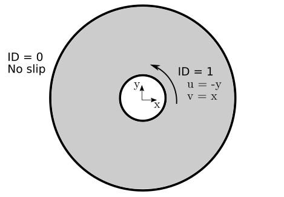

==================================
2D Taylor-Couette Flow
==================================

This is the second Lethe example. It showcases another classical fluid mechanics problem, the taylor-couette flow. This example introduces 

Features
----------------------------------
- Solvers: ``gls_navier_stokes_2d`` (with Q1-Q1) or  ``gd_navier_stokes_2d`` (with Q2-Q1)
- Steady-state problem
- Displays the use of the analytical solution to calculate the mesh convergence 
- Displays the calculation of the torque induced by the fluid on a boundary

Location of the examples
------------------------
``examples/incompressible_flow/2d_taylor-couette/taylor-couette.prm``

Description of the case
-----------------------

The Taylor-Couette flow is the name of a fluid flow in the gap between two long concentric cylinders with different rotational velocities. One or both of these cylinders may rotate along the axis, however generally it is assumed that outer cylinder is fixed, and the inner cylinder rotates with a constant angular velocity. For the Taylor-Couette flow, an analytical solution of the Navier-Stokes equations can be found, although this solution is not stable for all ranges of operating conditions and becomes instable at high Reynolds number.

We assume that the inner cylinder rotates at a constant velocity :math:`\Omega` , while the outer cylinder is fixed. The following figure shows the geometry of this problem and the corresponding boundary conditions:

Note that the outer cylinder does not rotate, while the inner cylinder rotates anti-clockwise. The analycal solution of this problem can be found relatively easily in cylindrical coordinates (see for example the book by Bird, Stewart and Lightfoot [1]):

.. math::

  u_{\theta} = \Omega R \frac{\left ( \frac{r}{\kappa R} - \frac{\kappa R}{r} \right )} {\left( \frac{1}{\kappa} - \kappa \right)}

where :math:`u_{\theta}` is the angular velocity, :math:`R` is the radius of the outer cylinder, :math:`\kappa` is the radius of the inner cylinder divided by the radius of the outer cylinder and :math:`r` is the radial position. Since the simulation in Lethe is in Cartesian coordinate, this analytical solution will have to be converted to Cartesian coordinates to be usable. As we shall see, this is not as hard as it seems. Interestingly, this flow also possesses an analytical solution for the torque :math:`T_z` acting on the inner cylinder:

.. math::
  T_z = 4 \pi \mu R^2 L \frac{\kappa^2}{1-\kappa^2}

where `\mu` is the dynamic viscosity and `L` is the height of the cylinder. Since we simulate the problem in 2D, we assume that :math:`L=1` without loss of generality.

Parameter file
--------------

We first establish the mesh used for the simulation

Mesh
~~~~~

The ``mesh`` subsection specifies the computational grid:

.. code-block:: text

    subsection mesh
        set type                 = dealii
        set grid type            = hyper_cube
        set grid arguments       = 0 : 1 : true
        set initial refinement   = 6
    end

The ``type`` specifies the mesh format used. At the moment, Lethe supports two mesh formats: ``dealii`` and ``gmsh``. ``dealii`` meshes are in-situ generated meshes for simple geometries. The type of grid generated is specified by the ``grid type`` parameters and this grid is parametrized by it's ``grid arguments``.
Since the lid-driven cavity problem domain is a square, we use the *hyper_cube* ``grid_type``. The arguments of this grid type are the position of the bottom left corner, the position of the top right corner and the option to colorize the boundaries in order to give each of them a unique ID. The IDs will be used to set the boundary conditions on specific parts of the boundary of the domain. The ID given to each face was given in the graphical description of the case. If ``colorize`` option were set to false, all boundaries would have been given the ID ``0``. We refer to the documentation of the deal.ii `GridGenerator <https://www.dealii.org/current/doxygen/deal.II/namespaceGridGenerator.html>`_ for a detailed explanation of the available grids. 

It is a bit surprising that the position of the bottom left and the top right corner are specified by a single value. Since the geometry is a square, the position of the corner is specified using a single number, assuming that this identifies both the x and y value associated with that point. Other grid generators, such as the ``hyper_rectangle``, allow for more flexibility.

The last parameter specifies the ``initial refinement`` of the grid. Most deal.ii grid generators contain a minimal number of cells. For example, the *hyper_cube* mesh is made of a single cell. Indicating an ``initial refinement=6`` implies that the initial mesh is refined 6 times. In 2D, each cell is divided by 4 per refinement. Consequently, the final grid is made of :math:`2^{(2\cdot6)}=4096` cells.

Boundary conditions
~~~~~~~~~~~~~~~~~~~

The ``boundary conditions`` subsection establishes the constraints on different parts of the domain:

.. code-block:: text

    subsection boundary conditions
    set number                  = 4
        subsection bc 0
            set id                = 0
            set type              = noslip
        end
        subsection bc 1
            set id                = 1
            set type              = noslip
        end
        subsection bc 2
            set id                = 2
            set type              = noslip
        end
        subsection bc 3
            set id                = 3
            set type              = function
            subsection u
                set Function expression = 1
            end
            subsection v
                set Function expression = 0
            end
        end
    end

First, the ``number`` of boundary conditions to be applied must be specified. For each boundary condition, the ``id`` of the boundary as well as its ``type`` must be specified. The left (``0``), right (``1``) and bottom (``2``) walls are static and, consequently, a ``noslip`` boundary condition can be used. This boundary condition imposes :math:`\mathbf{u} = [0,0]^T`. For the top wall, we use the ``function`` boundary type. This type of boundary condition allows us to define the value of the velocity components using ``Function expression``. We set :math:`u=1` and :math:`v=0`. Note that the ``Function expression`` supports writing complex mathematical expressions which may depend on the spatial coordinates (:math:`x,y,z`) and on time.

Physical properties
~~~~~~~~~~~~~~~~~~~

For the base case, we wish to simulate the lid-driven cavity at a Reynolds number of 400. Since the characteristic dimension of the cavity is :math:`L=1` and the velocity of the top boundary is :math:`u=1`, the Reynolds number is :math:`Re=\frac{1}{\nu}` where :math:`\nu` is the kinematic viscosity. The kinematic viscosity is set by the ``physical properties`` subsection:

.. code-block:: text

  subsection physical properties
    subsection fluid 0
      set kinematic viscosity            = 0.0025
    end
  end

By default, simulations only contain a single fluid which is labeled ``0``.

FEM interpolation
~~~~~~~~~~~~~~~~~

Lethe supports the use of arbitrary interpolation order. The default solver for this case is ``gls_navier_stokes_2d`` which uses a stabilized method and supports equal order interpolation. 

We specify the interpolation order for both pressure and velocity using the ``FEM`` subsection:

.. code-block:: text

    subsection FEM
        set velocity order            = 1
        set pressure order            = 1
    end

.. warning:: 
    An alternative would be to use the ``gd_navier_stokes_2d`` solver; for `LBB <https://en.wikipedia.org/wiki/Ladyzhenskaya%E2%80%93Babu%C5%A1ka%E2%80%93Brezzi_condition>`_ stable elements must be used (e.g. Qn-Q(n-1)). Only the stabilized solver supports the use of equal order elements. 

Non-linear solver parameters
~~~~~~~~~~~~~~~~~~~~~~~~~~~~

Lethe is an implicit CFD solver. Consequently, each time-step requires the solution of a non-linear system of equations. By default, Lethe uses a Newton solver for which a ``tolerance`` must be specified:

.. code-block:: text

  subsection non-linear solver
    set tolerance               = 1e-8
    set verbosity               = verbose
  end

The ``verbosity`` option specifies if details about the non-linear solver steps (residual value and iteration number) will be printed out to the terminal. By setting it to ``verbose``, this information is printed out, whereas ``quiet`` would mute all outputs of the non-linear solver. We recommend to always set ``verbosity=verbose`` in order to monitor possible non-convergence of the solver.

Linear solver parameters
~~~~~~~~~~~~~~~~~~~~~~~~~~~~

Each non-linear solver step requires the solution of a linear system of equations. Lethe has multiple options to parametrize its linear solvers, but here, we only enable its verbosity to monitor the number of iteration per time step and use the default parameters for the rest. 

.. note:: 
    A good thing to remember is that, generally, linear solver parameters control the robustness of the simulation.

.. code-block:: text

  subsection linear solver
    set method                                 = amg
    set verbosity                              = verbose
  end

Simulation control
~~~~~~~~~~~~~~~~~~~~~~~~~~~~

The last subsection, which is generally the one we put at the top of the parameter files, is the ``simulation control`` . In this example, it is only used to specify the name of the output files:

.. code-block:: text

  subsection simulation control
    set method      = steady 
    set output name = output_cavity
  end

Running the simulation
----------------------
Launching the simulation is as simple as specifying the executable name and the parameter file. Assuming that the ``gls_navier_stokes_2d`` executable is within your path, the simulation can be launched by typing:

.. code-block:: text

  gls_navier_stokes_2d cavity.prm

Lethe will generate a number of files. The most important one bears the extension ``.pvd``. It can be read by popular visualization programs such as `Paraview <https://www.paraview.org/>`_. 

Base case results (Re=400)
---------------------------

Using Paraview, the steady-state velocity profile and the streamlines can be visualized:

.. image:: images/result_re_400.png
    :alt: velocity distribution
    :align: center

It is also very interesting to compare the results with those obtained in the literature. A python script provided in the example folder allows to compare the velocity profile along de y axis for :math:`x=0.5` with results from the literature. Using this script, the following resuts are obtained for ``initial refinement = 6``

.. image:: images/lethe_ghia_re_400_comparison.png
    :alt: re_400_comparison
    :align: center

We note that the agreement is perfect. This is not surprising, especially considering that these results were obtained at a relatively low Reynolds number.

.. note:: 
    The vtu files generated by Lethe are compressed archives. Consequently, they cannot be postprocessed directly. Although they can be easily post-processed using Paraview, it is sometimes necessary to be able to work with the raw data. The python library `PyVista <https://www.pyvista.org/>`_  allows us to do this.

Results
~~~~~~~~~

Possibilities for extension
----------------------------

- **Validate at even higher Reynolds numbers:** 

References
------------

[1] Bird, R. B., Stewart, W. E., & Lightfoot, E. N. (2006). Transport phenomena (Vol. 1). John Wiley & Sons.