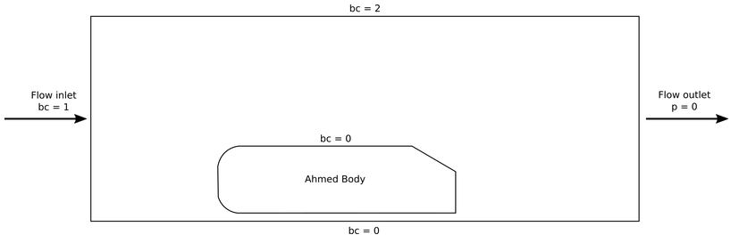
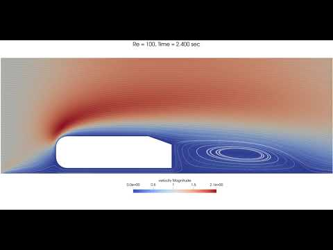
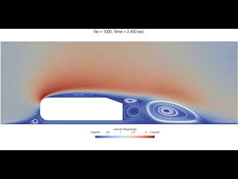
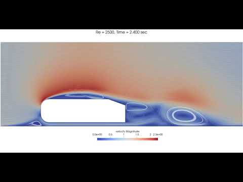

======================================
2D Transient flow around an Ahmed body
======================================

Features
---------

- Solver: ``gls_navier_stokes_2d`` (with Q1-Q1) 
- Transient problem
- Displays how to import and easily adapt a gmsh file

Location of the examples
-------------------------

- Parameter file: ``/examples/incompressible_flow/2d_ahmed_body/ahmed.prm``
- Geometry file: ``/examples/incompressible_flow/2d_ahmed_body/Ahmed_Body_20_2D.geo``
- Mesh file: ``/examples/incompressible_flow/2d_ahmed_body/Ahmed_Body_20_2D.geo``

Description of the case
--------------------------
In this example, a flow is passing across a fixed Ahmed body (simplified version of a car, classical benchmark for aerodynamic simulation tools). The velocity profile of the flow is simulated. The parameter file used is ``ahmed.prm``.

The following schematic describes the simulation.

* bc = 0 (No slip boundary condition)
* bc = 1 (u = 1; flow in the x-direction)
* bc = 2 (Slip boundary condition)

Geometry and mesh
-----------------
The basic geometry for the Ahmed body is given below, as defined in Ahmed and al., 1984, with all measures in mm.

.. image:: images/ahmed_geometry.png
    :alt: Geometry detailed description
    :align: center
    :name: geometry_detailed

Geometry parameters can be adapted in the "Parameters" section of the ``.geo`` file, as shown below. Namely the step parameter ``phi`` can be easily adapted.

.. code-block:: text

    //===========================================================================
    //Parameters
    //===========================================================================
    unit = 1000; //length unit : 1 -> mm ; 1000 -> m
    phi = 20; //angle at rear, variable
    esf = 2.0e-1; //element size factor, used in the free quad mesh

    //Ahmed body basic geometry
    L = 1044/unit;
    H = 288/unit;
    R = 100/unit;
    Hw = 50/unit; //wheel height (height from the road)
    Ls = 222/unit; //slope length

    //Fluid domain
    xmin = -500/unit;
    ymin = -Hw;
    xmax = 2500/unit;
    ymax = 1000/unit;

The initial mesh is built with `Gmsh <https://gmsh.info/#Download>`_. It is defined as transfinite at the body boundary layer and between the body and the road, and free for the rest of the domain. The mesh is dynamically refined throughout the simulation.

Parameter file
--------------
The initial condition and boundary conditions are defined as in `Example 3 <https://lethe-cfd.github.io/lethe/examples/incompressible-flow/2d-flow-around-cylinder/2d-flow-around-cylinder.html>`_.

Time integration is defined by a 1st order backward differentiation (``bdf1``), for a 4 seconds simulation (``time end``) with a 0.01 second ``time step``. The ``output path`` is defined to save obtained results in a sub-directory, as stated in Simulation Control:

.. code-block:: text

    subsection simulation control
      set method                  = bdf1
      set output frequency        = 1
      set output name             = ahmed-output
      set output path             = ./Re720/
      set time end                = 4
      set time step		      = 0.01
    end

Ahmed body are typically studied considering a 60 m/s flow of air. Here, the flow speed is set to 1 (``u = 1``) so that the Reynolds number for the simulation (``Re = uL/ν``, with ``L`` the height of the Ahmed body) is varied through the kinematic viscosity ``ν``:

.. code-block:: text 

    subsection physical properties
        set kinematic viscosity         = 4e-4
    end

The input mesh ``Ahmed_Body_20_2D.msh`` is in the same folder as the ``.prm`` file and is called with:

.. code-block:: text

    subsection mesh
        set type                 = gmsh
        set file name            = Ahmed_Body_20_2D.msh
    end

The simulation is launched in the same folder as the ``.prm`` and ``.msh`` file, using the ``gls_navier_stokes_2d`` solver. To decrease simulation time, it is advised to run on multiple cpu, using ``mpirun``:

.. code-block:: text

      mpirun -np 6 ../../exe/bin/gls_navier_stokes_2d ahmed.prm

where here 6 is the number of cpu used. The estimated execution time is 6 minutes and 53 seconds.

Results
-------
Transient results are shown for three ``Re`` values:

+-------+-----------------+--------------------+---------------------------------------+--------------------------------------+
| Re    | :math:`{\nu}`   | Video              | t = 0.5 s                             | t = 4 s                              |
+=======+=================+====================+=======================================+======================================+
| 28.8  | 1e-2            | |video_1_ahmed|_   | .. image:: images/Re28_speed_t05.png  | .. image:: images/Re28_speed_t4.png  |
+-------+-----------------+--------------------+---------------------------------------+--------------------------------------+
| 288   | 1e-3            | |video_2_ahmed|_   | .. image:: images/Re288_speed_t05.png | .. image:: images/Re288_speed_t4.png |
+-------+-----------------+--------------------+---------------------------------------+--------------------------------------+
| 720   | 4e-2            | |video_3_ahmed|_   | .. image:: images/Re720_speed_t05.png | .. image:: images/Re720_speed_t4.png |
+-------+-----------------+--------------------+---------------------------------------+--------------------------------------+

.. _video_1_ahmed: http://www.youtube.com/watch?feature=player_embedded&v=5iqMJ7O_AcU

.. _video_2_ahmed: http://www.youtube.com/watch?feature=player_embedded&v=22salV0Q8_0

.. _video_3_ahmed: http://www.youtube.com/watch?feature=player_embedded&v=SVReNMeDNiE

The mesh and processors load is adapted dynamically throughout the simulation, as shown below for ``Re = 720``.

+-------------+----------------------------------------+
| Time        | Image                                  |
+=============+========================================+
| t = 0 s     | .. image:: images/Re720_mesh_t0.png    |
+-------------+----------------------------------------+
| t = 0.05 s  | .. image:: images/Re720_mesh_t005.png  |
+-------------+----------------------------------------+
| t = 4 s     | .. image:: images/Re720_mesh_t4.png    |
+-------------+----------------------------------------+
