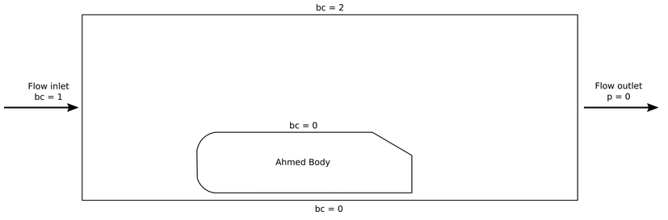
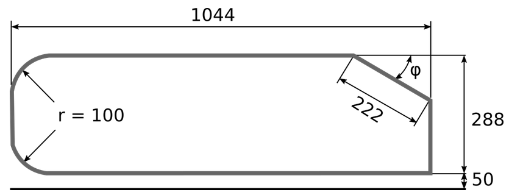
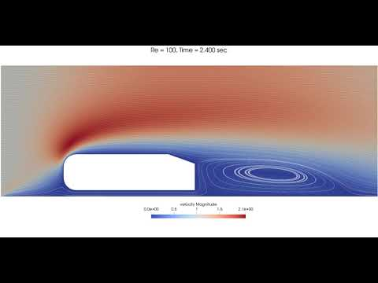
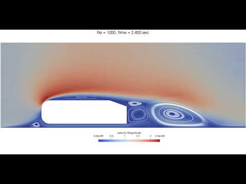
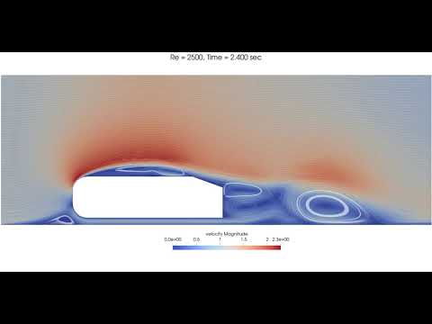

======================================
Transient Flow around an Ahmed Body
======================================

---------
Features
---------

- Solver: ``lethe-fluid`` (with Q1-Q1) 
- Transient problem
- Displays how to import and easily adapt a gmsh file
- Displays how to run case in parallel with mpirun

----------------------------
Files Used in This Example
----------------------------

All files mentioned below are located in the example's folder (``examples/incompressible-flow/2d-ahmed-body``).

- Geometry file: ``Ahmed-Body-20-2D.geo``
- Mesh file: ``Ahmed-Body-20-2D.msh``
- Parameter file: ``ahmed.prm``

--------------------------
Description of the Case
--------------------------

In this example, a flow is passing across a fixed Ahmed body (simplified version of a car, classical benchmark for aerodynamic simulation tools). The velocity profile of the flow is simulated. The parameter file used is ``ahmed.prm``.

The following schematic describes the simulation.

* bc = 0 (No slip boundary condition)
* bc = 1 (u = 1; flow in the x-direction)
* bc = 2 (Slip boundary condition)

The basic geometry for the Ahmed body is given below, as defined in Ahmed et al. `[1] <https://www.jstor.org/stable/44434262>`_, with all measures in mm.

--------------
Parameter File
--------------

First, we import the mesh as in the `2D Flow around a cylinder <https://chaos-polymtl.github.io/lethe/documentation/examples/incompressible-flow/2d-flow-around-cylinder/2d-flow-around-cylinder.html>`_. 

Mesh
~~~~~
Geometry parameters can be adapted in the "Parameters" section of the ``.geo`` file, as shown below. Namely the step parameter ``phi`` can be easily adapted.

.. code-block:: text

    //===========================================================================
    //Parameters
    //===========================================================================
    unit = 1000; //length unit : 1 -> mm ; 1000 -> m
    phi = 20; //angle at rear, variable
    esf = 2.0e-1; //element size factor, used in the free quad mesh

    //Ahmed body basic geometry
    L = 1044/unit;
    H = 288/unit;
    R = 100/unit;
    Hw = 50/unit; //wheel height (height from the road)
    Ls = 222/unit; //slope length

    //Fluid domain
    xmin = -500/unit;
    ymin = -Hw;
    xmax = 2500/unit;
    ymax = 1000/unit;

The initial `Mesh <https://chaos-polymtl.github.io/lethe/documentation/parameters/cfd/mesh.html>`_ is built with `Gmsh <https://gmsh.info/#Download>`_. It is defined as transfinite at the body boundary layer and between the body and the road, and free for the rest of the domain. The mesh is dynamically refined throughout the simulation. This will be explained later in this example.

The input mesh ``Ahmed-Body-20-2D.msh`` is in the same folder as the ``.prm`` file. The mesh subsection is set to use this file.

.. code-block:: text

    subsection mesh
      set type      = gmsh
      set file name = Ahmed-Body-20-2D.msh
    end

.. note::

    For further information about `Mesh <https://chaos-polymtl.github.io/lethe/documentation/parameters/cfd/mesh.html>`_ generation, we refer to the reader to the :doc:`../../../tools/gmsh/gmsh` page of this documentation, or the `GridGenerator <https://www.dealii.org/current/doxygen/deal.II/namespaceGridGenerator.html>`_ on the deal.ii documentation and the `Gmsh <https://gmsh.info/#Download>`_ website.

Initial and Boundary Conditions
~~~~~~~~~~~~~~~~~~~~~~~~~~~~~~~~
The `Initial Condition <https://chaos-polymtl.github.io/lethe/documentation/parameters/cfd/initial_conditions.html>`_ and `Boundary Conditions <https://chaos-polymtl.github.io/lethe/documentation/parameters/cfd/boundary_conditions_cfd.html>`_ are defined as in `Example 3 <https://chaos-polymtl.github.io/lethe/documentation/examples/incompressible-flow/2d-flow-around-cylinder/2d-flow-around-cylinder.html>`_.

.. code-block:: text

    subsection initial conditions
      set type = nodal
      subsection uvwp
        set Function expression = 1; 0; 0
      end
    end

    subsection boundary conditions
      set number = 3
      subsection bc 0
        set type = noslip
      end
      subsection bc 1
        set type = function
        subsection u
          set Function expression = 1
        end
        subsection v
          set Function expression = 0
        end
        subsection w
          set Function expression = 0
        end
      end
      subsection bc 2
        set type = slip
      end
    end

Simulation Control
~~~~~~~~~~~~~~~~~~
Time integration is defined by a 1st order backward differentiation (``bdf1``), for a 4 seconds simulation (``time end``) with a 0.01 second ``time step``. The ``output path`` is defined to save obtained results in a sub-directory, as stated in `Simulation Control <https://chaos-polymtl.github.io/lethe/documentation/parameters/cfd/simulation_control.html>`_:

.. code-block:: text

    subsection simulation control
      set method           = bdf1
      set output frequency = 1
      set output name      = ahmed-output
      set output path      = ./Re720/
      set time end         = 4
      set time step        = 0.01
    end

.. Warning::
   To successfully launch the simulation, the ``output path`` where the results are saved (in this example, the folder ``Re720``) must already exist. Otherwise, the simulation will hang because it will be unable to save the results.

Ahmed bodies are typically studied considering a 60 m/s flow of air. Here, the flow speed is set to 1 (``u = 1``) so that the Reynolds number for the simulation (``Re = uL/ν``, with ``L`` the height of the Ahmed body) is varied  by changing the ``kinematic viscosity``:

.. code-block:: text 

    subsection physical properties
      subsection fluid 0
        set kinematic viscosity = 4e-4
      end
    end

----------------------
Running the Simulation
----------------------

The simulation is launched in the same folder as the ``.prm`` and ``.msh`` file, using the ``lethe-fluid`` solver. To decrease simulation time, it is advised to run on multiple cpu, using ``mpirun``:

To do so, copy and paste the ``lethe-fluid`` executable to the same folder as your ``.prm`` file and launch it running the following line:

.. code-block:: text
  :class: copy-button

  mpirun -np 6 lethe-fluid ahmed.prm

where 6 is the number of CPUs used. The estimated execution time for a 4 seconds simulation with 6 CPUs is 6 minutes and 53 seconds. For 1 CPU, the estimated time is 30 minutes and 37 seconds.

Alternatively, specify the path to the ``lethe-fluid`` in your ``build/applications`` folder, as follows:

.. code-block:: text
  :class: copy-button

  mpirun -np 6 ../build/applications/lethe-fluid/lethe-fluid ahmed.prm

Guidelines for parameters other than the previous mentioned are found at the `Parameters guide <https://chaos-polymtl.github.io/lethe/documentation/parameters/parameters.html>`_.

-------
Results
-------
Transient results are shown for three ``Re`` values:

+-------+-----------------+--------------------+---------------------------------------+--------------------------------------+
| Re    | :math:`{\nu}`   | Video              | t = 0.5 s                             | t = 4 s                              |
+=======+=================+====================+=======================================+======================================+
| 28.8  | 1e-2            | |video_1_ahmed|_   | .. image:: images/Re28-speed-t05.png  | .. image:: images/Re28-speed-t4.png  |
+-------+-----------------+--------------------+---------------------------------------+--------------------------------------+
| 288   | 1e-3            | |video_2_ahmed|_   | .. image:: images/Re288-speed-t05.png | .. image:: images/Re288-speed-t4.png |
+-------+-----------------+--------------------+---------------------------------------+--------------------------------------+
| 720   | 4e-2            | |video_3_ahmed|_   | .. image:: images/Re720-speed-t05.png | .. image:: images/Re720-speed-t4.png |
+-------+-----------------+--------------------+---------------------------------------+--------------------------------------+

.. _video_1_ahmed: http://www.youtube.com/watch?feature=player_embedded&v=5iqMJ7O_AcU

.. _video_2_ahmed: http://www.youtube.com/watch?feature=player_embedded&v=22salV0Q8_0

.. _video_3_ahmed: http://www.youtube.com/watch?feature=player_embedded&v=SVReNMeDNiE

The mesh and processors load is adapted dynamically throughout the simulation, as shown below for ``Re = 720``.

+-------------+----------------------------------------+
| Time        | Image                                  |
+=============+========================================+
| t = 0 s     | .. image:: images/Re720-mesh-t0.png    |
+-------------+----------------------------------------+
| t = 0.05 s  | .. image:: images/Re720-mesh-t005.png  |
+-------------+----------------------------------------+
| t = 4 s     | .. image:: images/Re720-mesh-t4.png    |
+-------------+----------------------------------------+

----------------------------
Possibilities for Extension
----------------------------

* Change the ``phi`` value to see the effect of the angle in the streamline.
* Vary the Reynolds number, or the initial and boundary conditions.
* Make a three-dimensional mesh, or even add other features to it, such as sharpen the edges.
* Test higher order elements (e.g., Q2-Q1).

----------
Reference
----------
`[1] <https://www.jstor.org/stable/44434262>`_ Ahmed, S. R., et al. “Some Salient Features of the Time -Averaged Ground Vehicle Wake.” *SAE Transactions*, vol. 93, 1984, pp. 473–503. http://www.jstor.org/stable/44434262.
