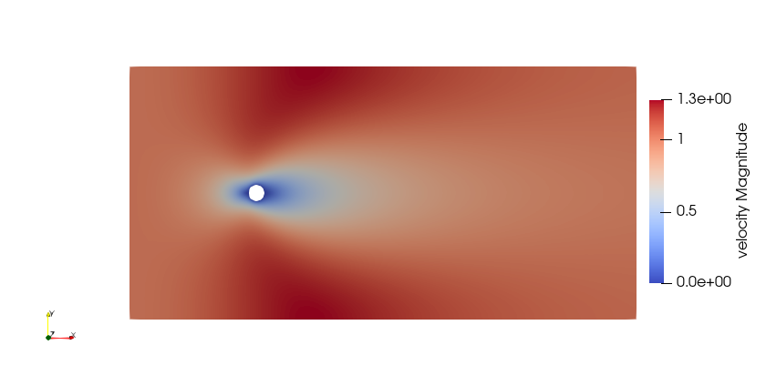
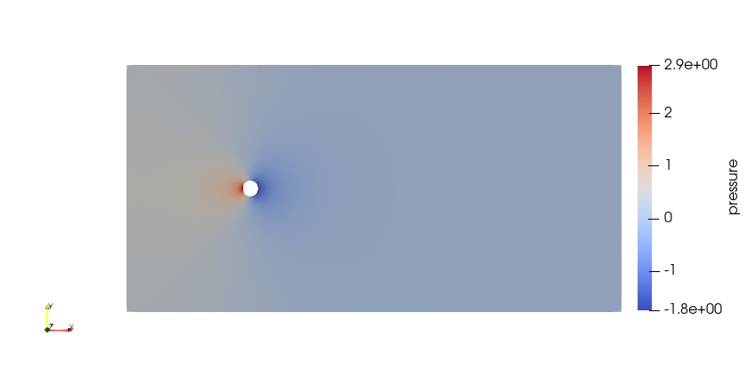

======================================
2D Transient flow around a cylinder
======================================

This example corresponds to a transient flow around a fixed cylinder at high Reynolds number.

Features
---------

- Solver: ``gls_navier_stokes_2d`` (with Q2-Q1)
- Transient problem

Location of the example
------------------------

- Parameter file: ``/examples/incompressible_flow/2d_transient-flow_around_cylinder/cylinder.prm``
- Mesh file: ``/examples/incompressible_flow/2d_transient-flow_around_cylinder/cylinder_structured.msh``
- Geometry file: ``/examples/incompressible_flow/2d_transient-flow_around_cylinder/cylinder_structured.geo``

Description of the case
-----------------------
We simulate the flow around a fixed cylinder with a constant upstream fluid velocity. We re-use the geometry and mesh presented in `2D Flow around a cylinder <https://lethe-cfd.github.io/lethe/examples/incompressible-flow/2d-flow-around-cylinder/2d-flow-around-cylinder.html>`_, which were taken from Blais et al. [1]:

.. image:: images/geometry_description.png
    :alt: The geometry
    :align: center
    :name: geometry_description

The flow field features a stable laminar boundary layer at the cylinder leading edge and a recirculation zone behind it formed by two unstable vortices of opposite signs. These vortices successively detach from the cylinder in a periodic manner (vortex shedding), leading to the genaration of the von Kármán vortex street pattern in the wake. This vortex shedding causes a fluctuating pressure force acting on the cylinder, resulting oscillations of the drag and lift coefficients in time. The frequency of vortex shedding is related to the Strouhal number:

.. math::
 S_t = \frac{D f_v}{U_\infty}

where :math:`D` is the diameter of the cylinder, :math:`f_v` is the frequency of the shedding and :math:`U_\infty` is the upstream velocity.

Parameter file
--------------

Mesh
~~~~~

The initial mesh is generated with `Gmsh <https://gmsh.info/#Download>`_ and imported as described in  `2D Flow around a cylinder <https://lethe-cfd.github.io/lethe/examples/incompressible-flow/2d-flow-around-cylinder/2d-flow-around-cylinder.html>`_.

.. code-block:: text

  #---------------------------------------------------
  # Mesh
  #---------------------------------------------------
  subsection mesh
      set type                 = gmsh
      set file name            = cylinder_structured.msh
      set initial refinement   = 1
  end

Mesh adaptation control
~~~~~~~~~~~~~~~~~~~~~~~

The parameters used are specified in the mesh adaptation control subsection:

.. code-block:: text

 # --------------------------------------------------
 # Mesh Adaptation Control
 #---------------------------------------------------
 subsection mesh adaptation
   set type                    = kelly
   set variable                = pressure
   set fraction type           = number
   set max number elements     = 70000
   set max refinement level    = 3
   set min refinement level    = 0
   set frequency               = 1
   set fraction refinement     = 0.02
   set fraction coarsening     = 0.01
 end

Initial conditions
~~~~~~~~~~~~~~~~~~
Despite this problem being a steady-state problem, one known strategy to improve convergence is to set a coherent initial condition. In Lethe, this can be achieved by the initial conditions subsection:

.. code-block:: text

    subsection initial conditions
        set type = nodal
        subsection uvwp
            set Function expression = 1; 0; 0
        end
    end

In this case we use the ``nodal`` initial condition and the ``subsection uvwp`` allows the description of a velocity-pressure vector-valued function. It can be seen that the individual components of the function are separated by semicolons in the ``set Function expression``. In this case, the velocity in the x-direction is set to ``1``, the velocity in the y-direction is set to ``0``, and the pressure is set to ``0``. If the problem was in three dimensions, four values should be specified, velocity in x, y and z and the pressure.

Boundary conditions
~~~~~~~~~~~~~~~~~~~~
In this section, we specify the boundary conditions taking into account the IDs presented in the following schematic:

.. image:: images/geometry_bc.png
    :alt: The boundary conditions
    :align: center
    :name: geometry_bc

.. code-block:: text

    subsection boundary conditions
        set number                  = 3
        subsection bc 0
            set type              = noslip
        end
        subsection bc 1
            set type              = function
            subsection u
                set Function expression = 1
            end
            subsection v
                set Function expression = 0
            end
            subsection w
                set Function expression = 0
            end
        end
        subsection bc 2
            set type              = slip
        end
    end

* ``bc 0`` identifies the cylinder where we apply ``noslip`` boundary conditions on its walls. This leads to a velocity of 0 for the fluid directly in contact with the walls of the cylinder.
* ``bc 1`` determines the flow of the fluid from the left wall. As mentioned before, the fluid is moving in the x-direction and therefore its boundary condition is defined with a function having a ``u`` velocity equals to 1. The rest of the velocity components are set to 0.
* ``bc2`` is applied at the top and bottom walls. This condition allows the simulation to be performed in a finite sized domain. In real life, the cylinder would be placed in a relatively infinite domain. Using ``slip`` condition, we assume that the fluid cannot go out in the normal direction, but that it can still flow from left to right without friction. Thus, the walls have no effect on the flow of the fluid.

.. note::
    An implicit fourth boundary condition is implemented on the right wall which represents the outlet of the flow. We do not specify anything explicitly, because this corresponds to a natural boundary condition where the pressure :math:`p` becomes close to 0 due to the imposed :math:`\int_{\Gamma}(-p\mathcal{I} + \mathbf{\tau}) \cdot \mathbf{n}=0`. For more details, refer to :doc:`../../../parameters/cfd/boundary_conditions_cfd` section.

Physical Properties
~~~~~~~~~~~~~~~~~~~

The Reynolds number must be high enough to capture a transient flow and study the evolution of the drag and lift coefficients in time. Therefore, we set Re = 200 through the value of the kinematic viscosity in the same manner as `2D Lid-driven cavity flow <https://lethe-cfd.github.io/lethe/examples/incompressible-flow/2d-lid%E2%80%90driven-cavity-flow/lid%E2%80%90driven-cavity-flow.html>`_ , since :math:`U_\infty = 1` and the :math:`D = 1`: :math:`Re=\frac{1}{\nu}` where :math:`\nu` is the kinematic viscosity.

.. code-block:: text

  #---------------------------------------------------
  # Physical Properties
  #---------------------------------------------------
  subsection physical properties
    subsection fluid 0
      set kinematic viscosity            = 0.005
    end
  end

Forces
~~~~~~

To calculate forces acting on the boundary conditions, for example, the forces acting on the cylinder, we can use the ``forces`` subsection:

.. code-block:: text

 #---------------------------------------------------
 # Forces
 #---------------------------------------------------
 subsection forces
     set verbosity             = verbose
     set calculate force       = true
     set calculate torque      = false
     set force name            = force
     set output precision      = 10
     set calculation frequency = 1
     set output frequency      = 1
 end

To print the values of the forces in the terminal we set ``verbosity`` to ``verbose``. The calculation of the forces in all boundaries is set by the ``set calculate force = true`` line. A ``.dat`` file is created with the corresponding data. Therefore, one can specify the prefix of the file by the ``force name`` parameter, the number of significant digits for the force values by the ``output precision`` and the frequency of calculation and output which are set to ``1``.

Running the simulation
----------------------
Launching the simulation is as simple as specifying the executable name and the parameter file. Assuming that the ``gls_navier_stokes_2d`` executable is within your path, the simulation can be launched by typing:

.. code-block:: text

  gls_navier_stokes_2d cylinder.prm

Lethe will generate a number of files. The most important one bears the extension ``.pvd``. It can be read by popular visualization programs such as `Paraview <https://www.paraview.org/>`_.

Results
-------

Using Paraview the following steady-state velocity and pressure profiles can be visualized:

From the velocity distribution, we notice how the velocity of the fluid is 0 at the boundaries of the cylinder and how it increases gradually if we move further away from it. In the case of the pressure, the difference between the inlet and outlet is visible and we can see how the pressure is near to 0 close to the outlet.

In addition to these profiles, we also obtain the values of the forces acting on the cylinder. These values can be found on the ``forces.00.dat`` file produced by the simulation and correspond to the forces acting on the ``bc 0`` (the cylinder):

.. code-block:: text

  cells     f_x           f_y          f_z
   1167 6.6047203044  0.0000001031 0.0000000000
   2247 6.9679298724 -0.0000000103 0.0000000000
   4302 7.0779158358  0.0000817047 0.0000000000
   8268 7.1160652038  0.0001911781 0.0000000000
  15990 7.1227744092 -0.0000746224 0.0000000000

The force in the x direction is the parallel or drag force, while the force in the y direction is the perpendicular or lift force. The drag and lift coefficients can be calculated as follows:

.. math::

 C_D = \frac{2 f_x}{\rho U_\infty^2 D},  C_L = \frac{2 f_y}{\rho U_\infty^2 D}

where :math:`U_\infty` is the upstream velocity and :math:`D` is the diameter of the cylinder. Considering the small values of the lift force, we calculate only the drag coefficients:

.. code-block:: text

  cells     C_D
   1167    13.20
   2247    13.93
   4302    14.15
   8268    14.23
  15990    14.24

We can see that the simulation is mesh convergent, as the last three values of the force in the x-direction and therefore the drag coefficient differ in less than 1%. An experimental value of the drag coefficient as a function of the Reynolds number is available in the `Drag Coefficient Calculator <https://kdusling.github.io/teaching/Applied-Fluids/DragCoefficient.html>`_ , and for a Reynolds number of 1, it corresponds to a value of :math:`C_D = 11.9`. The value calculated by Lethe differs from the theoretical value because of the slip boundary condition at the top and bottom walls, along with the short distance to them from the surface of the cylinder. To obtain a more accurate drag coefficient, the geometry should be enlarged.

Possibilities for extension
----------------------------
- Play with the size of geometry to observe the effect on the calculation of the drag forces.
- Increase the Reynolds number and perform an unsteady simulation to observe the famous von Kármán vortex street pattern.
- It would be interesting to try the same example in 3D and observe what happens with the drag and lift forces.

References
----------
[1] Blais, B., Lassaigne, M., Goniva, C., Fradette, L., & Bertrand, F. (2016). A semi-implicit immersed boundary method and its application to viscous mixing. Comput. Chem. Eng., 85, 136-146.
[2] Barbeau, L., Étienne, S., Béguin, C., & Blais, B. (2022). Development of a high-order continuous Galerkin sharp-interface immersed boundary method and its application to incompressible flow problems,
Computers & Fluids, Volume 239, 105415, https://doi.org/10.1016/j.compfluid.2022.105415.
