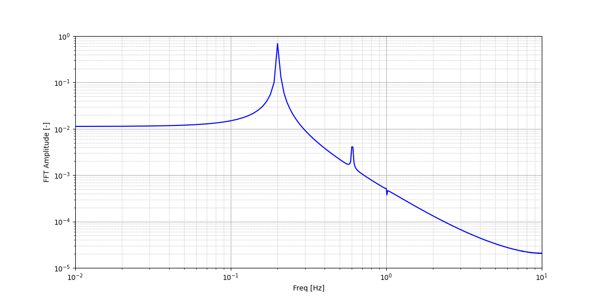

======================================
Transient Flow around a Cylinder
======================================

This example corresponds to a transient flow around a fixed cylinder at a high Reynolds number.

---------
Features
---------

- Solver: ``lethe-fluid`` (with Q2-Q1)
- Transient problem
- Usage of Gnuplot and Python scripts for the data post-processing

----------------------------
Files Used in This Example
----------------------------

All files mentioned below are located in the example's folder (``examples/incompressible-flow/2d-transient-flow-around-cylinder``).

- Geometry file: ``cylinder-structured.geo``
- Mesh file: ``cylinder-structured.msh``
- Parameter file: ``cylinder.prm``

-----------------------
Description of the Case
-----------------------

We simulate the flow around a fixed cylinder with a constant upstream fluid velocity. We re-use the geometry and mesh presented in `2D Flow around a cylinder <https://chaos-polymtl.github.io/lethe/documentation/examples/incompressible-flow/2d-flow-around-cylinder/2d-flow-around-cylinder.html>`_, which were taken from Blais *et al.* [#blais2016]_:

.. image:: images/geometry-description.png
    :alt: The geometry
    :align: center
    :name: geometry_description

The flow field features a stable laminar boundary layer at the cylinder leading edge and a recirculation zone behind it formed by two unstable vortices of opposite signs. These vortices successively detach from the cylinder in a periodic manner (vortex shedding), leading to the generation of the von Kármán vortex street pattern in the wake. This vortex shedding causes a fluctuating pressure force acting on the cylinder, resulting in oscillations of the drag and lift coefficients in time. The frequency of vortex shedding is related to the Strouhal number:

.. math::
 S_t = \frac{D f_v}{U_\infty}

where :math:`D` is the diameter of the cylinder, :math:`f_v` is the frequency of the shedding and :math:`U_\infty` is the upstream velocity.

--------------
Parameter File
--------------

Simulation Control
~~~~~~~~~~~~~~~~~~
This example uses a 2nd order backward differentiation (``method = bdf2``) for the time integration scheme. The simulation time is set to 200 seconds with the ``time end`` parameter and a time step of 0.05 seconds is used (``time step = 0.05``).

.. code-block:: text

    subsection simulation control
      set method           = bdf2
      set output name      = cylinder-output
      set output frequency = 5
      set output path      = ./Re200/
      set time end         = 200.0
      set time step        = 0.05
    end

FEM Interpolation
~~~~~~~~~~~~~~~~~

The interpolation orders for the velocity and pressure are set to Q2-Q1 in the ``FEM`` subsection:

.. code-block:: text

    subsection FEM
      set velocity order = 2
      set pressure order = 1
    end

Mesh
~~~~~

The initial mesh is generated with `Gmsh <https://gmsh.info/#Download>`_ and imported as described in  `2D Flow around a cylinder <https://chaos-polymtl.github.io/lethe/documentation/examples/incompressible-flow/2d-flow-around-cylinder/2d-flow-around-cylinder.html>`_.

.. code-block:: text

    subsection mesh
      set type               = gmsh
      set file name          = cylinder-structured.msh
      set initial refinement = 1
    end

Mesh Adaptation
~~~~~~~~~~~~~~~

While the discretization in the wake of the cylinder has less impact on the forces acting on the cylinder wall than the boundary layer discretization, it is interesting to well resolve the wake to capture the von Kármán vortex street pattern. Therefore, to adapt the mesh in the boundary layer and the wake as the vortices are shed, a non-uniform mesh adaptation is performed at each time step and the parameters are specified using the ``Mesh Adaptation`` subsection:

.. code-block:: text

    subsection mesh adaptation
      set type                 = kelly
      set variable             = pressure
      set fraction type        = number
      set max number elements  = 70000
      set max refinement level = 3
      set min refinement level = 1
      set frequency            = 1
      set fraction refinement  = 0.02
      set fraction coarsening  = 0.01
    end

Here, we are using the pressure as the variable for the `Kelly error estimator <https://chaos-polymtl.github.io/lethe/documentation/parameters/cfd/mesh_adaptation_control.html>`_, unlike the previous examples which were using the velocity. Indeed, we have observed that the refinement has less tendency to follow the vortices as they move through the wake with the pressure as the refinement indicator than if we select the velocity. Additionally, the ``fraction refinement`` and ``fraction coarsening`` are set to lower values than the previous examples (i.e., respectively 0.02 and 0.01) to enable a gradual growth of the mesh size.

Initial and Boundary Conditions
~~~~~~~~~~~~~~~~~~~~~~~~~~~~~~~
The `Initial Condition <https://chaos-polymtl.github.io/lethe/documentation/parameters/cfd/initial_conditions.html>`_ and `Boundary Conditions <https://chaos-polymtl.github.io/lethe/documentation/parameters/cfd/boundary_conditions_cfd.html>`_ are defined as in `2D Flow around a cylinder <https://chaos-polymtl.github.io/lethe/documentation/examples/incompressible-flow/2d-flow-around-cylinder/2d-flow-around-cylinder.html>`_.

.. code-block:: text

    subsection initial conditions
      set type = nodal
      subsection uvwp
        set Function expression = 1; 0; 0
      end
    end

    subsection boundary conditions
      set number = 3
      subsection bc 0
        set type = noslip
      end
      subsection bc 1
        set type = function
        subsection u
          set Function expression = 1
        end
        subsection v
          set Function expression = 0
        end
        subsection w
          set Function expression = 0
        end
      end
      subsection bc 2
        set type = slip
      end
    end

Physical Properties
~~~~~~~~~~~~~~~~~~~

The Reynolds number must be high enough to capture a transient flow and study the evolution of the drag and lift coefficients in time. Therefore, we set Re = 200 through the value of the kinematic viscosity in the same manner as for the `2D Lid-driven cavity flow <https://chaos-polymtl.github.io/lethe/documentation/examples/incompressible-flow/2d-lid%E2%80%90driven-cavity-flow/lid%E2%80%90driven-cavity-flow.html>`_. Since :math:`U_\infty = 1` and the :math:`D = 1`, we have :math:`Re=\frac{1}{\nu}`, where :math:`\nu` is the kinematic viscosity.

.. code-block:: text

  subsection physical properties
    subsection fluid 0
      set kinematic viscosity = 0.005
    end
  end

Linear Solver
~~~~~~~~~~~~~

For 2D problems, the ``amg`` preconditioner is an adequate preconditioner. It is especially robust for the first few time-steps for which the velocity and pressure profile is not well-defined because the initial conditions are not mass conservative.

.. code-block:: text

  subsection linear solver
    subsection fluid dynamics
      set verbosity                                 = verbose
      set method                                    = gmres
      set relative residual                         = 1e-4
      set minimum residual                          = 1e-8
      set preconditioner                            = amg
    end
  end

Forces
~~~~~~

Since we want to study the time evolution of the drag and lift coefficients, the force acting on the boundaries must be computed. We thus use the ``forces`` subsection:

.. code-block:: text

    subsection forces
      set verbosity             = verbose
      set calculate force       = true
      set calculate torque      = false
      set force name            = force
      set output precision      = 10
      set calculation frequency = 1
      set output frequency      = 10
    end

As we set ``calculation frequency`` to 1, the forces on each boundary are computed at each time step and written in the file specified by the field ``force name``.

.. note::

  The drag and lift coefficients are obtained with the forces acting on the wall of the cylinder (i.e., ``f_x`` and ``f_y``  written in the file ``forces.00.dat``) :

  .. math::

    C_D = \frac{2 f_x}{\rho U_\infty^2 D} \text{ and } C_L = \frac{2 f_y}{\rho U_\infty^2 D}

  where :math:`\rho = 1`. This way, we can obtain the evolution in time of both coefficients.

.. warning::

  The computational cost of writing this output file at each time step by setting ``output frequency`` to 1 can be significant, as explained in `Force and torque calculation <https://chaos-polymtl.github.io/lethe/documentation/parameters/cfd/force_and_torque.html>`_. It is a good practice to set ``output frequency`` to higher values, such as 10-100, to reduce the computational cost.

----------------------
Running the Simulation
----------------------

The mesh must be generated before the simulation is launched. A ``gmsh`` file is provided in this example and it can be used to generate the mesh of the domain:

.. code-block:: text
  :class: copy-button

  gmsh -2 cylinder-structured.geo

The simulation is launched in parallel using 10 CPUs, as explained in `2D Transient flow around an Ahmed body <https://chaos-polymtl.github.io/lethe/documentation/examples/incompressible-flow/2d-transient-around-ahmed-body/2d-transient-around-ahmed-body.html>`_ :

.. code-block:: text
  :class: copy-button

  mpirun -np 10 lethe-fluid cylinder.prm

.. warning::

  The estimated time to simulate 200 seconds is about 3 hours with 10 CPUs.

-------
Results
-------

The time evolution of the drag and lift coefficients is obtained from a Gnuplot script available in the example folder by launching in the same directory the following command:

.. code-block:: text
  :class: copy-button

  gnuplot -c "./postprocess.gnu" "./Re200"

where ``./postprocess.gnu`` is the path to the provided script and ``./Re200`` is the path to the directory that contains the simulation results (specified in the ``simulation control`` subsection). The figure, named ``CL-CD.png``, is outputted in the directory ``./Re200``.

.. note::

  Gnuplot is a command-line plotting tool supporting scripting. It can be downloaded `here <http://www.gnuplot.info/>`_. The script provided for this example works for the version 5.4 of Gnuplot.

Using the fast Fourier transform (FFT) of the CL for the last 100 seconds, we can obtain the frequency :math:`f_v` at which the vortices are shed :

This corresponds to the frequency at which the peak of amplitude appears in the FFT : :math:`f_v = 0.2`. From this result, we can obtain the Strouhal number, :math:`S_t = 0.2`, using the equation presented above. The python script used to obtain the FFT is available in the example folder and is launched in the same directory using the following command:

.. code-block:: text
  :class: copy-button

  python ./postprocess.py ./Re200

where ``./postprocess.py`` is the path to the provided script  and ``./Re200`` is the path to the directory that contains the simulation results (specified in the ``simulation control`` subsection). The figure, named ``cylinderFFT.png``, is outputted in the directory ``./Re200``.

The obtained values of the drag and lift coefficients as well as the Strouhal number are compared to some results of the literature :

.. list-table::
   :widths: 20 20 20 20
   :header-rows: 1

   * - Study
     - :math:`C_D`
     - :math:`C_L`
     - :math:`S_t`
   * - Lethe example
     - 1.396 :math:`\pm` 0.048
     - -0.003 :math:`\pm` 0.72
     - 0.2
   * - Lethe Sharp [#barbeau2022]_
     - 1.395 :math:`\pm` 0.047
     - :math:`\pm` 0.71
     - 0.2
   * - Braza et al. [#braza1986]_
     - 1.400 :math:`\pm` 0.050
     - :math:`\pm` 0.75
     - 0.2

Using Paraview the following velocity and pressure fields can be visualized in time:

.. raw:: html

    
<iframe width="720" height="405" src="https://www.youtube.com/embed/NnYsd_yqp7I" title="Velocity magnitude field evolution - Transient flow around a cylinder" frameborder="0" allow="accelerometer; autoplay; clipboard-write; encrypted-media; gyroscope; picture-in-picture; web-share" referrerpolicy="strict-origin-when-cross-origin" allowfullscreen></iframe>

.. raw:: html

    
<iframe width="720" height="405" src="https://www.youtube.com/embed/NbN2kBdakH4" title="Pressure field evolution - Transient flow around a cylinder" frameborder="0" allow="accelerometer; autoplay; clipboard-write; encrypted-media; gyroscope; picture-in-picture; web-share" referrerpolicy="strict-origin-when-cross-origin" allowfullscreen></iframe>

----------------------------
Possibilities for Extension
----------------------------
- Study the vortex shedding of other bluff bodies.
- Increase the Reynolds number to study a completely turbulent wake and the drag crisis phenomenon.
- Repeat the same example in 3D for a cylinder/sphere and study the effect on the drag and lift forces.
- Investigate the impact of the time-step and the time-stepping scheme (e.g., bdf 3)

----------
References
----------

.. [#blais2016] \B. Blais, M. Lassaigne, C. Goniva, L. Fradette, and F. Bertrand, “A semi-implicit immersed boundary method and its application to viscous mixing,” *Comput. Chem. Eng.*, vol. 85, pp. 136–146, Feb. 2016, doi: `10.1016/j.compchemeng.2015.10.019 <https://doi.org/10.1016/j.compchemeng.2015.10.019>`_\.

.. [#barbeau2022] \L. Barbeau, S. Étienne, C. Béguin, and B. Blais, “Development of a high-order continuous Galerkin sharp-interface immersed boundary method and its application to incompressible flow problems,” *Comput. Fluids*, vol. 239, p. 105415, May 2022, doi: `10.1016/j.compfluid.2022.105415 <https://doi.org/10.1016/j.compfluid.2022.105415>`_\.

.. [#braza1986] \M. Braza, P. Chassaing, and H. H. Minh, “Numerical study and physical analysis of the pressure and velocity fields in the near wake of a circular cylinder,” *J. Fluid Mech.*, vol. 165, pp. 79–130, Apr. 1986, doi: `10.1017/S0022112086003014 <https://doi.org/10.1017/S0022112086003014>`_\.
