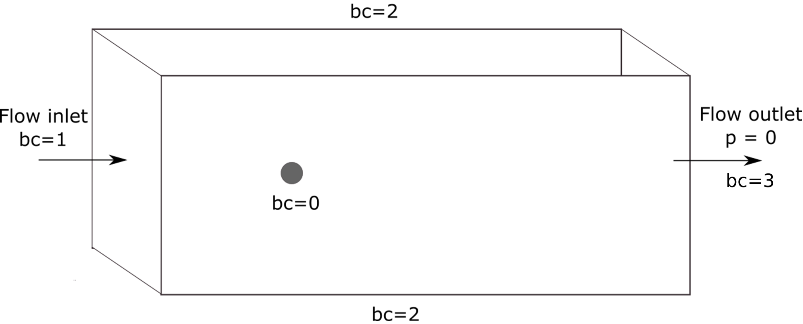
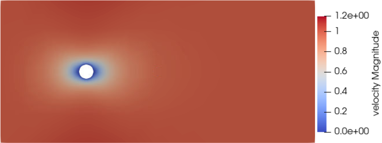
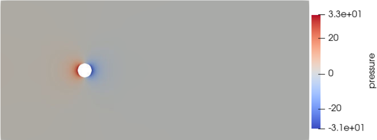
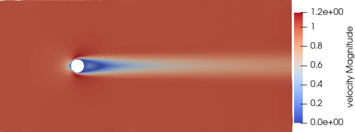
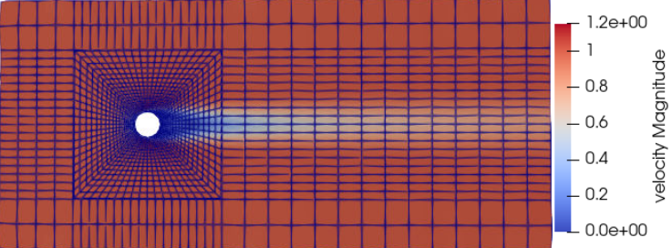
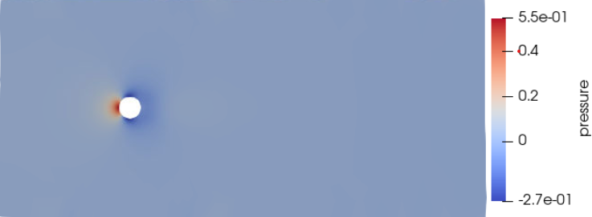
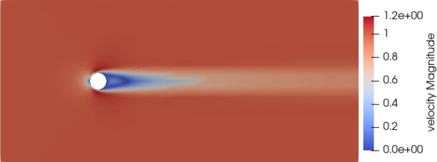
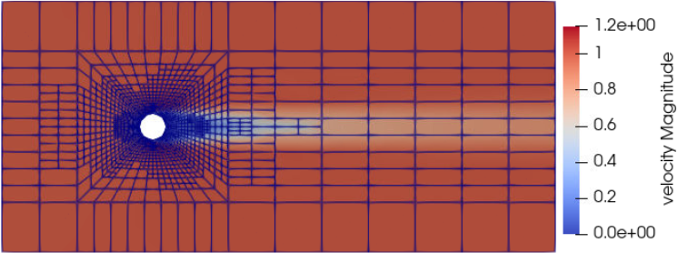

==================================
Flow around a Sphere
==================================

In this example, a fluid flows past a sphere.

----------------------------------
Features
----------------------------------

- Solvers: ``lethe-fluid`` (with Q1-Q1) or  ``lethe-fluid-block`` (with Q2-Q1)
- Steady-state problem
- Displays the importance of adaptative mesh refinement
- Displays the effect of the Reynolds number on the convergence

----------------------------
Files Used in This Example
----------------------------

All files mentioned below are located in the example's folder (``examples/incompressible-flow/3d-flow-around-sphere``).

- Parameter file for :math:`Re=0.1`: ``sphere-0.1.prm``
- Parameter file for :math:`Re=150`: ``sphere-150.prm``
- Parameter file for :math:`Re=150` using adaptative mesh refinement: ``sphere-adapt.prm``

-----------------------
Description of the Case
-----------------------

The following schematic describes the simulation and its boundary condition indices.

Note that the sphere surface has a boundary index of ``0``, the inlet ``1`` and the walls parallel to the flow direction have a boundary index of ``2``. 

As this examples allows for two different Reynolds numbers as well as an adaptative mesh refinement variation, the Parameter file section will specify the differences when applicable. 

--------------
Parameter File
--------------

We first establish the parameters.

Mesh
~~~~

The structured mesh is built using `gmsh <https://gmsh.info/#Download>`_. Geometry parameters can be adapted in the "Variables" section of the .geo file, as shown below. 

.. code-block:: text

  // Variables
  gr=4; 			// Global refinement
  around=10;		// Refinement around the sphere
  trail=8;		// Refinement of trail of sphere
  near_sphere=1.20;	// Progression of cell refinement to sphere surface
  downstream=16;	        // Length of domain downstream of sphere
  upstream=-6;		// Length of domain upstream of sphere (must be negative)
  cross_section=10;	// Half the cross-sectional width/height
  radius=0.5;		// Radius of sphere

.. note::

  The domain is dimensioned so that the wake has sufficient distance to develop downstream and there is a sufficient cross-sectional area to negate any effect from the wall boundary conditions.

In the parameter file, the mesh is read this way:

.. code-block:: text

    subsection mesh
      set type      = gmsh
      set file name = sphere.msh
    end

.. note:: text

  The ``initial refinement`` is set to 1 only for the second example (Re = 150 without mesh adaptation). This is added so that it has a number of cells of the same magnitude as the mesh adaptation example. This mesh contains a bit more than 46,000 cells.

Boundary Conditions
~~~~~~~~~~~~~~~~~~~

The ``boundary conditions`` subsection establishes the constraints on different parts of the domain. They are the same for all three parameter sets.

.. code-block:: text

    subsection boundary conditions
      set number = 3
      subsection bc 0
        set type = noslip
      end
      subsection bc 1
        set type = function
        subsection u
          set Function expression = 1
        end
        subsection v
          set Function expression = 0
        end
        subsection w
          set Function expression = 0
        end
      end
      subsection bc 2
        set type = slip
      end
    end

There are three boundary conditions, as shown in the figure above. A ``noslip`` condition is applied on the surface of the sphere, where the velocity should be 0. The inlet velocity is set to `u=1m/s`, and the boundaries of the domain that are parallel to the flow direction have a ``slip`` boundary condition.

Physical Properties
~~~~~~~~~~~~~~~~~~~

This is where the parameters differ from the first and the two last examples.

Recall the definition of the Reynolds number for a flow past a sphere:

.. math::
 Re = \frac{u_{\infty} D}{\nu}

Taking this into account and the fact that the sphere diameter :math:`D` is 1 m, and :math:`u_{\infty}` is set to 1 m/s, we set the ``kinematic viscosity`` parameter to obtain the targeted Reynolds number.

* In ``/examples/incompressible-flow/3d_flow_around_sphere/sphere-0.1.prm`` (Re = 0.1)

.. code-block:: text

    subsection physical properties
      subsection fluid 0
        set kinematic viscosity = 10
      end
    end

* In ``/examples/incompressible-flow/3d_flow_around_sphere/sphere-150.prm`` and ``/examples/incompressible-flow/3d_flow_around_sphere/sphere-adapt.prm`` (:math:`Re=150`)

.. code-block:: text

    subsection physical properties
      subsection fluid 0
        set kinematic viscosity = 0.006666667
      end
    end

By default, simulations only contain a single fluid which is labeled ``0``.

FEM Interpolation
~~~~~~~~~~~~~~~~~

The default FEM parameters for this example use first order polynomials. They can be changed to Q2-Q1 elements.

We specify the interpolation order for both pressure and velocity using the ``FEM`` subsection:

.. code-block:: text

    subsection FEM
      set velocity order = 1
      set pressure order = 1
    end

.. warning:: 

    If you choose to use the ``lethe-fluid-block`` solver; only Q2-Q1 elements are supported. 

Simulation Control
~~~~~~~~~~~~~~~~~~

The parameters also slightly differ from one problem to another as different examples experience different flow regimes.

In fact, for the Re = 0.1, we have a laminar to creeping flow, meaning that the flow is very steady, and therefore can be solved in steady-state.

.. code-block:: text

    subsection simulation control
      set method            = steady
      set number mesh adapt = 0
      set output path       = sphere-0.1/
      set output frequency  = 1
    end

At Re = 150, the flow has separated, resulting in an unstable wake and recirculation. It is hence more difficult to converge to a steady-state solution. 

.. code-block:: text

    subsection simulation control
      set method                       = steady_bdf
      set time step                    = 0.1
      set adapt                        = true
      set max cfl                      = 1000
      set stop tolerance               = 1e-5
      set adaptative time step scaling = 1.2
      set output path                  = sphere-150/
      set output frequency             = 1
    end

The ``steady_bdf`` method solves for a steady-state simulation using adjoint time stepping with a bdf1 scheme. An initial time step is used to complete a transient iteration, and with each iteration, the time step is increased. The simulation is considered to have reached steady-state when the L2 norm of the initial residual is lower than stop tolerance at the start of a non-linear solution step, i.e. until the time step is large enough that a pseudo-steady-state has been reached.

Initial Conditions
~~~~~~~~~~~~~~~~~~

An initial condition is introduced for the Re = 150 problem. This way, a Re = 10 initial condition is set. Since the solution can easily be found at Re = 10, this is used as an initial attempt to find the solution at Re=150.

.. code-block:: text

    subsection initial conditions
      set type                = viscous
      set kinematic viscosity = 0.1
    end

Mesh Adaptation
~~~~~~~~~~~~~~~

To increase the accuracy of the drag coefficient, the mesh must be refined in areas of interest, such as on the front face of the sphere and in the developing wake. Therefore, a dynamic adaptive mesh was introduced to refine the mesh in such regions.

.. code-block:: text

    subsection mesh adaptation
      set type                 = kelly
      set fraction coarsening  = 0.05
      set fraction refinement  = 0.1
      set fraction type        = number
      set max number elements  = 100000
      set min refinement level = 0
      set max refinement level = 4
      set variable             = pressure
      set frequency            = 5
    end

The mesh is dynamically adapted based on an estimate of the error of the solution for the pressure (the Kelly error estimator). The refinement is based on the number of elements. This means that the number of cells refined/coarsened per iteration is based on the fraction of the number of cells, rather than the fraction of the error (where all cells which have the fraction of the error are refined/coarsened).

The ``min refinement level`` refers to the base mesh which has been used in the previous static simulations. The mesh can only become finer than this, not coarser. The ``max refinement level`` is set at 3, giving a maximum possible number of cells of 3 million. However, the ``max number elements`` limits the number of cells to 50,000 to keep the simulation within feasible computational expense.

----------------------
Running the Simulation
----------------------

Launching the simulation is as simple as specifying the executable name and the parameter file. Assuming that the ``lethe-fluid`` executable is within your path, the simulation can be launched by typing:

.. code-block:: text
  :class: copy-button

  lethe-fluid sphere-0.1.prm

or 

.. code-block:: text
  :class: copy-button

  lethe-fluid sphere-150.prm

or

.. code-block:: text
  :class: copy-button

  lethe-fluid sphere-adapt.prm

Lethe will generate a number of files. The most important one bears the extension ``.pvd``. It can be read by popular visualization programs such as `Paraview <https://www.paraview.org/>`_. 

-----------------------
Results and Discussion
-----------------------

First Case Results (:math:`Re=0.1`)
~~~~~~~~~~~~~~~~~~~~~~~~~~~~~~~~~~~

Using Paraview, the steady-state velocity profile and the pressure profile can be visualized by operating a *slice* along the xy-plane (z-normal) that cuts in the middle of the sphere (See `documentation <https://forgeanalytics.io/blog/creating-slices-in-paraview/>`_). 

We can appreciate the axisymmetrical behavior of the flow. The drag on the sphere is available in the output file ``force.00.dat`` (the other force files ``force.01.dat`` and ``force.02.dat`` give the forces on boundary conditions 1 and 2 respectively). 

.. note::
  The last line of the file shows the force calculated in the last iteration. Since the flow in the x-direction, the x-direction force ``f_x`` gives the drag force.

.. code-block:: text

  cells      f_x           f_y          f_z        f_xv      f_yv      f_zv       f_xp       f_yp      f_zp  
  5823 98.3705224612 -0.0000000785 0.0000001119 62.270588  0.000000  0.000000   36.099934 -0.000000  0.000000

Given the flow parameters, the calculated drag coefficient is 250.50, using 6000 cells. At Re = 0.1, an analytical solution of the drag coefficient is known: :math:`C_D = 240` (see `reference <https://kdusling.github.io/teaching/Applied-Fluids/DragCoefficient.html>`_). The deviation from the analytical solution is primarily due to the size of the domain (height of the domain compared to the size of the sphere). The coarseness of the mesh can also have an impact on the result. It would be relevant to carry out a mesh refinement analysis.

Second Case Results (:math:`Re=150`)
~~~~~~~~~~~~~~~~~~~~~~~~~~~~~~~~~~~~~

We now consider the case at a Reynolds number of 150. At this value of the Reynolds number, the flow has separated, resulting in an unstable wake and recirculation. 

The velocity and pressure are once again visualised as well as the mesh used:

The drag coefficient at Re = 150 using this example simulation is 0.798, against a predicted coefficient of 0.889 (see `reference <https://kdusling.github.io/teaching/Applied-Fluids/DragCoefficient.html>`_).

Third Case Results (:math:`Re=150` With an Adaptative Mesh Refinement)
~~~~~~~~~~~~~~~~~~~~~~~~~~~~~~~~~~~~~~~~~~~~~~~~~~~~~~~~~~~~~~~~~~~~~~~

Using mesh adaptative refinement, the final mesh contains slightly more than 101,000 cells. The resulting velocity profile is shown without and with the underlying mesh. Refinement around the sphere and wake can be observed:

It is possible the acknowledge how better the mesh fits the velocity profile than in the previous example. The resulting drag coefficient of 0.880 is more accurate than determined using the static mesh, and does not take much more time to execute than the previous example. 

---------------------------
Possibilities for Extension
---------------------------

- **High-order methods:** Lethe supports higher order interpolation. This can yield much better results with an equal number of degrees of freedom than traditional second-order (Q1-Q1) methods, especially at higher Reynolds numbers. 

- **Mesh size** It would be interesting to increase the height:sphere diameter ratio and see if the drag coefficient becomes closer to the analytical one for Re = 0.1 A Mesh refinement analysis could also be carried out.

- **Dynamic mesh adaptation:** To increase accuracy further, the ``max number elements`` and ``max refinement level`` parameters of the mesh adaption can be increased.
