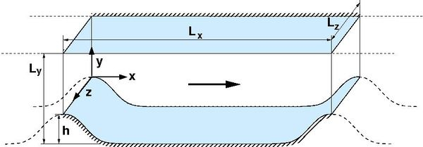
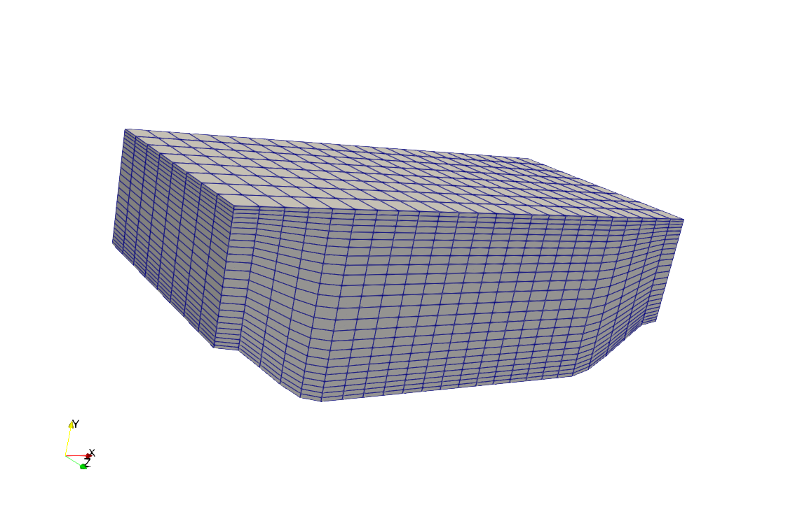
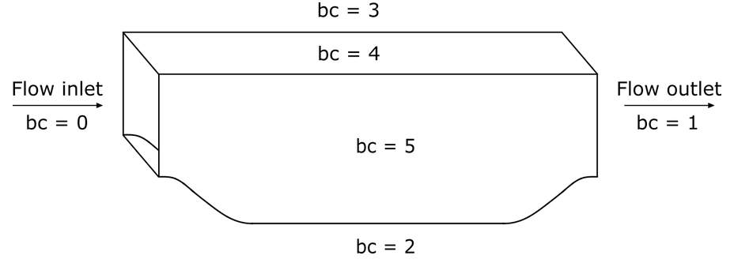
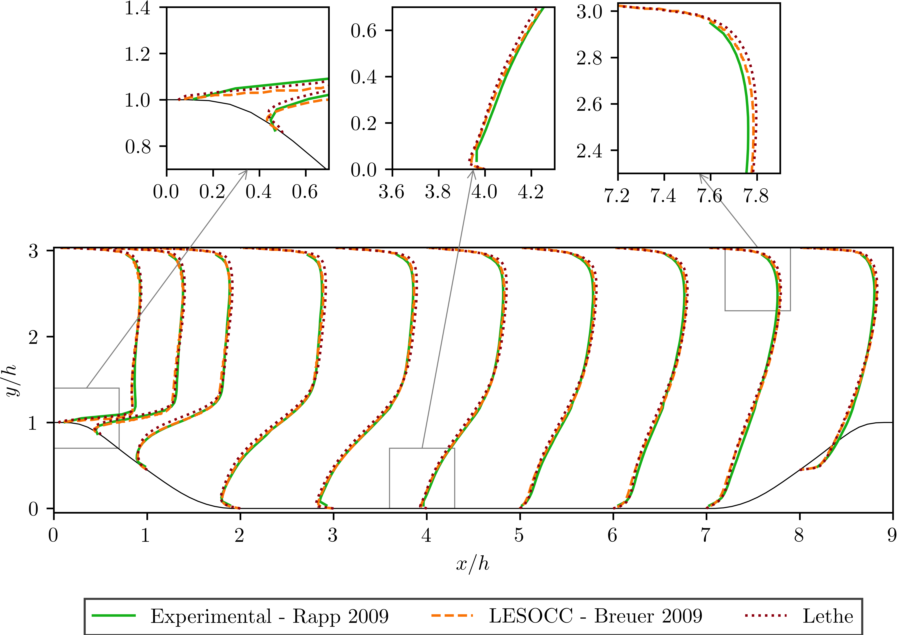
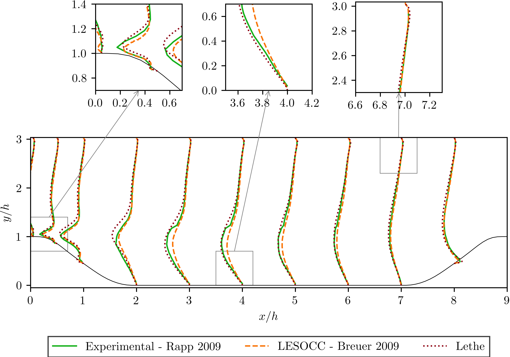

======================================
Flow over Periodic Hills
======================================

This example is a well-established benchmark for Computational Fluid Dynamics software known as the `periodic hills flow <https://kbwiki.ercoftac.org/w/index.php?title=Abstr:2D_Periodic_Hill_Flow>`_. It includes complex flow features such as the generation of an unsteady shear layer, recirculation, strong pressure gradients, attached and detached boundary layers and turbulence recycling due to the periodicity assumption. 

---------
Features
---------

- Solver: ``lethe-fluid`` (with Q1-Q1) 
- Transient problem

----------------------------
Files Used in This Example
----------------------------

- Parameter file: ``/examples/incompressible-flow/3d-periodic-hills/periodic-hills.prm``

-----------------------
Description of the Case
-----------------------

In this case a well-defined flow passes over a series of hills which repeat along a channel in a periodic fashion as it can be seen in the following figure (taken from ERCOFTAC `[1] <https://kbwiki.ercoftac.org/w/index.php/File:Hill3d.jpg>`_):

As the flow passes over the hill, it is subjected to the effects of both the curvature of the hill and the pressure gradient. The adverse pressure gradient on the leeward side of the hill and resulting deceleration of the flow causes the boundary layer to separate from the curved hill surface. The flow then recirculates on the leeward side of the hill and reattaches in the base of the channel before the next hill. There is a short distance remaining before the subsequent hill which allows the boundary layer to recover. The flow then accelerates up and over the second hill, and the flow pattern repeats in a periodic manner.

--------------
Parameter File
--------------

All the sections of the parameter file used in this case have been already explained in previous examples. However, for the sake of completeness, the important sections are briefly explained.

Simulation Control
~~~~~~~~~~~~~~~~~~~

This section controls the flow of the simulation. 

.. code-block:: text

    subsection simulation control
      set method           = bdf2
      set output name      = periodic_hills_output_
      set time step        = 0.1
      set output frequency = 1000
      set output path      = ./output/
      set time end         = 1000
    end

The ``method`` parameter specifies the time-stepping scheme chosen for this simulation. In this case is set to ``bdf2`` that corresponds to a second-order backward difference implicit scheme. The ``output name`` and ``output path``  are parameters that specify the name and the path for the ``.vtu`` files of the simulation, while the ``output frequency`` is relative to the number of time steps in the total time. The ratio between the total time of the simulation ``1000`` and the time step chosen ``0.1`` is 10000. Therefore, if the output frequency is set to ``1000`` a total of 11 ``.vtu`` files will be obtained including an initial output file at time 0. The total time is chosen to be long in order to consider the flow periodic, since it has already passed a significant number of hills.

.. warning:: It is important to remember that the output path folder, in this case ``output`` must exist before running the simulation.

Physical Properties
~~~~~~~~~~~~~~~~~~~

The physical properties section is used to target a specific Reynolds number:

.. code-block:: text

    subsection physical properties
      subsection fluid 0
        set kinematic viscosity = 1.78571E-04 # Re = 5600
      end
    end

Recall the definition of the Reynolds number:

.. math::
 Re = \frac{u_B h}{\nu}

Taking this into account and the fact that the height of the hill :math:`h` is 1 :math:`m`, we set the bulk velocity to 1 :math:`m s^{-1}` and the ``kinematic viscosity`` parameter to ``1.78571E-04`` to obtain a Reynolds number of 5600. 

Mesh 
~~~~~

The mesh subsection specifies the computational grid:

.. code-block:: text

    subsection mesh
      set type               = periodic_hills
      set initial refinement = 5
      set grid arguments     = 1;1;4;2;1
    end

The standard geometry is included in the Lethe code with 6 polynomials designing the curve of the hill. Therefore the ``type`` parameter is set to ``periodic_hills``. It consists of a static, uniformly refined mesh with isoparametric elements. The ``initial refinement`` parameter does a uniform refinement in the triangulation. The ``grid argument`` parameter requires five values that correspond to ``spacing y lines; alpha; repetitions x; repetitions y; repetitions z``. A brief explanation of each of them is given here:

* ``spacing y lines``: the periodic hill grid is generated with equally spaced horizontal lines or with gradually spaced lines which means more lines near upper and lower walls. This parameter may be set in the range from 0 to 1, with 0 meaning equally spaced lines and 1 the maximum of shifting lines.

* ``alpha``: While the geometry of the benchmark is fixed, it can be elongated to compare the behavior of the flow with the slope. Therefore, this parameter elongates the slopes of the geometry but keeps the length of the flat region. This parameter should be set in the range from 0.5 to 3, where 1 has no effect on the geometry.

* ``repetitions x, repetitions y, repetitions z``: To get cells with an aspect ratio different on the domain, different numbers of subdivisions are set, given by repetition in different coordinate directions. The minimum number of subdivisions in each direction is 1. 

The following image displays a coarse mesh for this example. It can be seen that the horizontal lines are shifted with the associated parameter to get more lines near walls. Here, repetitions for x, y, z allow the mesh to get more cells in x and y directions.

Boundary Conditions
~~~~~~~~~~~~~~~~~~~~
In this section, we specify the boundary conditions taking into account the IDs presented in the following scheme:

.. code-block:: text

    subsection boundary conditions
      set number = 4
      subsection bc 0
        set type               = periodic
        set id                 = 0
        set periodic_id        = 1
        set periodic_direction = 0
      end
      subsection bc 1
        set id   = 2
        set type = noslip
      end
      subsection bc 2
        set id   = 3
        set type = noslip
      end
      subsection bc 3
        set type               = periodic
        set id                 = 4
        set periodic_id        = 5
        set periodic_direction = 2
      end
    end

First, a ``periodic`` boundary condition is set for both the inlet id ``0`` and outlet id ``1`` of the flow. For the bottom and top walls we set ``noslip`` boundary conditions, while for the side walls id ``4`` and ``5`` we consider periodic boundary conditions too, because it allows to represent the bulk flow of the channel. All the boundary conditions are set to represent the actual benchmark case. 

Flow Control
~~~~~~~~~~~~

Since the flow is periodic and a specific Reynolds number is targeted for the simulation, the flow has to be controlled at each time step. To allow flow control, the subsection flow control has to be enabled. 

.. code-block:: text

    subsection flow control
      set enable               = true
      set boundary id          = 0
      set volumetric flow rate = -9.1575 # bulk velocity = -1
      set flow direction       = 0
      set initial beta         = 7.66
      set verbosity            = verbose
    end

First we set the ``enable`` parameter to ``true`` in order to control the flow. The boundary id ``0`` corresponds to the flow inlet where we want to control the flow. The ``volumetric flow rate`` has to be negative if the flow goes in x positive direction or ``flow direction = 0``. Therefore we adjust this parameter so that we obtain a bulk velocity :math:`u_B` equals to 1. The ``initial beta`` parameter is a coefficient calculated at each time step that speeds up the convergence of the flow rate targeted.

.. tip:: A good method to find a reasonable initial beta is to test two or three different initial beta parameters, write down the given flow rate at the first time step in the simulation and do a regression. The correlation is linear and giving a proper value will greatly speed up the convergence. 

Post-processing
~~~~~~~~~~~~~~~~

The post-processing subsection allows the calculation of different quantities:

.. code-block:: text

    subsection post-processing
      set calculate average velocities = true
      set initial time                 = 207
    end

In this example, we enable the calculation of average velocities through the parameter ``calculate average velocities`` after a certain time of the simulation. In this case, this time is set to ``207`` as we allow for the flow to reach some stability. The results of the calculated values will be available in the ``.vtu`` files when opened with a visualization software. 

FEM
~~~
The FEM subsection specifies the order of the elements used for both velocity and pressure.

.. code-block:: text

    subsection FEM
      set velocity order = 1
      set pressure order = 1
    end

For this example we simply consider Q1-Q1 elements. However, it can also be run using Q2-Q2 elements. In that case, it is important to remember to add the ``set qmapping all = true`` line after the velocity and pressure orders.

Non-linear Solver
~~~~~~~~~~~~~~~~~

The non-linear solver control section allows us to choose a method suitable for the problem that we are solving:

.. code-block:: text

    subsection non-linear solver
      subsection fluid dynamics
        set solver         = inexact_newton
        set tolerance      = 1e-5
        set max iterations = 10
        set verbosity      = verbose
      end
    end

In this case, we use the ``inexact_newton`` method that reuses the Jacobian matrix between iterations. This is a known strategy to reduce the cost of reassembling the Jacobian in every iteration. 

----------------------
Running the Simulation
----------------------

Launching the simulation is as simple as specifying the executable name and the parameter file. Assuming that the ``lethe-fluid`` executable is within your path, the simulation can be launched by typing:

.. code-block:: text
  :class: copy-button

  lethe-fluid periodic-hills.prm

Lethe will generate a number of files. The most important ones have the extension ``.vtu`` that can be read by popular visualization programs such as `Paraview <https://www.paraview.org/>`_. 

Due to the complexity of this example we recommend that you run this example using a cluster or supercomputer if available. For this it is necessary to add the ``mpirun -np X`` command at the beginning of the line. The number of processes ``X`` must be adjusted according to the machine. If you want to run this in a normal desktop we recommend that you set the parameter ``time end`` to ``5.0``; this allows you to observe the initial behavior of the simulation.

----------------------
Results and Discussion
----------------------
To summarize, a coarse mesh of 250K cells was simulated, using a time step of 0.1 and taking average quantities between 207s and 1000s. The results are compared against established test data from both experiments and another CFD simulation. The experimental data corresponds to the data obtained from Rapp `[2] <https://mediatum.ub.tum.de/doc/677970/677970.pdf>`_ and the computational data is extracted from the results of the LESOCC CFD code by Breuer et al. `[3] <https://doi.org/10.1016/j.compfluid.2008.05.002>`_.

The following image shows the average velocity profiles in the x-direction:

The values obtained for the reynolds normal stress in the x-direction:

.. image:: images/reynolds-normal-stress.png
    :alt: reynolds normal stress
    :align: center
    :name: reynolds_normal_stress

and the Reynolds shear stress:

It can be seen that there is a very good agreement of the Lethe average velocity with the values of both benchmarks. Especially at the lower wall and in the bulk of the flow. The Reynolds stresses are more sensitive than the average velocity, as we can see a bigger difference near to the separation of the flow and the reattachment zone. For the periodic hills case, the reattachment point is a good indicator of the accuracy of the simulation at the near wall region. The reattachment point reported experimentally is 4.83 and for the LESOCC code is 5.09. The value obtained with this simulation is 4.73. This is shorter than the ones reported in the literature and a possible reason for the under-prediction is the coarse mesh that is being used. This value could be further improved by using a finer mesh. In general, this example shows that Lethe can be used to simulate complex flow problems with good accuracy and coarse meshes.

----------------------------
Possibilities for Extension
----------------------------

- **Parameter tuning**: It is possible to play with different parameters of the simulation such as time average, time step and number of cells of the mesh and see the effects on the results.

- **High-order elements**: It would be interesting to observe the effect of high-order elements in the simulation of the periodic hills flow. For example, Q2-Q2 elements. The only part of the parameter file that would need to change would be the ``FEM`` section.

- **High Reynolds numbers**: The example could be run at higher Reynolds numbers. In fact, one can find experimental and numerical results in the literature for Reynolds numbers equal to 10600 or 37000. This comes of course with a higher computational effort.

----------
References
----------

`[1] <https://kbwiki.ercoftac.org/w/index.php/File:Hill3d.jpg>`_ ERCOFTAC. "File: hill3d.jpg". 2010. https://kbwiki.ercoftac.org/w/index.php/File:Hill3d.jpg.

`[2] <https://mediatum.ub.tum.de/doc/677970/677970.pdf>`_ C. R. Rapp, "Experimentelle studie der turbulenten strömung über periodische hügel", PhD dissertation, Technische Universität München, Munich, Germany, 2009. [Online] Available: https://mediatum.ub.tum.de/doc/677970/677970.pdf

`[3] <https://doi.org/10.1016/j.compfluid.2008.05.002>`_ M. Breuer, N. Peller, Ch. Rapp, and M. Manhart, “Flow over periodic hills – Numerical and experimental study in a wide range of Reynolds numbers,” *Comput. Fluids*, vol. 38, no. 2, pp. 433–457, Feb. 2009, doi: 10.1016/j.compfluid.2008.05.002.
