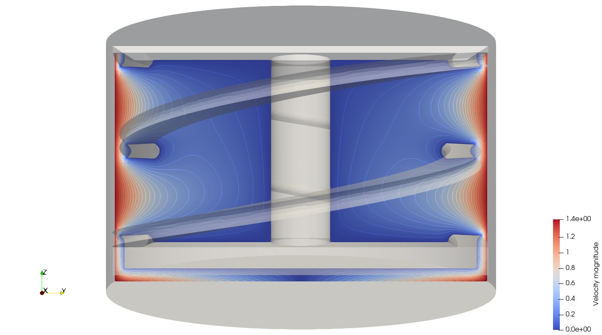

========================================================
Ribbon Mixer Using a Single Rotating Reference Frame
========================================================

When designing an industrial mixer, it is essential to evaluate the power consumed by the agitator. To do so, we usually refer to graphs correlating the power number (:math:`N_p`) as a function of the Reynolds number (:math:`Re`). :math:`N_p` is a dimensionless number that relates the power consumed by the agitator to the geometry of the system, the speed of the agitator, and the properties of the material being mixed (density :math:`\rho` and viscosity :math:`\mu`). In this example, using a single rotating frame (SRF) model, we simulate a fluid being mixed in a double helical ribbon mixer for different flow conditions (different values of :math:`Re`) to generate a numerical :math:`N_p` vs :math:`Re` curves.

In this example, we will be using the torque :math:`(\Gamma \ [=] \ \text{N} \cdot \text{m})` to calculate :math:`N_p` with the following expression:

.. math::
    N_p = \frac{2 \pi \Gamma}{\rho N^2 D^5}

where

- :math:`N` is the angular velocity :math:`[\text{rad} \cdot \text{s}^{-1}]` of the agitator;
- :math:`D` is the diameter of the impeller [m], and
- :math:`\rho` is the density of the fluid :math:`[\text{kg} \cdot \text{m}^{-3}]`.

-------------
Features
-------------

- Solver: ``lethe-fluid`` (with Q1-Q1)
- Steady-state problem
- Displays the use of a single rotating frame (``srf``) when modeling a complex rotating geometry
- Calculation of the power number (:math:`N_p`) using a python script
- Use of a Digital Research Alliance of Canada (Alliance) cluster to run simulations

----------------------------
Files Used in This Example
----------------------------

All files mentioned below are located in the example's folder (``examples/incompressible-flow/3d-ribbon-mixer-srf``).

- Bash script for gathering torques: ``Np_vs_Re/gather-torques.sh``
- Bash script for running simulations on a cluster (job script): ``Np_vs_Re/template/launch-mixer.sh``
- Experimental data file: ``Np_vs_Re/experimental.dat``
- Geometry file: ``diff-step-mesh.geo``
- Parameter file for :math:`Re = 1`: ``Re1/ribbon-gls-Re1.prm``
- Parameter file for generating multiple cases: ``Np_vs_Re/ribbon-gls.prm``
- Postprocessing Python script for generating the :math:`N_p` vs :math:`Re` curves: ``Np_vs_Re/plot_Np_vs_Re.py``
- Python script for generating different cases: ``Np_vs_Re/template/lethe_case_generator.py``
- Python script for launching all the simulations on the cluster: ``Np_vs_Re/launch_all_mixers.py``
- STEP file: ``db-helical.step``

-------------------------
Description of the Case
-------------------------

We simulate the flow generated by a double helical ribbon impeller in a cylindrical mixing tank. The double helical ribbon impeller is a close-clearance impeller making it a great option for mixing viscous fluids.

The following figure represents the geometry of our system:

The dimensions of the system are listed in the following table:

+-------------------------+----------------------------------+-------------------------+
| Parameter               | Description                      | Value                   |
+=========================+==================================+=========================+
| :math:`T`               | Tank diameter                    | :math:`28.57` cm        |
+-------------------------+----------------------------------+-------------------------+
| :math:`H`               | Tank height                      | :math:`17.4625` cm      |
+-------------------------+----------------------------------+-------------------------+
| :math:`C`               | Impeller off-bottom clearance    | :math:`T/4`             |
+-------------------------+----------------------------------+-------------------------+
| :math:`D`               | Impeller diameter                | :math:`27` cm           |
+-------------------------+----------------------------------+-------------------------+

To simulate the flow in such complex geometry, we take advantage of the system's symmetry and opt for a Lagrangian reference frame. Instead of observing the velocity profile from an Eulerian reference frame (or "lab reference frame"), we place ourselves on the impeller's reference making it static and inducing a no-slip boundary condition. This way, the cylindrical tank will be the only moving geometry in our system. The figure below illustrates the difference between the Eulerian and Lagrangian reference frames.

.. image:: images/eulerian-vs-langrangian-reference.jpg
   :alt: Eulerian and Lagrangian reference frames
   :align: center
   :name: Eulerian and Lagrangian reference frames
   :height: 5cm

The rotating Lagrangian frame of reference is non-Galilean. Consequently, the Coriolis and the centrifugal forces must be added to the incompressible Navier-Stokes equations. The resulting set of equations is:

.. math::
    \nabla \cdot \mathbf{u} &= 0   \\
    \frac{\partial \mathbf{u}}{\partial t}  + \mathbf{u} \cdot \nabla \mathbf{u} &= -\frac{1}{\rho} \nabla p  + \nu \nabla^2 \mathbf{u} +\mathbf{f} - \underbrace{\Omega \times \mathbf{u}}_{Coriolis} - \underbrace{\Omega \times (\mathbf{q} \times \mathbf{u})}_{Centrifugal}

where :math:`\mathbf{q}` is the position in the fluid with respect to the center of rotation and :math:`\mathbf{\Omega}` is the angular velocity of the rotating reference frame. The Coriolis force adds a velocity dependant force to the Navier-Stokes equations whereas the centrifugal forces is independent of the flow and only modifies the pressure field.

In this example, we will start by simulating the case when :math:`Re = 1` and then follow with simulations for :math:`Re` values ranging from :math:`0.1` to :math:`100` to generate :math:`N_p` vs :math:`Re` curves.

The Reynolds number for our system is defined as follows:

.. math::
    Re = \frac{ND^2}{\nu}

where :math:`\nu` is the kinematic viscosity of the fluid :math:`[\text{m}^2 \cdot \text{s}^{-1}]`.

--------------
Parameter File
--------------
All subsections in ``ribbon-gls.prm`` except for ``velocity source`` were discussed in previous examples. However, the important sections are briefly explained for completeness.

Simulation Control
~~~~~~~~~~~~~~~~~~

.. code-block:: text

    subsection simulation control
        set method            = steady
        set output name       = mixer
        set output boundaries = true
        set output path       = ./output/
    end

For this example, we consider that the regime is at a steady state, so we use a ``steady`` method. We set ``output boundaries = true`` to generate an auxiliary file that highlights the equipment walls by hiding the cells of the mesh. This allows a clearer visualization of the mixing setup.

Mesh
~~~~

.. code-block:: text

    subsection mesh
        set type      = gmsh
        set file name = diff-step-mesh.msh
        set simplex   = true
    end

The ``type`` specifies the mesh format used, in this case, we have ``gmsh`` which corresponds to a file generated by Gmsh. The ``set file name`` command specifies the path to the file. In this case, we assume that the parameter and mesh files are in the same location. The ``.geo`` used to generate the `gmsh <https://gmsh.info/#Download>`_ mesh is also provided. It is also interesting to note that the ``.geo`` file used in the current example imports a CAD file (``.step`` file) to get the double helical-shaped ribbon impeller.

Boundary Conditions
~~~~~~~~~~~~~~~~~~~

.. code-block:: text

    subsection boundary conditions
      set number = 3
      subsection bc 0
        set id   = 1
        set type = function
        subsection u
          set Function expression = -10*y
        end
        subsection v
          set Function expression = 10*x
        end
        subsection w
          set Function expression = 0
        end
      end
      subsection bc 1
        set id   = 2
        set type = slip
      end
    
      subsection bc 2
        set id   = 3
        set type = noslip
      end
    end

Three different boundary conditions are considered.

- On the lateral walls and the bottom wall (``id=1``), we use the ``function boundary type``. This type of boundary condition allows us to define the value of the velocity components using ``Function expression``. We set :math:`u = -10 \cdot y`, :math:`v = 10 \cdot x`, and :math:`w= 0` to ensure that the impeller's referential is static and the tank rotates in the opposite direction.
- At the top of the vessel (``id=2``), a slip boundary condition is imposed on the free surface.
- On the ribbon blades, a no-slip boundary condition applies (``id=3``).

The boundary conditions are described in the :doc:`../../../parameters/cfd/boundary_conditions_cfd` section of the documentation.

Physical Properties
~~~~~~~~~~~~~~~~~~~

.. code-block:: text

    subsection physical properties
      subsection fluid 0
        set kinematic viscosity = 0.11602395351399172
       end
    end

Here, the kinematic viscosity is set for a :math:`Re = 1`, when the angular velocity is :math:`10` Hz and the diameter of the impeller is :math:`0.27` m.

Velocity Source
~~~~~~~~~~~~~~~

.. code-block:: text

    subsection velocity source
        set type    = srf
        set omega_z = -10
    end

In the ``velocity source`` subsection, we specify with ``type = srf`` that we are in a single rotating reference frame. Since a centrifugal and a Coriolis force are induced by the rotating movement of the system, we are in a non-Galilean reference frame. These two additional force contributions must be taken into account in the Navier-Stokes equations and by setting the ``type`` parameter to ``srf`` we do so. The ``omega_z`` parameter represents the angular velocity of the reference frame.

Forces
~~~~~~
The ``forces`` subsection controls the postprocessing of the torque and the forces acting on the boundaries of the domain.

.. code-block:: text

    subsection forces
        set verbosity             = verbose   # Output force and torques in log <quiet|verbose>
        set calculate torque      = true      # Enable torque calculation
        set torque name           = torque    # Name prefix of torque files
        set output precision      = 14        # Output precision
        set calculation frequency = 1         # Frequency of the force calculation
        set output frequency      = 1         # Frequency of file update
    end

By setting ``calculate torque = true`` , the calculation of the torque resulting from the fluid dynamics physics on every boundary of the domain is automatically calculated. Setting ``verbosity = verbose`` will print out the value of the torque calculated. The ``output precision`` parameter holds the number of digits after the decimal point of the outputted value.

Non-linear Solver
~~~~~~~~~~~~~~~~~

.. code-block:: text

    subsection non-linear solver
      subsection fluid dynamics
        set tolerance = 1e-10
      end
    end

Lethe is an implicit CFD solver. Solving a steady-state problem requires the solution of a non-linear system of equations. By default, Lethe uses a Newton solver for which a ``tolerance`` must be specified. Here, we set our tolerance at ``1e-10``.

Linear Solver
~~~~~~~~~~~~~
Relatively standard parameters are used for the linear solver. From our experience, the ``amg`` preconditioner is more robust and for that reason we will use it.

.. code-block:: text

    subsection linear solver
      subsection fluid dynamics
        set method                                    = gmres
        set max iters                                 = 100
        set relative residual                         = 1e-4
        set minimum residual                          = 1e-10
        set preconditioner                            = amg
        set amg preconditioner ilu fill               = 0
        set amg preconditioner ilu absolute tolerance = 1e-11
        set amg preconditioner ilu relative tolerance = 1.00
        set amg aggregation threshold                 = 1e-14  # Aggregation
        set amg n cycles                              = 2      # Number of AMG cycles
        set amg w cycles                              = false  # W cycles, otherwise V cycles
        set amg smoother sweeps                       = 2      # Sweeps
        set amg smoother overlap                      = 1      # Overlap
        set verbosity                                 = verbose
        set max krylov vectors                        = 500
      end
    end

----------------------
Running the Simulation
----------------------

Generating the Mesh
~~~~~~~~~~~~~~~~~~~~~
Before launching the simulation, the mesh has to be generated.
Using Gmsh, with the ``diff-step-mesh.geo`` file we generate the ``diff-step-mesh.msh`` file.

Assuming the ``gmsh`` executable is within your ``$PATH`` variable, you may generate the ``msh`` file by typing:

.. code-block:: text
  :class: copy-button

     gmsh -3 diff-step-mesh.geo -o diff-step-mesh.msh

You can then copy this file in the ``Re1`` folder:

.. code-block:: text
  :class: copy-button

     cp diff-step-mesh.msh Re1

and then move it to the ``Np_vs_Re`` folder:

.. code-block:: text
  :class: copy-button

     mv diff-step-mesh.msh Np_vs_Re

Simulating for a Specific Flow Condition :math:`(Re=1)`
~~~~~~~~~~~~~~~~~~~~~~~~~~~~~~~~~~~~~~~~~~~~~~~~~~~~~~~~~~
Launching the simulation is as simple as specifying the executable name and the parameter file. Assuming that the ``lethe-fluid`` executable is within your path, the simulation can be launched by typing:

.. code-block:: text
  :class: copy-button

    mpirun -np $number_of_CPUs lethe-fluid ribbon-gls-Re1.prm

Generating :math:`N_p` vs :math:`Re` Curves :math:`(Re \in [0.1, 100])`
~~~~~~~~~~~~~~~~~~~~~~~~~~~~~~~~~~~~~~~~~~~~~~~~~~~~~~~~~~~~~~~~~~~~~~~
To generate :math:`N_p` vs :math:`Re` curves, we are going to launch simulations for :math:`25` different values of :math:`Re`. In this example, we will be launching these simulations on an Alliance cluster.

.. seealso::

    If it is your first time running simulations from Lethe on an Alliance cluster, you may want to see our installation guide on how to setup and install all the necessary software and modules: :doc:`../../../installation/digital_alliance`.

.. _Generating_the_Different_Cases:

Generating the Different Cases
^^^^^^^^^^^^^^^^^^^^^^^^^^^^^^^

Using ``lethe_case_generator.py``, we generate the :math:`25` cases with :math:`Re` ranging from :math:`0.1` to :math:`100`. Before running the Python script, it is important to **specify your group account name**, next to ``#SBATCH --account=`` among the job directives of the ``launch-mixer.sh`` script located in the ``template`` folder.

.. warning::

	In order to run a job on an Alliance cluster, it is required to at least specify the time limit of the job (``-- time``) and your account (``--account``).

Here are a few examples of other job directives you may want to specify in your job script:

.. code-block:: text
  :class: copy-button

  #!/bin/bash
  #SBATCH --account=$yourgroupaccount
  #SBATCH --time=1:00:00                  #maximum time for the simulation (hh:mm:ss or d-hh:mm:ss)
  #SBATCH --ntasks-per-node=$X            #number of parallel tasks (as in mpirun -np X)
  #SBATCH --nodes=1                       #number of whole nodes used (each with up to 40 tasks-per-node)
  #SBATCH --mem=120G                      #memory usage per node. See cluster specification for maximal amount.
  #SBATCH --job-name=$yourjobname
  #SBATCH --mail-type=END                 #email preferences
  #SBATCH --mail-type=FAIL
  #SBATCH --mail-user=$your.email.adress@email.provider

.. note::

    In this example, it is not necessary to specify the job name in the job script, we will be specifying it when submitting the jobs.

.. warning::

    The cluster we used in this example was Béluga, you may need to adjust slightly the Bash script if you are going to run your simulations on a different cluster.

For our example, we will be running every job on :math:`1` node with :math:`40` tasks per node.

Once you have added your account and all the other job directives you wanted to add in the Bash script, we may generate the different cases by running the ``lethe_case_generator.py`` script. The kinematic viscosity for each :math:`Re` value, :math:`\omega = 10 \ \text{Hz}` and :math:`D = 0.27 \ \text{m}` is then calculated.

.. math::
    \nu = \frac{ND^2}{Re}

After that, the ``{{N}}`` expression in the ``Physical Properties`` subsection of the ``ribbon-gls.prm`` file is replaced by the calculated value of :math:`\nu` using the Jinja2 module. That is how the different ``.prm`` files for the different cases are generated.

.. note::

    If you don't have the Jinja2 module installed, you may install it using ``pip`` with the following command line:

    .. code-block:: text
      :class: copy-button

        pip install Jinja2

After running the ``lethe_case_generator.py`` script you should have :math:`25` new folders named by the following syntax: ``mixer_$kinematic_viscosity_value``. A new file named ``case_index.txt`` containing the names of all the new folders should also have been generated.

Copying Files to the Cluster
^^^^^^^^^^^^^^^^^^^^^^^^^^^^^^
We will now copy the ``Np_vs_Re`` folder to the cluster.

On your **local computer**, you may copy the ``Np_vs_Re`` folder to your ``scratch`` folder in the cluster with:

.. code-block:: text
  :class: copy-button

  scp -r Path/To/Np_vs_Re username@clustername.computecanada.ca:/scratchPathInCluster

.. tip::

    You may want to save the path to your ``scratch`` folder in the cluster in an environment variable on your local computer so that you do not have to type the long expression every time you copy files there. You may do so by adding the following line to your ``~/.bashrc`` file (or any equivalent file) and sourcing the file:

    .. code-block:: text
      :class: copy-button

      export SCRATCH_PATH=username@clustername.computecanada.ca:/scratchPathInCluster

    By doing so, you may copy the ``Np_vs_Re`` folder from your local computer with:

    .. code-block:: text
      :class: copy-button

      scp -r Path/To/Np_vs_Re $SCRATCH_PATH

.. seealso::

	To avoid copying the ``Np_vs_Re`` folder, it is also possible to run the ``lethe_case_generator.py`` script directly into the cluster. To do so, you need to create a Python virtual environment and install Jinja2. See here the `documentation <https://docs.alliancecan.ca/wiki/Python>`_ from the Alliance.

Submitting Jobs and Launching Simulations
^^^^^^^^^^^^^^^^^^^^^^^^^^^^^^^^^^^^^^^^^^^
The next step is to connect to an Alliance cluster:

.. code-block:: text
  :class: copy-button

  ssh username@clustername.computecanada.ca

After connecting to your preferred cluster, you can submit your jobs by running the ``launch_all_mixers.py`` Python script located in the ``Np_vs_Re`` folder. After running the script, :math:`25` new jobs should have been generated. You may check if it is the case with the ``sq`` command. In the ``ST`` column of the output, you may see the status of each job. The two most common states are ``PD`` for *pending* or ``R`` for *running*.

.. admonition:: Have trouble submitting the jobs?
    :class: caution

    If you are having issues with submitting the jobs please return to the :ref:`Generating_the_Different_Cases` subsection and make sure that you added the required information in the ``launch-mixer.sh`` script.

.. seealso::

    For more information on the scheduler and running jobs on an Alliance cluster, you may visit their wiki pages:

    - `What is a scheduler? <https://docs.alliancecan.ca/wiki/What_is_a_scheduler%3f>`_
    - `Running jobs <https://docs.alliancecan.ca/wiki/Running_jobs>`_

----------------------
Results and Discussion
----------------------

Simulating for a Specific Flow Condition :math:`(Re=1)`
~~~~~~~~~~~~~~~~~~~~~~~~~~~~~~~~~~~~~~~~~~~~~~~~~~~~~~~
In the ``output`` subdirectory, you will find the ``mixer.pvd`` file that can be visualized using `Paraview <https://www.paraview.org/download/>`_. In the figure below, the velocity magnitude are shown for a flow at :math:`Re = 1`. Because a SRF is used, we can notice the rotational velocity imposed on the walls and the no-slip condition on the ribbon.

In the reference frame of the tank, the velocity field and its streamlines are visualized in an Eulerian frame. It is possible to do so by simply selecting ``velocity_eulerian`` in Paraview.

Generating :math:`N_p` vs :math:`Re` Curves :math:`(Re \in [0.1, 100])`
~~~~~~~~~~~~~~~~~~~~~~~~~~~~~~~~~~~~~~~~~~~~~~~~~~~~~~~~~~~~~~~~~~~~~~~

Copying Files to Your Local Computer (Using SFTP)
^^^^^^^^^^^^^^^^^^^^^^^^^^^^^^^^^^^^^^^^^^^^^^^^^
Before postprocessing the results of the simulations, you may want to copy the files from the remote machine to your local one. You may do so by connecting to the remote computer with the Secure File Transfer Protocol (SFTP):

.. code-block:: text
  :class: copy-button

  sftp username@clustername.computecanada.ca

With the ``get`` command you may copy the remote ``Np_vs_Re`` folder:

.. code-block:: text
  :class: copy-button

  get -r Path/To/Remote_Np_vs_Re Path/To/Local_directory

.. note::

    Earlier, before launching the simulations, we could have also uploaded the initial ``Np_vs_Re`` folder using this method with the ``put`` command:

    .. code-block:: text
      :class: copy-button

      put -r Path/To/Local_Np_vs_Re Path/To/Remote_scratch_directory

Once the transfer is completed, you may exit with the ``exit`` command.

Postprocess Data
^^^^^^^^^^^^^^^^^
In order to generate the :math:`N_p` vs :math:`Re` curves, we must first gather all the calculated :math:`\Gamma` from all different cases. You may do so by executing the ``gather-torques.sh`` Bash script. A new ``gather.dat`` file will be generated containing the number of cells and the :math:`\Gamma` components of each simulated case.

.. note::

    In order to run the ``gather-torques.sh`` script, you must make sure that the script is executable. If it is not executable, you may add the permissions with:

    .. code-block:: text
      :class: copy-button

      chmod +x Path/To/gather-torques.sh

After that, you may run the ``plot_Np_vs_Re.py`` Python script to get the figure shown below.

.. image:: images/Np-Re.png
   :alt: Power curve
   :align: center
   :name: Power curve

As you can see, :math:`N_p` decreases when :math:`Re` increases. It is explained by:

.. math::

    N_p = \frac{2 \pi \Gamma}{\rho N^2 D^5} =\frac{1}{Re}  \frac{2 \pi \Gamma}{\mu  N D^3}

As we can see in the image above, for :math:`Re < 100` (laminar regime), the Lethe curve fits well with the experimental values.

----------------------------
Possibility for Extension
----------------------------

It could be interesting to simulate at higher Reynolds numbers in a transient simulation and compare the results with the experimental data.

-----------
Reference
-----------

`[1] <https://doi.org/10.1016/j.powtec.2020.05.006>`_ B. Delacroix, A. Bouarab, L. Fradette, F. Bertrand, and B. Blais, “Simulation of granular flow in a rotating frame of reference using the discrete element method,” *Powder Technol.*, vol. 369, pp. 146–161, Jun. 2020, doi: 10.1016/j.powtec.2020.05.006.
