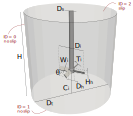

===============================================================================
Mixer with Pitched-Blade Turbine Impeller Using Nitsche Immersed Boundary
===============================================================================

Simulation of mixing in stirred-tanks is one important industrial application which is often simulated with Lethe. Agitated vessels are widely applied in chemical engineering as product homogenizers, heat and mass transfer enhancers, and surface area maximizers in solid-fluid processes. Batch and Continuous Stirred Tank Reactors (CSTR), for example, are among the most often reactor models applied in chemical industries that can be simulated through computational fluid dynamics.

This example illustrates how the transient flow in a stirred-tank can be simulated by Lethe using the Nitsche Immersed Boundary (NIB) formulation.

.. seealso::
	This example is related to the article *A parallel and adaptative Nitsche immersed boundary method to simulate viscous mixing* by  Joachim *et al.* `[1] <https://doi.org/10.1016/j.jcp.2023.112189>`_

--------
Features
--------

- Solvers: ``lethe-fluid-nitsche``
- Transient problem
- Rotating complex solid modeled with Nitsche immersed boundary
- Calculation of the average velocity

--------------------------
Files Used in This Example
--------------------------

All files mentioned below are located in the example's folder (``examples/incompressible-flow/3d-nitsche-mixer-with-pbt-impeller``).

- Geometry file: ``pbt.geo``
- Mesh file: ``pbt.msh``
- Parameter file: ``mixer.prm``

-----------------------
Description of the Case
-----------------------

We simulate the flow generated by a pitched blade turbine (PBT) in a stirred tank. The PBT is an axial impeller, which generates a flow pattern that amplifies axial circulation within the vessel (in opposition to radial impellers, e.g. Rushton turbines) `[2] <https://onlinelibrary.wiley.com/doi/book/10.1002/0471451452>`_.

The setup that we wish to simulate is schematized in the following figure:

The dimensions are listed in the following table:

+--------------------+----------------------------+---------------------------------------+
| Symbol             | Description                | Value                                 |
+====================+============================+=======================================+
| :math:`D_\text{t}` | Tank diameter              | :math:`0.3` m                         |
+--------------------+----------------------------+---------------------------------------+
| :math:`H`          | Height of the fluid domain | :math:`D_\text{t}`                    |
+--------------------+----------------------------+---------------------------------------+
| :math:`C_\text{i}` | PBT off-bottom clearance   | :math:`D_\text{t}/4`                  |
+--------------------+----------------------------+---------------------------------------+
| :math:`D_\text{i}` | PBT diameter               | :math:`D_\text{t}/3`                  |
+--------------------+----------------------------+---------------------------------------+
| :math:`W_\text{i}` | PBT blade width            | :math:`D_\text{i}/5`                  |
+--------------------+----------------------------+---------------------------------------+
| :math:`T_\text{i}` | PBT blade thickness        | :math:`W_\text{i}/10`                 |
+--------------------+----------------------------+---------------------------------------+
| :math:`\theta`     | Tilt angle of the blades   | :math:`45^\circ`                      |
+--------------------+----------------------------+---------------------------------------+
| :math:`D_\text{s}` | Shaft diameter             | :math:`W_\text{i}\times \cos(\theta)` |
+--------------------+----------------------------+---------------------------------------+
| :math:`D_\text{h}` | Hub diameter               | :math:`1.4 \times D_\text{s}`         |
+--------------------+----------------------------+---------------------------------------+
| :math:`H_\text{h}` | Hub height                 | :math:`W_\text{i} \times \sin(\theta)`|
+--------------------+----------------------------+---------------------------------------+
		
.. seealso::
	The ``.geo`` file used to generate the mesh is available in the example folder, or `in lethe-utils repository <https://github.com/lethe-cfd/lethe-utils>`_.

The boundary conditions on the tank are:

* ``noslip`` on the hull and bottom wall, and 
* ``slip`` on the upper wall to mimic the liquid's free surface. 

.. note::
	The use of a ``slip`` boundary condition is debatable. A ``none`` (do-nothing) boundary condition could also be used since free surfaces have constant pressure, but the slip boundary condition is generally significantly more numerically robust.

For this configuration, the Reynolds number is defined as:

.. math::
    Re = \frac{D_\text{i}^2 N}{\nu}

where :math:`N` is the angular velocity in Hertz (or Rotation Per Second, RPS), here constant (:math:`N = 1~\text{Hz}`), and :math:`\nu` is the kinematic viscosity in :math:`\text{m}^2/\text{s}`. 

We investigate this case at a Reynolds number :math:`Re=300`. This example can easily be extended to higher Reynolds number values by lowering the kinematic viscosity. It would then be necessary to increase the mesh resolution for the solution to be meaningfully accurate.

--------------
Parameter File
--------------

Except for the Nitsche immersed boundary, all other sections of the parameter file in the present case have been explained in previous examples. However, the important sections are briefly explained for completeness.

Simulation Control
~~~~~~~~~~~~~~~~~~~

The :doc:`../../../parameters/cfd/simulation_control` subsection defines the time integration and output results:

.. code-block:: text

    subsection simulation control
      set method            = bdf2
      set output name       = mixer
      set output path       = ./output/
      set output frequency  = 2
      set time end          = 5
      set time step         = 0.02
      set output boundaries = true
    end

Since the flow generated by the agitator is naturally transient, we simulate:

* a total of ``time end = 5`` seconds, 
* with a ``time step = 0.02`` second, 
* using a second-order ``bdf2`` time-stepping method.

Results are outputted:

* at every ``output frequency = 2`` iterations, and
* we set ``output boundaries = true`` to generate an auxiliary ``.vtu`` file that highlights the tank walls by hiding the cells of the mesh. This allows for a clearer visualization of the mixing setup.

Physical Properties
~~~~~~~~~~~~~~~~~~~

The :doc:`../../../parameters/cfd/physical_properties` subsection defines our fluid:

.. code-block:: text

  subsection physical properties
    subsection fluid 0
      set kinematic viscosity = 0.001
    end
  end

The kinematic viscosity is set to :math:`0.001`. This, combined with the angular velocity of :math:`1~\text{Hz}` and the diameter of the impeller of :math:`0.3~\text{m}`, will allow us to simulate the vessel at :math:`Re=300`.

Mesh
~~~~~

The :doc:`../../../parameters/cfd/mesh` subsection specifies the computational grid:

.. code-block:: text

  subsection mesh
      set type               = dealii
      set grid type          = subdivided_cylinder
      set grid arguments     = 2:0.5:0.5
      set initial refinement = 3
  end

Thanks to our immersed boundary approach, we only need to mesh the vessel without considering the impeller. This greatly simplifies the meshing process, so that the mesh can be generated straightforwardly using the deal.II mesh generator for a subdivided cylinder, where:

* the half-height is :math:`= 0.5`, and 
* the radius of the vessel is :math:`= 0.5`. 

This will generate a vessel in which the axis of the impeller will be along the :math:`x` coordinate. The bottom of the vessel will be on the :math:`x=-0.5` plane. 

.. seealso::
	For detailed explanation of the mesh generators, see the deal.ii `GridGenerator <https://www.dealii.org/current/doxygen/deal.II/namespaceGridGenerator.html>`_.

Boundary Conditions
~~~~~~~~~~~~~~~~~~~

The :doc:`../../../parameters/cfd/boundary_conditions_cfd` subsection establishes the constraints on different parts of the domain:

.. code-block:: text

    subsection boundary conditions
      set number = 3
      subsection bc 0
        set id   = 0
        set type = noslip
      end
      subsection bc 1
        set id   = 1
        set type = noslip
      end
      subsection bc 2
        set id   = 2
        set type = slip
      end
    end

Three boundary conditions are considered:

* on the hull (``id=0``, lateral walls): ``noslip``,
* on the bottom wall (``id=1``): ``noslip``, and
* on the upper wall (``id=2``): ``slip``. 

.. seealso::
	The boundary conditions are described in the :doc:`../../../parameters/cfd/boundary_conditions_cfd` section of the documentation.

Nitsche Immersed Boundary Parameters
~~~~~~~~~~~~~~~~~~~~~~~~~~~~~~~~~~~~

The :doc:`../../../parameters/cfd/nitsche` subsection is used to insert the immersed geometry and control its motion.

.. code-block:: text

    subsection nitsche
      set number of solids = 1
      subsection nitsche solid 0
        subsection mesh
          set type      = gmsh
          set file name = pbt.msh
          set simplex   = true
        end
        subsection solid velocity
          set Function expression = 0 ; 1*2*pi*z ; -1*2*pi*y
        end
    
        set calculate torque on solid = true
        set enable particles motion   = true
        set particles sub iterations  = 10
      end
    end

* ``subsection mesh``: controls the mesh used for the Nitsche immersed boundary, working as a regular :doc:`../../../parameters/cfd/mesh` subsection. 

  * ``type = gmsh``: we import a mesh file (``.msh``) of the PBT that is in the same folder as the ``.prm``, with the specified ``file name``
  * ``simplex = true``: mandatory as the mesh is built with simplices (tetrahedra), to better account for the PBT geometry

* ``subsection solid velocity``: specify the velocity as a rotation around the :math:`x` axis of the meshes, centered at :math:`(0,0,0)`.

  .. warning::
	The ``solid velocity`` specified in the ``.prm`` must be consistent with the axes of the GMSH mesh.

* ``enable particles motion = true``: mandatory as the solid is moving inside the fluid.
* ``particles sub iterations = 10``: ensures that particles are always located efficiently as they move through the cell.
* ``calculate torque on solid = true``: computes torque calculation on the PBT and saves it in the file ``torque_solid_00.dat``.

Post-processing
~~~~~~~~~~~~~~~

It is often desirable to obtain the time-averaged velocity field when simulating a transient flow. This is achieved through the :doc:`../../../parameters/cfd/post_processing` section. The averaging period is started after the flows start to stabilize and reach their pseudo steady-state. In this case, we assume it happens after :math:`2~\text{sec}`. This choice is prone to error, which can be mitigated by increasing the duration of simulations and using a longer averaging interval.

.. code-block:: text

    subsection post-processing
      set calculate average velocities = true
      set initial time                 = 2
    end

Mesh Adaptation
~~~~~~~~~~~~~~~

We use :doc:`../../../parameters/cfd/mesh_adaptation_control` on the fluid velocity, so that cells are refined in cells where the fluid velocity changes the most.

.. code-block:: text

    subsection mesh adaptation
      set type                 = kelly
      set variable             = velocity
      set fraction type        = fraction
      set max number elements  = 1200000
      set max refinement level = 5
      set min refinement level = 3
      set frequency            = 5
      set fraction refinement  = 0.2
    end

Here, we refine:

* at each ``frequency = 5`` iterations, 
* on a ``fraction refinement = 0.2`` (:math:`20\%` of the cells), 
* with ``max number elements = 1200000`` to limit the computational cost. 

The ``min refinement level`` and ``max refinement level`` are chosen in consideration of the ``initial refinement = 3`` of the fluid mesh: the cells cannot be coarsen (as ``min refinement level`` = ``initial refinement``), and can be refined up to two times.

Non-linear Solver
~~~~~~~~~~~~~~~~~

Since this is a transient problem, it is not highly non-linear except for the first few iterations. Thus, we use standard :doc:`../../../parameters/cfd/non-linear_solver_control` parameters.

.. code-block:: text

    subsection non-linear solver
      subsection fluid dynamics
        set tolerance = 1e-4
        set solver    = inexact_newton
      end
    end

Because the assembly of the Nitsche restriction for the immersed boundary is relatively expensive, we reuse the Jacobian matrix as much as possible. This is accomplished by setting ``solver = inexact_newton``.

Linear Solver
~~~~~~~~~~~~~

Relatively standard parameters are used for the :doc:`../../../parameters/cfd/linear_solver_control`. From our experience, the ``amg`` preconditioner is more robust with the Nitsche immersed boundaries than the traditional ILU.

.. code-block:: text

    subsection linear solver
      subsection fluid dynamics
        set method                                    = gmres
        set max iters                                 = 200
        set minimum residual                          = 1e-7
        set preconditioner                            = amg
        set amg preconditioner ilu absolute tolerance = 1e-8
        set amg preconditioner ilu relative tolerance = 2.00
        set amg aggregation threshold                 = 1e-10  
        set max krylov vectors                        = 200
      end
    end

----------------------
Running the Simulation
----------------------

Launching the simulation is as simple as specifying the executable name and the parameter file. For this more complex example, it is highly advised to use ``mpirun`` to parallelize the computation, with ``<np>`` the number of processes, defined accordingly with your machine's number of cpu.  Assuming that the ``lethe-fluid-nitsche`` executable is within your path, the simulation can be launched by typing, in a terminal opened in the example folder:

.. code-block:: text
  :class: copy-button

  mpirun -np <np> lethe-fluid-nitsche mixer.prm

Lethe generates a larger number of files when the Nitsche immersed boundary is used:

* the ``mixer.pvd`` contains the 3D visualization of the velocity, pressure, and auxiliary variables such as the average velocity ;
* the ``mixer_solid_triangulation_00.pvd``, corresponding to the Nitsche IB mesh ;
* the ``mixer_solid_particles_00.pvd``, corresponding to the discrete particles inserted at the Gauss points of the solid triangulation. 

.. tip ::
  The solid particles enable the Nitsche restriction visualization, while the solid triangulation is used for animation purposes.

----------------------
Results and Discussion
----------------------

The following movie shows the evolution of the velocity magnitude as a function of time in a cut perpendicular to the radius of the vessel with and without the mesh :

.. raw:: html

    <iframe width="560" height="315" src="https://www.youtube.com/embed/rt6PAvgMkio" frameborder="0" allowfullscreen></iframe>

.. raw:: html

   <iframe width="560" height="315" src="https://www.youtube.com/embed/jvaT76qBBTs" frameborder="0" allowfullscreen></iframe>

Whereas the next one show the evolution of the axial velocity pattern in the same cut:

.. raw:: html

    <iframe width="560" height="315" src="https://www.youtube.com/embed/8b0ETD8EkQc" frameborder="0" allowfullscreen></iframe>

Finally, the following animation illustrates the axial velocity pattern in an axial cut of the vessel:

.. raw:: html

    <iframe width="560" height="315" src="https://www.youtube.com/embed/_VUoN8TGsJ4" frameborder="0" allowfullscreen></iframe>

From these animations, we can see that the impeller generates an axial pumping flow. The fluid is diagonally propelled from the blade to the lateral walls and rises along the outer periphery of the vessel before circulating down along the shaft. 

Although the transient flow patterns are clear, looking at the time-averaged velocity field is also relevant. The following figures show the time-averaged axial velocity in the axial plane:

  .. image:: images/averaged-axial-velocity.png
   :alt: Time-averaged axial velocity
   :align: center
   :name: axial_velocity

Clearly, the fluid is descending along the shaft and rises along the lateral walls of the vessel.
Multiple analyses can be done with this type of simulation. For example, one can monitor the torque on the impeller as a function of the Reynolds number to generate the power curve of the agitator. One could also leverage the tracer multiphysics module to measure the mixing time of the tank and/or identify the presence of dead zones.

----------------------------
Possibilities for Extension
----------------------------

- **Increase the Reynolds number:** Using a finer grid, this example can be launched at even higher Reynolds numbers. In the latter case, the flow is significantly more unsteady.

- **Calculate the mixing time using the passive tracer physics:** Using the passive tracer physics and the built-in post-processing tool, the mixing time in the vessel can be easily calculated.

---------
Reference
---------

`[1] <https://doi.org/10.1016/j.jcp.2023.112189>`_ 	J. Joachim, C.-A. Daunais, V. Bibeau, L. Heltai, and B. Blais, “A parallel and adaptative Nitsche immersed boundary method to simulate viscous mixing,” *J. Comput. Phys.*, vol. 488, p. 112189, Sep. 2023, doi: 10.1016/j.jcp.2023.112189.

`[2] <https://onlinelibrary.wiley.com/doi/book/10.1002/0471451452>`_  E. L. Paul, V. A. Atiemo-Obeng, and S. M. Kresta,
*Handbook of Industrial Mixing*, John Wiley & Sons, Ltd, 2003. doi: 10.1002/0471451452.
