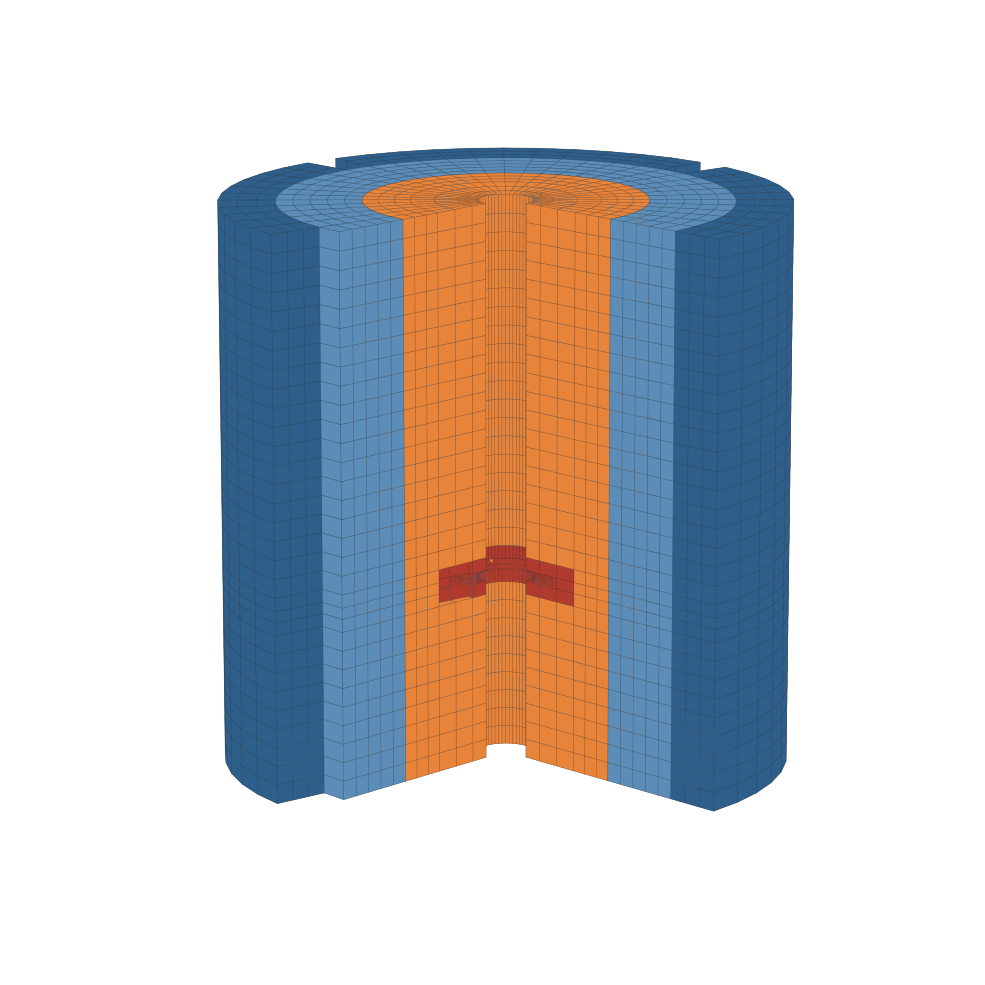

==================================================
Rushton Mixer Using the Mortar Method
==================================================

This example showcases the use of the mortar method in Lethe to simulate a baffled stirred tank agitated by a Rushton turbine, using the built-in Rushton mixer grid to generate both halves of the domain.

---------
Features
---------

- Solvers: ``lethe-fluid`` (Q1-Q1 with bubble enrichment) and ``lethe-fluid-matrix-free`` (Q2-Q2 with global-coarsening multigrid)
- Transient problem
- Mortar method for rotating geometry in three dimensions
- Usage of the ``lethe`` built-in :ref:`Rushton Mixer <rushton-mixer>` grid with the mortar method
- Torque computation on the impeller

----------------------------
Files Used in This Example
----------------------------

All files mentioned below are located in the example's folder (``examples/incompressible-flow/3d-rushton-mixer-mortar``).

- Parameter file (matrix-based): ``rushton-mixer-mortar.prm``
- Parameter file (matrix-free): ``rushton-mixer-mortar-matrix-free.prm``

No mesh file is needed: both the rotor and the stator meshes are generated by Lethe from the dimensions given in the parameter file. The two parameter files describe the same case on the same mesh and differ only in the discretization and the linear solver, so they can be compared directly.

-----------------------
Description of the Case
-----------------------

A Rushton turbine is the archetypal *radial* impeller: a flat disc carrying six vertical blades, which discharges a strong radial jet at the height of the impeller. The jet impinges on the tank wall and splits, driving a ring vortex above the impeller and another below it. Four baffles on the wall convert the swirl into that axial circulation and prevent the free surface from forming a vortex.

The domain is split into two parts, coupled by mortar elements across a cylindrical interface coaxial with the tank:

- the **rotor**, inside the interface, which rotates rigidly and carries the shaft, the disc and the six blades. As on a real turbine the blades start inside the disc rim, at :math:`D/4`, so that they protrude above and below the disc;
- the **stator**, outside it, which is fixed and carries the four baffles and the tank wall.

Both meshes are generated by Lethe's Rushton mixer grid from the same set of dimensions, which guarantees that the two sides of the interface carry the same number of faces and discretize the height identically, as the mortar implementation requires.

The geometry follows the standard Rushton proportions, normalized by the tank diameter :math:`T = 1`:

.. list-table::
   :header-rows: 1

   * - Dimension
     - Value
   * - Liquid height :math:`H`
     - :math:`T`
   * - Impeller diameter :math:`D`
     - :math:`T/3`
   * - Disc diameter
     - :math:`0.75\,D`
   * - Blade radial span
     - :math:`D/4` to :math:`D/2`
   * - Blade height
     - :math:`D/5`
   * - Off-bottom clearance
     - :math:`T/3`
   * - Baffle width
     - :math:`T/10`
   * - Number of blades / baffles
     - 6 / 4

The impeller turns at :math:`N = 1` revolution per second and the kinematic viscosity is chosen so that the impeller Reynolds number is

.. math::
   Re = \frac{N D^2}{\nu} = 100

which keeps the flow laminar, as is appropriate for a mesh of this size.

--------------
Parameter File
--------------

Mesh
~~~~

The ``mesh`` subsection describes the **stator**, that is the fixed half of the domain. The sixteen ``grid arguments`` are the dimensions of the vessel and of the impeller followed by the discretisation controls, and are documented in the :ref:`Rushton Mixer <rushton-mixer>` grid section.

.. code-block:: text

  subsection mesh
    set type               = lethe
    set grid type          = rushton_stator
    set grid arguments     = 1 : 1 : 0.3333333333333333 : 0.16666666666666666 : 0.25 : 0.02 : 0.06666666666666667 : 0.1 : 0.3333333333333333 : 0.1 : 0.5 : 6 : 4 : 48 : 1 : 1 : 0
    set initial refinement = 0
  end

Mortar
~~~~~~

The ``mortar`` subsection contains a nested ``mesh`` subsection describing the **rotor**. It is given exactly the same ``grid arguments`` as the stator, and differs only by its ``grid type``.

.. code-block:: text

  subsection mortar
    set enable = true
    subsection mesh
      set type           = lethe
      set grid type      = rushton_rotor
      set grid arguments = 1 : 1 : 0.3333333333333333 : 0.16666666666666666 : 0.25 : 0.02 : 0.06666666666666667 : 0.1 : 0.3333333333333333 : 0.1 : 0.5 : 6 : 4 : 48 : 1 : 1 : 0
    end
    set rotor boundary id       = 10
    set stator boundary id      = 0
    set center of rotation      = 0, 0, 0
    set rotation axis direction = 2
    subsection rotor rotation angle
      set Function constants  = omega=6.283185307179586
      set Function expression = omega*t
    end
    subsection rotor angular velocity
      set Function constants  = omega=6.283185307179586
      set Function expression = omega
    end
    set penalty factor = 1
    set verbosity      = verbose
  end

.. warning::
  The ``rotor angular velocity`` must be the time derivative of the ``rotor rotation angle``.

Boundary Conditions
~~~~~~~~~~~~~~~~~~~

The stator carries five distinct boundary ids, so the rotor ids are shifted by five when the two halves are merged:

.. list-table::
   :header-rows: 1

   * - Id
     - Surface
     - Condition
   * - 0, 10
     - Both sides of the mortar interface
     - ``none``
   * - 1, 2, 3
     - Tank wall, baffles and stator floor
     - ``noslip``
   * - 4, 9
     - Free surface
     - ``slip``
   * - 5, 6, 7
     - Shaft, disc and blades
     - ``function``
   * - 8
     - Rotor floor
     - ``noslip``

The shaft, the disc and the blades rotate with the mesh, and are given the solid-body velocity :math:`\mathbf{u} = \boldsymbol{\omega} \times \mathbf{r}`, evaluated at the current position of the rotated mesh.

The vessel is closed, in the sense that no boundary imposes a pressure or a traction, so the pressure is only determined up to a constant. It is therefore pinned in a single node with ``set fix pressure constant = true``.

.. note::
  The rotor mesh rotates rigidly, but its floor and its free surface are annuli centered on the axis and are therefore invariant under that rotation. Imposing a no-slip condition on the rotor floor and a slip condition on the rotor free surface does describe a fixed vessel.

.. code-block:: text

  subsection boundary conditions
    set number = 6
    subsection bc 0
      set type = none
      set id   = 0, 10
    end
    subsection bc 3
      set type = function
      set id   = 5, 6, 7
      subsection u
        set Function constants  = omega=6.283185307179586
        set Function expression = -omega*y
      end
      subsection v
        set Function constants  = omega=6.283185307179586
        set Function expression = omega*x
      end
      subsection w
        set Function expression = 0
      end
    end
  end

Forces
~~~~~~

The torque exerted on the shaft, the disc and the blades is computed at every time step, which gives the power drawn by the impeller and hence its power number.

.. code-block:: text

  subsection forces
    set verbosity        = verbose
    set calculate torque = true
  end

Matrix-Free Variant
~~~~~~~~~~~~~~~~~~~

The matrix-free solver imposes two changes on the parameter file. It builds an ``FE_Q`` system of equal order for the velocity and the pressure and asserts that the two degrees match, and it does not offer the bubble enrichment, so the Q1-Q1 pair with bubble is replaced by an equal-order Q2-Q2 pair stabilized by PSPG/SUPG:

.. code-block:: text

  subsection FEM
    set velocity degree = 2
    set pressure degree = 2
  end

The preconditioner becomes a global-coarsening multigrid. Since ``initial refinement`` is zero there is a single geometric level, so the hierarchy is built by coarsening the polynomial degree instead, which is what ``hp`` coarsening does: the levels are Q1 and then Q2 on the same mesh. Plain ``h`` coarsening would leave a single level here and only becomes useful once the mesh is refined. The coarse level still carries around 90 000 degrees of freedom, which is too large for the default direct coarse solver, so AMG is used there:

.. code-block:: text

  subsection linear solver
    subsection fluid dynamics
      set preconditioner        = gcmg
      set mg coarsening type    = hp
      set mg coarse grid solver = amg
    end
  end

.. note::
  On the coarsest level, where the interpolation is Q1, the mortar coupling is deliberately left out of the level operator. This affects the preconditioner only, never the system that is actually solved, and is the intended behaviour of the multigrid setup.

-----------------------
Running the Simulation
-----------------------

The matrix-based simulation is launched with:

.. code-block:: text
  :class: copy-button

  mpirun -np 8 lethe-fluid rushton-mixer-mortar.prm

and the matrix-free one with:

.. code-block:: text
  :class: copy-button

  mpirun -np 8 lethe-fluid-matrix-free rushton-mixer-mortar-matrix-free.prm

With the default arguments the two halves together carry roughly 20 000 cells, and the simulation covers five revolutions of the impeller.

.. tip::
  The resolution is controlled by ``n_theta`` and ``target_cell_size`` in the ``grid arguments``, and by ``initial refinement``. Increasing ``n_theta`` also makes the blades and the baffles thinner, since they occupy a fixed number of angular cells.

---------
Results
---------

The flow is the one expected of a radial impeller: a jet leaves the blade tips, travels outward to the tank wall and splits there into an upper and a lower ring vortex, while the baffles convert the swirl into axial circulation.

The torque on the impeller is written to ``torque.dat``. Once the flow has become periodic, the power number is obtained from the mean torque :math:`\Gamma` as

.. math::
   N_p = \frac{2 \pi N \Gamma}{\rho N^3 D^5}

---------------------------
Possibilities for Extension
---------------------------

- Increase the Reynolds number and refine the mesh to approach the turbulent regime in which Rushton turbines are normally operated.
- Add a tracer to measure the mixing time of the vessel.
- Compare the power number against the value reported in the literature for a standard Rushton configuration.
