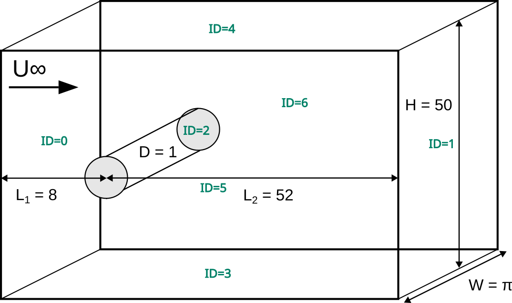

=====================================
3D Turbulent Flow Around a Cylinder
=====================================

This example showcases the turbulent flow around a Cylinder at :math:`Re=3900`. . It features the matrix-free solver (``lethe-fluid-matrix-free``) which is more computationally efficient when solving problems using high-order elements and fine meshes. It also demonstrates the usage of static box refinement and boundary condition refinement to statically refine a mesh. 

---------
Features
---------

- Solvers: ``lethe-fluid-matrix-free`` (with Q2-Q2 or Q3-Q3)
- Transient problem using ``bdf2`` time integrator
- Static mesh refinement using the ``box refinement`` feature :doc:`../../../parameters/cfd/box_refinement`

---------------------------
Files Used in This Example
---------------------------

All files mentioned below are located in the example's folder (``examples/incompressible-flow/3d-turbulent-flow-around-a-cylinder``).

- Parameter file: ``turbulent-cylinder.prm``
- Postprocessing Python scripts: ``postprocess-cylinder.py`` and ``cylinder-functions.py``

------------------------
Description of the Case
------------------------

The flow around bluff bodies such as a cylinder is quite complicated and it often used as a benchmark problem for CFD. Such flow typically involved boundary-layer seperatoions, flow-regime transition, transition to turbulence, vortex shedding and coherent structures. If the body is symmetric, as is the case for a cylinder,  the wake usually exhibits self-induced periodicity from vortices being shed from alternate sides of the body, generating fluctuating forcs on the body. Taylor-Couette flow occurs in the annular space between two coaxial cylinders with different angular velocities. In this example, we study the flow around a cylinder at a Reynolds number of 3900 is considered to be in the subcritical turbulent regime.

This example is a canonical benchmark for LES, as explained in the book by Grinstein, Margolin and Rider [#wang2021]_. It also showcases the capabilities of Lethe to statically refine the mesh athe beggining of the simulation using user-defined box refinement. The mesh is refined in the vicinity of the cylinder to capture the boundary layer and the wake region more accurately.

The simulation set-up as well as the boundary ids are illustrated in the following figure:

--------------
Parameter File
--------------

Mesh
~~~~

The ``mesh`` subsection specifies the computational grid. We use a custom mesh generated using the deal.II library's `GridGenerator <https://www.dealii.org/current/doxygen/deal.II/namespaceGridGenerator.html>`_ to create the flow using high-order elements.

.. code-block:: text

  subsection mesh
    set type                        = dealii 
    set grid type                   = cylinder_shell
    set grid arguments              = 3.14159265359 : 0.5 : 1.0 : 5 : 4 : true
    set initial refinement          = 4
    set initial boundary refinement = 1
    set boundaries refined          = 0, 1
  end

.. note::

  This mesh generator is only present in the 9.7 version of the deal.II library.

Boundary Conditions
~~~~~~~~~~~~~~~~~~~

The ``boundary conditions`` subsection establishes the constraints on different parts of the domain:

.. code-block:: text

  subsection boundary conditions
    set number = 3 
    subsection bc 0          
      set type = function
      subsection u
        set Function expression = -y
      end
      subsection v
        set Function expression = x
      end
      subsection w
        set Function expression = 0
      end
    end
    subsection bc 1       
      set type = noslip
    end
    subsection bc 2            
      set type               = periodic
      set id                 = 2
      set periodic_id        = 3
      set periodic_direction = 2
    end
  end

Physical Properties
~~~~~~~~~~~~~~~~~~~

In the present case, the Reynolds number is defined as: :math:`Re = \frac{Ud}{\nu}`. Since we set the values of :math:`U` and :math:`d`, the Reynold number of 4000 can be set solely using the kinematic viscosity: 

.. code-block:: text

  subsection physical properties
    set number of fluids = 1
    subsection fluid 0
      set kinematic viscosity = 6.25e-5
    end
  end

Initial Conditions 
~~~~~~~~~~~~~~~~~~

The ``initial conditions`` subsection lets us set-up the velocity and pressure of the flow at :math:`t = 0 \ \text{s}`:  

.. code-block:: text

    subsection initial conditions
      set type = nodal
      subsection uvwp
        # A= -(kappa * kappa) / (1. - kappa * kappa);
        # B= ri * ri / (1. - kappa * kappa);
        set Function constants = epsilon=0.1, ri=0.5, omega=1.0, d=0.5 , A= -0.3333333333333333, B= 0.3333333333333333
        set Function expression = cos(atan2(y,x))*(epsilon*omega*ri*cos(atan2(y,x))*sin(((sqrt(x*x+y*y)-ri)*pi)/ri)*sin(z/d)) - sin(atan2(y,x))*(A*(sqrt(x*x+y*y)) + B/(sqrt(x*x+y*y)) + epsilon*omega*ri*sin(atan2(y,x))*sin(((sqrt(x*x+y*y)-ri)*pi)/ri)*sin(z/d)); sin(atan2(y,x))*(epsilon*omega*ri*cos(atan2(y,x))*sin(((sqrt(x*x+y*y)-ri)*pi)/ri)*sin(z/d)) + cos(atan2(y,x))*(A*(sqrt(x*x+y*y)) + B/(sqrt(x*x+y*y)) + epsilon*omega*ri*sin(atan2(y,x))*sin(((sqrt(x*x+y*y)-ri)*pi)/ri)*sin(z/d)); 0.0; ((0.5*A*A*(x*x+y*y)) + (2*A*B*ln(sqrt(x*x+y*y)))) - (0.5*B*B/(x*x+y*y)) + (0.5*(epsilon*omega*ri)*(epsilon*omega*ri)*cos(2*atan2(y,x))*sin((2*(sqrt(x*x+y*y)-ri)*pi)/ri)*sin(2*z/d))
      end
    end

The ``type`` is set to ``nodal``. Then we choose the ``uvwp subsection`` which allows us to respectively set the :math:`u_x;u_y;u_z;p` expressions under the ``function expression``. Switching from cylindrical to Cartesian coordinates results in a quite complex expression. To help with that matter, we use the ``Function constant``. 

FEM Interpolation
~~~~~~~~~~~~~~~~~

The results obtained for the turbulent Taylor-Couette flow are highly dependent on the numerical dissipation that occurs within the CFD scheme. Generally, high-order methods outperform traditional second-order accurate methods for this type of flow. In the present case, we will compare the usage of second (Q2) and third degree (Q3) polynomial.

.. code-block:: text

    subsection FEM
      set velocity order = 2  #3 for Q3
      set pressure order = 2  #3 for Q3
    end

Forces
~~~~~~

The ``forces`` subsection controls the postprocessing of the torque and the forces acting on the boundaries of the domain: 

.. code-block:: text

    subsection forces
      set calculate torque = true
    end

By setting ``calculate torque = true``, the calculation of the torque resulting from the fluid dynamics physics on every boundary of the domain is automatically calculated. Setting ``verbosity = quiet`` will disable the print out on the terminal for each time step.

Post-processing
~~~~~~~~~~~~~~~

.. code-block:: text

    subsection post-processing
      set calculate kinetic energy = true
      set calculate enstrophy      = true
    end

To monitor the kinetic energy and the enstrophy, we set calculation to ``true`` in the post-processing section.  

Simulation Control
~~~~~~~~~~~~~~~~~~

The ``simulation control`` subsection controls the flow of the simulation. To maximize the temporal accuracy of the simulation, we use a second-order ``bdf2`` scheme. Results are written every 10 time-steps. To ensure a more adequate visualization of the high-order elements, we set ``subdivision = 2``. This will allow Paraview to render the high-order solutions with more fidelity.

.. code-block:: text

    subsection simulation control
      set method            = bdf2
      set time step         = 0.01
      set adapt             = true
      set max cfl           = 1
      set time end          = 60  
      set output frequency  = 10    
      set subdivision       = 2
    end

.. tip::

  A good practice is to use as many subdivisions as the interpolation order scheme. 

----------------------
Running the Simulation
----------------------

Launching the simulation is as simple as specifying the executable name and the parameter file. Assuming that the ``lethe-fluid-matrix-free`` executable are within your path, the matrix-free simulation can be launched by typing:

.. code-block:: text
  :class: copy-button

  mpirun -np n_proc lethe-fluid-matrix-free tc-matrix-free.prm 

and choosing the number of processes ``n_proc`` according to the resources you have available.

----------------------
Results and Discussion
----------------------

The flow patterns generated by the Taylor-Couette flow are quite complex. The following animation displays the evolution of velocity magnitude on the radial-vertical plane (left) and the Q-criterion iso-contours (right), illustrating the vortical structure as the vortex breaks down and generates smaller structures.

..
  +----------------------------------------------------------------------------------------------------------------------------------------------------+
  | .. raw:: html                                                                                                                                      |
  |                                                                                                                                                    |
  |    <iframe width="800" height="400" src="https://www.youtube.com/embed/bRa04yMDsXo?si=Q1ppAuakIsrNwFlw"  frameborder="0" allowfullscreen></iframe> |
  |                                                                                                                                                    |
  +----------------------------------------------------------------------------------------------------------------------------------------------------+

..
  +-------------------------------------------------------------------------------------------------------------------+
  |  .. figure:: images/enstrophy_comparison_Q3Q3_942k.png                                                            |
  |     :width: 620                                                                                                   |
  |                                                                                                                   |
  +-------------------------------------------------------------------------------------------------------------------+

----------------------------
Possibilities for Extension
----------------------------

- This case offers numerous options for postprocessing. Consider exploring alternative quantities such as vorticity and pressure and use the results to generate interesting animations. Feel free to share them with us!
- It could also be interesting to explore this case with an even higher Reynolds number

------------
References
------------

.. [#wang2021] \Z. J. Wang and E. Jourdan, “Benchmark for scale-resolving simulation with curved walls: the Taylor Couette flow,” Advances in Aerodynamics, vol. 3, no. 1, Jun. 2021, doi: `10.1186/s42774-021-00071-0 <https://doi.org/10.1186/s42774-021-00071-0>`_\.

.. [#wikipedia2024] \“Taylor–Couette flow,” *Wikipedia*. Feb. 15, 2024. Available: https://en.wikipedia.org/wiki/Taylor%E2%80%93Couette_flow\.
