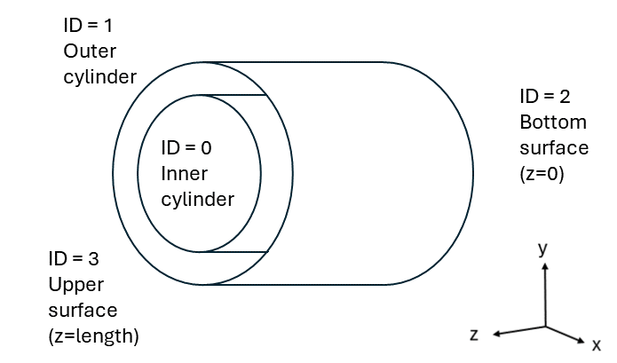
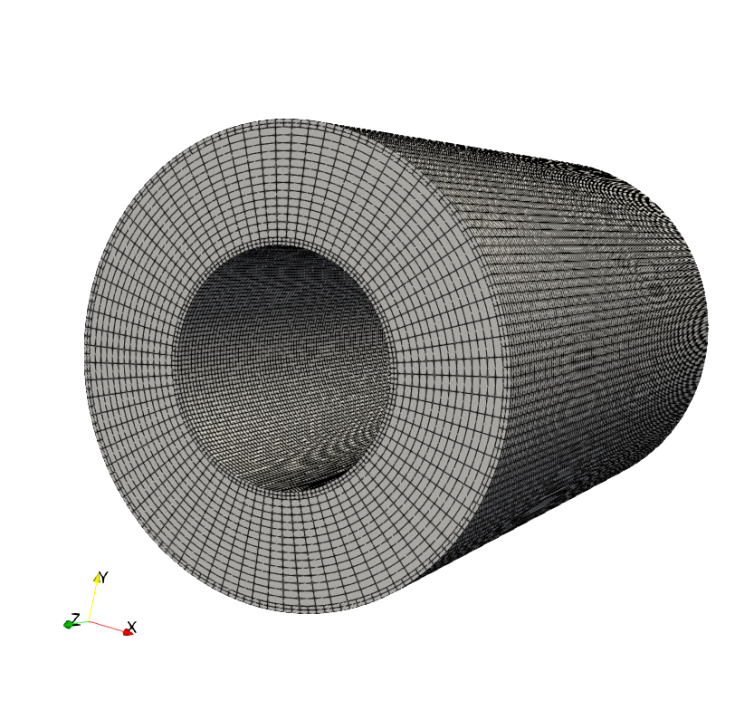

==============================
Turbulent Taylor-Couette Flow
==============================

This example showcases a turbulent extension of the `Taylor-Couette Flow <https://chaos-polymtl.github.io/lethe/documentation/examples/incompressible-flow/2d-taylor-couette-flow/2d-taylor-couette-flow.html>`_. It features the matrix-free solver (``lethe-fluid-matrix-free``) which is more computationally efficient when solving problems using high-order elements and fine meshes. It also demonstrates the utilization of initial conditions and the postprocessing of the enstrophy.

---------
Features
---------

- Solvers: ``lethe-fluid-matrix-free`` (with Q2-Q2 or Q3-Q3)
- Transient problem using ``bdf2`` time integrator
- Demonstrates the implementation of initial conditions for velocity and pressure 
- Demonstrates the postprocessing of the enstrophy

---------------------------
Files Used in This Example
---------------------------

All files mentioned below are located in the example's folder (``examples/incompressible-flow/3d-turbulent-taylor-couette``).

- Parameter file: ``tc-matrix-free.prm``
- Reference data files from Wang and Jourdan (2021): [#wang2021]_ (``enstrophy_wang_p%.dat``)
- Postprocessing Python scripts: ``tc-postprocessing.py`` and ``tc-functions.py``

------------------------
Description of the Case
------------------------

The Taylor-Couette flow occurs in the annular space between two coaxial cylinders with different angular velocities. For a laminar flow, an analytical solution exists (see `Taylor-Couette Flow <https://chaos-polymtl.github.io/lethe/documentation/examples/incompressible-flow/2d-taylor-couette-flow/2d-taylor-couette-flow.html>`_). As the Reynolds number increases, the flow undergoes a transition where Taylor vortices emerge (symmetrical vortices in the radial-vertical plane). Eventually, as the flow becomes fully turbulent, a chaotic vortex structure appears with intense fluid agitation [#wikipedia2024]_ .

This example is drawn from a case study by Wang and Jourdan [#wang2021]_. It simulates a turbulent Taylor-Couette flow with a Reynolds number of 4000. It incorporates initial conditions based on a modified version of the laminar solution to generate specific vortical structures, inspired by the Taylor-Green vortex.

The inner cylinder rotates counterclockwise at a constant angular velocity :math:`\omega`, while the outer cylinder remains fixed. Periodic boundary conditions are applied to the upper and lower openings of the annular section. The following figure illustrates the geometry of this case:

The initial conditions for velocity and pressure are defined as follows: 

.. math::
   u_{\theta} &= Ar + \frac{B}{r} + \epsilon U\sin(\theta) \sin \left( \frac{(r-r_i)\pi}{r_i} \right) \sin \left( \frac{z}{d} \right) \\
   u_{r} &= \epsilon U\cos(\theta) \sin \left( \frac{(r-r_i)\pi}{r_i} \right) \sin \left( \frac{z}{d} \right) \\
   u_{z} &= 0 \\
   p &= \frac{1}{2}A^2r^2 + 2AB\ln(r) - \frac{\frac{1}{2}B^2}{r^2} + \frac{1}{2}(\epsilon U)^2 \cos(2\theta) \sin  \left( \frac{2(r-r_i)\pi}{r_i} \right) \sin \left( \frac{2z}{d} \right)

where :math:`A = -\frac{\omega \kappa^2}{1-\kappa^2}`, :math:`B = \frac{\omega r_i^2}{1-\kappa^2}`,  :math:`U = \omega r_i`, :math:`\kappa =  \frac{r_i}{r_o}`, :math:`d = r_o - r_i`, :math:`\epsilon` is a relaxing factor, :math:`r_i` is the inner cylinder radius, :math:`r_o` is the outer cylinder radius, r is the radial coordinate and z is the axial coordinate. 

For this particular case, the value for each variable can be found in the following table: 

.. list-table::
    :header-rows: 1

    * - Variable
      - Value 
      - Variable
      - Value
    * - *A*
      - -0.3333
      - *B*
      - 0.3333
    * - *U*
      - 0.5
      - :math:`\kappa`
      - 0.5
    * - *d*
      - 0.5
      - :math:`\epsilon`
      - 0.1
    * - :math:`r_i`
      - 0.5
      - :math:`r_o`
      - 1.0

Since Lethe uses a Cartesian coordinate system, the expressions have been transformed to proceed with the simulation. For an incompressible flow, the enstrophy and the kinetic energy are defined as: 

.. math::
  \mathcal{E} &= \frac{1}{\Omega} \int_{\Omega} \frac{\mathbf{\omega}\cdot \mathbf{\omega}}{2} \mathrm{d}\Omega \\
  E_k &= \frac{1}{\Omega} \int_{\Omega} \frac{\mathbf{u}\cdot \mathbf{u}}{2} \mathrm{d}\Omega \\

where :math:`\mathbf{\omega}=\nabla \times \mathbf{u}` represents the vorticity. The results obtained for both enstrophy and kinetic energy are compared to the benchmark values from the case study. 

--------------
Parameter File
--------------

Mesh
~~~~

The ``mesh`` subsection specifies the computational grid:

.. code-block:: text

  subsection mesh
    set type                        = dealii 
    set grid type                   = cylinder_shell
    set grid arguments              = 3.14159265359 : 0.5 : 1.0 : 5 : 4 : true
    set initial refinement          = 4
    set initial boundary refinement = 1
    set boundaries refined          = 0, 1
  end

The ``type`` specifies the mesh format used. We use the  ``cylinder_shell`` from deal.II `GridGenerator <https://www.dealii.org/current/doxygen/deal.II/namespaceGridGenerator.html>`_ that creates a shell from two concentric cylinders with the option to set-up specific boundary conditions to each surface. The arguments are the length (3.14159265359), the inner cylinder radius (0.5), the outer cylinder radius (1.0), the number of azimuthal cells (5) and the number of axial cells (4).
Indicating an ``initial refinement = 4`` implies that the initial mesh is refined 4 times globally; in 3D each cell is divided by 8 per refinement. However, in addition to this global refinements, the cells next to the walls are refined one more time locally. This is indicated through the ``initial boundary refinement = 1`` parameter and the ``set boundaries refined = 0, 1`` parameter, which indicates the boundaries IDs of the wall of the cylinder. The following figure illustrates the mesh: 

.. note::

  The mesh resolution used in the case study consists of 153,600 cells. If one more initial refinement is used, 942,080 cells are obtained. 

Boundary Conditions
~~~~~~~~~~~~~~~~~~~

The ``boundary conditions`` subsection establishes the constraints on different parts of the domain:

.. code-block:: text

  subsection boundary conditions
    set number = 3 
    subsection bc 0          
      set type = function
      subsection u
        set Function expression = -y
      end
      subsection v
        set Function expression = x
      end
      subsection w
        set Function expression = 0
      end
    end
    subsection bc 1       
      set type = noslip
    end
    subsection bc 2            
      set type               = periodic
      set id                 = 2
      set periodic id        = 3
      set periodic direction = 2
    end
  end

First, the ``number`` of boundary conditions to be applied must be specified. For each boundary condition, the ``id`` of the boundary (refer to `geometry`_ for details of surface ``id``) as well as its ``type`` must be specified. The inner cylinder (``bc 0``) is rotating at a constant angular velocity (:math:`\omega=1 \ \text{rad/s}`). We use the ``type = function`` and prescribe a function for the components of the velocity. By prescribing :math:`\mathbf{u}=[-y,x,0]^T`, we prescribe the rotation of the inner cylinder at an angular velocity of :math:`1 \ \text{rad/s}` in the trigonometric direction. The outer cylinder (``bc1``) is static and, consequently, a ``noslip`` boundary condition is applied. Finally, a periodic condition is used for the inlet and outlet (``bc 2``). The ``z-`` (``id=2``) is periodic with ``z+`` (``id=3``). For this condition, the periodic direction must be specified. In Lethe, the periodic direction of ``2`` implies that the normal direction is the :math:`\mathbf{e}_z` vector. 

Physical Properties
~~~~~~~~~~~~~~~~~~~

In the present case, the Reynolds number is defined as: :math:`Re = \frac{Ud}{\nu}`. Since we set the values of :math:`U` and :math:`d`, the Reynold number of 4000 can be set solely using the kinematic viscosity: 

.. code-block:: text

  subsection physical properties
    set number of fluids = 1
    subsection fluid 0
      set kinematic viscosity = 6.25e-5
    end
  end

Initial Conditions 
~~~~~~~~~~~~~~~~~~

The ``initial conditions`` subsection lets us set-up the velocity and pressure of the flow at :math:`t = 0 \ \text{s}`:  

.. code-block:: text

    subsection initial conditions
      set type = nodal
      subsection uvwp
        # A= -(kappa * kappa) / (1. - kappa * kappa);
        # B= ri * ri / (1. - kappa * kappa);
        set Function constants = epsilon=0.1, ri=0.5, omega=1.0, d=0.5 , A= -0.3333333333333333, B= 0.3333333333333333
        set Function expression = cos(atan2(y,x))*(epsilon*omega*ri*cos(atan2(y,x))*sin(((sqrt(x*x+y*y)-ri)*pi)/ri)*sin(z/d)) - sin(atan2(y,x))*(A*(sqrt(x*x+y*y)) + B/(sqrt(x*x+y*y)) + epsilon*omega*ri*sin(atan2(y,x))*sin(((sqrt(x*x+y*y)-ri)*pi)/ri)*sin(z/d)); sin(atan2(y,x))*(epsilon*omega*ri*cos(atan2(y,x))*sin(((sqrt(x*x+y*y)-ri)*pi)/ri)*sin(z/d)) + cos(atan2(y,x))*(A*(sqrt(x*x+y*y)) + B/(sqrt(x*x+y*y)) + epsilon*omega*ri*sin(atan2(y,x))*sin(((sqrt(x*x+y*y)-ri)*pi)/ri)*sin(z/d)); 0.0; ((0.5*A*A*(x*x+y*y)) + (2*A*B*ln(sqrt(x*x+y*y)))) - (0.5*B*B/(x*x+y*y)) + (0.5*(epsilon*omega*ri)*(epsilon*omega*ri)*cos(2*atan2(y,x))*sin((2*(sqrt(x*x+y*y)-ri)*pi)/ri)*sin(2*z/d))
      end
    end

The ``type`` is set to ``nodal``. Then we choose the ``uvwp subsection`` which allows us to respectively set the :math:`u_x;u_y;u_z;p` expressions under the ``function expression``. Switching from cylindrical to Cartesian coordinates results in a quite complex expression. To help with that matter, we use the ``Function constant``. 

FEM Interpolation
~~~~~~~~~~~~~~~~~

The results obtained for the turbulent Taylor-Couette flow are highly dependent on the numerical dissipation that occurs within the CFD scheme. Generally, high-order methods outperform traditional second-order accurate methods for this type of flow. In the present case, we will compare the usage of second (Q2) and third degree (Q3) polynomial.

.. code-block:: text

    subsection FEM
      set velocity order = 2  #3 for Q3
      set pressure order = 2  #3 for Q3
    end

Forces
~~~~~~

The ``forces`` subsection controls the postprocessing of the torque and the forces acting on the boundaries of the domain: 

.. code-block:: text

    subsection forces
      set calculate torque = true
    end

By setting ``calculate torque = true``, the calculation of the torque resulting from the fluid dynamics physics on every boundary of the domain is automatically calculated. Setting ``verbosity = quiet`` will disable the print out on the terminal for each time step.

Post-processing
~~~~~~~~~~~~~~~

.. code-block:: text

    subsection post-processing
      set calculate kinetic energy = true
      set calculate enstrophy      = true
    end

To monitor the kinetic energy and the enstrophy, we set calculation to ``true`` in the post-processing section.  

Simulation Control
~~~~~~~~~~~~~~~~~~

The ``simulation control`` subsection controls the flow of the simulation. To maximize the temporal accuracy of the simulation, we use a second-order ``bdf2`` scheme. Results are written every 10 time-steps. To ensure a more adequate visualization of the high-order elements, we set ``subdivision = 2``. This will allow Paraview to render the high-order solutions with more fidelity.

.. code-block:: text

    subsection simulation control
      set method            = bdf2
      set time step         = 0.01
      set adapt             = true
      set max cfl           = 1
      set time end          = 60  
      set output frequency  = 10    
      set subdivision       = 2
    end

.. tip::

  A good practice is to use as many subdivisions as the interpolation order scheme. 

Other Subsections
~~~~~~~~~~~~~~~~~~~~~~~~

The ``non-linear solver`` and ``linear solver`` subsections use the same parameters as the `Taylor-Green Vortex <https://chaos-polymtl.github.io/lethe/documentation/examples/incompressible-flow/3d-taylor-green-vortex/3d-taylor-green-vortex.html>`_ example. More details can be found in this example and a complete overview of the ``lethe-fluid-matrix-free`` linear solver can be found in the the :doc:`../../../parameters/cfd/linear_solver_control` section.

----------------------
Running the Simulation
----------------------

Launching the simulation is as simple as specifying the executable name and the parameter file. Assuming that the ``lethe-fluid-matrix-free`` executable are within your path, the matrix-free simulation can be launched by typing:

.. code-block:: text
  :class: copy-button

  mpirun -np n_proc lethe-fluid-matrix-free tc-matrix-free.prm 

and choosing the number of processes ``n_proc`` according to the resources you have available.

----------------------
Results and Discussion
----------------------

The flow patterns generated by the Taylor-Couette flow are quite complex. The following animation displays the evolution of velocity magnitude on the radial-vertical plane (left) and the Q-criterion iso-contours (right), illustrating the vortical structure as the vortex breaks down and generates smaller structures.

+----------------------------------------------------------------------------------------------------------------------------------------------------+
| .. raw:: html                                                                                                                                      |
|                                                                                                                                                    |
|    <iframe width="800" height="400" src="https://www.youtube.com/embed/bRa04yMDsXo?si=Q1ppAuakIsrNwFlw"  frameborder="0" allowfullscreen></iframe> |
|                                                                                                                                                    |
+----------------------------------------------------------------------------------------------------------------------------------------------------+

Using the ``enstrophy.dat`` file generated by Lethe, the history of enstrophy can be monitored and compared to the reference values extracted from the case study. A plot comparing our simulation results to the reference enstrophy data will be generated by using the following command:

.. code-block:: text
  :class: copy-button

  python3 tc-postprocessing.py -ens output/enstrophy.dat

The enstrophy plot features a zoomed section of the enstrophy cascade. The following plot shows the history of the enstrophy as measured with the Q2 scheme: 

+-------------------------------------------------------------------------------------------------------------------+
|  .. figure:: images/enstrophy_comparison_Q2Q2_153k.png                                                            |
|     :width: 620                                                                                                   |
|                                                                                                                   |
+-------------------------------------------------------------------------------------------------------------------+

We note that the enstrophy history does not match either reference scheme. Increasing the order from Q2 to Q3 leads to the following results, which are quite close to the P4 and P5 solutions:

+-------------------------------------------------------------------------------------------------------------------+
|  .. figure:: images/enstrophy_comparison_Q3Q3_153k.png                                                            |
|     :width: 620                                                                                                   |
|                                                                                                                   |
+-------------------------------------------------------------------------------------------------------------------+

We then revert the scheme order back to Q2 and refine the mesh by setting the ``initial refinement = 5`` in the mesh subsection resulting in a total of 942,080 cells. This simulation closely matches the references for the first 30 seconds and captures the second peak of enstrophy better than the previous simulations:

+-------------------------------------------------------------------------------------------------------------------+
|  .. figure:: images/enstrophy_comparison_Q2Q2_942k.png                                                            |
|     :width: 620                                                                                                   |
|                                                                                                                   |
+-------------------------------------------------------------------------------------------------------------------+

Finally, employing the finer mesh with Q3 elements actually yields a more accurate prediction of the second peak and certain values of the enstrophy between 30 and 60 seconds. 

+-------------------------------------------------------------------------------------------------------------------+
|  .. figure:: images/enstrophy_comparison_Q3Q3_942k.png                                                            |
|     :width: 620                                                                                                   |
|                                                                                                                   |
+-------------------------------------------------------------------------------------------------------------------+

Considering one more refinement could be interesting to observe if the solution begins to be mesh-independent.

----------------------------
Possibilities for Extension
----------------------------

- This case offers numerous options for postprocessing. Consider exploring alternative quantities such as vorticity and pressure and use the results to generate interesting animations. Feel free to share them with us!
- It could also be interesting to explore this case with an even higher Reynolds number

------------
References
------------

.. [#wang2021] \Z. J. Wang and E. Jourdan, “Benchmark for scale-resolving simulation with curved walls: the Taylor Couette flow,” Advances in Aerodynamics, vol. 3, no. 1, Jun. 2021, doi: `10.1186/s42774-021-00071-0 <https://doi.org/10.1186/s42774-021-00071-0>`_\.

.. [#wikipedia2024] \“Taylor–Couette flow,” *Wikipedia*. Feb. 15, 2024. Available: https://en.wikipedia.org/wiki/Taylor%E2%80%93Couette_flow\.
