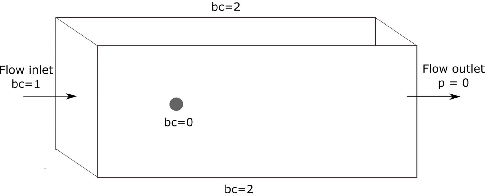

==================================
3D Flow Around a Sphere
==================================

In this example, a flow is passing around a sphere. 

Features
----------------------------------
- Solvers: ``gls_navier_stokes_3d`` (with Q1-Q1) or  ``gd_navier_stokes_3d`` (with Q2-Q1)
- Steady-state problem
- Displays the importance of adaptative mesh refinement
- Displays the effect of the Reynolds number on the convergence

Location of the examples
------------------------
- For :math:`Re=0.1` : ``/examples/incompressible_flow/3d_flow_around_sphere/sphere_0.1.prm``
- For :math:`Re=150` : ``/examples/incompressible_flow/3d_flow_around_sphere/sphere_150.prm``
- For :math:`Re=150` Using adaptative mesh refinement : ``/examples/incompressible_flow/3d_flow_around_sphere/sphere_adapt.prm``

Description of the case
-----------------------

The following schematic describes the simulation and its boundary condition indices.

Note that the sphere surface has a boundary index of `0`, the inlet `1` and the walls parallel to the flow direction have a boundary index of `2`. 

As this examples allows for two different Reynolds number as well as an adaptative mesh refinement variation, the Parameter file section will specify the differences when applicable. 

Parameter file
--------------

We first extablish the parameters.

Mesh
~~~~~

The structured mesh is built using `gmsh <https://gmsh.info/#Download>`_. Geometry parameters can be adapted in the "Variables" section of the .geo file, as shown below. 

.. code-block:: text

  // Variables
  gr=4; 			// Global refinement
  around=10;		// Refinement around the sphere
  trail=8;		// Refinement of trail of sphere
  near_sphere=1.20;	// Progression of cell refinement to sphere surface
  downstream=16;	        // Length of domain downstream of sphere
  upstream=-6;		// Length of domain upstream of sphere (must be negative)
  cross_section=10;	// Half the cross-sectional width/height
  radius=0.5;		// Radius of sphere

.. note::

  The domain is dimensioned so that the wake has sufficient distance to develop downstream and there is a sufficient cross-sectional area to negate any effect from the wall boundary conditions.

In the parameter file, the mesh can be uploaded this way:

.. code-block:: text
  subsection mesh
    set type         = gmsh
    set file name    = sphere.msh
  end

Boundary conditions
~~~~~~~~~~~~~~~~~~~

The ``boundary conditions`` subsection establishes the constraints on different parts of the domain. They are the same for all three parameter sets.

.. code-block:: text

  subsection boundary conditions
    set number                  = 3
    subsection bc 0
        set type              = noslip
    end
    subsection bc 1
        set type              = function
        subsection u
            set Function expression = 1
        end
        subsection v
            set Function expression = 0
        end
        subsection w
            set Function expression = 0
        end
    end
    subsection bc 2
        set type              = slip
    end
  end

There are three boundary conditions, as shown in the figure above. A ``noslip`` condition is applied on the surface of the sphere, where the velocity should be 0. The inlet velocity is set to `u=1m/s`, and the walls have a ``slip`` boundary condition.

Physical properties
~~~~~~~~~~~~~~~~~~~

This is where the parameters differ from the first and the two last examples.

* In ``/examples/incompressible_flow/3d_flow_around_sphere/sphere_0.1.prm`` (:math:`Re=0.1`)

.. code-block:: text

  subsection physical properties
    subsection fluid 0
      set kinematic viscosity = 10
    end
  end

* In ``/examples/incompressible_flow/3d_flow_around_sphere/sphere_150.prm`` and ``/examples/incompressible_flow/3d_flow_around_sphere/sphere_adapt.prm`` (:math:`Re=150`)

.. code-block:: text

  subsection physical properties
    subsection fluid 0
      set kinematic viscosity = 0.006666667
    end
  end

By default, simulations only contain a single fluid which is labeled ``0``.

FEM interpolation
~~~~~~~~~~~~~~~~~

The default FEM parameters for this example use first order polynomials. They can be changed to Q2-Q1 elements.

We specify the interpolation order for both pressure and velocity using the ``FEM`` subsection:

.. code-block:: text

    subsection FEM
        set velocity order            = 1
        set pressure order            = 1
    end

.. warning:: 

    If you choose to use the ``gd_navier_stokes_3d`` solver; only Q2-Q1 elements are supported. 

Simulation control
~~~~~~~~~~~~~~~~~~~~~~~~~~~~

The parameters also slightly from one problem to another differ in this section since as the difference examples experience different flow regimes.

In fact, for the :math:`Re=0.1` 

.. code-block:: text

  subsection simulation control
    set method      = steady 
    set output name = output_cavity
  end

Running the simulation
----------------------
Launching the simulation is as simple as specifying the executable name and the parameter file. Assuming that the ``gls_navier_stokes_2d`` executable is within your path, the simulation can be launched by typing:

.. code-block:: text

  gls_navier_stokes_2d cavity.prm

Lethe will generate a number of files. The most important one bears the extension ``.pvd``. It can be read by popular visualization programs such as `Paraview <https://www.paraview.org/>`_. 

Base case results (Re=400)
---------------------------

Using Paraview, the steady-state velocity profile and the streamlines can be visualized:

.. image:: images/result_re_400.png
    :alt: velocity distribution
    :align: center

It is also very interesting to compare the results with those obtained in the literature. A python script provided in the example folder allows to compare the velocity profile along de y axis for :math:`x=0.5` with results from the literature. Using this script, the following resuts are obtained for ``initial refinement = 6``

.. image:: images/lethe_ghia_re_400_comparison.png
    :alt: re_400_comparison
    :align: center

We note that the agreement is perfect. This is not surprising, especially considering that these results were obtained at a relatively low Reynolds number.

.. note:: 
    The vtu files generated by Lethe are compressed archives. Consequently, they cannot be postprocessed directly. Although they can be easily post-processed using Paraview, it is sometimes necessary to be able to work with the raw data. The python library `PyVista <https://www.pyvista.org/>`_  allows us to do this.

Higher-Reynolds case results (Re=7500)
---------------------------------------

We now consider the case at a Reynolds number of 7500. At this value of the Reynolds number, the ``steady`` solver will generally not converge as the problem is too non-linear (or too stiff). A workaround for this issue is to use an adjoint time-stepping strategy. This strategy consists in transforming the steady-state problem into a transient problem and to use an increasingly large time-step to reach a steady-state solution. This method is called ``steady_bdf`` in Lethe.

It can be used by modifying the ``simulation control`` subsection:

.. code-block:: text

  subsection simulation control
    set method                  = steady_bdf

    set adapt = true
    # Maximum CFL value
    set max cfl                      = 1000
    # Tolerance at which the simulation is stopped
    set stop tolerance               = 1e-10
  
    # Adaptative time step scaling
    set adaptative time step scaling = 1.05

    set time step = 0.001
  end

The ``adapt`` parameter allows dynamic time-step adaptation. This feature is also used in transient simulations to carry simulations at a constant CFL number. The ``max cfl`` controls the maximum value of the CFL reached during the simulation. Remember that Lethe is an implicit solver and, as such, can theoretically manage absurdly large values of the CFL. The ``stop-tolerance`` controls the initial tolerance of a time-step below which steady-state will be considered reached.  The ``time step`` controls the initial value of the time step and, finally, the ``adaptative time step scaling`` controls the rate of increase of the time step. The increase of the time step follows:

.. math::

  \Delta t_{n+1} = \alpha \Delta t_{n}

where :math:`\alpha` is the ``adaptative time step scaling`` .

Results
~~~~~~~~~

We first carry out the simulations with an initial refinement 7. Using Paraview, the steady-state velocity profile and the streamlines can be visualized:

.. image:: images/result_re_7500.png
    :alt: velocity distribution
    :align: center

We see that new recirculation regions occur in the flow.

Using a similar python script, we can compare the results obtained with those from the literature. We note that there is quite a good agreement with the results from the literature, even in the top region where the velocity field changes abruptly.

.. image:: images/re_7500_mesh_7/lethe_ghia_re_7500_comparison.png
    :alt: re_7500_comparison_mesh_7
    :align: center

.. image:: images/re_7500_mesh_7/lethe_ghia_re_7500_comparison_zoom.png
    :alt: re_7500_comparison_mesh_7
    :align: center

Increasing the number of cells by a factor 4 (to ~65k) allows for an even slightly better agreement.

.. image:: images/re_7500_mesh_8/lethe_ghia_re_7500_comparison.png
    :alt: re_7500_comparison_mesh_8
    :align: center

.. image:: images/re_7500_mesh_8/lethe_ghia_re_7500_comparison_zoom.png
    :alt: re_7500_comparison_mesh_8
    :align: center

Possibilities for extension
----------------------------

- **Validate at even higher Reynolds numbers:** The Erturk 2005 data within the example investigates this case up to a Reynolds number of 20000.  It is an interesting exercise to simulate these more complex cases using the adjoint time-stepping ``steady_bdf`` scheme. 
- **High-order methods:** Lethe supports higher order interpolation. This can yield much better results with an equal number of degrees of freedom than traditional second-order (Q1-Q1) methods, especially at higher Reynolds numbers. 

- **Dynamic mesh adaptation:** Lethe supports dynamic mesh adaptation. Running this case with dynamic mesh adaptation could potentially yield better results.

