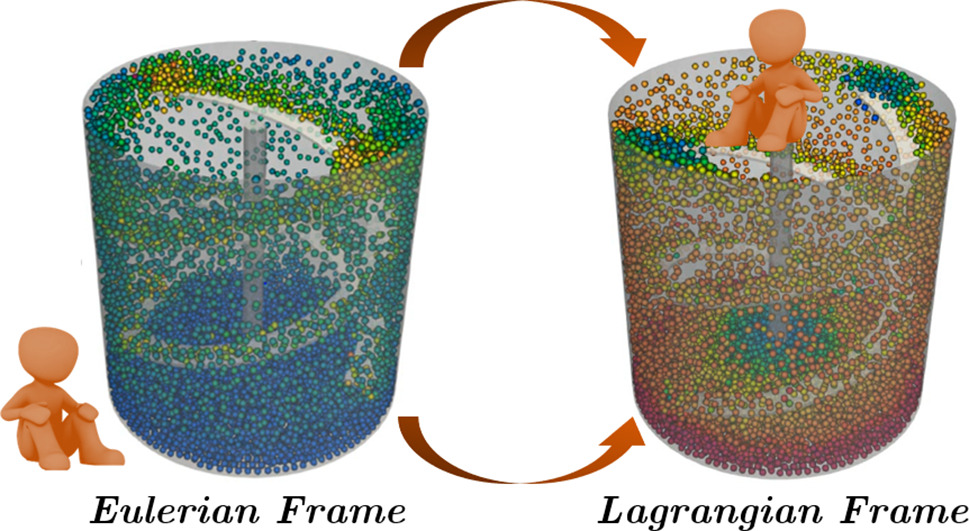

========================================================
3D Ribbon Mixer using a Single Rotating Reference Frame
========================================================

When designing an industrial mixer, it is essential to evaluate the power consumed by the agitator. To do so, we usually refer to graphs correlating the power number (:math:`N_p`) as a function of the Reynolds number (:math:`Re`). :math:`N_p` is a dimensionless number that relates the power consumed by the agitator to the geometry of the system, the speed of the agitator, and the properties of the material being mixed (density :math:`\rho` and viscosity :math:`\mu`). In this example, using a single rotating frame (SRF) model, we simulate a fluid being mixed in a ribbon mixer for different flow conditions (different values :math:`Re`) to generate :math:`N_p` vs :math:`Re` curves.

Features
-------------
- Solver: ``gls_navier_stokes_3d`` (with Q1-Q1)
- Steady-state problem
- Displays the use of a single rotating frame (srf) when modeling a complex rotating geometry
- Calculation of the power number (:math:`N_p`) with a python script
- Use of a cluster to run simulations

Locations of Files Used in the Example
---------------------------------------
- Parameter file: ``examples/incompressible_flow/3d_ribbon_mixer_srf/ribbon_gls.prm``

Description of the Case
-------------------------
We simulate the flow generated by a double helical ribbon impeller in a cylindrical mixing tank. The double helical ribbon impeller is an axial and a tangential impeller making it a great option for mixing viscous fluids.

The following figure represents the geometry of our system:

<insert image>

The dimensions of the parameters seen in the figure above are listed in the following table:

<insert table>

To be able to simulate the flow in such complex geometry, we take advantage of the symmetry of the system and opt for a Lagrangian reference frame. Instead of observing the velocity profile from an Eulerian reference frame (or lab reference frame), we place ourselves on the impeller's reference making it static and inducing a no-slip boundary condition on it. This way, the cylindrical vessel is going to be the only moving geometry in our system. The figure below illustrates the difference between the Eulerian and Lagrangian reference frames.

In this example, we will start by simulating the case when :math:`Re = 1` and then follow with simulation a for :math:`Re` values ranging for :math:`0.1` to :math:`100`.

The Reynolds number for our system is defined as follows:

.. math::
    Re = \frac{ND²}{\nu}

where

- N is the angular velocity :math:`[rps]` of the agitator;
- D is the diameter of the impeller :math:`[m]`, and
- \nu is the kinematic viscosity of the fluid :math:`[m^2 \cdot s^{-1}]`.

In order to genrate :math:`N_p` vs :math:`Re` curves, we have to calculate :math:`N_p`. In this example, we will be using the torque (:math:`\Gamma`) to calculate :math:`N_p`:

.. math::
	N_p = \frac{2 \pi \Gamma}{\rho N^2 D^5}

where :math:`\rho` is the density of the fluid.

Parameter File
--------------
All subsections in ``ribbon_gls.prm`` except for ``velocity source`` were discussed in previous examples. However, the important sections are briefly explained for completeness.

Simulation Control
~~~~~~~~~~~~~~~~~~~~~~~~~~~

.. code-block:: text

  subsection simulation control
    set method                  = steady
    set output name             = mixer
    set output frequency        = 1
    set output boundaries       = true
    set output path             = ./output/
  end

For this example, we consider that the regime is permanent so we use a ``steady`` method. We set ``output boundaries = true`` to generate an auxiliary file that highlights the equipment walls by hiding the cells of the mesh.This allows for a clearer visualization of the mixing setup.

FEM
~~~~~

.. code-block:: text

    subsection FEM
        set velocity order            = 1
        set pressure order            = 1
    end

Physical Properties
~~~~~~~~~~~~~~~~~~~~~~~~~~~

.. code-block:: text

    subsection physical properties
      subsection fluid 0
        set kinematic viscosity            = 0.11602395351399172
       end
    end

The kinematic viscosity is set for a :math:`Re = 1`.It is combined with the angular velocity of 10 RPS and the diameter of the impeller of **<insert Diameter>**.

Velocity Source
~~~~~~~~~~~~~~~~~

.. code-block:: text

    subsection velocity source
        set type         = srf
        set omega_z      = -10
    end

In the ``velocity source`` subsection, we specify that we are in a single rotating frame (``srf``). Since a centrifugal and a Coriolis force are induced by the rotating nature of the system, we are in a non-Galilean reference frame. These two additional force contributions must be taken into account in the Navier-Stokes equations and by setting the ``type`` parameter to ``srf`` we do so. The ``omega_z`` parameter represents the angular velocity of the reference frame.

Force
~~~~~~~

.. code-block:: text

    subsection forces
        set verbosity             = verbose   # Output force and torques in log <quiet|verbose>
        set calculate torque      = true      # Enable torque calculation
        set torque name           = torque    # Name prefix of torque files
        set output precision      = 14        # Output precision
        set calculation frequency = 1         # Frequency of the force calculation
        set output frequency      = 1         # Frequency of file update
    end

Mesh Adaptation Control
~~~~~~~~~~~~~~~~~~~~~~~~~~~

.. code-block:: text

    subsection mesh adaptation
      set type                    = kelly
      set variable                = velocity
      set fraction type           = number
      set max number elements     = 600000
      set max refinement level    = 2
      set min refinement level    = 0
      set frequency               = 1
      set fraction refinement     = 0.15
      set fraction coarsening     = 0.00
    end

The ``min refinement level`` refers to the base mesh which has been used in the previous static simulations. The mesh can only become finer than this, not coarser. The ``max refinement level`` is set at 2, giving a maximum possible number of cells of 2 million. However, the ``max number elements`` limits the number of cells to 600,000 to keep the simulation within feasible computational expense.

Mesh
~~~~~~~~~~~~~~~~~~~~~~~~~~~

.. code-block:: text

    subsection mesh
        set type                 = gmsh
        set file name            = diff_step_mesh.msh
        set initial refinement   = 0
        set simplex = true
    end

The type specifies the mesh format used, in this case we have ``gmsh`` which corresponds to a file generated by Gmsh. The ``set file name`` command specifies the path to the file. In this case, we assume that the parameter and mesh files are in the same location. The ``.geo`` used to generate the `gmsh <https://gmsh.info/#Download>`_ mesh is also provided as a reference.

Boundary Conditions
~~~~~~~~~~~~~~~~~~~~~~~~~~~

.. code-block:: text

    subsection boundary conditions
      set number                         = 3
        subsection bc 0
            set id = 1
            set type                     = function
            subsection u
                set Function expression  = -10*y     #2*0.314159*y
            end
            subsection v
                set Function expression  = 10*x      #2*0.314159*x
            end
            subsection w
                set Function expression  = 0
            end
        end
        subsection bc 1
            set id = 2
            set type                     = slip
        end

        subsection bc 2
            set id  = 3
            set type                     = noslip
        end
    end

Three different boundary conditions are considered. On the lateral walls and the bottom wall (id=1), we use the ``function boundary type``. This type of boundary condition allows us to define the value of the velocity components using ``Function expression``. We set :math:`u = -10*y` ; :math:`v = 10*x` and :math:`w= 0` to insure that the impeller's referential is static and the tank rotates in the opposite direction. On the ribbon blades, a no-slip boundary condition applies (id=3) whereas a slip boundary condition is imposed on the free surface at the top of the vessel (id=2). The boundary conditions are described in the :doc:`../../../parameters/cfd/boundary_conditions_cfd` section of the documentation.

Non-linear Solver Control
~~~~~~~~~~~~~~~~~~~~~~~~~~~
Lethe is an implicit CFD solver. Consequently, each time-step requires the solution of a non-linear system of equations. By default, Lethe uses a Newton solver for which a ``tolerance`` must be specified:

.. code-block:: text

    subsection non-linear solver
      set tolerance               = 1e-10
      set verbosity               = verbose
    end

The ``verbosity`` option specifies if details about the non-linear solver steps (residual value and iteration number) will be printed out to the terminal. By setting it to ``verbose``, this information is printed out, whereas ``quiet`` would mute all outputs of the non-linear solver. We recommend to always set ``verbosity=verbose`` in order to monitor possible non-convergence of the solver.

Linear Solver Control
~~~~~~~~~~~~~~~~~~~~~~~~~~~
Relatively standard parameters are used for the linear solver. From our experience, the ``AMG`` preconditioner is more robust with the ``Nitsche IB`` than the traditional ``ILU``.

.. code-block:: text

    subsection linear solver
      set method                                       = amg
      set max iters                                    = 100
      set relative residual                            = 1e-4
      set minimum residual                             = 1e-10
      set amg preconditioner ilu fill                  = 0
      set amg preconditioner ilu absolute tolerance    = 1e-11
      set amg preconditioner ilu relative tolerance    = 1.00
      set amg aggregation threshold                    = 1e-14  # Aggregation
      set amg n cycles                                 = 2      # Number of AMG cycles
      set amg w cycles                                 = false  # W cycles, otherwise V cycles
      set amg smoother sweeps                          = 2      # Sweeps
      set amg smoother overlap                         = 1      # Overlap
      set verbosity                                    = verbose
      set max krylov vectors                           = 500
    end

Running the Simulation
------------------------------------

Simulating for a Specific Flow Condition (:math:`Re = 1`)
~~~~~~~~~~~~~~~~~~~~~~~~~~~~~~~~~~~~~~~~~~~~~~~~~~~~~~~~~~
Launching the simulation is as simple as specifying the executable name and the parameter file. Assuming that the gls_navier_stokes_3d executable is within your path, the simulation can be launched by typing:

.. code-block:: text

    gls_navier_stokes_3d ribbon_gls.prm

Generating :math:`N_p` vs :math:`Re` curves (:math:`Re \in [0.1, 100]`)
~~~~~~~~~~~~~~~~~~~~~~~~~~~~~~~~~~~~~~~~~~~~~~~~~~~~~~~~~~~~~~~~~~~~~~~

Results
--------

References
-----------

