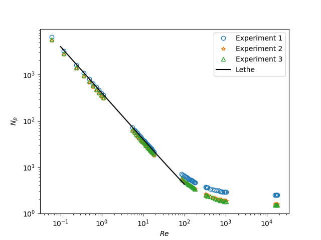

========================================================
3D Ribbon Mixer using a Single Rotating Reference Frame
========================================================

When designing an industrial mixer, it is essential to evaluate the power consumed by the agitator. To do so, we usually refer to graphs correlating the power number (:math:`N_p`) as a function of the Reynolds number (:math:`Re`). :math:`N_p` is a dimensionless number that relates the power consumed by the agitator to the geometry of the system, the speed of the agitator, and the properties of the material being mixed (density :math:`\rho` and viscosity :math:`\mu`). In this example, using a single rotating frame (SRF) model, we simulate a fluid being mixed in a ribbon mixer for different flow conditions (different values of :math:`Re`) to generate :math:`N_p` vs :math:`Re` curves.

Features
-------------
- Solver: ``gls_navier_stokes_3d`` (with Q1-Q1)
- Steady-state problem
- Displays the use of a single rotating frame (``srf``) when modeling a complex rotating geometry
- Calculation of the power number (:math:`N_p`) with a python script
- Use of a cluster to run simulations

Locations of Files Used in the Example
---------------------------------------
- Parameter file for :math:`Re = 1`: ``examples/incompressible_flow/3d_ribbon_mixer_srf/Re1/ribbon_gls_Re1.prm``
- Parameter file for generating multiple cases: ``examples/incompressible_flow/3d_ribbon_mixer_srf/Np_vs_Re/ribbon_gls.prm``
- Geometry file: ``examples/incompressible_flow/3d_ribbon_mixer_srf/Re1/template/diff_step_mesh.geo``
- Step file: ``examples/incompressible_flow/3d_ribbon_mixer_srf/Re1/template/db_helical.step``
- Mesh file: ``examples/incompressible_flow/3d_ribbon_mixer_srf/Re1/template/diff_step_mesh.msh``
- Bash script for running simulations on a cluster (job script): ``examples/incompressible_flow/3d_ribbon_mixer_srf/Np_vs_Re/template/launch.sh``
- Python script for generating different cases: ``examples/incompressible_flow/3d_ribbon_mixer_srf/Np_vs_Re/template/lethe_case_generator.py``
- Python script for launching all the simulations on the cluster: ``examples/incompressible_flow/3d_ribbon_mixer_srf/Np_vs_Re/launch_all.py``
- Bash script for gathering torques: ``examples/incompressible_flow/3d_ribbon_mixer_srf/Np_vs_Re/launch_all.py``

**Double check all files and their names at the end**

Description of the Case
-------------------------
We simulate the flow generated by a double helical ribbon impeller in a cylindrical mixing tank. The double helical ribbon impeller is an axial and a tangential impeller making it a great option for mixing viscous fluids.

The following figure represents the geometry of our system:

.. image:: images/geometry.png
   :alt: Ribbon Mixer Geometry
   :align: center
   :name: Ribbon Mixer Geometry
   :height: 15 cm

The dimensions of the system are listed in the following table:

+-------------------------+----------------------------------+-------------------------+
| Symbol                  | Description                      | Value                   |
+=========================+==================================+=========================+
| :math:`T`               | Tank diameter                    | :math:`28.57` cm        |
+-------------------------+----------------------------------+-------------------------+
| :math:`H`               | Tank height                      | :math:`17.4625` cm      |
+-------------------------+----------------------------------+-------------------------+
| :math:`C`               | Impeller off-bottom clearance    | :math:`T/4`             |
+-------------------------+----------------------------------+-------------------------+
| :math:`D`               | Impeller diameter                | :math:`27` cm           |
+-------------------------+----------------------------------+-------------------------+

To be able to simulate the flow in such complex geometry, we take advantage of the symmetry of the system and opt for a Lagrangian reference frame. Instead of observing the velocity profile from an Eulerian reference frame (or lab reference frame), we place ourselves on the impeller's reference making it static and inducing a no-slip boundary condition on it. This way, the cylindrical tank is going to be the only moving geometry in our system. The figure below illustrates the difference between the Eulerian and Lagrangian reference frames.

.. image:: images/eulerian_vs_langrangian_reference.jpg
   :alt: Eulerian and Lagrangian reference frames
   :align: center
   :name: Eulerian and Lagrangian reference frames
   :height: 5cm

In this example, we will start by simulating the case when :math:`Re = 1` and then follow with simulation a for :math:`Re` values ranging for :math:`0.1` to :math:`100`.

The Reynolds number for our system is defined as follows:

.. math::
    Re = \frac{ND^2}{\nu}

where

- N is the angular velocity :math:`[rad \cdot s^{-1}]` of the agitator;
- D is the diameter of the impeller :math:`[m]`, and
- :math:`\nu` is the kinematic viscosity of the fluid :math:`[m^2 \cdot s^{-1}]`.

In order to genrate :math:`N_p` vs :math:`Re` curves, we have to calculate :math:`N_p`. In this example, we will be using the torque (:math:`\Gamma`) to calculate :math:`N_p` with the following expression: 

.. math::
    N_p = \frac{2 \pi \Gamma}{\rho N^2 D^5}

where :math:`\rho` is the density of the fluid :math:`[kg \cdot m^{-3}]`.

Parameter File
--------------
All subsections in ``ribbon_gls.prm`` except for ``velocity source`` were discussed in previous examples. However, the important sections are briefly explained for completeness.

Simulation Control
~~~~~~~~~~~~~~~~~~~~~~~~~~~

.. code-block:: text

    subsection simulation control
        set method                  = steady
        set output name             = mixer
        set output frequency        = 1
        set output boundaries       = true
        set output path             = ./output/
    end

For this example, we consider that the regime is at a steady state so we use a ``steady`` method. We set ``output boundaries = true`` to generate an auxiliary file that highlights the equipment walls by hiding the cells of the mesh. This allows a clearer visualization of the mixing setup.

Mesh
~~~~~~~~~~~~~~~~~~~~~~~~~~~

.. code-block:: text

    subsection mesh
        set type                 = gmsh
        set file name            = diff_step_mesh.msh
        set initial refinement   = 0
        set simplex = true
    end

The ``type`` specifies the mesh format used, in this case we have ``gmsh`` which corresponds to a file generated by Gmsh. The ``set file name`` command specifies the path to the file. In this case, we assume that the parameter and mesh files are in the same location. The ``.geo`` used to generate the `gmsh <https://gmsh.info/#Download>`_ mesh is also provided. It is also interesting to note that the ``.geo`` file used in the current example imports a CAD file (``.step`` file) to get the double helical shaped ribbon impler.

Mesh Adaptation Control
~~~~~~~~~~~~~~~~~~~~~~~~~~~

.. code-block:: text

    subsection mesh adaptation
      set type                    = kelly
      set variable                = velocity
      set fraction type           = number
      set max number elements     = 600000
      set max refinement level    = 2
      set min refinement level    = 0
      set frequency               = 1
      set fraction refinement     = 0.15
      set fraction coarsening     = 0.00
    end

The ``min refinement level`` refers to the base mesh which has been used in the previous static simulations. The mesh can only become finer than it, not coarser. The ``max refinement level`` is set at 2. And the ``max number elements`` limits the number of cells to 600,000 to keep the simulation within feasible computational expense.

Boundary Conditions
~~~~~~~~~~~~~~~~~~~~~~~~~~~

.. code-block:: text

    subsection boundary conditions
      set number                         = 3
        subsection bc 0
            set id = 1
            set type                     = function
            subsection u
                set Function expression  = -10*y     #2*0.314159*y
            end
            subsection v
                set Function expression  = 10*x      #2*0.314159*x
            end
            subsection w
                set Function expression  = 0
            end
        end
        subsection bc 1
            set id = 2
            set type                     = slip
        end

        subsection bc 2
            set id  = 3
            set type                     = noslip
        end
    end

Three different boundary conditions are considered.

- On the lateral walls and the bottom wall (``id=1``), we use the ``function boundary type``. This type of boundary condition allows us to define the value of the velocity components using ``Function expression``. We set :math:`u = -10 \cdot y`, :math:`v = 10 \cdot x`, and :math:`w= 0` to insure that the impeller's referential is static and the tank rotates in the opposite direction.
- At the top of the vessel (``id=2``), a slip boundary condition is imposed on the free surface.
- On the ribbon blades, a no-slip boundary condition applies (``id=3``).

The boundary conditions are described in the :doc:`../../../parameters/cfd/boundary_conditions_cfd` section of the documentation.

Physical Properties
~~~~~~~~~~~~~~~~~~~~~~~~~~~

.. code-block:: text

    subsection physical properties
      subsection fluid 0
        set kinematic viscosity            = 0.11602395351399172
       end
    end

Here, the kinematic viscosity is set for a :math:`Re = 1`, when the angular velocity is :math:`10` Hz and the diameter of the impeller is :math:`0.27` m.

FEM Interpolation
~~~~~~~~~~~~~~~~~~~~

.. code-block:: text

    subsection FEM
        set velocity order            = 1
        set pressure order            = 1
    end

In this example, we set the interpolation orders for both the velocity and the pressure to :math:`1`.

Velocity Source
~~~~~~~~~~~~~~~~~

.. code-block:: text

    subsection velocity source
        set type         = srf
        set omega_z      = -10
    end

In the ``velocity source`` subsection, we specify with ``type = srf`` that we are in a single rotating reference frame. Since a centrifugal and a Coriolis force are induced by the rotating movement of the system, we are in a non-Galilean reference frame. These two additional force contributions must be taken into account in the Navier-Stokes equations and by setting the ``type`` parameter to ``srf`` we do so. The ``omega_z`` parameter represents the angular velocity of the reference frame.

Force
~~~~~~~
The ``forces`` subsection controls the postprocessing of the torque and the forces acting on the boundaries of the domain.

.. code-block:: text

    subsection forces
        set verbosity             = verbose   # Output force and torques in log <quiet|verbose>
        set calculate torque      = true      # Enable torque calculation
        set torque name           = torque    # Name prefix of torque files
        set output precision      = 14        # Output precision
        set calculation frequency = 1         # Frequency of the force calculation
        set output frequency      = 1         # Frequency of file update
    end

By setting ``calculate torque = true`` , the calculation of the torque resulting from the fluid dynamics physics on every boundary of the domain is automatically calculated. Setting ``verbosity=verbose`` will print out the value of the torque calculated. The ``output precision`` parameter holds the number of digits after the decimal point of the outputted value.

Non-linear Solver Control
~~~~~~~~~~~~~~~~~~~~~~~~~~~

.. code-block:: text

    subsection non-linear solver
      set tolerance               = 1e-10
      set verbosity               = verbose
    end

Lethe is an implicit CFD solver. Consequently, each time-step requires the solution of a non-linear system of equations. By default, Lethe uses a Newton solver for which a ``tolerance`` must be specified. Here, we set our tolerance at ``1e-10``. The ``verbosity`` option specifies if details about the non-linear solver steps (residual value and iteration number) will be printed out to the terminal. By setting it to ``verbose``, this information is printed out, whereas ``quiet`` would mute all outputs of the non-linear solver. We recommend to always set ``verbosity=verbose`` in order to monitor possible non-convergence of the solver.

Linear Solver Control
~~~~~~~~~~~~~~~~~~~~~~~~~~~
Relatively standard parameters are used for the linear solver. From our experience, the ``AMG`` preconditioner is more robust and for that reason we will use it.

.. code-block:: text

    subsection linear solver
      set method                                       = amg
      set max iters                                    = 100
      set relative residual                            = 1e-4
      set minimum residual                             = 1e-10
      set amg preconditioner ilu fill                  = 0
      set amg preconditioner ilu absolute tolerance    = 1e-11
      set amg preconditioner ilu relative tolerance    = 1.00
      set amg aggregation threshold                    = 1e-14  # Aggregation
      set amg n cycles                                 = 2      # Number of AMG cycles
      set amg w cycles                                 = false  # W cycles, otherwise V cycles
      set amg smoother sweeps                          = 2      # Sweeps
      set amg smoother overlap                         = 1      # Overlap
      set verbosity                                    = verbose
      set max krylov vectors                           = 500
    end

Running the Simulation
------------------------------------

Simulating for a Specific Flow Condition (:math:`Re = 1`)
~~~~~~~~~~~~~~~~~~~~~~~~~~~~~~~~~~~~~~~~~~~~~~~~~~~~~~~~~~
Launching the simulation is as simple as specifying the executable name and the parameter file. Assuming that the gls_navier_stokes_3d executable is within your path, the simulation can be launched by typing:

.. code-block:: text

    gls_navier_stokes_3d ribbon_gls_Re1.prm

Generating :math:`N_p` vs :math:`Re` Curves (:math:`Re \in [0.1, 100]`)
~~~~~~~~~~~~~~~~~~~~~~~~~~~~~~~~~~~~~~~~~~~~~~~~~~~~~~~~~~~~~~~~~~~~~~~
In order to generate a :math:`N_p` vs :math:`Re` curves, we are going to launch simulations for :math:`25` different values of :math:`Re` while maintaining a laminar regime. In this example, we will be launching these simulations on a Compute Canada cluster.

.. seealso::

    If it's your first time running simulations from Lethe on a Compute Canada cluster, you may want to see our installation guide on how to set-up and install all the necessary software and modules: :doc:`../../../installation/compute_canada`.

.. _Generating_the_Different_Cases:

Generating the Different Cases
^^^^^^^^^^^^^^^^^^^^^^^^^^^^^^^

Using ``lethe_case_generator.py``, we generate the :math:`25` cases with :math:`Re` ranging from :math:`0.1` to :math:`100`. Before running the Python script, it is important to specify your account, next to ``#SBATCH --account=`` among the job directives of the ``launch.sh`` script located in the ``template`` folder.

.. warning::

	In order to run a job on a Compute Canada cluster, it is required to at least specify the time limit of the job (``-- time``) and your account (``--account``).

Here are a few examples of other job directives you may want to specify in your job script:

.. code-block:: text

    #!/bin/bash
    #SBATCH --account=$yourgroupaccount
    #SBATCH --time=1:00:00                  #maximum time for the simulation (hh:mm:ss or d-hh:mm:ss)
    #SBATCH --ntasks-per-node=$X            #number of parallel tasks (as in mpirun -np X)
    #SBATCH --nodes=1                       #number of whole nodes used (each with up to 40 tasks-per-node)
    #SBATCH --mem=120G                      #memory usage per node. See cluster specification for maximal amount.
    #SBATCH --job-name=$yourjobname
    #SBATCH --mail-type=END                 #email preferences
    #SBATCH --mail-type=FAIL
    #SBATCH --mail-user=$your.email.adress@email.provider

.. note::

    In this example, it is not necessary to specify the job name in the job script, we will be specifying it when launching the simulations.

For our example, we will be running every job on :math:`1` node with :math:`40` tasks per node.

Once you've added your account and all the other job directives you wanted to add in the Bash script, we may generate the different cases by running the ``lethe_case_generator.py`` script.

.. note::

    The cases are generated using the Jinja2 module. You may install it using ``pip`` with the following command line:

    .. code-block:: text

        pip install Jinja2

After running the ``lethe_case_generator.py`` script you should have :math:`25` new folders named with the following syntax ``mixer_$kinematic_viscosity``. A new file named ``case_index.txt`` containing the names of all the new folders should also have been generated.

Copying Files to the Cluster
^^^^^^^^^^^^^^^^^^^^^^^^^^^^^^
We will now copy the ``Np_vs_Re`` folder to the cluster.

On your **local computer**, you may copy the ``Np_vs_Re`` folder to your ``scratch`` folder in the cluster with:

.. code-block:: text

    scp -r /home/Path/To/Np_vs_Re username@clustername.computecanada.ca:/scratchPathInCluster

.. tip::

    You may want to save your the path to your ``scratch`` folder in the cluster in a environment variable on your local computer, so that you don't have to type the long expression everytime you copy files there. You may do so by adding the following line to your ``~/.bashrc`` file (or any equivalent) and sourcing the file:

    .. code-block:: text

        export SCRATCH_PATH=username@clustername.computecanada.ca:/scratchPathInCluster

    By doing so, you may copy the ``Np_vs_Re`` folder from your local computer with:

    .. code-block:: text

        scp -r /home/PathToNp_vs_Re $SCRATCH_PATH

Submitting Jobs and Launching Simulations
^^^^^^^^^^^^^^^^^^^^^^^^^^^^^^^^^^^^^^^^^^^
After connecting on your preferred cluster, you can submit your jobs by running the ``launch_all.py`` Python script located in the ``Np_vs_Re`` folder. After running the script, :math:`25` new jobs should have been generated. You may check if it's the case with the ``sq`` command. In the ``ST`` column of the output, you may see the status of each job. The two most common states are ``PD`` for *pending* or ``R`` for *running*.

.. note::

    If you are having issues with submitting the jobs please return to the :ref:`Generating_the_Different_Cases` subsection and make sure that you added the required information in the ``launch.sh`` script.

Results
--------

Simulating for a Specific Flow Condition (:math:`Re = 1`)
~~~~~~~~~~~~~~~~~~~~~~~~~~~~~~~~~~~~~~~~~~~~~~~~~~~~~~~~~~
In the figure below, the velocity magnitude and streamlines are shown for a flow at :math:`Re = 1`. Because a SRF is used, the rotational velocity imposed on the walls and the no-slip condition on the ribbon is vizualised.

.. image:: images/velocity_magnitude.png
   :alt: Ribbon Mixer Velocity magnitude
   :align: center
   :name: Ribbon Mixer Velocity magnitude

Generating :math:`N_p` vs :math:`Re` Curves (:math:`Re \in [0.1, 100]`)
~~~~~~~~~~~~~~~~~~~~~~~~~~~~~~~~~~~~~~~~~~~~~~~~~~~~~~~~~~~~~~~~~~~~~~~

Copying Files to Local Computer (with SFTP)
^^^^^^^^^^^^^^^^^^^^^^^^^^^^^^^^^^^^^^^^^^^^^
Before postprocessing the results of the simulation, you may want to copy the files from the remote machine to your local one and you may do so by connecting to the remote computer with the Secure File Transfer Protocol (SFTP):

.. code-block:: text

    sftp username@clustername.computecanada.ca

With the ``get`` command your may copy the remote ``Np_vs_Re`` folder:

.. code-block:: text

    get -r Path/To/Remote_Np_vs_Re Path/To/Local_directory

.. note::

    Earlier, before launching the simulations, we could have also uploaded the initial ``Np_vs_Re`` folder using this methode with the ``put`` command:

    .. code-block:: text

        put -r Path/To/Local_Np_vs_Re Path/To/Remote_scratch_directory

Once you are done, you may exit with the ``exit`` command.

Postprocess Data
^^^^^^^^^^^^^^^^^
In order to generate the :math:`N_p` vs :math:`Re` curves, we must first gather all the calculated :math:`\Gamma` from all different cases. You may do so by executing the ``gather_torques.sh`` Bash script. A new ``gather.dat`` file will be generated containing the number of cells and the :math:`\Gamma` components of each case.

.. note::

    In order to run the ``gather_torques.sh`` script, you must make sure that the script is executable. If it is not executable, you may add the permissions with:

    .. code-block:: text

        chmod +x gather_torques.sh

After that, you may run the ``plot_Np_vs_Re.py`` Python script to get the figure shown below.

References
-----------

