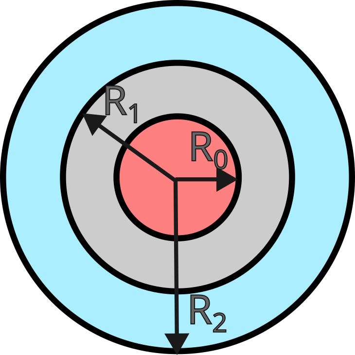

====================================
Concentric heat exchanger
====================================

This example simulates a heat exchanger which is made of two concentric pipes in which a hot and a cold fluid circulate in counterflow. We simulate the fluid flow within two fluid regions as well as the heat transfer within the entire domain (solid and fluid). This example illustrates the conjugate heat transfer capabilities of Lethe.

----------------------------------
Features
----------------------------------
- Solver: ``gls_navier_stokes_3d`` 
- Heat transfer physics
- Conjugated heat transfer

Files used in this example
---------------------------
- Parameter file: ``examples/multiphysics/concentric-heat-exchanger/concentric-heat-exchanger.prm``
- GMSH file: ``examples/multiphysics/concentric-heat-exchanger/concentric-cylinders.geo``
- Correlation calculation: ``examples/multiphysics/concentric-heat-exchanger/correlation_calculation.py``
- Plot generator: ``examples/multiphysics/concentric-heat-exchanger/plot_temperature_over_line.py.``

Description of the case
-------------------------

Heat exchangers are common unit operations used in many types of industries to transfer energy from one fluid to another. In this case, we simulate the most simple heat exchanger geometry, which is a concentric tube in which the hot fluid circulates within the inner tube, and a cold fluid circulates within the outer tube. We model the full heat transfer by simulating the motion of the fluid in both regions and the heat transfer within the entire domain. 

We consider copper concentric tubes with radii of :math:`R_0=1\text{mm} ,R_1=2\text{mm},R_2=3\text{mm}` in which water circulates. We consider a counter-current flow with an inner tube velocity of :math:`u_i=10\text{mm/s}` and an outer tube velocity of :math:`u_o=-4\text{mm/s}`. The inlet temperature within the inner tube is :math:`100^\circ C` and it is :math:`0^\circ C` in the outer tube. We do not formulate the problem in SI units, but instead we express the fundamental length in mm. This ensures that most variables of interest are close to unit value and this leads to a system matrix with an improved condition number.

We will compare the results we obtain with the CFD simulations with results obtained using the Number of Transfer Unit (NTU) approach (see [1]). Since the flow within both pipes is not developed, the Nusselt number in the inner pipe can be estimated as:

.. math::

    \overline{Nu}_D = 1.86 + \left(\frac{Re_D Pr D}{L}\right)^{1/3}

Using the NTU approach, the thermal effectiveness can be calculated and, from it, the outlet temperature is estimated to be  :math:`25.3^\circ C`. A python file (``correlation_calculation.py``) is added to the example and contains all calculation procedures.

--------------
Parameter file
--------------

We first enable the heat transfer multiphysics component:

.. code-block:: text

    #---------------------------------------------------
    # Multiphysics
    #---------------------------------------------------
    subsection multiphysics
       set heat transfer = true
    end

Conjugated heat transfer simulations require meshes in which the fluid and the solid regions are identified using a ``material_id``. In the case of meshes generated by GMSH, this corresponds to the ``Physical Volume``. Lethe assumes that the region occupied by the fluid has ``material_id=0`` and the region occupied by the solid has ``material_id=1``. The mesh used in this problem is a mesh generated using GMSH with the ``concentric-cylinders.geo`` file.

.. code-block:: text

    #---------------------------------------------------
    # Mesh
    #---------------------------------------------------
    subsection mesh
        set type                 = gmsh
        set file name            = concentric-cylinders.msh
    end

The next step is establishing the boundary conditions for the fluid flow. We specify a no-slip boundary condition on the outer walls of the cylinder and specify an inlet velocity for both boundaries 1 and 2. Note that the faces at the interfaces between the solid region and the fluid regions automatically have a ``noslip`` boundary condition applied to them. They should not be identified by a Physical Surface in the mesh.

.. code-block:: text

    # --------------------------------------------------
    # Boundary Conditions
    #---------------------------------------------------
    subsection boundary conditions
      set number                  = 3
    
        subsection bc 0
            set type              = function
            set id                = 0
            subsection u
                set Function expression = 0
            end
            subsection v
                set Function expression = 0
            end
            subsection w
                set Function expression = 10
            end
        end
        subsection bc 1
            set type              = function
            set id                = 3
            subsection u
                set Function expression = 0
            end
            subsection v
                set Function expression = 0
            end
            subsection w
                set Function expression = -4
            end
        end
    
        subsection bc 2
            set type              = noslip
            set id                = 4
        end
    
    end

On the heat transfer side, we apply temperature boundary conditions at both inlets to impose the cold and the hot temperatures of the fluid. We explicitly specify ``noflux`` boundary conditions on both outlets to ensure that the heat flux through them will be calculated within the post-processing section of the code.

.. code-block:: text

    # --------------------------------------------------
    # Boundary Conditions Heat Transfer
    #---------------------------------------------------
    subsection boundary conditions heat transfer
      set number                  = 5
        subsection bc 0
            set id = 0
            set type              = temperature
    	      set value             = 100
        end
    
        subsection bc 1
            set id = 1
            set type              = noflux
        end
    
        subsection bc 2
            set id = 2
            set type              = noflux
        end
    
        subsection bc 3
            set id = 3
            set type              = temperature
    	      set value             = 0
        end
    
        subsection bc 4
            set id = 4
            set type              = noflux
        end
    end

Next, we define the physical properties for both the solid and the fluid. It is important to explicitly indicate the number of solids, otherwise, the solid region will not be detected by Lethe. We consider the physical properties of copper for the solid and water for the fluid. The exponent that arises results from the change of units for length from meter to millimeter. 

.. code-block:: text

   subsection physical properties
     set number of solids = 1
     subsection fluid 0
       set kinematic viscosity            = 1
       set specific heat                  = 4180e6
       set density                        = 1000e-9
       set thermal conductivity           = 0.60e3
     end
   
       subsection solid 0
       set thermal conductivity           = 398e3
       set specific heat                  = 385e6
       set density                        = 8960e-9
     end
   end

To enable a more complete analysis of the case, we enable the heat flux post-processing. This will calculate the total heat flux on every boundary of the domain and enable us to characterize the energy coming in and out of every inlet and outlet.

.. code-block:: text

    #---------------------------------------------------
    # Post-processing
    #---------------------------------------------------
    subsection post-processing
        set verbosity = verbose
        set calculate heat flux = true
    end

Finally, we are interested in steady-state results and we thus specify a steady-state simulation.

.. code-block:: text

    # --------------------------------------------------
    # Simulation Control
    #---------------------------------------------------
    subsection simulation control
      set method                  = steady
      set output frequency        = 1
      set output path             = ./output/
    end

-------
Results
-------

The following image shows the temperature profile along the length of the inner tube for three radial positions: center(:math:`r=0mm`), half radius (:math:`r=0.5mm`) and inner wall (:math:`r=1mm`). We see that the temperature at the center of the tube takes a certain length before it starts decreasing. This is due to the poor heat transfer within the liquid. The black circle indicates the outlet temperature calculated from the NTU approach using the correlation. We see that this temperature is well within the envelope of the temperature profile obtained at the outlet. 

Using paraview, the velocity and temperature profiles can be explored in depth.

Possibilities for extension
----------------------------

- **Investigate co-current flow:** By inverting the inlet and the outlet on the outer pipe, this case can be changed from a counter-current to a co-current heat exchanger.

----------------------------
References
----------------------------

[1] Incropera, Frank P., et al. Fundamentals of heat and mass transfer. Vol. 6. New York: Wiley, 1996.
