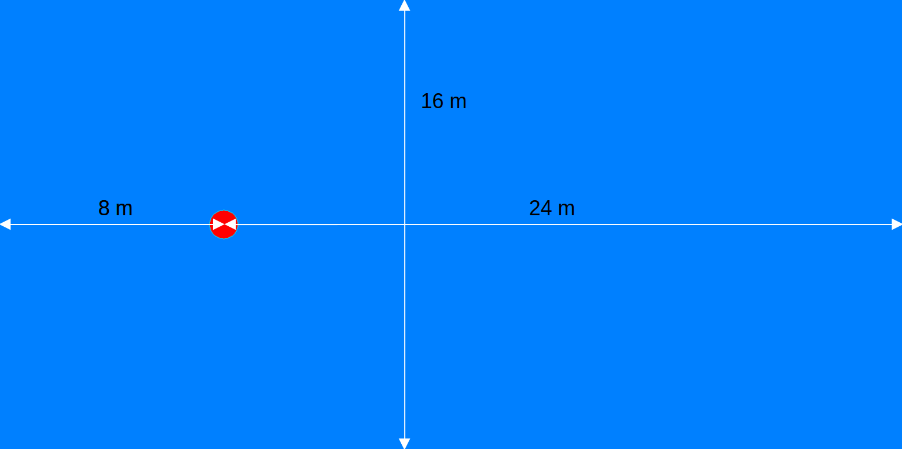
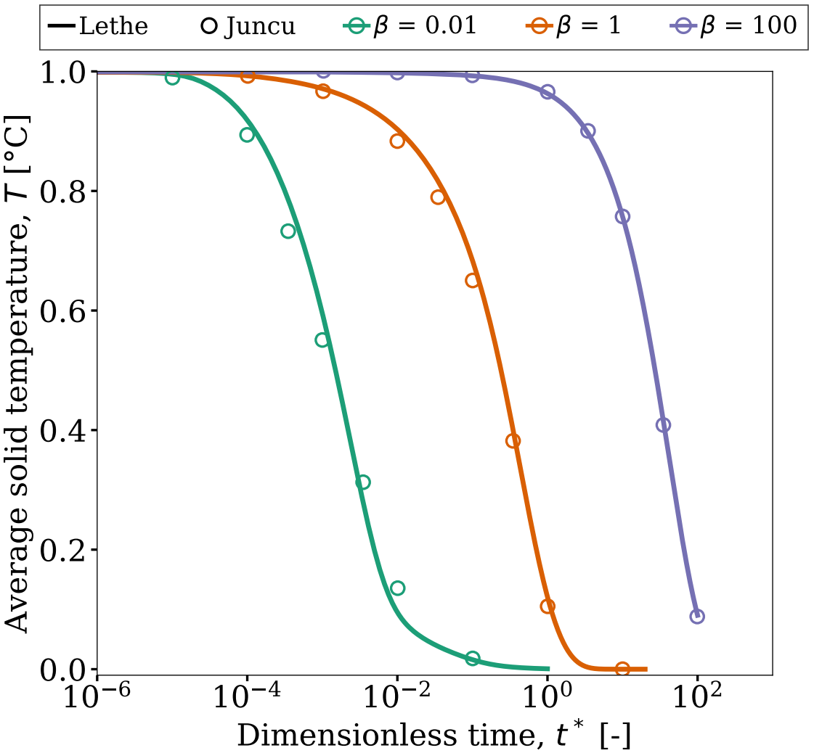

====================================
Cooling of a Cylinder
====================================

This example simulates the cooling of a 2D solid cylinder in a flow at a Reynolds number of 20. The dimensionless number :math:`\beta` (defined below) is modified to observe the effect of the thermal capacity ratio on the average temperature of the cylinder in time. Results are compared to those of Juncu [#juncu2004]_. This example illustrates the unsteady conjugate heat transfer capabilities of Lethe.

.. math::

    \beta = \frac{\rho_\mathrm{s} C_{p,\mathrm{s}}}{\rho_\mathrm{f} C_{p,\mathrm{f}}}

Where, :math:`\rho_\mathrm{s}` and :math:`\rho_\mathrm{f}` are the densities of the solid and fluid respectively, and :math:`C_{p,\mathrm{s}}` and :math:`C_{p,\mathrm{f}}` are the specific heats of the solid and fluid respectively. The value of :math:`\beta` is modified by changing the density of the solid. The values of :math:`\beta` used in this example are: 0.01, 1 and 100.

----------------------------------
Features
----------------------------------

- Solver: ``lethe-fluid`` 
- Heat transfer physics
- Conjugated heat transfer

---------------------------
Files Used in This Example
---------------------------

All files mentioned below are located in the example's folder (``examples/multiphysics/cylinder-cooling``).

- Mesh file: ``cylinder.msh``
- Parameter files: ``cylinder-xi-0_01.prm``, ``cylinder-xi-1.prm``, ``cylinder-xi-100.prm``
- Postprocessing Python script: ``post-process-avg-temperature.py.``
- Plotting script: ``plot-avg-temperature.py``

-------------------------
Description of the Case
-------------------------

The geometry for the simulations is shown in the figure below. We consider a domain of length :math:`l = 32\,\text{m}` and height :math:`L = 16\,\text{m}`. A cylinder (shown in red) of radius :math:`R = 0.5\,\text{m}` is positioned at :math:`x = 8\,\text{m}` and :math:`y = 0\,\text{m}`. The cylinder is initially set at a temperature of :math:`T_0 = 1^\circ\text{C}` and is cooled by a fluid flowing at a temperature of :math:`T_\infty = 0^\circ\text{C}`. The flow enters from the left and exits to the right. Slip boundary conditions are applied on the top and bottom walls of the domain.

In this example, we launch three distinct simulations, each using a different value of :math:`\beta`. The specific heat is modified by changing the density of the solid cylinder. Values of :math:`\rho_{s}` of :math:`0.1`, :math:`1` and :math:`100` are used to get values of :math:`\beta` of :math:`0.1`, :math:`1` and :math:`100`, respectively. The conductivity of the fluid is set to :math:`0.2` in order to obtain a Prandtl number of :math:`5`. The velocity at the entrance is set to :math:`U = 20\,\text{m/s}` in order to obtain a Reynolds number of :math:`20`. Other parameters such as the viscosity of the fluid, the heat capacity of the fluid, the heat capacity of the solid and the density of the fluid are set to :math:`1`.

--------------
Parameter File
--------------

We present the case for the parameter file ``cylinder-xi-1.prm``. The other two cases are similar, with the only difference being the density of the solid, the initial time step and the output frequency. The parameter file is divided into several sections, each of which is described below.

Multiphysics
~~~~~~~~~~~~

We first enable the heat transfer multiphysics component:

.. code-block:: text

    subsection multiphysics
       set heat transfer = true
    end

Mesh
~~~~

Conjugated heat transfer simulations require meshes in which the fluid and the solid regions are identified using a ``material_id``. In the case of meshes generated with Fidelity Pointwise, this corresponds to the ``fluid`` and ``solid`` at the end of the file in section ``$PhysicalNames``. Lethe assumes that the region occupied by the fluid has ``material_id=0`` and the region occupied by the solid has ``material_id=1``. It is therefore necessary to modify the number in the second column before ``fluid`` and ``solid`` in the section ``$PhysicalNames``. We generate the mesh in this problem using the ``cylinder.pw`` file.

.. code-block:: text

    subsection mesh
        set type                 = gmsh
        set file name            = cylinder.msh
    end

Boundary Conditions
~~~~~~~~~~~~~~~~~~~

The next step is establishing the boundary conditions for the fluid flow. We specify an inlet velocity of :math:`20` (``id = 3``) in order to obtain a Reynolds number of :math:`20`. A slip boundary condition is set on the outer walls of the domain (``id = 5``) and an outlet boundary conditions is set for the right boundary (``id = 4``). The remaining ids (``id = 1`` and ``id = 2``) are defined on the cylinder but are not used in what follows. 

.. Note ::
    The ids of the boundaries are written in the second column of the ``cylinder.msh`` file in the ``$PhysicalNames`` section.

.. code-block:: text

    subsection boundary conditions
        set number = 3

        subsection bc 0
            set id = 3
            set type = function
            subsection u
            set Function expression = 20
            end
            subsection v
            set Function expression = 0
            end
            subsection w
            set Function expression = 0
            end
        end

        subsection bc 1
            set id = 4
            set type = outlet
        end

        subsection bc 2
            set id = 5
            set type = slip
        end
    end

Boundary Conditions Heat Transfer
~~~~~~~~~~~~~~~~~~~~~~~~~~~~~~~~~

On the heat transfer side, we apply a constant temperature of 0 at the inlet (``id = 3``) to impose the cold temperature of the fluid. We explicitly specify ``noflux`` boundary conditions on the domain limits (``id = 5``) and on the outlet (``id = 4``). A ``noflux`` boundary condition at the outlet does not prevent energy from leaving the domain, because the energy is carried away by the convective flow exiting the domain. Instead, it ensures the boundary does not act as a source or sink of energy. 

.. code-block:: text

    subsection boundary conditions heat transfer
        set number = 3

        subsection bc 0
            set id    = 3
            set type  = temperature
            subsection value
            set Function expression = 0
            end
        end

        subsection bc 1
            set id   = 4
            set type = noflux
        end

        subsection bc 2
            set id   = 5
            set type = noflux
        end
    end

Initial conditions
~~~~~~~~~~~~~~~~~~~~

The initial velocity is set to :math:`20` in the x direction and :math:`0` in the y and z directions. To specify the initial temperature throughout the domain, we use a conditional statement. If the node is inside the cylinder, the initial temperature is set to :math:`1`. Anywhere else, the initial temperature is set to :math:`0`.

.. code-block:: text

    subsection initial conditions
        set type = nodal

        subsection uvwp
            set Function expression = 20; 0; 0
        end

        subsection temperature
            set Function expression = if(((x-8)^2+(y-0)^2)^0.5-0.5001<0,1,0) 
        end
    end

Physical Properties
~~~~~~~~~~~~~~~~~~~

Next, we define the physical properties for both the solid and the fluid. It is important to explicitly indicate the number of solids, otherwise, the solid region will not be detected by Lethe. The thermal conductivity is set so the Prandtl number is equal to :math:`5`. All the other physical properties are set to :math:`1`. 

.. code-block:: text

    subsection physical properties
        subsection fluid 0
            set kinematic viscosity  = 1
            set specific heat        = 1
            set density              = 1
            set thermal conductivity = 0.2
        end
        
        set number of solids = 1
        subsection solid 0
            set thermal conductivity = 0.2
            set specific heat        = 1
            set density              = 1
        end
    end

Simulation Control
~~~~~~~~~~~~~~~~~~

We solve the Navier-Stokes and the heat transfer equation in time. In the simulation control subsection we therefore need to specify the time-stepping scheme, the simulation end time and other parameters related to the growth rate of the time step. A maximum CFL of 5 is set to limit the maximal time step. The parameters related to the output of the .vtu files are also specified in this subsection. 

.. code-block:: text

    subsection simulation control
        set method                       = bdf2
        set time end                     = 20
        
        set time step                    = 0.000001
        set adapt                        = true
        set adaptative time step scaling = 1.02
        set max cfl                      = 5

        set output frequency             = 10
        set output name                  = out
        set output path                  = ./output-xi-1/
    end

.. warning::
    The output frequency is set to ``10`` iterations but can be modified to reduce the amount of .vtu files generated. We use this output frequency to reproduce a smooth curve that can be compared with the results of Juncu [#juncu2004]_. Using a higher output frequency can reduce the number of files generated. ``set output control = time`` could also be used to reduce the number of .vtu files generated.

-----------------------
Running the Simulation
-----------------------

Call the lethe-fluid by invoking:

.. code-block:: text
  :class: copy-button

  mpirun -np 8 lethe-fluid cylinder-xi-1.prm

to run the simulation using eight CPU cores. Feel free to use more. 

.. warning::
    Make sure to compile lethe in `Release` mode and
    run in parallel using mpirun. The simulation using :math:`\beta=0.01` takes around :math:`4` hours to run on 8 CPU cores. With :math:`\beta=1` and :math:`\beta=100`, the simulations can take up to :math:`10\,\text{h}` and :math:`24\,\text{h}` on 8 CPU cores. The end time of the simulations can be modified to reduce the computational time.

to run the post-processing script:

.. code-block:: text
  :class: copy-button

  python3 post-process-avg-temperature.py

.. warning::
    Make sure the simulations using the parameter files ``cylinder-xi-0_01.prm``, ``cylinder-xi-1.prm`` and ``cylinder-xi-100.prm`` were launched before calling the script.

To vizualise the results:

.. code-block:: text
  :class: copy-button

  python3 plot-avg-temperature.py

-------
Results
-------

The image below shows the evolution of the average temperature of the cylinder as a function of the dimensionless time. The dimensionless time is described by:

.. math::

    t^* = \frac{4tk_\mathrm{s}}{d^2}

The results obtained are in good agreement with those reported by Juncu [#juncu2004]_. Shorter cooling times are obtained as the :math:`\beta` decreases.

----------------------------
Possibilities for Extension
----------------------------

- **Investigate the evolution of the Nusselt number:** Juncu [#juncu2004]_ also investigated the evolution of the Nusselt number evolution in time. The post-processing script could be modified to compare these results with those of Juncu. If you do so, just make sure to use the corrected paper, in the original one there was an error with the Nusselt number post-processing. 

----------------------------
References
----------------------------

.. [#juncu2004] \F. Gh. Juncu, "Unsteady conjugate heat/mass transfer from a circular cylinder in laminar crossflow at low Reynolds numbers", *International Journal of Heat and Mass Transfer*, vol. 47, no. 10-11, pp. 2469-2480, May 2004, doi: https://doi.org/10.1016/j.ijheatmasstransfer.2003.10.035\.
