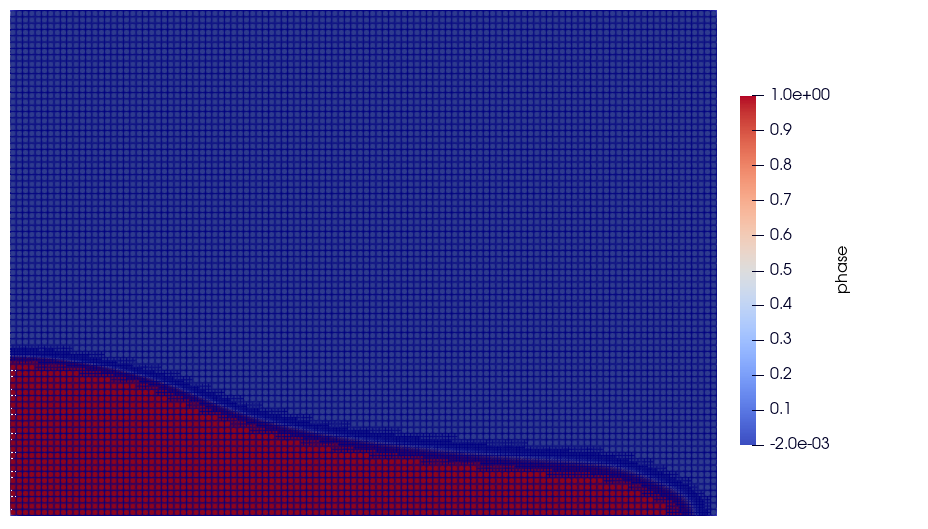

==========================
Dam break VOF
==========================

This example simulates the dam break experiments of `Martin and Moyce (1952)`_. 

.. _Martin and Moyce (1952): https://royalsocietypublishing.org/doi/abs/10.1098/rsta.1952.0006

A liquid is fixed behind a dam at the left most corner of
a rectangular domain as shown in the figure below.
At :math:`t = 0` seconds, the dam is removed, and 
the liquid is released into the total simulation domain. 
The corresponding parameter file is 
``gls_VOF_dam-break_Martin_and_Moyce.prm``.

The following schematic describes the simulation:

.. note:: 
    All the four boundary conditions are slip, and an external 
    gravity field of :math:`-1`` is applied in the `y` direction.

--------------
Parameter file
--------------

Time integration is handled by a 1st order backward differentiation scheme 
`(bdf1)`, for a :math:`4.1` seconds simulation time with an initial 
time step of :math:`0.01` seconds.

.. note::   
    This example uses an adaptive time-stepping method in which the 
    time-steps are modified during the simulation to keep the maximum value of the CFL condition
    below a given threshold.

.. code-block:: text

    # --------------------------------------------------
    # Simulation Control
    #---------------------------------------------------
    subsection simulation control
        set method                         = bdf1
        set time end                       = 4.1
        set time step                      = 0.01
        set adapt                          = true
        set max cfl                        = 0.5
        set stop tolerance                 = 1e-5
        set adaptative time step scaling   = 1.1
        set number mesh adapt              = 0
        set output name                    = dam-break_VOF
        set output frequency               = 20
        set output path                    = ./Output/
        set subdivision                    = 1      
    end

.. warning::
Make sure to create a directory named `Output` in the same directory 
you are calling the solver from.  Otherwise, the solver will be unable to generate the results files and will hang.

The ``multiphysics`` subsection enables to turn on `(true)` 
and off `(false)`` the physics of interest. Here ``VOF`` and 
``interface sharpening`` are chosen.

.. note:: 
     If the interface sharpening is not selected, the interface 
     between phases will become blurry (due to diffusion). 
     The following section defines the interface sharpening 
     parameters.

.. code-block:: text

    #---------------------------------------------------
    # Multiphysics
    #---------------------------------------------------
    subsection multiphysics
        set VOF = true
        set interface sharpening = true
    end 

In the ``interface sharpening`` subsection, the parameters required for 
sharpening the interface are defined. The current interface 
sharpening method consists of two steps. These steps are explained as
follows: 

""""""""""""""""""""""""""
1- Phase fraction limiter
""""""""""""""""""""""""""

.. math:: 
    \phi := min \left( max \left(\phi^{old},0 \right),1 \right)

""""""""""""""""""""""""
2 -Interface sharpening 
""""""""""""""""""""""""
.. math::
    \phi :=
    \begin{cases}
     c^{1-\alpha} \phi^{\alpha} &  (0 \leq \phi < c  ) \\
     1-(c-1)^{1-\alpha}(1-\phi)^{\alpha} & (c \leq \phi \leq 1  ) 
    \end{cases}

where :math:`\phi`, :math:`c`, and :math:`\alpha` denote phase fraction, 
sharpening threshold, and interface sharpness respectively. 
This interface sharpening method was proposed by `Aliabadi and Tezduyar (2000)`_.  

.. _Aliabadi and Tezduyar (2000):  https://www.sciencedirect.com/science/article/pii/S0045782500002000

``Sharpening frequency`` is an integer parameter that defines the 
frequency of the interface sharpening; ``sharpening threshold`` defines 
a phase fraction threshold for interface sharpening (generally :math:`0.5`);
and ``interface sharpness`` is a model parameter which is generally in
the range of :math:`(1-2]`.

.. code-block:: text

    #---------------------------------------------------
    # Interphase sharpening
    #---------------------------------------------------
    subsection interface sharpening
        set sharpening threshold        = 0.5
        set interface sharpness         = 2
        set sharpening frequency      	= 10
    end

In the ``initial condition``, the initial velocity and initial position 
of the liquid phase are defined. The liquid phase is initially 
defined as rectangle of length :math:`= 3.5` and height ::math:`= 7`.

.. code-block:: text

    #---------------------------------------------------
    # Initial condition
    #---------------------------------------------------
    subsection initial conditions
        set type = nodal
        subsection uvwp
            set Function expression = 0; 0; 0
        end
        subsection VOF
             set Function expression = if (x<3.5 & y<7 , 1, 0)
        end
    end

The ``source term`` subsection defines the gravitational acceleration:

.. code-block:: text
    
    #---------------------------------------------------
    # Source term
    #---------------------------------------------------
    subsection source term
        set enable = true
        subsection xyz
            set Function expression = 0;-1.0; 0
        end
    end

Two fluids are present in this simulation, hence in the ``physical 
properties`` subsection, their physical properties should be defined:

.. code-block:: text

    #---------------------------------------------------
    # Physical Properties
    #---------------------------------------------------
    subsection physical properties
        set number of fluids     = 2
        subsection fluid 0
            set density              = 0.02
            set kinematic viscosity  = 0.1
        end
        subsection fluid 1
            set density              = 0.9982
            set kinematic viscosity  = 0.01
        end
    end

In the ``mesh adaptation subsection``, adaptive mesh refinement is 
defined for ``velocity``. ``min refinement level`` and ``max refinement 
level`` are 4 and 5, respectively.

.. code-block:: text

    #---------------------------------------------------
    # Mesh Adaptation
    #---------------------------------------------------
    subsection mesh adaptation
        set type                    = kelly
        set variable                = velocity
        set fraction type           = fraction
        set max refinement level    = 5
        set min refinement level    = 4
        set frequency               = 5
        set fraction refinement     = 0.2
        set fraction coarsening     = 0.01
    end

*Call the gls_navier_stokes_2d by invoking:*  

``mpirun -np 2 gls_navier_stokes_2d gls_VOF_dam-break_Martin_and_Moyce.prm``

*to run the simulation using two CPU cores.* (Feel free to use more)

.. warning:: 
    The code will compute :math:`100,000+` dofs for :math:`620+` time 
    iterations. Make sure to compile lethe in `Release` mode and 
    run in parallel using mpirun 

-------
Results
-------
The following image shows the screenshots 
of the simulation at :math:`0`, :math:`1.1`, :math:`3`, and :math:`4` seconds

.. image:: images/time-shots.png
    :alt: time-shots
    :align: center

A python post-processing code `(gls_VOF_dam-break_Martin_and_Moyce.py)` 
is added to the example folder for post-processing the results.
Run `python3 ./Dambreak_2d_lethe.py ./Output` to execute this 
post-processing code, where `./Output` is the directory that 
contains the simulation results. In post-processing, the maximum 
dimensionless lateral position of the liquid phase is tracked 
through time and compared with the experiments of Martin and Moyce
(1952). The following figure shows the result of
the post-processing:

.. image:: images/xmax_t.png
    :alt: xmax_t
    :align: center

As mentioned previously, this simulation uses adaptive mesh
refinement. The following image shows the mesh and the position of
the interface at :math:`4` seconds. The mesh refinement detects 
and refines the meshes on the interface.

