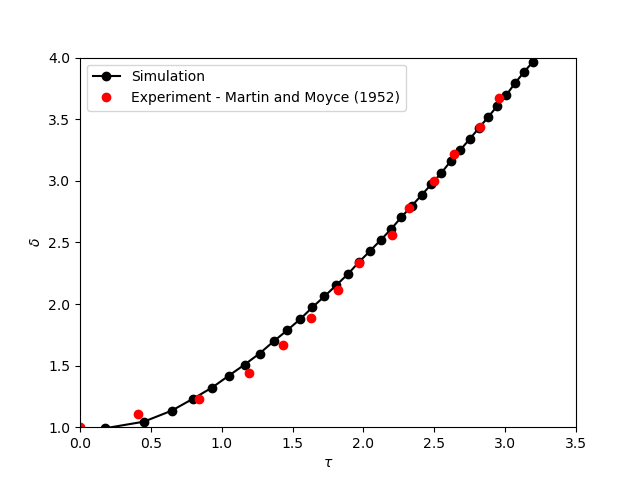
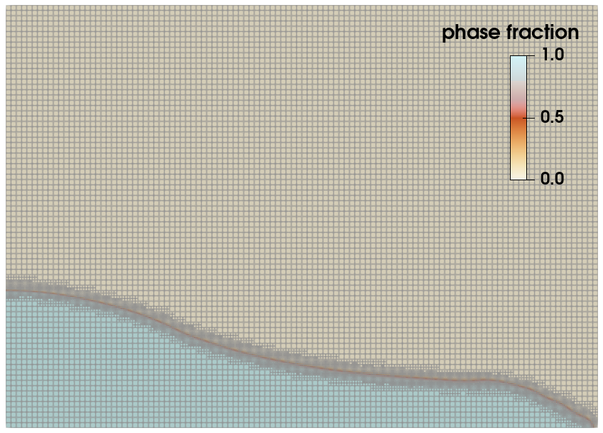

==========================
Dam-Break
==========================

This example simulates the dam break experiments of Martin and Moyce `[1] <https://doi.org/10.1098/rsta.1952.0006>`_.

----------------------------------
Features
----------------------------------

- Solver: ``lethe-fluid``  (with Q1-Q1)
- Two phase flow handled by the Volume of fluids (VOF) approach with interface sharpening
- Unsteady problem handled by an adaptive BDF1 time-stepping scheme 
- The use of a python script for post-processing data

---------------------------
Files Used in This Example
---------------------------
Both files mentioned below are located in the example's folder (``examples/multiphysics/dam-break``).

- Parameter file: ``dam-break-Martin-and-Moyce.prm``
- Postprocessing Python script: ``dam-break-2d.py``

---------------------------
Description of the Case
---------------------------

A liquid is fixed behind a dam at the left most corner of
a rectangular domain as shown in the figure below.
At :math:`t = 0` s, the dam is removed, and 
the liquid is released into the total simulation domain. 

The following schematic describes the geometry and dimensions of the simulation in the :math:`(x,y)` plane:

+---------------------------------------------------------+
|  .. image:: images/dam-break-initial-configuration.svg  |
|     :alt: Schematic                                     |
|     :width: 800                                         |
|     :align: center                                      |
|                                                         |
+---------------------------------------------------------+

.. note:: 
    All the four boundary conditions are ``slip``, and an external 
    gravity field of :math:`-1` is applied in the :math:`y` direction.

--------------
Parameter File
--------------

Simulation Control
~~~~~~~~~~~~~~~~~~

Time integration is handled by a 1st order backward differentiation scheme 
`(bdf1)`, for a :math:`4.1` s simulation time with an initial 
time step of :math:`0.01` seconds.

.. note::   
    This example uses an adaptive time-stepping method, where the 
    time-steps are modified during the simulation to keep the maximum value of the CFL condition
    below a given threshold.

.. code-block:: text

    subsection simulation control
      set method           = bdf1
      set time end         = 4
      set time step        = 0.01
      set adapt            = true
      set max cfl          = 0.5
      set output name      = dam-break
      set output frequency = 20
      set output path      = ./output/
    end

Multiphysics
~~~~~~~~~~~~

The ``multiphysics`` subsection enables to turn on `(true)` 
and off `(false)` the physics of interest. Here ``VOF`` is chosen.

.. code-block:: text

    subsection multiphysics
      set VOF = true
    end 

Interface Sharpening Parameters
~~~~~~~~~~~~~~~~~~~~~~~~~~~~~~~

VOF
***

If the ``interface sharpening`` is not enabled in :doc:`VOF <../../../parameters/cfd/volume_of_fluid>` subsection, the interface between phases will become blurry (due to diffusion). Furthermore, the ``phase filtration`` is enabled in this example. We refer the reader to the :doc:`../../../theory/multiphase/cfd/vof` documentation for more explanation on both methods.

.. code-block:: text

    subsection VOF
      subsection interface sharpening
        set enable              = true
        set threshold           = 0.5
        set interface sharpness = 1.5
        set frequency           = 20
      end
      subsection phase filtration
        set type            = tanh
        set beta            = 10
      end
    end

Fluid Phase Parameters
~~~~~~~~~~~~~~~~~~~~~~

Initial Conditions
******************

In the ``initial conditions``, the initial velocity and initial position
of the liquid phase are defined. The liquid phase is initially 
defined as rectangle of length :math:`= 3.5` and height :math:`= 7`.

.. code-block:: text

    subsection initial conditions
      set type = nodal
      subsection uvwp
        set Function expression = 0; 0; 0
      end
      subsection VOF
        set Function expression = if (x<3.5 & y<7 , 1, 0)
      end
    end

Source Term
***********

The ``source term`` subsection defines the gravitational acceleration:

.. code-block:: text
    
    subsection source term
      subsection fluid dynamics
        set Function expression = 0;-1.0; 0
      end
    end

Physical Properties
*******************

Two fluids are present in this simulation, hence in the ``physical 
properties`` subsection, their physical properties should be defined:

.. code-block:: text

    subsection physical properties
      set number of fluids = 2
      subsection fluid 0
        set density             = 1.2
        set kinematic viscosity = 0.01516
      end
      subsection fluid 1
        set density             = 1000
        set kinematic viscosity = 0.000001
      end
    end

We define two fluids here simply by setting the number of fluids to be :math:`2`.
In ``subsection fluid 0``, we set the density and the kinematic viscosity for the phase associated with a VOF indicator of 0. 
Similar procedure is done for the phase associated with a VOF indicator of 1 in ``subsection fluid 1``.

Mesh
~~~~

We start off with a rectangular mesh that spans the domain defined by the corner points situated at the origin and at point
:math:`[14,10]`. The first :math:`14,10` couple defines the number of initial grid subdivisions along the length and height of the rectangle. 
This makes our initial mesh composed of perfect squares. We proceed then to redefine the mesh globally three times by setting
``set initial refinement=3``. 

.. code-block:: text
        
    subsection mesh
      set type               = dealii
      set grid type          = subdivided_hyper_rectangle
      set grid arguments     = 14, 10 : 0, 0 : 14, 10 : true
      set initial refinement = 3
    end
    
In the ``mesh adaptation subsection``, adaptive mesh refinement is 
defined for ``phase``. ``min refinement level`` and ``max refinement 
level`` are 3 and 5, respectively. The adaptation strategy ``fraction type`` is set to ``fraction``, which leads
the mesh adaptation to refine the cells contributing to a certain fraction of the total error. This is highly
appropriate for VOF simulations since the error for the VOF field is highly localized to the
vicinity of the interface. We set ``initial refinement steps=4`` to ensure that the initial mesh
is adapted to the initial condition for the phase.

.. code-block:: text

    subsection mesh adaptation
      set type                     = kelly
      set variable                 = phase
      set fraction type            = fraction
      set max refinement level     = 5
      set min refinement level     = 3
      set frequency                = 1
      set fraction refinement      = 0.99
      set fraction coarsening      = 0.01
      set initial refinement steps = 4
    end

----------------------
Running the Simulation
----------------------

Call ``lethe-fluid`` by invoking:

.. code-block:: text
  :class: copy-button

  mpirun -np 6 lethe-fluid dam-break-Martin-and-Moyce.prm

to run the simulation using six CPU cores. Feel free to use more.

.. warning:: 
    The code will compute :math:`35,000+` dofs for :math:`600+` time iterations.
    Make sure to compile Lethe in `Release` mode and run in parallel using mpirun.
    This simulation takes :math:`\sim \, 3` minutes on :math:`6` processes.

-----------------------
Results and Discussion
-----------------------

The following image shows the screenshots of the simulation at :math:`0`, :math:`1`, :math:`2`, :math:`3`, and :math:`4` seconds,
of the phase results without and with phase filtering.
The red area corresponds to the liquid phase and the blue area corresponds to the air phase.

.. image:: images/time-series.png
    :alt: time-shots
    :align: center

A python post-processing code `(dam-break-2d.py)` 
is added to the example folder to post-process the results.
Run

.. code-block:: text
  :class: copy-button

  python3 ./dam-break-2d.py ./output

to execute this post-processing code, where ``./output`` is the directory that contains the simulation results.
In post-processing, the maximum dimensionless lateral position of the liquid phase is tracked
through time and compared with the experiments of Martin and Moyce (1952) `[1] <https://doi.org/10.1098/rsta.1952.0006>`_.
The following figure shows the result of the post-processing, with a good agreement between the simulation and the experiment:

As mentioned previously, this simulation uses adaptive mesh
refinement. The following image shows the mesh and the position of
the interface at :math:`4` s. The mesh refinement detects 
and refines the meshes on the interface.

----------------------------
References
----------------------------

`[1] <https://doi.org/10.1098/rsta.1952.0006>`_ J. C. Martin *et al.*, “Part IV. An experimental study of the collapse of liquid columns on a rigid horizontal plane,” *Philos. Trans. R. Soc. Lond. Ser. Math. Phys. Sci.*, vol. 244, no. 882, pp. 312–324, Mar. 1952, doi: 10.1098/rsta.1952.0006.