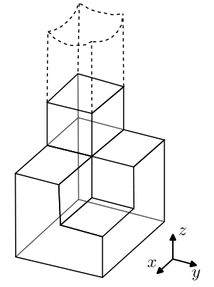
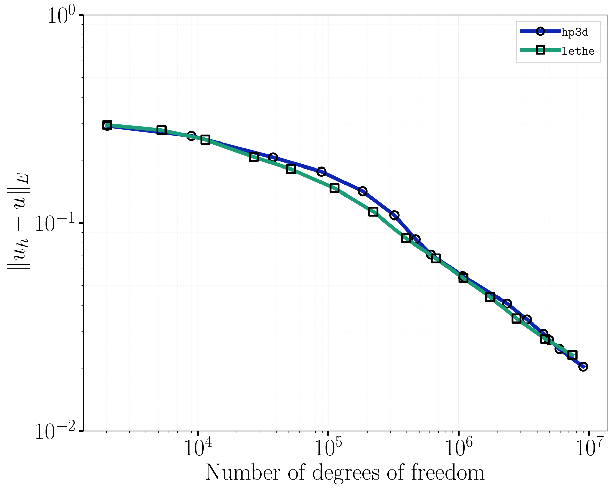
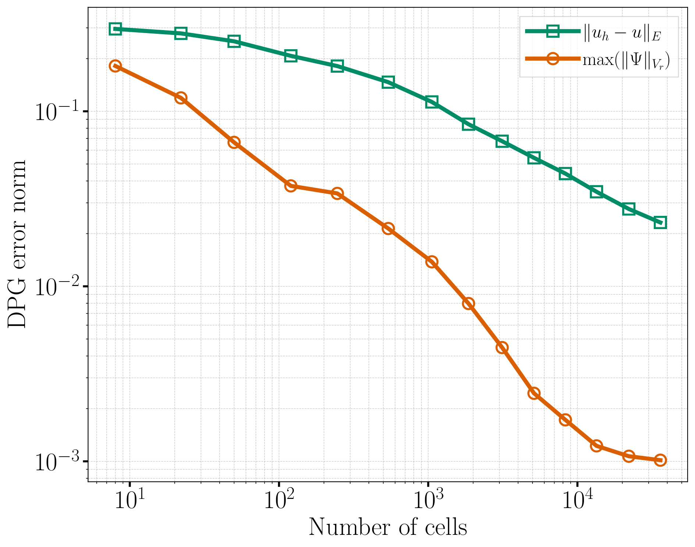
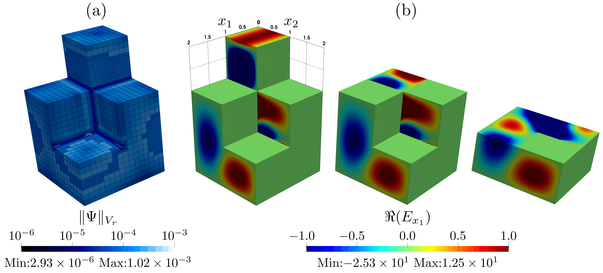

..
    SPDX-FileCopyrightText: Copyright (c) 2026 The Lethe Authors
    SPDX-License-Identifier: Apache-2.0 WITH LLVM-exception OR LGPL-2.1-or-later

Fichera Oven
============

This example verifies the implementation of the built-in `discontinuous Petrov-Galerkin (DPG) <https://pdxscholar.library.pdx.edu/mth_fac/426/>`_ residual error estimator and the associated :math:`h`-adaptive mesh refinement for the time-harmonic Maxwell solver. The domain is a "staircase" cavity with a re-entrant corner, and is fed by a small excitation port at its top, much like the cavity of a microwave oven -- hence the name *Fichera oven*. 

The re-entrant edges of the cavity generates electromagnetic field singularities, and therefore this benchmark has been used as a stress test for adaptive mesh refinement using the DPG error estimator [#Cartensen2016]_ [#Petrides2021]_. Indeed, near each of these edges, the electromagnetic field develops a corner singularity: its regularity is limited regardless of the polynomial degree used. Hence, the spatial convergence rate is dictated by the regularity of the singularity rather than by the polynomial degree of the finite element space. 

Resolving these singularities efficiently therefore requires increasing the mesh refinement near the re-entrant edges while leaving the rest of the cavity coarse. It follows that the DPG error estimator should naturally identify the re-entrant edges as the regions responsible for the largest contribution to the discretization error, and therefore mark them for refinement adequately even when the mesh is still coarse and the `Nyquist criterion <https://en.wikipedia.org/wiki/Nyquist_frequency>`_ is not satisfied. The goal of this benchmark example is to verify that this is what happens in practice.

Features
--------

- Solver: ``lethe-fluid``
- Steady-state problem
- Use of the Time-Harmonic Maxwell physics solver
- Built-in ``fichera_oven`` grid generator
- Use of the built-in DPG residual error estimator to drive :math:`h`-adaptive mesh refinement

Files Used in This Example
--------------------------

Both files below are located in the example's folder (``examples/multiphysics/fichera-oven``).

- Parameter file: ``fichera-oven.prm``
- Postprocessing Python script: ``fichera-oven.py``

Description of the Case
-----------------------

.. _geometry_section:

Geometry
~~~~~~~~

The domain is generated with Lethe's built-in ``fichera_oven`` grid generator. Starting from a :math:`2\times2\times3` array of unit cubes, four cubes are removed from the top two levels to create a staircase-like cavity with re-entrant edges. The three levels of the staircase are defined as follows:

- bottom level (:math:`z\in[0,1]`): the full :math:`2\times2` array of cubes is kept;
- middle level (:math:`z\in[1,2]`): one of the four cubes is removed, leaving an L-shaped cross-section;
- top level (:math:`z\in[2,3]`): three of the four cubes are removed, leaving a single cube.

This produces the eight-cube "staircase" tower shown below. When ``colorize`` is set to ``true`` in the ``grid arguments``, the small top face of the tower (at :math:`z=3`) is assigned boundary id ``1`` -- this is the excitation port -- while every other face of the cavity is assigned boundary id ``0``.

The dashed region illustrates the semi-infinite waveguide associated with the inlet excitation port boundary condition. Although the boundary condition assumes that the waveguide extends to infinity, only the staircase cavity is included in the numerical domain.

Physical Problem
~~~~~~~~~~~~~~~~

.. note::
    As in the :doc:`waveguide example <../waveguide/waveguide>`, Lethe's time-harmonic Maxwell solver solves the dimensionless form of the equations,

    .. math::
        \begin{align*}
        \tag{Faraday's law} \nabla \times \mathbf{E} - i\omega \mu_{\mathrm{r}}\mathbf{H} &= 0 \\
        \tag{Ampere-Maxwell's law} \nabla \times \mathbf{H} + i \omega \varepsilon_{\mathrm{r,eff}} \mathbf{E} &= \mathbf{J}
        \end{align*}

    See the :doc:`DPG formulation for time-harmonic Maxwell problems <../../../theory/multiphysics/electromagnetism/time_harmonic_weak_form>` theory guide for the full derivation and the DPG variational formulation used by the solver.

The cavity is filled with vacuum (:math:`\varepsilon_\mathrm{r,eff}=\mu_\mathrm{r}=1`) and its walls are perfectly-conducting (``pec``), except for the small top face, on which a Dirichlet ``electric field`` condition of the form :math:`E_x = \sin(\pi y)` is imposed. The excitation frequency is set to :math:`f=\mathrm{238.567258\,MHz}`, corresponding to a dimensionless angular frequency of :math:`\omega = 5`.

Since the cavity has no known analytical solution, this example does not rely on an analytical solution to assess convergence, as is done, for instance, in the :doc:`waveguide example <../waveguide/waveguide>`. Instead, it relies on:

- the DPG method's built-in residual error estimator :math:`\|\Psi\|_{V_r} = \sqrt{\Psi^\dagger G \Psi}` computed on each cell and then integrated in a :math:`L^2` way to obtain the full error on the solution denoted:  
    .. math::
      \|u_h-u\|_E = \sqrt{\sum_{K\in\Omega_h} \|\Psi_K\|_{V_r}^2}

- a comparison with independently published reference results for this exact benchmark problem, obtained with the ``hp3d`` code by Petrides and Demkowicz [#Petrides2021]_.

Parameter File
--------------

The parameter file follows the structure below. Only the parameters relevant to this example are detailed; refer to the appropriate documentation pages for the complete description of each subsection.

Simulation Control
~~~~~~~~~~~~~~~~~~

.. code-block:: text

    subsection simulation control
        set method            = steady
        set output path       = ./output/
        set number mesh adapt = 5
    end

The steady-state problem is solved on the initial mesh, then the mesh is adapted and the problem solved again, and so on for ``number mesh adapt = 5`` refinement cycles, for a total of six solves. Each of these solves is written to the ``./output/`` folder as a separate time step of a PVD/VTU time series, with the *time* of each step corresponding to its refinement iteration number (from ``0`` to ``6``, with the first step being the initial condition before any computation).

Mesh Adaptation
~~~~~~~~~~~~~~~

This is the core subsection of this example:

.. code-block:: text

    subsection mesh adaptation
        set type                = adaptive
        set variable            = electromagnetic fields
        set error estimator     = dpg
        set fraction refinement = 0.3
        set fraction coarsening = 0.05
        set fraction type       = fraction
    end

- ``set type = adaptive`` requests :math:`h`-adaptive refinement, as opposed to a ``uniform`` refinement of every cell.
- ``set error estimator = dpg`` selects the DPG built-in residual error estimator, which is the only error estimator available for the ``electromagnetic fields`` variable. Unlike the more generic ``kelly`` estimator (a jump-based indicator applicable to every physics), the ``dpg`` estimator is intrinsic to the DPG variational formulation. This error estimator is computed from the norm, in the test space, of the local residual representation function on each cell (the residual is represented by an error representation function through the Riesz map, for more details see :doc:`DPG formulation for time-harmonic Maxwell problems <../../../theory/multiphysics/electromagnetism/dpg_time_harmonic_maxwell>`). It is available at essentially no extra cost once the DPG system has been solved on that cell. 
- ``set fraction refinement = 0.3`` and ``set fraction coarsening = 0.05`` respectively mark the highest error cells that represent :math:`30\%` of the total error indicator for refinement and the lowest error cells that represent :math:`5\%` of the total error indicator for coarsening (using the deal.II ``refine_and_coarsen_fixed_fraction`` strategy). This is done at every adaptation cycle.

FEM
~~~

.. code-block:: text

    subsection FEM
        set electromagnetics trial degree = 2
        set electromagnetics test degree  = 3
    end

The interior fields are approximated with degree-2 discontinuous elements, while the DPG test space is enriched to degree 3. The choice of polynomial degree is arbitrary, but in the paper of Petrides and Demkowicz [#Petrides2021]_, the reference results were obtained with degree-2 trial spaces, so we use the same degree here to facilitate comparison.

.. caution::
    As in the waveguide example, the time-harmonic Maxwell solver requires the test space degree to always be strictly greater than the trial space degree.

Physical Properties
~~~~~~~~~~~~~~~~~~~

.. code-block:: text

    subsection physical properties
        set number of fluids = 1
        subsection fluid 0
            set electric conductivity model = constant
            set electric conductivity       = 0.

            set electric permittivity model     = constant
            set electric permittivity real part = 1.
            set electric permittivity imag part = 0.

            set magnetic permeability model     = constant
            set magnetic permeability real part = 1.
            set magnetic permeability imag part = 0.
        end
    end

The cavity is filled with vacuum: the `relative permittivity real part` and `magnetic permeability real part` are `constant` and set to 1, with no losses (zero `electric conductivity` and zero `imag part`).

Mesh
~~~~

See the `Geometry <geometry_section_>`_ section above for the description of the ``fichera_oven`` grid generator and its arguments:

.. code-block:: text

    subsection mesh
        set type           = lethe
        set grid type      = fichera_oven
        set grid arguments = 0, 0, 0 : 2, 2, 3 : true
    end

The ``grid arguments`` are the coordinates of the lower and upper corners of the bounding box of the staircase, followed by a boolean flag to colorize the top port face with boundary id ``1`` (every other face is assigned boundary id ``0``).

Multiphysics
~~~~~~~~~~~~

.. code-block:: text

    subsection multiphysics
        set fluid dynamics   = false
        set electromagnetics = true
    end

As in the waveguide example, the ``electromagnetics`` physics is enabled and the ``fluid dynamics`` solver, which is enabled by default, is turned off.

Time-Harmonic Maxwell
~~~~~~~~~~~~~~~~~~~~~

.. code-block:: text

    subsection time harmonic maxwell
        set electromagnetic frequency = 2.38567258e8
    end

This is the only parameter required in this subsection since, unlike the waveguide example, no waveguide-port inlet is used here: the excitation is instead applied directly as a Dirichlet ``electric field`` boundary condition (see below).

Boundary Conditions
~~~~~~~~~~~~~~~~~~~

.. attention::
    Although the fluid solver is not used, the ``subsection boundary conditions`` for the fluid dynamics boundaries cannot be removed from the parameter file, otherwise the simulation fails to execute:

    .. code-block:: text

        subsection boundary conditions
            set number = 1
            subsection bc 0
                set id   = 0, 1
                set type = noslip
            end
        end

The electromagnetic boundary conditions are specified in the ``boundary conditions time harmonic maxwell`` subsection:

.. code-block:: text

    subsection boundary conditions time harmonic maxwell
        set number = 2
        subsection bc 0
            set id   = 0
            set type = pec
        end
        subsection bc 1
            set id   = 1
            set type = electric field
            subsection E x real part
                set Function expression = sin(pi*y)
            end
            subsection E x imag part
                set Function expression = 0
            end
            subsection E y real part
                set Function expression = 0
            end
            subsection E y imag part
                set Function expression = 0
            end
            subsection E z real part
                set Function expression = 0
            end
            subsection E z imag part
                set Function expression = 0
            end
        end
    end

- ``bc 0`` (``id = 0``) covers every wall of the staircase except the top port and imposes a ``pec`` (perfect electric conductor) condition, :math:`\mathbf{n}\times\mathbf{E}=0`.
- ``bc 1`` (``id = 1``) covers the small top face and imposes a Dirichlet ``electric field`` condition. Only the real part of :math:`E_x` is non-zero, and is set to :math:`\sin(\pi y)`.

Linear Solver Control
~~~~~~~~~~~~~~~~~~~~~

.. code-block:: text

    subsection linear solver
        subsection electromagnetics
            set verbosity         = verbose
            set relative residual = 1e-8
            set minimum residual  = 1e-12
            set preconditioner    = none
        end
    end

Running the Simulation
----------------------

Call ``lethe-fluid`` by invoking:

.. code-block:: text
    :class: copy-button

    mpirun -np 8 lethe-fluid fichera_oven.prm

to run the simulation using eight CPU cores.

.. warning::
    Make sure to compile Lethe in ``Release`` mode. Also, if the results presented below needs to be reproduced, the number of mesh adaptations (``number mesh adapt``) in the parameter file needs to be changed to thirteen. This simulation will require more memory than what is available on a typical desktop computer. On a machine with 1TB of RAM and 128 CPU cores, the simulation takes about 8 hours to complete. It can be run on a smaller machine by reducing  but this will reduce the number of data points available for convergence analysis.

Once the simulation is complete, run the postprocessing script from the same folder:

.. code-block:: text
    :class: copy-button

    python3 fichera_oven.py

The script reads the ``out.pvd`` time series produced in the ``output`` folder using `PyVista <https://pyvista.org/>`_, and for each iteration:

- retrieves the number of cells and faces in the mesh;
- computes the number of degrees of freedom of the interior and skeleton DPG trial spaces. The counting is done assuming a `electromagnetics trial degree = 2` and removing the degrees of freedom associated with the Dirichlet boundary conditions since they are not part of the linear system solved by the solver;
- computes the :math:`L^2`- and :math:`L^\infty`-like norms of the DPG error indicator, ``dpg_error_norm`` (:math:`\|\Psi\|_{V_r}`), outputed by the solver on each cell.

It then produces two convergence plots -- error versus number of cells, and error versus number of degrees of freedom compared against the reference ``hp3d`` results. When the post-processing script is run with the ``--validate`` flag, a ``solution-fichera-oven.dat`` file is generated for automated testing. To run the program with validation, use the following command:

.. code-block:: text
    :class: copy-button

    python3 fichera_oven.py --validate -f /path/to/output/folder

.. tip::
    The ``-f`` (or ``--folder``) argument lets you input an output folder other than the default ``./output``, which is convenient when post-processing results are generated in a different directory.

Results and Discussion
----------------------

The following figure compares the convergence of the DPG error norm obtained with Lethe against the reference results of Petrides and Demkowicz [#Petrides2021]_, obtained with the independent ``hp3d`` code, as a function of the number of degrees of freedom:

The following figure shows the same DPG error norm as a function of the number of cells in the mesh, illustrating the reduction of the error achieved over the successive adaptive refinement cycles:

Finally, the following figure shows the solution of the electromagnetic field on the most refined mesh for the different level of the geometry:

As expected from the discussion of the geometry above, the adaptive refinement concentrates near the re-entrant edges of the staircase rather than spreading uniformly across the cavity, confirming that the DPG error estimator correctly identifies the regions responsible for the largest contribution to the discretization error.

Possibilities for Extension
---------------------------

- **Compare against uniform refinement:** Set ``mesh adaptation type = uniform`` and re-run the case. Comparing the resulting convergence curve (error versus number of degrees of freedom) with the adaptive one obtained above would illustrate the benefit of adaptive refinement for problems with corner singularities.
- **Use the Kelly error estimator:** Set ``mesh adaptation variable = electric field, magnetic field`` and ``error estimator = kelly, kelly`` to compare the mesh refinement pattern, and the resulting convergence, obtained with a generic jump-based estimator against those obtained with the method-intrinsic DPG estimator.
- **Change the excitation:** Modify the frequency or the profile of the ``electric field`` boundary condition on the port to excite different resonant modes of the cavity and observe how the refinement pattern adapts to the new field distribution.
- **Change the polynomial degree:** Change ``electromagnetics trial degree`` (and correspondingly ``electromagnetics test degree``) to study how the polynomial degree affects the convergence rate.

References
----------

.. [#Cartensen2016] \C. Carstensen, L. Demkowicz, and J. Gopalakrishnan, "Breaking spaces and forms for the DPG method and applications including Maxwell equations," *Computers & Mathematics with Applications,*, vol. 72, pp. 494-522, 2016, doi: `10.1016/j.camwa.2016.05.004 <https://doi.org/10.1016/j.camwa.2016.05.004>`_\.

.. [#Petrides2021] \S. Petrides and L. Demkowicz, "An adaptive multigrid solver for DPG methods with applications in linear acoustics and electromagnetics," *Computers & Mathematics with Applications,*, vol. 87, pp. 12-26, 2021, doi: `10.1016/j.camwa.2021.01.017 <https://doi.org/10.1016/j.camwa.2021.01.017>`_\.
