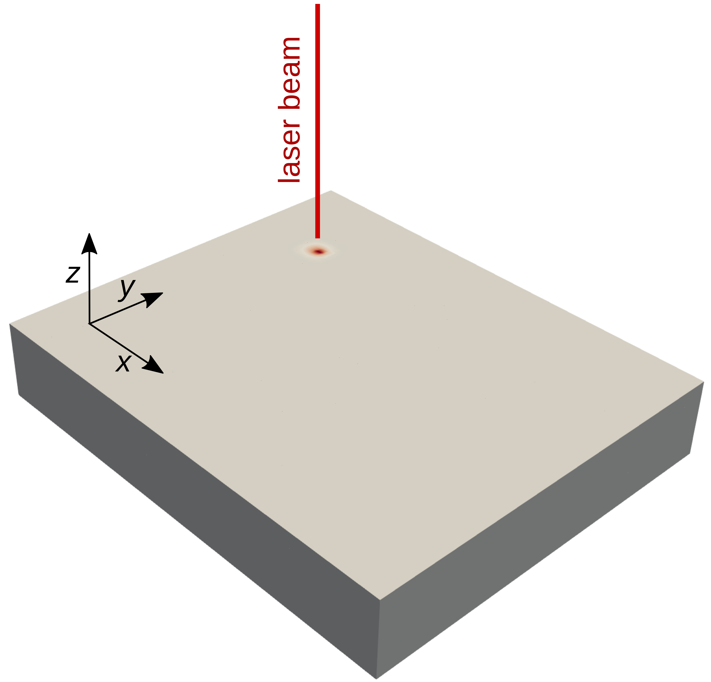

==========================
Laser Heating
==========================

This example simulates a three-dimensional solid block heated with a laser beam which follows a complex path. This mimics an additive manufacturing process.

----------------------------------
Features
----------------------------------

- Solver: ``lethe-fluid`` 
- Laser heat source
- Convection-radiation heat transfer boundary condition
- Unsteady problem handled by an adaptive BDF2 time-stepping scheme 
- Time-dependent laser path
- Mesh adaptation using temperature

---------------------------
Files Used in This Example
---------------------------

- Parameter file: ``examples/multiphysics/laser-heating/laser-heating.prm``

-----------------------------
Description of the Case
-----------------------------

A laser beam heats a three-dimensional solid block. The laser beam is emitted perpendicular to the top surface of the block in the negative z direction. The following schematic describes the geometry and dimensions of block and laser beam:

The laser path changes with time. The laser beam radius and penetration depth are both set to :math:`0.00005` m. Because of this small radius and penetration depth, we use adaptive mesh refinement based on the temperature. Thermal boundary conditions are ``convection-radiation-flux`` with a convective heat transfer coefficient of 5 and an emissivity of 0.4. The corresponding parameter file is:
``laser-heating.prm``.

--------------
Parameter File
--------------

Time integration is handled by a 2nd order backward differentiation scheme `(bdf2)` (for a better temporal accuracy), for a :math:`0.003` seconds simulation time with a constant
time step of :math:`5.0 \times 10^{-5}` seconds.

Simulation Control
~~~~~~~~~~~~~~~~~~

.. code-block:: text

    subsection simulation control
      set method           = bdf2
      set time end         = 0.003
      set time step        = 0.00005
      set output name      = laser-heating
      set output frequency = 1
      set output path      = ./output/
      set subdivision      = 1
    end

Boundary Conditions
~~~~~~~~~~~~~~~~~~~

All the boundary conditions are ``noslip``, and the heat transfer boundary conditions are ``convection-radiation-flux``.

.. code-block:: text

    subsection boundary conditions
      set number = 1
      subsection bc 0
        set type = noslip
      end
    end
    subsection boundary conditions heat transfer
      set number = 1
      subsection bc 0
        set type       = convection-radiation-flux
        subsection h
          set Function expression = 5
        end
        subsection Tinf
          set Function expression = 20
        end
        subsection emissivity
          set Function expression = 0.4
        end
      end
    end

Multiphysics
~~~~~~~~~~~~

The ``multiphysics`` subsection enables to turn on (``true``) and off (``false``) the physics of interest. Here only ``heat transfer`` is enabled.

.. code-block:: text

    subsection multiphysics
      set heat transfer = true
    end

Laser Parameters
~~~~~~~~~~~~~~~~

In the ``laser parameters`` section, the parameters of the laser model are defined. The exponential decaying model `[1] <https://doi.org/10.1016/j.matdes.2018.01.022>`_ is used to simulate the laser heat source. In the exponential decaying model, the laser heat flux is calculated using the following equation:

.. math::
    q(x,y,z) = \frac{\eta \alpha P}{\pi r^2 \mu} \exp{\left(-\eta \frac{r^2}{R^2}\right)} \exp{\left(- \frac{|z|}{\mu}\right)}

where :math:`\eta`, :math:`\alpha`, :math:`P`, :math:`R`, :math:`\mu`, :math:`r` and :math:`z` denote concentration factor, absorptivity, laser power, beam radius, penetration depth, radial distance from the laser focal point, and axial distance from the laser focal point, respectively. These parameters are explained in more detail in the `laser parameters <https://lethe-cfd.github.io/lethe/documentation/parameters/cfd/laser_heat_source.html>`_.

.. note:: 
    The scanning path of the laser is defined using a Function expression in the ``path`` subsection. Here the laser ``path`` is a function of time, and changes its direction twice during laser operation.

.. code-block:: text

    subsection laser parameters
      set enable               = true
      set type                 = exponential_decay
      set concentration factor = 50
      set power                = 3
      set absorptivity         = 0.6
      set penetration depth    = 0.00005
      set beam radius          = 0.00005
      set start time           = 0
      set end time             = 0.003
      set beam orientation     = z-
      subsection path
        set Function expression = if(t<0.001, 0.5 * t, if(t<0.002, 0.0005, if(t<0.003 , 0.0005-0.5 * (t-0.002), -1))); if(t<0.001, 0.00025, if(t < 0.002, 0.00025 - 0.5 * (t-0.001) , if(t < 0.003 , -0.00025, -1))) ; 0.0003
      end
    end

Mesh Adaptation
~~~~~~~~~~~~~~~

In the ``mesh adaptation`` subsection, we choose a mesh refinement based on the variable ``temperature``. Mesh adaptation is explained in more detail in `mesh adaptation control <https://lethe-cfd.github.io/lethe/documentation/parameters/cfd/mesh_adaptation_control.html>`_

.. code-block:: text

    subsection mesh adaptation
      set type                 = kelly
      set variable             = temperature
      set fraction type        = fraction
      set max refinement level = 4
      set min refinement level = 0
      set frequency            = 1
      set fraction refinement  = 0.5
      set fraction coarsening  = 0.2
    end

----------------------
Running the Simulation
----------------------

Call the lethe-fluid by invoking:

.. code-block:: text
  :class: copy-button

  mpirun -np 8 lethe-fluid laser-heating.prm

to run the simulation using eight CPU cores. Feel free to use more.

.. warning:: 
    Make sure to compile lethe in `Release` mode and 
    run in parallel using mpirun. This simulation takes
    :math:`\approx` 5 minutes on 8 processes.

-------
Results
-------

The following animation shows the temperature distribution in the simulations domain, as well the laser path.

.. raw:: html

    <iframe width="560" height="315" src="https://www.youtube.com/embed/e9bZ_3DAyZk" frameborder="0" allowfullscreen></iframe>

--------------------------
Possibility for Extension
--------------------------

This example can be extended to implement phase change (melting the solid block by laser and solidifying again after cooling).

