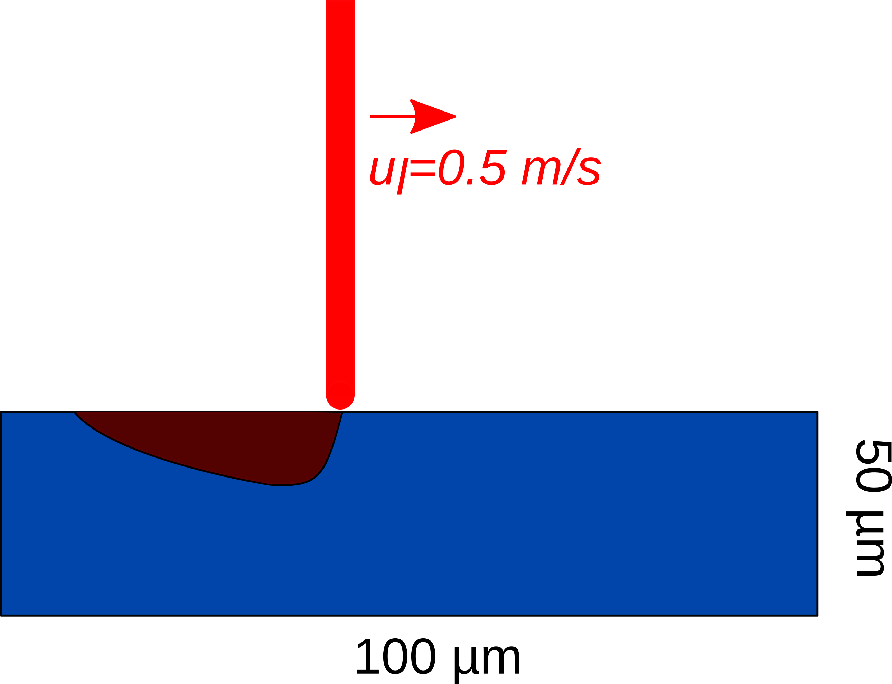
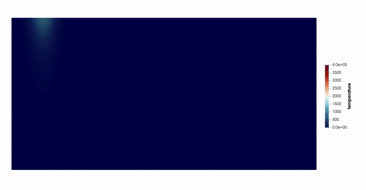

==========================
Laser Melt Pool
==========================

This example simulates a two-dimensional melt pool with a laser `[1] <https://doi.org/10.1016/j.powtec.2022.117533>`_.

----------------------------------
Features
----------------------------------

- Solver: ``lethe-fluid`` 
- Laser heat source
- Phase change (solid-liquid)
- Buoyant force (natural convection)
- Convection-radiation heat transfer boundary condition
- Unsteady problem handled by an adaptive BDF2 time-stepping scheme 
- Mesh adaptation using temperature

---------------------------
Files Used in This Example
---------------------------

- Parameter file: ``examples/multiphysics/laser-melt-pool/laser-melt-pool.prm``

-----------------------------
Description of the Case
-----------------------------

A Ti-6Al-4 V powder bed (assumed as a solid block in this example) melts using a laser beam that is emitted perpendicular to the top surface of the block. The laser beam speed is 0.5 m/s. Due to the laser heat source, the solid block melts in the direction of the laser. The corresponding parameter file is 
``laser-melt-pool.prm``.

The following schematic describes the geometry and dimensions of the simulation in the :math:`(x,y)` plane:

--------------
Parameter File
--------------

Time integration is handled by a 2nd order backward differentiation scheme 
`(bdf2)` (for a better temporal accuracy), for a :math:`0.005` seconds simulation time with a constant
time step of :math:`5.0 \times 10^{-6}` seconds.

Simulation Control
~~~~~~~~~~~~~~~~~~

.. code-block:: text

    subsection simulation control
      set method           = bdf2
      set time end         = 0.005
      set time step        = 0.000005
      set output name      = laser-melt-pool
      set output frequency = 1
      set output path      = ./output/
    end

Boundary Conditions
~~~~~~~~~~~~~~~~~~~

All the four boundary conditions are ``noslip``, and the heat transfer boundary conditions are ``convection-radiation-flux`` with a convective heat transfer coefficient of 80 :math:`\text{W}\text{m}^{-2}\text{K}^{-1}`, ambient temperature is 20 :math:`^{\circ}\text{C}`, and emissivity is 0.6.

.. code-block:: text

    subsection boundary conditions
      set number = 4
      subsection bc 0
        set id   = 0
        set type = noslip
      end
      subsection bc 1
        set id   = 1
        set type = noslip
      end
      subsection bc 2
        set id   = 2
        set type = noslip
      end
      subsection bc 3
        set id   = 3
        set type = noslip
      end
    end
    subsection boundary conditions heat transfer
      set number = 4
      subsection bc 0
        set id         = 0
        set type       = convection-radiation-flux
        subsection h
          set Function expression = 80
        end
        subsection Tinf
          set Function expression = 20
        end
        subsection emissivity
          set Function expression = 0.6
        end
      end
      subsection bc 1
        set id         = 1
        set type       = convection-radiation-flux
        subsection h
          set Function expression = 80
        end
        subsection Tinf
          set Function expression = 20
        end
        subsection emissivity
          set Function expression = 0.6
        end
      end
      subsection bc 2
        set id         = 2
        set type       = convection-radiation-flux
        subsection h
          set Function expression = 80
        end
        subsection Tinf
          set Function expression = 20
        end
        subsection emissivity
          set Function expression = 0.6
        end
      end
      subsection bc 3
        set id         = 3
        set type       = convection-radiation-flux
        subsection h
          set Function expression = 80
        end
        subsection Tinf
          set Function expression = 20
        end
        subsection emissivity
          set Function expression = 0.6
        end
      end
    end

Multiphysics
~~~~~~~~~~~~

The ``multiphysics`` subsection enables to turn on (``true``) and off (``false``) the physics of interest. Here ``heat transfer``, ``buoyancy force``, and ``fluid dynamics`` are enabled.

.. code-block:: text

    subsection multiphysics
      set heat transfer  = true
      set buoyancy force = true
      set fluid dynamics = true
    end

Laser Parameters
~~~~~~~~~~~~~~~~

In the ``laser parameters`` section, the parameters of the laser model are defined. The exponential decaying model `[2] <https://doi.org/10.1016/j.matdes.2018.01.022>`_ is used to simulate the laser heat source. In the exponential decaying model, the laser heat flux is calculated using the following equation:

.. math::
    q(x,y,z) = \frac{\eta \alpha P}{\pi r^2 \mu} \exp{\left(-\eta \frac{r^2}{R^2}\right)} \exp{\left(- \frac{|z|}{\mu}\right)}

where :math:`\eta`, :math:`\alpha`, :math:`P`, :math:`R`, :math:`\mu`, :math:`r` and :math:`z` denote concentration factor, absorptivity, laser power, beam radius, penetration depth, radial distance from the laser focal point, and axial distance from the laser focal point, respectively. These parameters are explained in more detail in `laser parameters <https://lethe-cfd.github.io/lethe/documentation/parameters/cfd/laser_heat_source.html>`_.

.. note:: 
    The scanning path of the laser is defined using a Function expression in the ``path`` subsection.

.. code-block:: text

    subsection laser parameters
      set enable               = true
      set type                 = exponential_decay
      set concentration factor = 2
      set power                = 100
      set absorptivity         = 0.6
      set penetration depth    = 0.000070
      set beam radius          = 0.000050
      set start time           = 0
      set end time             = 0.001
      set beam orientation     = y-
      subsection path
        set Function expression = 0.5 * t; 0.000500
      end
    end  

Physical Properties
~~~~~~~~~~~~~~~~~~~

The laser heat source locally melts the material, which is initially in the solid phase according to the definition of the ``solidus temperature``. Hence, the physical properties should be defined using ``phase_change`` models. Interested readers may find more information on phase change model in the `Stefan problem example <https://lethe-cfd.github.io/lethe/documentation/examples/multiphysics/stefan-problem/stefan-problem.html>`_ . In the ``physical properties`` subsection, the physical properties of the different phases of the fluid are defined:

.. code-block:: text

    subsection physical properties
      set number of fluids = 1
      subsection fluid 0
        set thermal conductivity model = phase_change
        set thermal expansion model    = phase_change
        set rheological model          = phase_change
        set specific heat model        = phase_change
    
        set density = 4420
    
        subsection phase change
          # Enthalpy of the phase change
          set latent enthalpy = 286000
    
          # Temperature of the liquidus
          set liquidus temperature = 1650
    
          # Temperature of the solidus
          set solidus temperature = 1604
    
          # Specific heat of the liquid phase
          set specific heat liquid = 831
    
          # Specific heat of the solid phase
          set specific heat solid = 670
    
          # Kinematic viscosity of the liquid phase
          set viscosity liquid = 0.00000069
    
          # Kinematic viscosity of the solid phase
          set viscosity solid = 0.008
    
          set thermal conductivity solid  = 33.4
          set thermal conductivity liquid = 10.6
    
          set thermal expansion liquid = 0.0002
          set thermal expansion solid  = 0.0
        end
      end
    end

.. note:: 
    Using a ``phase_change`` model for the thermal conductivity, the thermal conductivity of the material varies linearly between ``thermal conductivity solid`` and ``thermal conductivity liquid`` when the temperature is in the range of the solidus and liquidus temperatures.

Mesh
~~~~

We start the simulation with a rectangular mesh that spans the domain defined by the corner points situated at :math:`[-0.0001, 0]` and
:math:`[0.0009, 0.0005]`. The first :math:`[4,2]` couple of the ``set grid arguments`` parameter defines the number of initial grid subdivisions along the length and height of the rectangle. 
This allows for the initial mesh to be composed of perfect squares. We proceed then to redefine the mesh globally seven times by setting
``set initial refinement=7``. 

.. code-block:: text
        
    subsection mesh
      set type               = dealii
      set grid type          = subdivided_hyper_rectangle
      set grid arguments     = 4, 2 : -0.0001, 0 : 0.0009, 0.000500 : true
      set initial refinement = 7
    end
    

----------------------
Running the Simulation
----------------------

Call the lethe-fluid by invoking:  

.. code-block:: text
  :class: copy-button

  mpirun -np 12 lethe-fluid laser-melt-pool.prm

to run the simulation using twelve CPU cores. Feel free to use more.

.. warning:: 
    Make sure to compile lethe in `Release` mode and 
    run in parallel using mpirun. This simulation takes
    :math:`\approx` 3 hours on 12 processes.

-------
Results
-------

The following animation shows the temperature distribution in the simulations domain, as well the melted zone (using white contour lines at the liquidus and solidus temperatures).

-----------
References
-----------

`[1] <https://doi.org/10.1016/j.powtec.2022.117533>`_ E. Li, Z. Zhou, L. Wang, Q. Zheng, R. Zou, and A. Yu, “Melt pool dynamics and pores formation in multi-track studies in laser powder bed fusion process,” *Powder Technol.*, vol. 405, p. 117533, Jun. 2022, doi: 10.1016/j.powtec.2022.117533.

`[2] <https://doi.org/10.1016/j.matdes.2018.01.022>`_ S. Liu, H. Zhu, G. Peng, J. Yin, and X. Zeng, “Microstructure prediction of selective laser melting AlSi10Mg using finite element analysis,” *Mater. Des.*, vol. 142, pp. 319–328, Mar. 2018, doi: 10.1016/j.matdes.2018.01.022