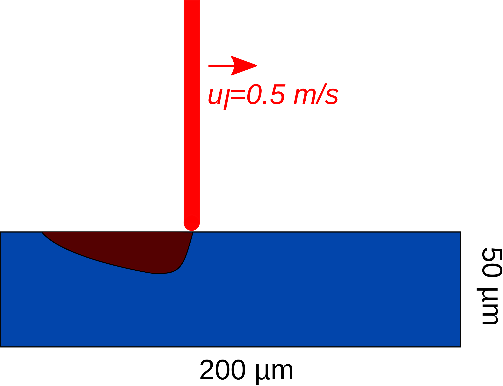
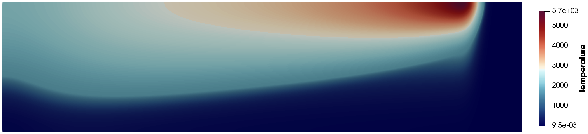
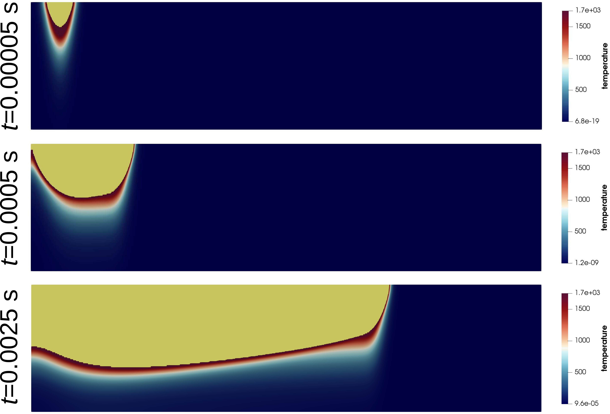

==========================
Laser melting
==========================

This example simulates a two-dimensional melt pool with a laser. 

----------------------------------
Features
----------------------------------
- Solver: ``gls_navier_stokes_2d`` 
- Laser heat source
- Phase change (solid-liquid)
- Convection-radiation heat transfer boundary condition
- Mesh adaptation using temperature

------------------------
Location of the example
------------------------
``examples/multiphysics/laser-melting/laser-melting.prm``

-----------------------------
Description of the case
-----------------------------

A stainless steel rectangular block melts using a laser beam that emits perpendicular to the top surface of the block. The laser beam speed is 0.5 m/s. Due to the laser heat source, the stainless steel solid block melts in the direction of the laser. The corresponding parameter file is 
``laser_melting.prm``.

The following schematic describes the geometry and dimensions of the simulation in the :math:`(x,y)` plane:

--------------
Parameter file
--------------

Time integration is handled by a 2nd order backward differentiation scheme 
`(bdf2)` (for a better temporal accuracy), for a :math:`0.0035` s simulation time with a constant
time step of :math:`0.000005` seconds.

.. code-block:: text

    # --------------------------------------------------
    # Simulation Control
    #---------------------------------------------------
    subsection simulation control
      set method                  		= bdf2
      set time end                		= 0.0035
      set time step               		= 0.000005
      set output name             		= laser_phase-change
      set output frequency        		= 1
      set output path                  	        = ./output/
    end

All the four boundary conditions are ``noslip``, and the heat transfer boundary conditions are ``convection-radiation`` with a convective heat transfer coefficient of 15 :math:`\text{W}\text{m}^{-2}\text{K}^{-1}`, ambient temperature is 20 :math:`^{\circ}\text{C}`, and emissivity is 0.5.

.. code-block:: text

    # --------------------------------------------------
    # Boundary Conditions
    #---------------------------------------------------
    subsection boundary conditions
      set number                  = 4
        subsection bc 0
            set id = 0
            set type              = noslip
        end
        subsection bc 1
            set id = 1
            set type              = noslip
        end
        subsection bc 2
            set id = 2
            set type              = noslip
        end
        subsection bc 3
            set id = 3
            set type              = noslip
        end
    end
    subsection boundary conditions heat transfer
      set number                  = 4
        subsection bc 0
        	set id = 0
    	set type	      = convection-radiation
            set h	      	      = 15
            set Tinf	      = 20
            set emissivity        = 0.5
        end
        subsection bc 1
        	set id = 1
    	set type	      = convection-radiation
            set h	              = 15
            set Tinf	      = 20
            set emissivity        = 0.5
        end
        subsection bc 2
        	set id = 2
    	set type	      = convection-radiation
            set h	              = 15
            set Tinf	      = 20
            set emissivity        = 0.5
        end
        subsection bc 3
        	set id = 3
    	set type	      = convection-radiation
            set h	              = 15
            set Tinf	      = 20
            set emissivity        = 0.5
        end
    end

The ``multiphysics`` subsection enables to turn on (``true``) 
and off (``false``) the physics of interest. Here ``heat transfer`` is enabled.

.. code-block:: text

    #---------------------------------------------------
    # Multiphysics
    #---------------------------------------------------
    subsection multiphysics
        set heat transfer  		= true
    end 
    

In the ``laser parameters`` section, the parameters of the laser model are defined. The exponential decaying model [1] is used to simulate the laser heat source. In the exponential decaying model, the laser heat flux is calculated using the following equation:

    .. math:: 
        q(x,y,z) = \frac{\eta \alpha P}{\pi r^2 \mu} \exp{(-\eta \frac{r^2}{R^2})} \exp{(- \frac{|z|}{\mu})}

where :math:`\eta`, :math:`\alpha`, :math:`P`, :math:`R`, :math:`\mu`, :math:`r` and :math:`z` denote concentration factor, absorptivity, laser power, beam radius, penetration depth, radial distance from the laser focal point, and axial distance from the laser focal point, respectively. These parameters are explained in more detail in `laser parameters <https://lethe-cfd.github.io/lethe/parameters/cfd/laser_heat_source.html>`_.

.. note:: 
    The scanning path of the laser is defined using a Function expression in the ``path`` subsection.

.. code-block:: text

    #---------------------------------------------------
    # Laser parameters
    #---------------------------------------------------
    subsection laser parameters
    	set enable = true
        	set concentration factor       = 2
        	set power 			          = 100
        	set absorptivity               = 0.6
        	set penetration depth          = 0.000070
        	set beam radius                = 0.000050
        	set start time                 = 0
        	set end time                   = 0.0034
        	set beam orientation           = y-
        	subsection path
        		set Function expression    =  0.5 * t; 0.000500
        	end
    end    

The laser heat source locally melts the material, which is initially in the solid phase according to the definition of the ``solidus temperature``. Hence, the physical properties should be defined using ``phase_change`` models. Interested readers may find more information on phase change model in the `Stefan problem example <https://lethe-cfd.github.io/lethe/examples/multiphysics/stefan_problem/stefan_problem.html>`_ . In the ``physical properties`` subsection, the physical properties of the different phases of the fluid are defined:

.. code-block:: text

    #---------------------------------------------------
    # Physical Properties
    #---------------------------------------------------
    subsection physical properties
      set number of fluids     		    = 1
      subsection fluid 0
        set thermal conductivity model 	= phase_change
        set rheological model 		    = phase_change
        set specific heat model 		    = phase_change
        
        set density 			            = 4300
        
        subsection phase change
          # Enthalpy of the phase change
          set latent enthalpy      		= 286000
    
          # Temperature of the liquidus
          set liquidus temperature 		= 1750
    
          # Temperature of the solidus
          set solidus temperature  		= 1700
    
          # Specific heat of the liquid phase
          set specific heat liquid 		= 830
    
          # Specific heat of the solid phase
          set specific heat solid  		= 200
          
          set thermal conductivity solid 	= 1.5
          set thermal conductivity liquid = 33.4
    
          # viscosity of the liquid phase
          set viscosity liquid 		    = 6
    
          # viscosity of the solid phase
          set viscosity solid  		    = 100000
        end
    
      end
    end

.. note:: 
    Using a ``phase_change`` model for the thermal conductivity, the thermal conductivity of the material varies linearly between ``thermal conductivity solid`` and ``thermal conductivity liquid`` when the temperature is in the range of the solidus and liquidus temperatures.

We start the simulation with a rectangular mesh that spans the domain defined by the corner points situated at :math:`[-0.0001, 0]` and
:math:`[0.0019, 0.0005]`. The first :math:`[8,2]` couple defines the number of initial grid subdivisions along the length and height of the rectangle. 
This allows for the initial mesh to be composed of perfect squares. We proceed then to redefine the mesh globally eight times by setting
``set initial refinement=8``. 

.. code-block:: text
        
    #---------------------------------------------------
    # Mesh
    #---------------------------------------------------
    subsection mesh
            set type = dealii
            set grid type = subdivided_hyper_rectangle
            set grid arguments 	= 8, 2 : -0.0001, 0 : 0.0019, 0.000500 : true
            set initial refinement 	= 8
    end
    
In the ``mesh adaptation subsection``, adaptive mesh refinement is 
defined for ``temperature``. ``min refinement level`` and ``max refinement level`` are 4 and 8, respectively. Since the laser heat source moves on the boundary and the temperature distribution changes abruptly due to the large laser heat source and radiation boundary condition, we choose 0.5 and 0.2 for ``fraction refinement`` and ``fraction refinement``, respectively.

.. code-block:: text

    #---------------------------------------------------
    # Mesh Adaptation
    #---------------------------------------------------
    subsection mesh adaptation
        set type                    = kelly
        set variable                = temperature
        set fraction type           = fraction
        set max refinement level    = 8
        set min refinement level    = 4
        set frequency               = 1
        set fraction refinement     = 0.5
        set fraction coarsening     = 0.2
    end

----------------------
Running the simulation
----------------------

Call the gls_navier_stokes_2d by invoking:  

``mpirun -np 8 gls_navier_stokes_2d laser_melting.prm``

to run the simulation using eight CPU cores. Feel free to use more.

.. warning:: 
    Make sure to compile lethe in `Release` mode and 
    run in parallel using mpirun. This simulation takes
    :math:`\approx` 5 mins on 8 processes.

-------
Results
-------

The following image shows the temperature distribution in the simulation domain after 0.0034 seconds.

Using Paraview, we can monitor the melted region by using a temperature threshold above the liquidus temperature. The following image shows, in yellow, the melted region at :math:`t=0.00005` s, :math:`0.0005` s, and :math:`0.0025` s. 

-----------
References
-----------
[1] Liu, S., Zhu, H., Peng, G., Yin, J. and Zeng, X., 2018. Microstructure prediction of selective laser melting AlSi10Mg using finite element analysis. Materials & Design, 142, pp.319-328.
